Claro, aquí tienes el texto formateado como **notas claras y legibles**, sin cambiar su contenido:

---

# 📌 Metamodelado De Sistemas

## 📖 Conceptos Básicos

- Los **metamodelos** son fundamentales en el desarrollo de software basado en modelos.
    
- Describen **entidades conceptuales**, **relaciones** y **reglas** de los modelos.
    
- Los elementos del metamodelo proporcionan un **esquema de tipos** para los elementos del modelo.
    
- Un modelo es **conforme a un metamodelo** si cada elemento del modelo tiene su metaelemento definido en el metamodelo.

## 🧠 Lenguajes De Modelado Y Metamodelos

- Para definir un lenguaje de modelado como **UML**, es necesario proporcionar distintos tipos de información en un metamodelo.
    
- La disposición de esta información contribuye a una **clara separación de vistas o incumbencias**.
    
- La **modularidad y reutilización** se favorecen al combinar vistas en partes separadas del metamodelo.

## 📐 Especificaciones Formales

- Una especificación basada en modelos es **formal** si:
    
    - Se basa en un lenguaje con **sintaxis y semántica bien definidas**.
        
    - Cada concepto representado tiene reglas claras.

---

# 🧱 Estructura Del Metamodelo

- Los metamodelos están compuestos por elementos que proporcionan un esquema de tipos para los modelos.
    
- El tipado de elementos se expresa mediante la **metarrelación** entre el modelo y su metaelemento.
    
- Un modelo es conforme a un metamodelo si cada uno de sus elementos tiene un metaelemento correspondiente.

---

# 🧩 Vistas Y Modularidad

- La información del lenguaje de modelado debe proporcionarse en distintas **partes del metamodelo**.
    
- Las vistas bien separadas contribuyen a:
    
    - Modularidad.
        
    - Reutilización.
        
- Estas partes pueden combinarse entre sí para un modelado más flexible.

---

# 🧾 Lenguajes De Modelado Ejemplares

- Ejemplos: **UML**, **BPMN**, **E/R**, **OWL**, **XML Schema**.
    
- También se puede usar el **formalismo de redes de Petri**, como lo explica Bézivin (2006).

---

# 📊 Ejemplo: Red De Petri

La red de Petri se puede definir con cuatro tipos de conocimientos:

## 1. Conocimiento De la Estructura

- Se expresa con un diagrama de clases usando conceptos como:
    
    - `Pnet`, `Place`, `Transition`, `Token`.
        
    - Relaciones: `basicRelation`, `numberOfTokens`.

## 2. Conocimiento De Las Aserciones

- Usando lenguajes como **Object Constraint Language (OCL)**:
    
    - El atributo `token` **no puede set negativo**.
        
    - Una `basicRelation` puede conectar:
        
        - `Place → Transition`
            
        - `Transition → Place`
            
        - Nunca `Place → Place` ni `Transition → Transition`.

## 3. Conocimiento De la Ejecución

```python
funcion firable(t: Transition)
{Devuelve verdadero si cada Place de entrada de t tiene al menos un Token, en caso contrario devuelve falso}

context Pnet Action;
repeat
  seleccionar de Pnet una Transition t cualquiera tal que fireable(t);
  decrementar el número de tokens de cada Place de entrada de t;
  incrementar el número de tokens de cada Place de salida de t;
until ninguna Transition t en pNet cumpla fireable(t);
```

## 4. Conocimiento De la Visualización

- **Transition**: Rectángulo.
    
- **Place**: Círculo.
    
- **Arc**: Flecha.

---

# 🗂️ Función Del Metamodelo

- El metamodelo actúa como un **repositorio**:
    
    - Almacena conceptos y reglas acordadas.
        
    - Garantiza un **lenguaje común** entre usuarios.
        
- Ayuda a evitar malinterpretaciones y asegura una correcta especificación y manipulación de modelos.

---

# 🧬 Metametamodelo

- Se necesita un **framework de integración** para todos los metamodelos: el **Metametamodelo**.
    
- Si un modelo es un metamodelo, el metamodelo que lo describe se convierte en un **metametamodelo**.
    
- El **metametamodelo** define los metamodelos y permite crear nuevos metamodelos.
    
- Los modelos son conformes a su metamodelo, y los metamodelos son conformes al metametamodelo.

---

# 🧭 Ejemplo De Metametamodelo

- **MOF** (Meta Object Facility) es un ejemplo de metametamodelo.
    
- El metamodelo de UML es conforme a MOF.
    
- El metametamodelo está compuesto por **elementos**.
    
- Un metamodelo es conforme al metametamodelo si:
    
    - Cada uno de sus metaelementos tiene su correspondiente **metametaelemento** definido.

# 📊 In-Depth Concept Chart: Model vs. Metamodel vs. Metametamodel

|Level|Name|Description|Purpose|Example|
|---|---|---|---|---|
|0|**Instance / Data**|The actual real-world data or system being described or represented.|To represent real entities or data at runtime.|A running banking app showing a customer "Alice" with account balance $500|
|1|**Model**|An **abstraction** that describes the structure and behavior of a system. It consists of elements that represent real-world concepts.|To describe a specific system’s design, structure, or behavior.|UML class diagram with classes like `Customer`, `Account`, and their relationships.|
|2|**Metamodel**|A **model of models**: it defines the rules, elements, and constraints that make up valid models.|To specify the language and structure used to create models.|UML metamodel that defines what a `Class`, `Attribute`, or `Association` is.|
|3|**Metametamodel**|A **model of metamodels**: defines the core building blocks for defining metamodels themselves.|To provide a universal framework or language for defining any modeling language.|MOF (Meta-Object Facility), which defines elements like `Class`, `Property`, etc.|

---

# 🔁 Relationships

- **Data conforms to a Model**  
    ↳ E.g., an object like `Customer("Alice", 500)` conforms to the class diagram.
    
- **Model conforms to a Metamodel**  
    ↳ E.g., a UML diagram conforms to the UML Metamodel.
    
- **Metamodel conforms to a Metametamodel**  
    ↳ E.g., UML Metamodel conforms to MOF.

---

# 📦 Concrete Example: Modeling a Banking System

Let’s go step by step through an example:

---

## 🔹 **Level 0: Data (Runtime Instances)**

Real objects in an application:

```json
{
  "customerName": "Alice",
  "accountBalance": 500
}
```

---

## 🔹 **Level 1: Model**

UML Class Diagram of a system:

```Python
+------------+       +-------------+
|  Customer  |<----->|   Account   |
+------------+       +-------------+
| -name      |       | -balance    |
+------------+       +-------------+
```

- Describes the types of objects: Customer has a name; Account has a balance.

---

## 🔹 **Level 2: Metamodel**

Definition of UML Elements (UML Metamodel):

```Python
Metaclass: Class
  - name: String
  - attributes: List<Attribute>

Metaclass: Attribute
  - name: String
  - type: DataType

Metaclass: Association
  - source: Class
  - target: Class
```

- These are not specific classes, but definitions of what a "Class", "Attribute", or "Association" mean.

---

## 🔹 **Level 3: Metametamodel**

MOF (Meta Object Facility):

```Python
Element: Class
Element: Property
Element: Relationship
```

- These abstract modeling elements are used to build metamodels like UML.

---

# 📌 Visual Hierarchy Summary

```Python
MOF (Metametamodel - Level 3)
   ↑
UML Metamodel (Metamodel - Level 2)
   ↑
UML Class Diagram (Model - Level 1)
   ↑
Customer Object "Alice" (Data - Level 0)
```

---

# 🧠 Final Analogy

Think of it like language:

- **Instance / Data** = A sentence you say: “Alice has $500.”
    
- **Model** = The grammar rules you used: Subject → Verb → Object
    
- **Metamodel** = The structure of grammatical constructs: What is a noun? What is a verb?
    
- **Metametamodel** = The meta-rules of grammar systems: How to define new grammatical constructs

---

# 🧱 Pirámide De Conformidad

- Las siguientes figuras (mencionadas) ilustran de manera **piramidal** los niveles de:
    
    - **Modelo → Metamodelo → Metametamodelo**.

![[Pasted image 20250601092104.png]]

![[Pasted image 20250601114553.png]]

---

## 🔍 Explicación Del Diagrama

|Nivel|Nombre|Contenido en el diagrama|Relación superior|
|---|---|---|---|
|M0|**The System**|Representa un sistema real en Java: una clase `Client` con un atributo `Name`.|➕ Es representado por el modelo UML en M1.|
|M1|**UML Model**|Un modelo UML con una clase `Client` que tiene un atributo `Name:String`.|➕ Conforma al Metamodelo UML (M2).|
|M2|**UML Metamodel**|Define qué es una `Class`, un `Attribute` o una `Association` en UML.|➕ Conforma a MOF (M3).|
|M3|**The MOF**|Define los conceptos base para construir metamodelos: `Class`, `Association`, `Source`, `Destination`.|🔁 Base última, autoreferencial.|

### Relaciones

- Cada elemento **"conforma a"** su metanivel superior (flechas negras).
    
- Las relaciones **"meta"** (flechas moradas) indican qué definición conceptual usa cada nivel.

---

## 📈 Otra Forma De Visualizarlo Con Mermaid.js

Aquí tienes una forma más **didáctica y clara** de representar este mismo diagrama usando **Mermaid.js**, con anotaciones para cada nivel:

```mermaid
graph TD
  M3[🔷 M3: Metametamodel MOF ] -->|Defines| M2[🔶 M2: UML Metamodel]
  M2 -->|Defines| M1[🔷 M1: UML Model]
  M1 -->|Represents| M0[🔶 M0: The System ]

  subgraph M3_MOF
    direction LR
    ClassM3[Class M3 ]
    AssociationM3[Association M3 ]
    ClassM3 -->|Source| AssociationM3
    ClassM3 -->|Destination| AssociationM3
  end

  subgraph M2_UML_Metamodel
    direction LR
    ClassM2[Class M2]
    AssociationM2[Association M2]
    ClassM2 -->|1..*| AssociationM2
  end

  subgraph M1_UML_Model
    direction LR
    Client[Client M1]
    Name[Name:String M1]
    Client --> Name
  end

  subgraph M0_System
    direction LR
    JavaClass["Java Class:<br/>class Client {<br/>&nbsp;&nbsp;private String name;<br/>}"]
  end

  %% Meta relationships
  Client -->|InstanceOf| ClassM2
  Name -->|InstanceOf| AssociationM2
  ClassM2 -->|InstanceOf| ClassM3
  AssociationM2 -->|InstanceOf| AssociationM3

```



---

![[Pasted image 20250601115436.png]]

Esta figura ilustra un ejemplo de un sistema software a través de los distintos niveles de modelado.

![[Pasted image 20250601115520.png]]

---

## MicroTest

- ¿Cuáles de las siguientes afirmaciones son ciertas según el texto sobre la relación entre modelo, metamodelo y metametamodelo? Selecciona dos:
	- Un metamodelo define un modelo.
	- Un metametamodelo define un metamodelo.
- ¿Cuáles de las siguientes afirmaciones son ciertas según el texto sobre los tipos de conocimiento que puede container un metamodelo? Selecciona dos:
	- Conocimiento de la ejecucion.
	- Conocimiento de la estructura.
- ¿Cuáles de las siguientes afirmaciones son ciertas según el texto sobre las características de una especificación basada en modelos? Selecciona dos:
	- Se basa en un lenguaje con sintaxis y semántica bien definidas.
	- Asocia cada concepto del lenguaje.
- ¿Cuáles de las siguientes afirmaciones son ciertas según el texto sobre los beneficios de distribuir la información de un metamodelo en diferentes partes? Selecciona dos:
	- Favorece la modularidad.
	- Favorece la reutilización.

## **Saber más**![[Desarrollo de Software Dirigido por modelos.pdf]]