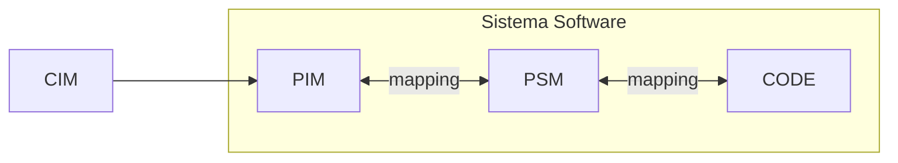

# **Arquitectura Dirigida Por Modelos (MDA)**

---

## 📌 Definición General

- **Model Driven Architecture (MDA)** es una iniciativa del **Object Management Group (OMG)** que propone el uso de **modelos en todas las etapas del desarrollo de software**.
    
- Los modelos se consideran un **lenguaje de programación de alto nivel**, con un **mayor nivel de abstracción** que lenguajes como Java o C++.
    
- Su objetivo es **separar la especificación de la funcionalidad** de un sistema de los detalles de **implementación en una plataforma concreta**.

---

## 🧠 Components Técnicos Clave

- **Compiladores MDA** traducen modelos en **MOF** (MetaObject Facility) y **UML** (Unified Modeling Language) a lenguajes de alto nivel y plataformas actuales.
    
- **MOF** es el **metametamodelo** que permite definir lenguajes de metamodelado.
    
- **UML** es un **metamodelo conforme a MOF**, usado para definir lenguajes de modelado.

---

## 📈 Beneficios Y Usos

- MDA se considera como una Mejora del ciclo de vida del software con **modelado formal** (Guttman y Parodi, 2007).
    
- Los modelos están **siempre actualizados** y son **reutilizables**.
	
- MDA permite separar la especificación de una funcionalidad de su implementación en una plataforma Tecnológica.
    
- **No se limita a generar código desde UML**, también puede generar **otros artefactos** del ciclo de vida.
    
- Potential en:
    
    - **Recolección de requisitos**
        
    - **Establecimiento de estándares arquitectónicos**
        
    - **Trazabilidad**
        
    - **Comunicación entre negocio y tecnología**

---

## ⚙️ Herramientas Y Procesos Involucrados

- Lenguajes de modelado
    
- Entornos de desarrollo
    
- Herramientas para especificar lenguajes de modelado
    
- Tecnologías para intercambio de modelos
    
- Transformaciones con reglas de negocio
    
- Traducción de modelos
    
- Ingeniería de sistemas
    
- Redirección y generación de sistemas software

---

## 🕰️ Historia

- El término **MDA se propuso en 2001**, aunque su uso se remonta a sistemas integrados y de tiempo real.

---

## 🚀 Aplicación En El Ciclo De Vida

MDA busca elevar el nivel de abstracción en el desarrollo de sistemas Software y utilize modelos para dirigir actividades como: 

- Análisis
    
- Diseño
    
- Construcción
    
- Despliegue
    
- Operación
    
- Mantenimiento
    
- Evolución

---

## 🧱 Capas De Abstracción (OMG-MDA, 2014)

Model driven architecture (MDA) define tres capas de arquitectura para los sistemas en función de su nivel De abstracción

### 1. **Computation Independent Model (CIM)**

- También llamado **modelo de negocio** o **modelo de dominio**.
    
- Representa **cosas reales**, independientes del sistema de información.
    
- Enfocado en el **problema**, no en la solución técnica.
    
- No aporta información de arquitectura o implementación.

### 2. **Platform Independent Model (PIM)**

- Modelo lógico de diseño **independiente de tecnologías** específicas.
    
- Construido con base en los conceptos del CIM.
    
- La **independencia de plataforma es relativa**: lo que es PIM para uno puede set PSM para otro.
    
- Es importante declarar explícitamente **de qué plataformas es independiente**.

### 3. **Platform Specific Model (PSM)**

- Vista del sistema desde una **plataforma específica**.
    
- También conocido como **modelo de implementación**.
    
- Contiene especificaciones del PIM + detalles concretos de implementación.
    
- Se transforma en código fuente mediante:
    
    - **Transformación modelo-a-texto**
        
    - **Transformación modelo-a-modelo** (cuando el código también se considera un modelo, como Java → bytecode).

| **Capa** | **Nombre Completo**           | **Definición**                                                                | **Enfoque**                   | **Ejemplo**                                                                           | **Relación con la Arquitectura**          |
| -------- | ----------------------------- | ----------------------------------------------------------------------------- | ----------------------------- | ------------------------------------------------------------------------------------- | ----------------------------------------- |
| **CIM**  | Computation Independent Model | Modelo que describe el dominio del problema sin detalles técnicos.            | Negocio / Requisitos          | Un diagrama de procesos de negocio (BPMN) para una tienda online.                     | Vista de negocio / Requisitos funcionales |
| **PIM**  | Platform Independent Model    | Modelo de diseño que define la solución sin considerar tecnologías concretas. | Diseño lógico / Funcionalidad | Modelo UML con clases, casos de uso y relaciones para el sistema de la tienda online. | Vista lógica / Diseño independiente       |
| **PSM**  | Platform Specific Model       | Modelo que adapta el PIM a una plataforma específica de implementación.       | Implementación técnica        | Modelo UML adaptado con detalles específicos para Spring Boot + MySQL.                | Vista técnica / Implementación concreta   |
|          |                               |                                                                               |                               |                                                                                       |                                           |

### ✅ Claves Comparativas

- **CIM ➡️ PIM**: Se traduce el problema del negocio a un diseño funcional sin plataforma.
    
- **PIM ➡️ PSM**: Se adapta ese diseño a una tecnología concreta (ej. Java, .NET, etc.).
    
- **PSM ➡️ Código**: El PSM puede convertirse directamente en código fuente, usando transformaciones automáticas o manuales.

---

## 📊 Transformaciones Entre Vistas

Esto permite obtener el sistema implementado, es decir, el **código**:

> ![[Pasted image 20250601123525.png]]

---

## Micro Test

- ¿Cuáles de los siguientes son modelos en el contexto de model driven architecture (MDA), según el texto?
	- Las instancias de un modelo computation independent model (CIM) no representan cosas del sistema de información.
	- Las instancias de metamodelos de meta object facility (MOF) compuestos por elementos del modelo y de enlaces entre ellos.
- ¿Cuáles son las tres capas de arquitectura definidas por MDA según el nivel de abstracción?
	- Computation independent model.
	- Platform independent model.
	- Platform specific model.
- Según el texto, ¿cuál de los siguientes NO es independiente de la implementación?
	- Computation independent model.

---

## Saber Mas

Model-Driven Development (MDD) advocates the construction of three models of� the system:

CIM = Computation-Independent Model  
PIM = Platform-Independent Model  
PSM = Platform-Specific Model

The goal of the analysis phase is to produce the CIM. The goal of the design phase is to produce the PIM. The goal of the implementation phase is to produce the PSM.

## CIM as a Statechart Diagram

One candidate for the CIM is a statechart diagram that combines the statechart diagrams for all use cases as macro or submachine states. (A macro state is a state that contains micro states and transitions.)

Here's the CIM for the ATM:

![[Pasted image 20250601125640.png]]## CIM as an Activity Diagram

We can also model our CIM using an activity diagram![[Pasted image 20250601125702.png]]