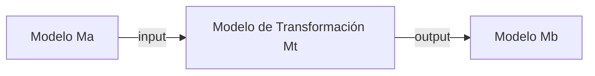
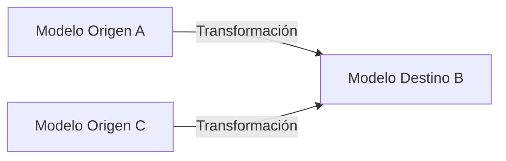
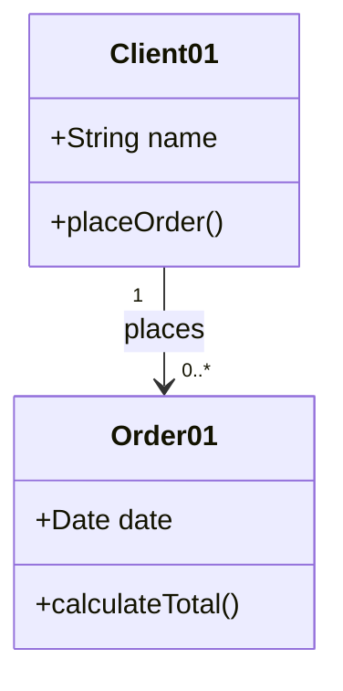

# **Transformaciones De Modelos**

---

## 📌 Introducción

- El proceso de desarrollo de software en **MDE (Model-Driven Engineering)** se basa en **transformaciones de modelos**.
    
- En MDE, la **transformación** en sí misma se considera un **modelo**.
    
- Los modelos en MDE contemplan distintas dimensions del sistema y se relacionan a través de **correspondencias**.
    
- En **MDA (Model-Driven Architecture)**, el metametamodelo **MOF (MetaObject Facility)** se utilize para definir transformaciones entre distintos lenguajes de modelado, como UML.

---

## 🏗️ Transformaciones En MDA

- MDA utilize el **metametamodelo MOF** para definir transformaciones entre lenguajes de modelado (ej. UML).
    
- Las transformaciones en MDA **aceptan elementos de entrada** y **producen elementos de salida**.
    
- **MOF Query/View/Transformation (QVT)** es el estándar del **OMG** para facilitar la definición y automatización de transformaciones de modelos en MDA.

### 🔄 Esquema Simplificado De Transformación MDA

- Se parte de un **modelo origen (Ma)** y se llega a un **modelo destino (Mb)** a través de un **modelo de transformación (Mt)**.

> ![[Pasted image 20250601131831.png]]

Para ilustrar este flujo, se podría usar un diagrama **Mermaid** como ejemplo alternativo:



---

## 📚 Conceptos Clave (Lopes, Hammoudi, Bézivin Y Jouault, 2005)

1. **Metametamodelo**
    
    - Define el marco general (ej. **MOF**).
        
2. **Modelo Origen**
    
    - Ejemplo: un **PIM** (Platform Independent Model).
        
3. **Modelo Destino**
    
    - Ejemplo: un **PSM** (Platform Specific Model).
        
4. **Metamodelos de Origen y Destino**
    
    - Definen la “gramática” de cada modelo (por ejemplo, UML para PIM, UML con estereotipos específicos para PSM).
        
5. **Modelo de Correspondencia**
    
    - Especifica las **relaciones** entre los metamodelos de origen y destino.
        
6. **Modelo de Transformación**
    
    - Se genera a partir del **modelo de correspondencia** usando un **lenguaje de transformación** (por ejemplo, QVT en MDA).

> **Nota**: Es necesario disponer de la **especificación de correspondencias** antes de definir una transformación.

---

## 🛠️ Técnicas Arquitectónicas Para Transformaciones

(Sendall & Kozaczynski, 2003)

1. **Manipulación directa del modelo**
    
    - Permite acceder y manipular la representación interna del modelo a través de una **API** (ej. usando Java, Visual Basic).
        
    - **Ventaja**: Familiar para desarrolladores.
        
    - **Desventaja**: Puede restringir ciertos tipos de transformaciones y limitar la abstracción en la especificación del comportamiento.
        
2. **Semántica de Acción de UML (AS)**
    
    - Permite definir el comportamiento a un **nivel de abstracción más alto**.
        
    - Las acciones formales de UML hacen que la especificación sea **computacionalmente completa** y los modelos UML sean **ejecutables**.
        
3. **Exportación a formato estándar**
    
    - Se exporta el modelo a un formato como **XML** (ej. **XMI** en MDA para modelos MOF/UML).
        
    - Una herramienta procesa ese XML para realizar la transformación.
        
    - Require soporte para un **lenguaje de transformación** capaz de expresar y aplicar dichas transformaciones (ej. **QVT**).

---

## 🔄 Transformación Modelo-a-Modelo (M2M)

- **Definición**: Toma uno o más **modelos** como entrada y produce uno o más **modelos** como salida.
    
- **Caso común**: Transformar un modelo en otro, de manera **uno-a-uno**.
    
- **Casos especiales**:
    
    - **Muchos-a-uno**: Unificar varios diagrams de clases UML en una vista integrada.
        
    - **Uno-a-muchos**: Generar diferentes vistas o derivaciones a partir de un único modelo.

### 📈 Patrón De Transformación M2M

> ![[Pasted image 20250601132200.png]]

Para ejemplificar, se puede mostrar un **Mermaid** alternativo que ilustra un flujo de M2M:



---

### 🔍 Tipos De Transformaciones M2M (Czarnecki & Helsen, 2006)

1. **Transformaciones Endógenas**
    
    - **Origen y destino** conformes a **un mismo metamodelo**.
        
    - Ejemplo: Refactorizar un diagrama de clases UML a otro diagrama UML con normas de estilo diferentes.
        
2. **Transformaciones Exógenas**
    
    - **Origen y destino** conformes a **metamodelos distintos**.
        
    - Ejemplo: Transformar un diagrama UML (metamodelo UML) a un modelo ER (metamodelo ER).

> ![[Pasted image 20250601132240.png]]

---

## ⚙️ Lenguajes De Transformación M2M

### 🔹 **QVT (Query/View/Transformation)**

- Estándar **OMG** para transformaciones M2M en MDA.
    
- Define tres sublenguajes:
    
    1. **Relations**
        
        - Permite especificar transformaciones de manera **declarativa**, relacionando elementos de los modelos.
            
    2. **Core**
        
        - Es una versión más **simple** que `relations` pero con descripciones **más complicadas**.
            
    3. **Operational Mappings**
        
        - Permite definir transformaciones usando **técnicas imperativas**.
            
- QVT combina:
    
    - **Parte declarativa** (core y relations)
        
    - **Parte imperativa** (operational mappings)

### 🔹 **ATL (Atlas Transformation Language)**

- Desarrollado por **AtlanMod** como respuesta a la RFP OMG MOF/QVT.
    
- Forma parte de la plataforma **AMMA**.
    
- Define su sintaxis abstracta mediante un **metamodelo** ⇒ Cada transformación es en sí **un modelo**.
    
- Lenguaje **híbrido**: combina **declarativo** e **imperativo**.
    
- Características:
    
    - Las transformaciones son **unidireccionales**:
        
        - Modelos origen: **solo lectura**
            
        - Modelos destino: **solo escritura**
            
    - Soporte automático de **trazabilidad**
        
- Herramientas asociadas:
    
    - Motor de transformaciones ATL
        
    - IDE basado en **Eclipse**
        
    - Depurador ATL

---

## 🖥️ Transformación Modelo-a-Texto (M2T)

- **Objetivo**: Generar **código fuente** a partir de un modelo.
    
- En MDE, las transformaciones M2T se centran en la **generación automática** o **semiautomática** de código desde un modelo.

### 🔄 Proceso De Generación De Código En MDA

> ![[Pasted image 20250601132405.png]]

- El flujo suele seguir el **proceso unificado**:
    
    1. **PIM/PSM → Plantillas de código**
        
    2. **Plantillas → Código fuente**

### 📊 Esquema General De Generación De Código En MDE

> ![[Pasted image 20250601132430.png]]

---

## 🔗 Ejemplo De Transformación M2T

A continuación se muestra un extracto de un modelo UML y su **equivalente en Java**:



**Equivalente en Java** (resultado de M2T):

```java
public class Client {
    private String name;
    private List<Order> orders;

    public Client(String name) {
        this.name = name;
        this.orders = new ArrayList<>();
    }

    public void placeOrder(Order order) {
        orders.add(order);
    }
}

public class Order {
    private Date date;

    public Order(Date date) {
        this.date = date;
    }

    public double calculateTotal() {
        // Lógica de cálculo...
        return 0.0;
    }
}
```

> **Nota**: Este ejemplo muestra cómo un simple **diagrama de clases UML** se traduce en **código Java**, ilustrando una transformación **M2T**.

---

## ✅ Resumen De Claves

1. **Transformaciones en MDA**: MOF → Metamodelos → Modelos (PIM → PSM)
    
2. **QVT y ATL**: Lenguajes estándar/exógenos para M2M
    
3. **M2T**: Generación de código a partir de modelos UML
    
4. **Endógeno vs Exógeno**:
    
    - Endógeno: misma “gramática” (metamodelo)
        
    - Exógeno: metamodelos diferentes
        
5. La interrelación entre **modelos** y **transformaciones** es la base de la arquitectura de artefactos en proyectos de software.

---

## MicroTest

- Según el texto, ¿cuál de las siguientes afirmaciones es correcta?
	- B. Una transformación modelo-a-modelo puede convertir varios modelos en un único modelo.
- Según el texto, ¿qué tipo de transformaciones distinguen entre las transformaciones modelo-a-modelo?
	- Transformaciones endógenas y transformaciones exógenas.
- Según el texto, ¿cuál es la parte imperativa de query/view/transformation (QVT)?
	- Lenguaje operational mappings.
- ¿Qué tipo de transformación relaciona las herramientas de análisis con las plataformas de ejecución?
	- A Transformación modelo-a-texto.