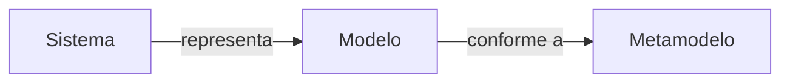
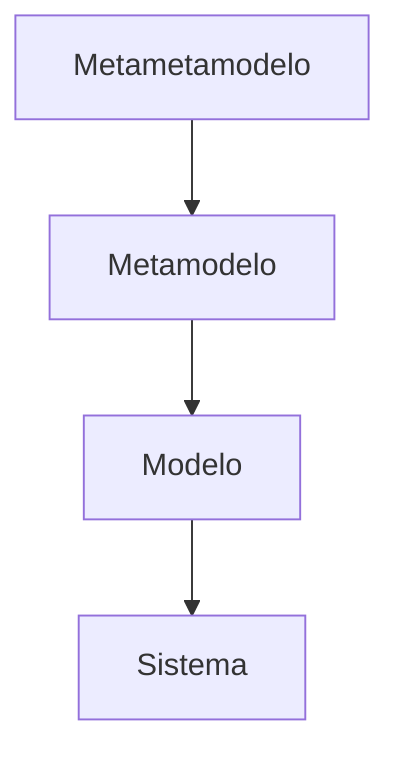
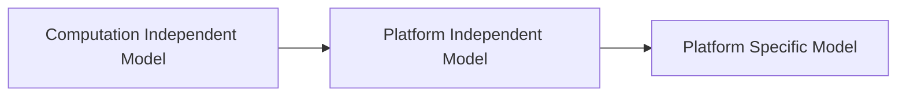
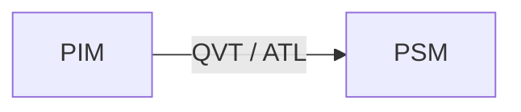
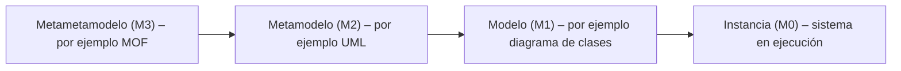
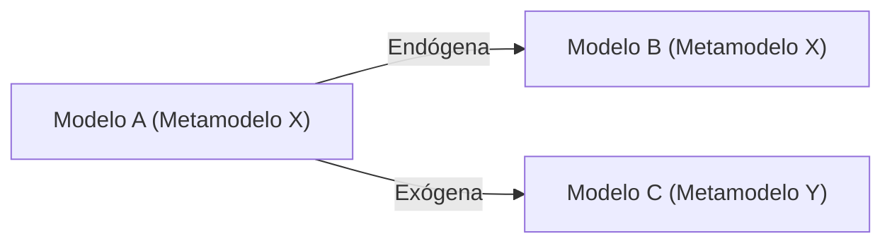

# 📘 Notas: Ingeniería Y Arquitectura Dirigida Por Modelos (MDE & MDA)

---

## 1. Importancia De Los Modelos

- Usar modelos para diseñar sistemas complejos es importante en ingeniería.

- Abstracción para comprender y resolver sistemas complejos.
    
- **MDE**: los modelos son artefactos principales—descripción, validación, verificación, simulación y generación de código.
    
- Modelos usan conceptos cercanos al **dominio del problema**, no detalles de implementación.

Un modelo usa conceptos que serán más próximos al dominio conceptual del problema y están menos Relacionados con elementos de los lenguajes de programación, logrando que los lenguajes sean más Fáciles de especificar, comprender y mantener.

MDE generaliza conceptos mediante el establecimiento de principios, donde MDA (arquitectura dirigida por modelos) constituye un estándar aplicado de la teoría que presenta.

---

## 2. Fundamentos De MDE

### 2.1 Conceptos Clave

- **Sistema** ↔ **Modelo** (relación de **representación**)
    
- **Modelo** ↔ **Metamodelo** (relación de **conformidad**)



### 2.2 Definición De Bézivin

> “Un modelo es un grafo dirigido y etiquetado que representa aspectos de un sistema y es conforme a otro grafo: el metamodelo.”

---

## 3. Propiedades De Un Modelo

1. Representa **parte** del sistema (no es la totalidad).
    
2. Ofrece **correspondencia**, **simplificación** y **practicidad**.
    
3. Vista **parcial** y **propósito** concreto (descriptivo o prescriptivo).
    
4. Se pueden relacionar múltiples modelos (mismo o distinto lenguaje).
    
    - **Adaptación de modelo** (mismo lenguaje)
        
    - **Adaptación de lenguaje** (lenguajes diferentes)

- EI modelo y el sistema no son lo mismo, el modelo representa partes del sistema a construir siendo conforme a un único metamodelo.

- EI modelo solo refleja una selección relevante de las propiedades del sistema real.
- EI modelo debe set utilizado en lugar del sistema original con respecto a algún propósito, ya sea descriptivo o prescriptivo

---

## 4. Vistas Y Dimensions

- Descomposición simultánea en **vistas** (función, estructura, comportamiento…).
    
- Cada modelo aporta **modularidad**, **reutilización**, **automatización**.

---

## 5. Herramientas CASE

- Automatizan creación, transformación, simulación, trazabilidad.
    
- Reducen esfuerzo y maximizan beneficios de los modelos.

---

## 6. Ejemplos De Modelos UML

- **Casos de uso**: función
    
- **Clases / Components**: estructura
    
- **Estados / Actividad**: comportamiento

---

## 7. Metamodelos & Metametamodelos

### 7.1 Metamodelo

- Define **entidades**, **relaciones** y **reglas** de un lenguaje de modelado.
    
- Un modelo es **conforme** si sus elementos tienen correspondientes metaelementos.

### 7.2 Metametamodelo

- Define **metamodelos**.
    
- Ejemplo: **MOF** (Meta-Object Facility).



---

## 8. Model Driven Architecture (MDA)

### 8.1 Capas De MDA



1. **CIM**: modelo de negocio / dominio (sin detalles de implementación).
    
2. **PIM**: diseño lógico, independiente de tecnología.
    
3. **PSM**: adaptación al entorno de implementación concreto.

---

### 8.2 Transformaciones Modelo → Modelo

- **Endógenas**: origen y destino conformes al **mismo** metamodelo.
    
- **Exógenas**: metamodelos **distintos** (p.ej. PIM → PSM).



---

## 9. Lenguajes Y DSLs

- **DSL**: Domain-Specific Language (ej. HTML, SQL)
    
- **DSML**: Modelado de dominio específico (perfil UML, Babel Meta)

---

## 10. OCL (Object Constraint Language)

- Estándar OMG para **restricciones** y definiciones formales en UML.
    
- **Tipado**, **sin efectos laterales**, **declarativo**, **sin detalles de implementación**.

```ocl
context Vuelo
  inv: self.escala->isOrdered()
```

---

## 11. Lenguajes De Transformación

- **QVT** (OMG): relations, core, operational mappings.
    
- **ATL** (AtlanMod): híbrido, unidireccional, con trazabilidad automática.

---

> **Conclusión:**  
> [[MDE]]/MDA elevan niveles de abstracción al usar **modelos** como motor del proceso, apoyados por **CASE**, **metamodelos**, transformaciones y lenguajes formales como **OCL**, **QVT** y **ATL** para automatizar y asegurar la calidad de sistemas complejos.

# Ingeniería Dirigida Por Modelos (MDE)

La **Ingeniería Dirigida por Modelos** (Model-Driven Engineering, [[MDE]]) es un paradigma de desarrollo de software centrado en la creación y explotación de modelos de dominio. En este enfoque, los modelos (representaciones conceptuales del problema) son los artefactos principales del proceso, relegando los detalles algorítmicos a un segundo plano[en.wikipedia.org](https://en.wikipedia.org/wiki/Model-driven_engineering#:~:text=Model,algorithmic%29%20concepts). El objetivo principal de la MDE es **explicitar los términos del negocio** en forma de modelos y utilizar estos modelos durante todo el ciclo de vida del software mediante transformaciones automáticas[sisbib.unmsm.edu.pe](https://sisbib.unmsm.edu.pe/bibvirtual/publicaciones/risi/2010_n2/v7n2/a02v7n2.pdf#:~:text=ingenier%C3%ADa%20dirigida%20por%20modelos%20tiene,la%20automatizaci%C3%B3n%20de%20sus%20procesos). De esta manera se busca aumentar la productividad y la calidad: por ejemplo, maximizando la compatibilidad entre sistemas (reutilización de modelos estandarizados), simplificando el diseño mediante patrones del dominio y promoviendo la comunicación con terminología común en el equipo de desarrollo[en.wikipedia.org](https://en.wikipedia.org/wiki/Model-driven_engineering#:~:text=The%20MDE%20approach%20is%20meant,2).

- **Objetivos de [[MDE]]:** Especificar los términos del dominio en modelos[sisbib.unmsm.edu.pe](https://sisbib.unmsm.edu.pe/bibvirtual/publicaciones/risi/2010_n2/v7n2/a02v7n2.pdf#:~:text=ingenier%C3%ADa%20dirigida%20por%20modelos%20tiene,la%20automatizaci%C3%B3n%20de%20sus%20procesos), utilizar modelos en todas las etapas mediante transformaciones automáticas y abstraer la complejidad de plataformas de ejecución.
    
- **Beneficios:** Mayor **reutilización** y estandarización de modelos, **simplificación del diseño** aplicando patrones de alto nivel, y mejor **comunicación** en el equipo de desarrollo gracias a un vocabulario común[en.wikipedia.org](https://en.wikipedia.org/wiki/Model-driven_engineering#:~:text=The%20MDE%20approach%20is%20meant,2).

## Modelo, Metamodelo Y Metametamodelo

En [[MDE]] se define una jerarquía por niveles de abstracción que relaciona _modelos_, _metamodelos_ y _metametamodelos_. Un **metamodelo** es la definición de un lenguaje de modelado (por ejemplo, el metamodelo de UML) y un **modelo** concreto es una instancia de ese metamodelo[uml-diagrams.org](https://www.uml-diagrams.org/uml-meta-models.html#:~:text=MOF%20is%20used%20as%20the,can%20define%20their%20own%20models). A su vez, un **metametamodelo** (por ejemplo, el Meta-Object Facility, MOF) define el lenguaje en el que se especifican los metamodelos[uml-diagrams.org](https://www.uml-diagrams.org/uml-meta-models.html#:~:text=The%20meta,metamodel). De modo general, **un modelo es una instancia de un metamodelo**[uml-diagrams.org](https://www.uml-diagrams.org/uml-meta-models.html#:~:text=MOF%20is%20used%20as%20the,can%20define%20their%20own%20models) y los elementos de un metamodelo son instancias de su metametamodelo. Esta jerarquía de niveles se suele representar como capas M3–M2–M1 (y M0 para instancias reales)[cs.sjsu.edu](https://www.cs.sjsu.edu/~pearce/modules/lectures/se/mda.htm#:~:text=)[uml-diagrams.org](https://www.uml-diagrams.org/uml-meta-models.html#:~:text=The%20meta,metamodel):



- **Metametamodelo (M3):** Define el lenguaje para especificar metamodelos (p.ej. MOF)[uml-diagrams.org](https://www.uml-diagrams.org/uml-meta-models.html#:~:text=The%20meta,metamodel).
    
- **Metamodelo (M2):** Define el lenguaje para los modelos (p.ej. UML es un metamodelo)[uml-diagrams.org](https://www.uml-diagrams.org/uml-meta-models.html#:~:text=MOF%20is%20used%20as%20the,can%20define%20their%20own%20models).
    
- **Modelo (M1):** Es una descripción del sistema (p.ej. un modelo UML de clases) que **instancia** un metamodelo.
    
- **Instancia (M0):** Elementos de ejecución o datos concretos, instancias de los modelos.

Según la especificación OMG, en la arquitectura de cuatro capas: M0 son los objetos de datos reales, M1 los modelos, M2 los lenguajes de modelado (metamodelos) y M3 los lenguajes de metametamodelado (por ejemplo MOF). Cada elemento de nivel M_i es instancia de un elemento de nivel M_{i+1}[cs.sjsu.edu](https://www.cs.sjsu.edu/~pearce/modules/lectures/se/mda.htm#:~:text=).

## Arquitectura Dirigida Por Modelos (MDA) Y Niveles CIM/PIM/PSM

Dentro de la [[MDE]] destaca la **Arquitectura Dirigida por Modelos** (Model-Driven Architecture, MDA), propuesta por el Object Management Group (OMG). MDA organiza el desarrollo en tres modelos principales[cs.sjsu.edu](https://www.cs.sjsu.edu/~pearce/modules/lectures/se/mda.htm#:~:text=There%20are%20three%20models%20in,MDA):

- **CIM (Computation-Independent Model):** Modelo independiente de computación. Describe el sistema en términos de requerimientos y dominio del problema, sin detalles de la solución tecnológica[cs.sjsu.edu](https://www.cs.sjsu.edu/~pearce/modules/lectures/se/mda.htm#:~:text=The%20CIM%20combines%20the%20requirements,will%20interact%20with%20its%20environment).
    
- **PIM (Platform-Independent Model):** Modelo independiente de la plataforma. Es el modelo de diseño del sistema, sin referirse a ninguna plataforma de implementación específica[cs.sjsu.edu](https://www.cs.sjsu.edu/~pearce/modules/lectures/se/mda.htm#:~:text=The%20CIM%20combines%20the%20requirements,will%20interact%20with%20its%20environment).
    
- **PSM (Platform-Specific Model):** Modelo específico de plataforma. Agrega detalles de la plataforma de destino (por ejemplo, frameworks o tecnologías concretas) al PIM[cs.sjsu.edu](https://www.cs.sjsu.edu/~pearce/modules/lectures/se/mda.htm#:~:text=The%20CIM%20combines%20the%20requirements,will%20interact%20with%20its%20environment).

MDA define transformaciones formales entre estos modelos: típicamente se transforma el PIM en uno o varios PSM añadiendo información de la plataforma, y se espera automatizar la generación de código desde el PSM. El siguiente diagrama resume la relación de abstracción:



Este enfoque en niveles de abstracción facilita la separación entre requisitos, diseño abstracto y detalles de implementación, potenciando la reutilización del modelo PIM en múltiples plataformas.

## Transformaciones De Modelos

En [[MDE]], las **transformaciones de modelos** son procesos automáticos que convierten un modelo de entrada en otro modelo o artefacto de salida. El propósito de una transformación es **automatizar la construcción y modificación de modelos** para reducir esfuerzo y errores[en.wikipedia.org](https://en.wikipedia.org/wiki/Model_transformation#:~:text=A%20model%20transformation%2C%20in%20model,modification%20of%20models%20where%20possible). Por ejemplo, se suele transformar un modelo PIM en un modelo PSM incorporando detalles de plataforma.

Las transformaciones pueden clasificarse según el origen y destino del lenguaje de modelado:

- **Transformación endógena:** el modelo fuente y el modelo destino están expresados en el mismo lenguaje (metamodelo). Es decir, la transformación no cambia el lenguaje de modelado[en.wikipedia.org](https://en.wikipedia.org/wiki/Model_transformation#:~:text=Endogenous%20transformations%20are%20transformations%20between,model%20by%20an%20exogenous%20model).
    
- **Transformación exógena:** el modelo fuente y el modelo destino usan lenguajes diferentes (distintos metamodelos)[en.wikipedia.org](https://en.wikipedia.org/wiki/Model_transformation#:~:text=Endogenous%20transformations%20are%20transformations%20between,model%20by%20an%20exogenous%20model). Por ejemplo, transformar un modelo de dominio a un modelo de base de datos.
