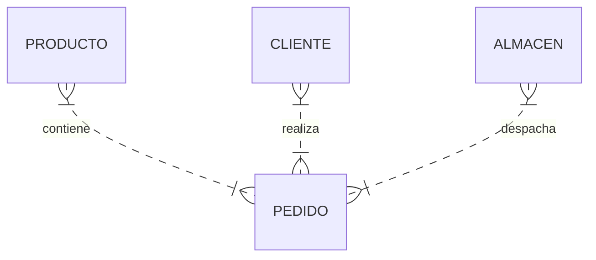
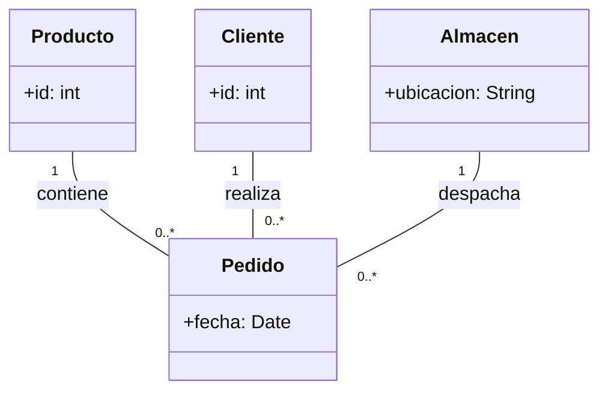

# Vista Estática Del Sistema (UML)

El **modelo de clases** es importante para la comunicación entre analistas, diseñadores y programadores en el desarrollo de aplicaciones.  

En el modelado de la **vista estática** del sistema con UML se deben tener en cuenta aspectos importantes para una correcta comprensión del sistema.  

- **Modelo conceptual (análisis)** vs **modelo de software (diseño)** en la identificación de clases, atributos y operaciones.  
- Se sugiere la creación de un **modelo del entorno** antes del modelo conceptual.  
  - El **modelo del entorno** define la parte de la realidad que rodea al sistema informático.  
  - El sistema informático interactúa con el entorno para proporcionar servicios.  
  - Ayuda a entender y extraer requisitos del sistema software.  

---

## Asociación Reflexiva (Recursiva)

Una **asociación reflexiva** o recursiva es una asociación que enlaza una clase consigo misma.  

- Los enlaces pueden conectar dos instancias diferentes de la misma clase, o una instancia consigo misma.  
- Los **nombres de rol** son obligatorios para distinguir los extremos de la asociación.  
- **No es simétrica.**
![[Pasted image 20250608201818.png]]

### Ejemplo Mermaid

```mermaid
classDiagram
    class Persona {
        +nombre: String
    }
    Persona "1" -- "0..*" Persona : padreDe
    Persona "1" -- "0..*" Persona : madreDe
````

---

## Clase Asociación

Una **clase asociación** se corresponde con una clase que tiene las propiedades propias de una clase y una asociación.

- Debe tener un **único nombre**.
    
- No puede container **tuplas repetidas** (salvo que se añada la restricción `{nonunique}` en los extremos).

![[Pasted image 20250608201933.png]]

### Ejemplo Mermaid

```mermaid
classDiagram
    class Estudiante {
        +id: int
    }
    class Curso {
        +codigo: String
    }
    class Inscripción {
        +fecha: Date
    }

    Estudiante "1" -- "0..*" Inscripción : inscribe
    Curso "1" -- "0..*" Inscripción : esEn
```

---

## Transformación a Código (Java, .NET, …)

Al programar en una plataforma concreta, la **clase asociación** se transforma en una **clase intermedia**, cruzando las cardinalidades:
![[Pasted image 20250608202012.png]]
---

## Asociación N-aria

Una **asociación n-aria** enlaza _n_ clases simultáneamente.

- No permite especificar la dirección del nombre, navegabilidad ni agregación.
    
- **Admite** clases asociación.
    
- La **multiplicidad** en un extremo representa el número permitido de instancias para cualquier possible combinación de instancias de las otras _n-1_ clases.
    
    - La **multiplicidad mínima** suele set 0.
        
- **Efecto rebote del uno**: si la multiplicidad mínima en un extremo es 1 (o superior), debe existir al menos un enlace para cada combinación de instancias de las otras _n-1_ clases.

### Ejemplo Mermaid





---

## Microtest

- ¿Cuál de las siguientes es una característica de una asociación reflexiva?
	- Los enlaces pueden conectar dos instancias diferentes de la misma clase, pero también pueden conectar una instancia consigo misma.
- ¿Qué característica tiene una clase asociación?
	- Como se trata de un elemento único, ha de tener un único nombre.
- Como se trata de un elemento único, ha de tener un único nombre.
	- Debe comprenderse correctamente los aspectos del sistema que se está modelando.