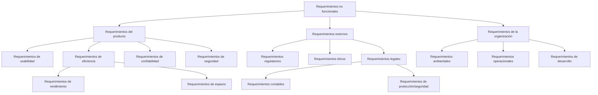
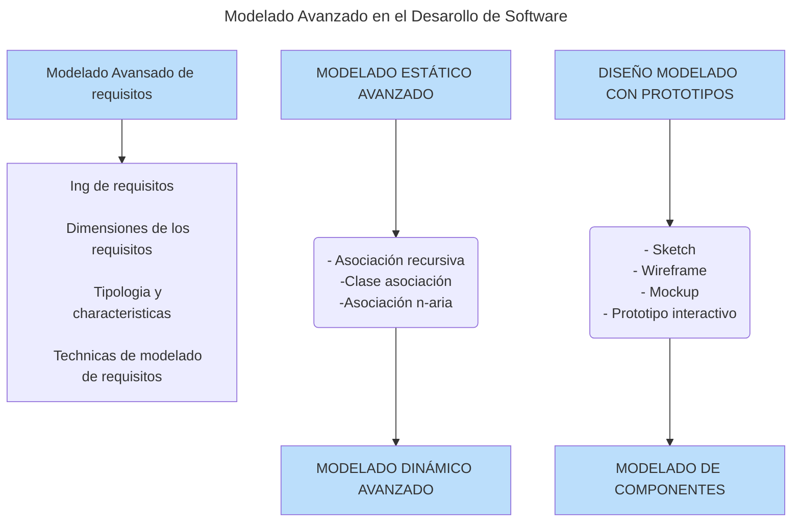

# Modelado Avanzado En El Desarrollo De Software

## Introducción

La extracción de requisitos es una de las tareas más críticas en un proyecto de desarrollo de software. Muchas veces no se gestiona adecuadamente, lo que resulta en aplicaciones de baja calidad. A pesar de las herramientas formales disponibles, muchos proyectos aún fracasan porque el sistema no cumple con las necesidades del cliente. La ingeniería de requisitos es una disciplina difícil que consiste en obtener, analizar, documentar y validar los requisitos del proyecto.

La comunicación es fundamental para descubrir los requisitos de un nuevo producto o servicio.

---

## Dimensions De Los Requisitos

- **Ámbito:** Parte del sistema afectada por el requisito.
    
- **Tipos:**
    
    - Requisitos funcionales
        
    - Requisitos no funcionales
        
    - Requisitos de información
        
- **Audiencia:**
    
    - Clientes y usuarios sin formación técnica
        
    - Desarrolladores de software

---

## Niveles De Requisitos

1. **Requisitos de negocio:** Justifican por qué se desea desarrollar un sistema y qué beneficio se espera alcanzar.
    
2. **Requisitos de usuario:** Describen qué desean hacer los usuarios con el sistema y qué objetivos quieren lograr.
    
3. **Requisitos funcionales:** Indican qué deben implementar los desarrolladores para que usuarios y organización alcancen sus objetivos.

---

## Requisitos No Funcionales (Sommerville)

- **Producto:** Rendimiento, seguridad, usabilidad.
    
- **Organización:** Políticas y procedimientos.
    
- **Externos:** Regulaciones, leyes, aspectos éticos.

---

## Técnicas De Modelado De Requisitos

- **Entrevistas**: Preguntas directas al usuario.
    
- **Observación directa**: Se observa el comportamiento del usuario.
    
- **Análisis de interfaces y documentación**
    
- **Casos de uso y escenarios**: Representan y refinan la especificación.
    
- **Prototipos**: Simulan el sistema para validar especificaciones.
    
- **Ingeniería inversa**: Recuperación de requisitos de sistemas existentes.
    
- **Reutilización de requisitos**: Aplicación de requisitos de proyectos anteriores.

---

## UML Y Modelado

- **Casos de uso**: Modelan la funcionalidad del sistema.
    
- **Ambigüedad en UML**: Require documentación adicional.
    
- **Diagrams complementarios**:
    
    - Interacción
        
    - Actividad
        
    - Estados

---

## Vista Estática Y Dinámica Del Sistema

- **Vista estática**: Estructura completa a implementar.
    
- **Vista dinámica**: Modelado del comportamiento.
    
    - Diagrams de interacción
        
    - Diagrams de actividad
        
    - Diagrams de estado
        
- **Ley de Demeter**: Restricciones de comunicación entre objetos.

---

## Modelado Visual: Prototipos

### Sketch O Boceto

- Primer dibujo a mano alzada.
    
- Evaluación rápida de alternativas.
    
- Creatividad y agilidad.

### Wireframe

- Ilustración bidimensional.
    
- Estructura y navegación.
    
- Elementos esenciales sin estilo visual.
    
- Se usan patrones de diseño comunes.

### Mockup O Maqueta

- Representación visual avanzada.
    
- Alta o baja fidelidad.
    
- Contenido de prueba, paleta de colores, tipografía.
    
- No son funcionales, pero pueden set interactivos.

### Prototipo Interactivo

- Modelo navegable y funcional.
    
- Evaluación detallada de:
    
    - Navegación
        
    - UI/UX
        
    - Servicios de búsqueda y ayuda
        
- Nivel más sofisticado de prototipos.
    
- Útil para proyectos novedosos y con alta incertidumbre.

---

## Diagrama General Del Proceso De Modelado Avanzado

---

## Imagen De Apoyo

![[Pasted image 20250617101223.png]]

(Si deseas incrustar directamente esta imagen o reemplazarla por un enlace, indícamelo)

---

¿Deseas exportar esto como PDF, HTML o seguir con más contenido? También puedo ayudarte a crear una portada o formato de presentación académica si es necesario.