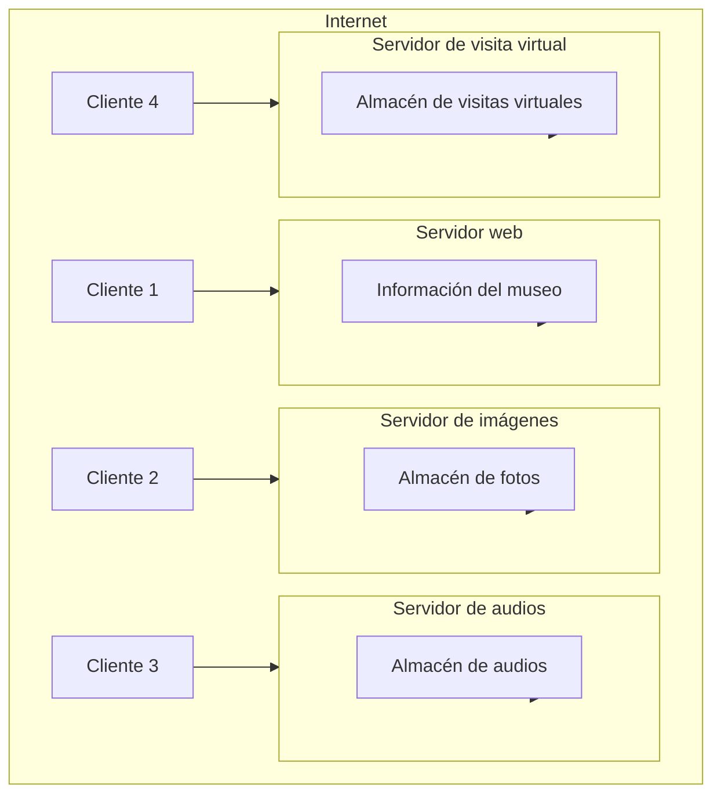

# Patrones De Arquitectura

Para Sommerville, los patrones arquitectónicos son una manera de «representar, compartir y reutilizar el conocimiento sobre los sistemas de software que se manifiesta como una descripción abstracta estilizada de buena práctica, que se ensayó y puso a prueba en diferentes sistemas y entornos»  
(Sommerville, I. (2011). _Ingeniería de software_ (9.ª ed.). Pearson Educación de México).

## Arquitecturas Cliente-servidor

En estos sistemas, la lógica se distribuye entre dos tipos de máquinas, clientes y servidores, conectados por algún tipo de middleware  
(POIO Usaola, M. (2012). _Desarrollo de software basado en reutilización_. Universitat Oberta de Catalunya).

Estas arquitecturas son habituales en los sistemas distribuidos, pero también pueden aplicarse a procesos que se ejecutan en la misma máquina.  
Los elementos fundamentales son: **servidores**, **clientes** y **red**.

En la figura se muestra el ejemplo de un museo virtual como sistema multiusuario.  
Además, se aprecia que los distintos servidores a los que acceden los clientes se comportan a su vez como clientes frente a sus respectivos repositorios de datos, definiéndose un modelo de dos capas en cada uno de los servidores.

### Tabla: Arquitecturas Cliente-servidor

|**Nombre**|**Descripción**|**Ejemplo**|**Cuándo usarlo**|**Ventajas**|**Desventajas**|
|---|---|---|---|---|---|
|Arquitecturas cliente-servidor|La funcionalidad del sistema se organiza en servicios que ofrecen distintos servidores. Los clientes son usuarios de estos servicios.|En la figura anterior se muestra un ejemplo para un museo virtual organizado según el modelo cliente-servidor.|Apropiado cuando desde diferentes puntos se necesita obtener información o servicios comunes.|Los servidores pueden estar distribuidos en una red. Cuando la carga es variable se pueden replicar los servidores.|Los servidores son puntos vulnerables al poder recibir ataques. La carga puede set impredecible cuando aumenta el número de clientes.|

En función de cómo esté distribuida la lógica entre los diferentes nodos, podemos encontrar diferentes situaciones particulares, como se aprecia en la figura.  
Interesa resaltar la diferencia entre:

- **Clientes ligeros**, que únicamente contienen lógica de presentación.
    
- **Clientes pesados**, que, además, realizan operaciones adicionales con los datos y, en muchos casos, almacenan también información.

![[Pasted image 20250617163250.png]]

## Arquitecturas De Tuberías Y Filtros

Son sistemas con nodos especializados en procesar datos de entrada y producir resultados.  
Los nodos, o filtros, se conectan a través de **tuberías**, formando un grafo dirigido en el sistema.  
Los nodos son independientes, no comparten información de estado ni conocen a otros nodos.

Ejemplos de estos sistemas incluyen compiladores de lenguajes y sistemas de procesamiento de señal.

En este tipo de sistemas es fácil la **reutilización** de components, o filtros, siempre y cuando los protocolos de comunicación entre ellos sean respetados.  
Además, dada la independencia de los components, el mantenimiento suele set sencillo.

### Tabla: Arquitecturas De Tuberías Y Filtros

| **Nombre**                          | **Descripción**                                                                                                                           | **Ejemplo**                                                                                                                                       | **Cuándo usarlo**                                                                                                                           | **Ventajas**                                                                                                                                             | **Desventajas**                                                                                                             |
| ----------------------------------- | ----------------------------------------------------------------------------------------------------------------------------------------- | ------------------------------------------------------------------------------------------------------------------------------------------------- | ------------------------------------------------------------------------------------------------------------------------------------------- | -------------------------------------------------------------------------------------------------------------------------------------------------------- | --------------------------------------------------------------------------------------------------------------------------- |
| Arquitecturas de tuberías y filtros | Los datos fluyen a lo largo del sistema, atravesando components de procesamiento (filtros) conectados entre sí y que no comparten estado. | En la figura anterior se muestra un ejemplo con los diferentes y consecutivos procesamientos que sufre el código durante la compilación y enlace. | Es de utilidad en cualquier operación de tratamiento de datos (en lote o transacciones) en donde son necesarias varias etapas de procesado. | Fácil de entender, mantener y aplicar reutilización. Se adapta bien a muchos procesos empresariales. Fácil extensión mediante la adición de más filtros. | Se deben respetar formatos e interfaces entre filtros. Puede requerir el desarrollo de filtros adicionales de acoplamiento. |

- Descomponen un sistema en capas especializadas. Cada Capa ofrece servicios a la siguiente y solo conoce a las Adyacentes. 
- Ideal para el desarrollo incremental de sistemas. Apropiado Para establecer distintos niveles de control de acceso. 
- Ejemplo en la arquitectura de capas de la plataforma Android con Kernel Linux en el nivel inferior y capa de API En el superior.

![[Pasted image 20250617165243.png]]

## Arquitecturas Multicapa

Las características principales de este patrón se resumen en la tabla:

| **Nombre**              | **Descripción**                                                                                                                      | **Ejemplo**                                                                                                                                                                                                          | **Cuándo usarlo**                                                                                                          | **Ventajas**                                                                                                                   | **Desventajas**                                                                                                              |
| ----------------------- | ------------------------------------------------------------------------------------------------------------------------------------ | -------------------------------------------------------------------------------------------------------------------------------------------------------------------------------------------------------------------- | -------------------------------------------------------------------------------------------------------------------------- | ------------------------------------------------------------------------------------------------------------------------------ | ---------------------------------------------------------------------------------------------------------------------------- |
| Arquitecturas multicapa | Las funcionalidades del sistema se distribuyen en distintas capas lógicas, de manera Que cada una ofrece servicios a la superior. | En la figura anterior se presentan tres ejemplos de arquitectura, una para el caso De una aplicación, otra para el caso de un sistema de comunicación y, finalmente, la Arquitectura de la plataforma Android. | Cuando queramos construir nuevos servicios sobre otros existentes o exista un Requisito de seguridad en varios niveles. | Permite la sustitución de capas enteras manteniendo la interfaz. Permite el despliegue de cada capa en máquinas diferentes. | Puede set difícil mantener una separación clara entre capas. Puede disminuir el rendimiento en sistemas con muchas capas. |

## Arquitectura De Repositorios

La arquitectura de repositorio es adecuada para sistemas con grandes cantidades de información

Compartida por diferentes subsistemas.

Consiste en components generadores de datos y otros que los consumen, almacenando la

información en un repositorio común.

Se puede definir una arquitectura orientada a la seguridad en un servidor centralizado, como en un

Sistema de gestión hospitalaria.

Este modelo se enfoca en la concentración de datos en el repositorio común, sin diferencias

Significativas con el cliente-servidor

En la figura se muestra un ejemplo de este patrón para eI caso de un sistema de gestión hospitalaria.

Todos los subsistemas comparten información sobre los pacientes, que está almacenada y

Centralizada en un único servidor. En este servidor se puede definir una arquitectura interna orientada

A la seguridad como una arquitectura de capas. Este modelo no presenta diferencias respecto del

Cliente-servidor, pero está orientado a la concentración de los datos en el repositorio común.

![[Pasted image 20250617170345.png]]

Esta es una manera eficiente de

Compartir grandes cantidades de datos,

Pero todos los participantes deben

Ponerse de acuerdo en un modelo de

datos común.

Esta possible distribución, orientada en

General a facilitar la escalabilidad del

Sistema, es uno de los puntos que

Plantea problemas en este modelo.

| **Nombre**    | **Arquitectura de repositorios**                                                                                                                                                                                                                         |
| ------------- | -------------------------------------------------------------------------------------------------------------------------------------------------------------------------------------------------------------------------------------------------------- |
| Desc          | Todos los datos del sistema se concentran en un repositorio central, al que acceden EI resto de las components.                                                                                                                                          |
| Ejemplo       | En la figura anterior vemos un ejemplo de un sistema de gestión hospitalaria, donde toda la Información sobre pacientes es compartida por otros subsistemas de gestión.                                                                                  |
| Cuando usarlo | Con sistemas que deben almacenar grandes volúmenes de información durante Mucho tiempo.                                                                                                                                                               |
| Ventajas      | EI resto los components son independientes entre sí. Los datos están concentrados, 10 cual facilita su gestión.                                                                                                                                       |
| Desventajas   | La información está concentrada en un único nodo critico. • EI resto de los components se comunican a través de este nodo. Puede set complicado distribuir eI repositorio en varias máquinas (problemas de Redundancia o inconsistencia de datos), |

---

