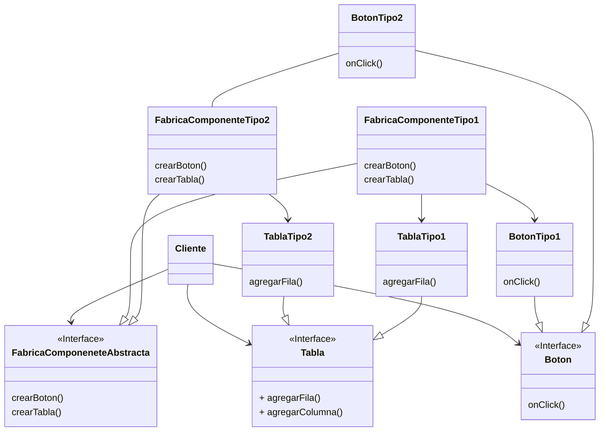
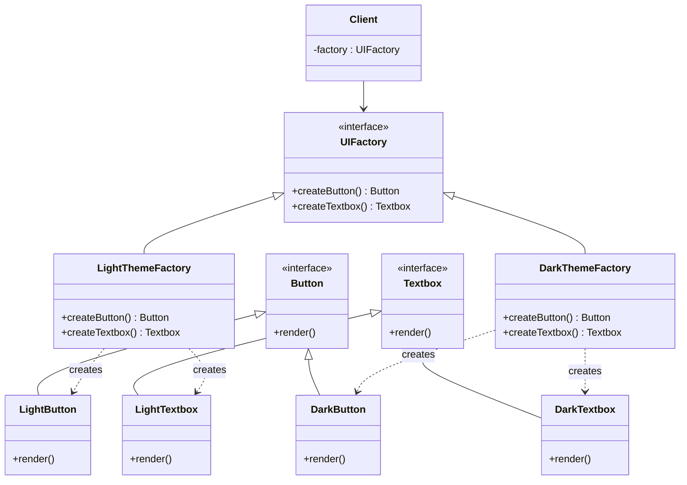
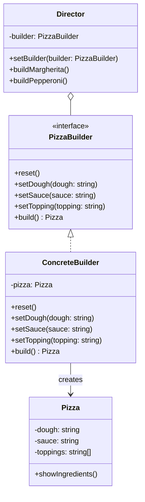
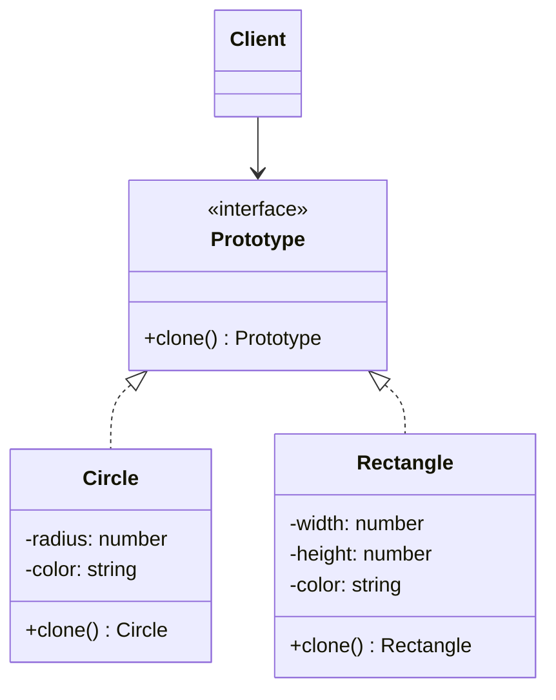
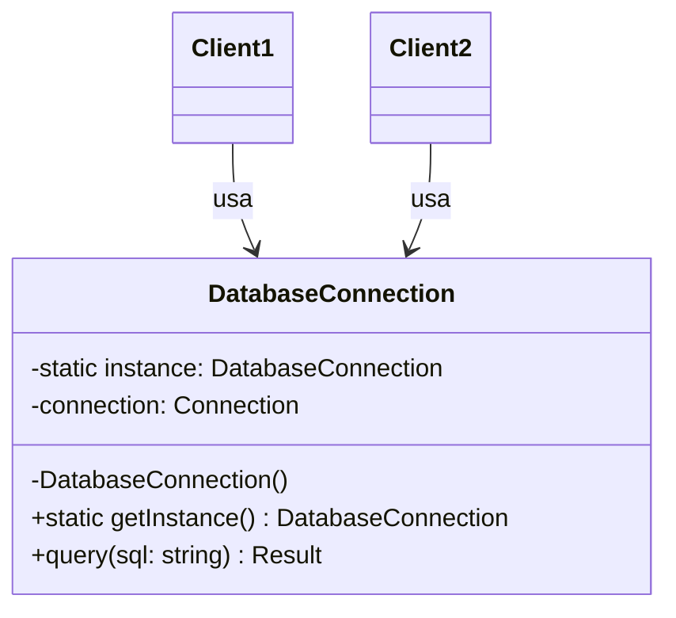
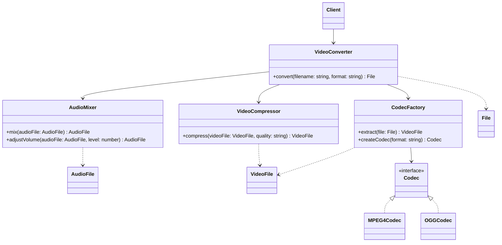
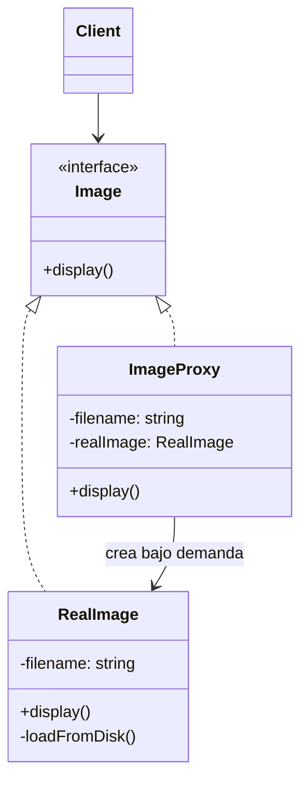
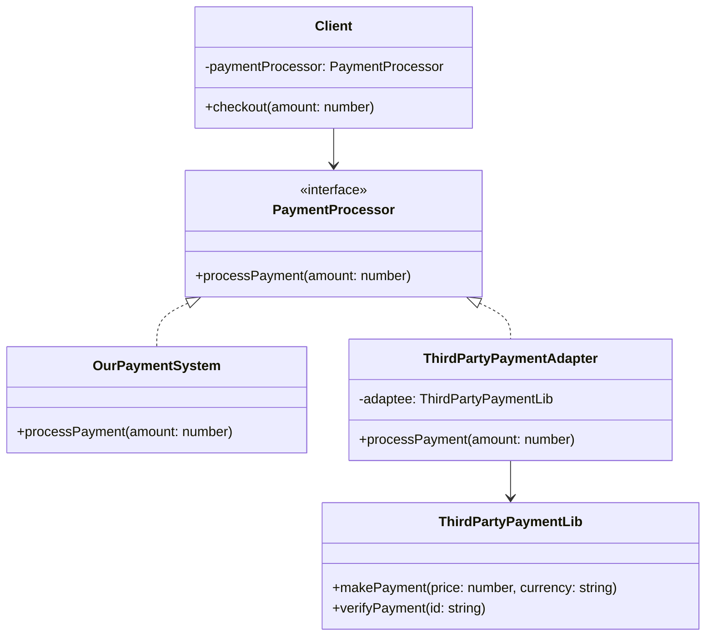
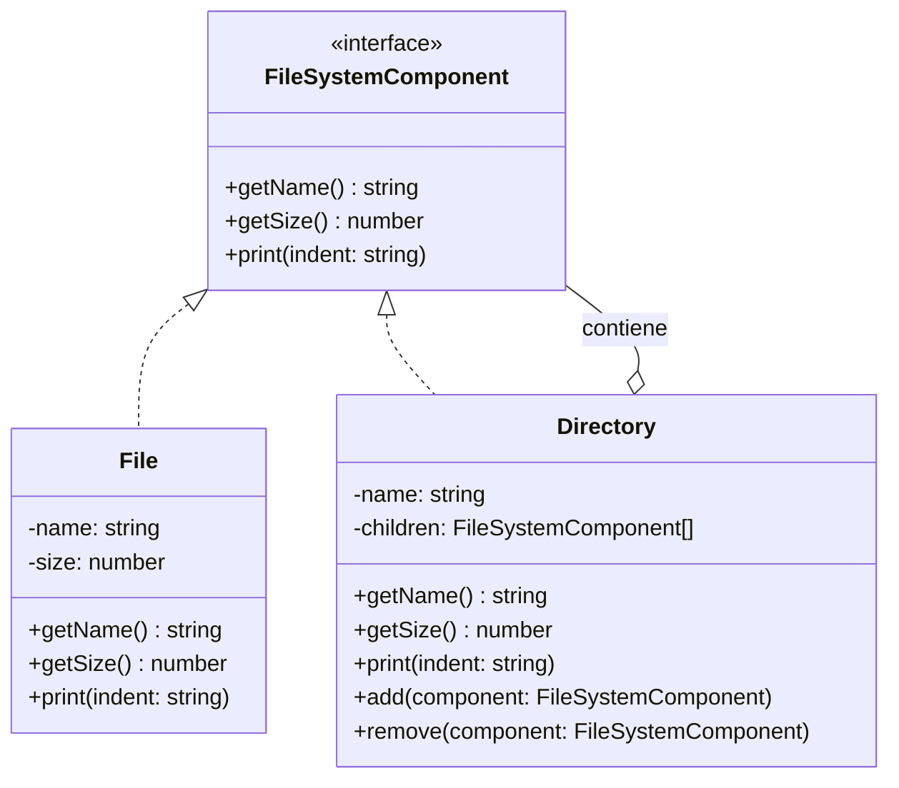

# Patrones De Diseño

## Introducción

La idea clave «Patrones de arquitectura» se centró en el estudio de los patrones de arquitectura que

permiten modelar al más alto nivel los components principales de un sistema, así como las relaciones

que se establecen entre ellos.

Los patrones de diseño fueron definidos como la forma de describir un problema que se da una y otra

vez en nuestro entorno y que especifica el núcleo de la solución para ese problema, de tal forma que se

pueda utilizar esa solución un millón de veces más, sin que se tenga que hacer de la misma manera más

de una vez (Alexander, C., Ishikawa, S., Silverstein, M., Jacobson, M, Fiksdahl-King, l. y Angel, S. (1977).

A Pattern Language. Oxford University Press.).

## Características De Los Patrones De Diseño

Para poder considerar una solución como un patrón de diseño deben darse al menos dos características

(POIO Usaola, M. (2012). Desarrollo de software basado en reutilización. Universitat Oberta de Catalunya):

- Debe set repetible, habiendo mostrado su efectividad en más de una ocasión.
- Su descripción debe set lo suficientemente genérica como para que pueda set aplicada en contextos
tecnológicos diversos.

En algunos casos, los patrones de diseño ofrecen soluciones que, en apariencia, complican

excesivamente el diseño del sistema (por ejemplo, introduciendo elementos adicionales que a priori no

parecen indispensables). Por este motivo, el abuso de su empleo (o su utilización incorrecta) puede

hacer que el sistema se vuelva más difícil de comprender y mantener.

Sin embargo, en términos generales, los patrones de diseño persiguen aumentar la cohesión y reducir el

acoplamiento de los sistemas, favoreciendo prácticas deseables como la reutilización de software.

## Importancia Y Catálogos

Tal es la importancia que cobran los patrones de diseño como técnicas de reutilización de software y

resolución rápida de problemas habituales, que este tipo de conocimiento es recopilado y publicado en

diferentes manuales y catálogos.

Estos catálogos utilizan una estructura estandarizada y generalmente definen elementos como el

nombre, la clasificación, la intención, entre otros, para cada uno de los patrones, así como también los

patrones relacionados, indicando los nombres de otros patrones con los que presenta similitudes o con

los que es possible combinarlo.

El más conocido y antiguo de estos catálogos es el de Gamma, Helm, Johnson y Vlissides (patrones de

Gamma), que publicaron una primera versión de su libro, Design patterns, en 1994 y desde entonces han

aparecido múltiples ediciones (Gamma, E., Helm, R., Johnson, R. y Vlissides, J. (2003). Patrones de

Diseño: elementos de software orientado a objetos reutilizables. Pearson Educación).

El trabajo de estos cuatro autores ha sido tan influyente que generalmente son conocidos como «la banda

de los cuatro» (gang of four o GOF).

## Clasificación De Patrones De Diseño

### Patrones Creacionales

Ayudan en la tarea de construcción de nuevos objetos de características complejas. Se encargan de la

creación, composición y representación de objetos.

- **Abstract factory** (fabricación abstracta)
- **Builder** (constructor)
- **Prototype** (prototipo)
- **Singleton**

### Patrones Estructurales

Centrados en la manera de combinar entre sí objetos que se agrupan en estructuras lógicas más

complejas. Relacionados con el modo en el que se organizan e integran las clases y objetos para

construir una estructura más grande. Separan la interfaz de la implementación. Nos aseguran

independencia entre las capas software que se van creando.

- **Adapter** (adaptador)
- **Composite** (compuesto)
- **Facade** (fachada)
- **Proxy**

### Patrones De Comportamiento

Ayudan a resolver problemas de comunicación entre objetos, proponiendo algoritmos adecuados. Están

enfocados a la asignación de responsabilidad entre los objetos y al modo en el que se comunican. Más

que describir objetos o clases, describen la comunicación entre ellos.

- **Chain of responsibility** (cadena de responsabilidad)
- **Mediator** (mediador)
- **Observer** (observador)
- **State** (estado)
- **Template method** (método plantilla)

## Descripción De Patrones

### Abstract Factory

No interesan las características concretas de cada objeto, al menos desde el punto de vista de su utilización.

Pensemos en una aplicación con interfaz gráfica, que podemos generar empleando dos posibles alternativas

de familias de controles gráficos, Tipo 1 y Tipo 2 (cada una de ellas compuesta por botones, listas

desplegables, etc.). El mismo tipo de control dentro de cada familia se utilize empleando el mismo conjunto

de métodos. La clase encargada de crear el objeto del tipo correcto en cada caso es una factoría que, a su

vez, implementa unos métodos de creación conocidos por el cliente, independientemente del tipo de factoría

concreta que estemos utilizando.

Una aplicación que manipula diferentes tipos de documentos o un videojuego con varios tipos de personajes

son otros ejemplos de aplicaciones que podrían beneficiarse de este patrón, siempre y cuando estas familias

de objetos puedan compartir una interfaz de utilización común, de manera que no importe la clase concreta

que estemos empleando en cada caso.



#### Ejemplo De Abstract Factory

**Contexto**: Una aplicación para crear documentos con diferentes estilos visuals (Light y Dark).



**Implementación en código:**

```typescript
// Interfaces
interface Button {
    render(): void;
}

interface Textbox {
    render(): void;
}

// Productos concretos
class LightButton implements Button {
    render(): void {
        console.log("Renderizando botón con tema claro");
    }
}

class DarkButton implements Button {
    render(): void {
        console.log("Renderizando botón con tema oscuro");
    }
}

class LightTextbox implements Textbox {
    render(): void {
        console.log("Renderizando caja de texto con tema claro");
    }
}

class DarkTextbox implements Textbox {
    render(): void {
        console.log("Renderizando caja de texto con tema oscuro");
    }
}

// Abstract Factory
interface UIFactory {
    createButton(): Button;
    createTextbox(): Textbox;
}

// Fábricas concretas
class LightThemeFactory implements UIFactory {
    createButton(): Button {
        return new LightButton();
    }
    
    createTextbox(): Textbox {
        return new LightTextbox();
    }
}

class DarkThemeFactory implements UIFactory {
    createButton(): Button {
        return new DarkButton();
    }
    
    createTextbox(): Textbox {
        return new DarkTextbox();
    }
}

// Cliente
class Application {
    private factory: UIFactory;
    private button: Button;
    private textbox: Textbox;
    
    constructor(factory: UIFactory) {
        this.factory = factory;
    }
    
    createUI(): void {
        this.button = this.factory.createButton();
        this.textbox = this.factory.createTextbox();
    }
    
    render(): void {
        this.button.render();
        this.textbox.render();
    }
}

// Uso
const lightApp = new Application(new LightThemeFactory());
lightApp.createUI();
lightApp.render();

const darkApp = new Application(new DarkThemeFactory());
darkApp.createUI();
darkApp.render();
```

### Builder

Deseamos separar la construcción de un objeto (el conjunto de pasos necesarios) de su representación (la

información que contiene), de manera que un mismo proceso de construcción pueda dar lugar a

representaciones diferentes.

En este caso, podríamos implementar un constructor concreto para cada uno de los tipos de contenedor

soportados, devolviendo a cada uno de ellos un conversor específico para ese formato.

La configuración de cada uno de los conversores puede set similar, su construcción require de los mismos

pasos (selección de códec de video, selección de códec de audio, etc), de manera que el proceso de

construcción, o al menos los pasos necesarios, quedan modelados en la clase abstracta «Constructor», de la

que todos los constructores concretos heredan.

![[Pasted image 20250620165048.png]]

Un ejemplo claro de utilización de este patrón lo encontramos en el proceso de construcción de una URI en

código Java, como se muestra en la siguiente figura:

![[Pasted image 20250620165131.png]]

#### Ejemplo De Builder

**Contexto**: Creación de objetos de tipo Pizza con diferentes ingredientes y características.



**Implementación en código:**

```typescript
// Producto
class Pizza {
    private dough: string;
    private sauce: string;
    private toppings: string[] = [];

    public setDough(dough: string): void {
        this.dough = dough;
    }

    public setSauce(sauce: string): void {
        this.sauce = sauce;
    }

    public addTopping(topping: string): void {
        this.toppings.push(topping);
    }

    public showIngredients(): void {
        console.log(`Pizza con masa ${this.dough}, salsa ${this.sauce} y toppings: ${this.toppings.join(', ')}`);
    }
}

// Builder interface
interface PizzaBuilder {
    reset(): void;
    setDough(dough: string): void;
    setSauce(sauce: string): void;
    addTopping(topping: string): void;
    build(): Pizza;
}

// Concrete Builder
class ConcreteBuilder implements PizzaBuilder {
    private pizza: Pizza;

    constructor() {
        this.reset();
    }

    reset(): void {
        this.pizza = new Pizza();
    }

    setDough(dough: string): void {
        this.pizza.setDough(dough);
    }

    setSauce(sauce: string): void {
        this.pizza.setSauce(sauce);
    }

    addTopping(topping: string): void {
        this.pizza.addTopping(topping);
    }

    build(): Pizza {
        const result = this.pizza;
        this.reset();
        return result;
    }
}

// Director
class Director {
    private builder: PizzaBuilder;

    setBuilder(builder: PizzaBuilder): void {
        this.builder = builder;
    }

    buildMargherita(): void {
        this.builder.reset();
        this.builder.setDough("fina");
        this.builder.setSauce("tomate");
        this.builder.addTopping("mozzarella");
        this.builder.addTopping("albahaca");
    }

    buildPepperoni(): void {
        this.builder.reset();
        this.builder.setDough("gruesa");
        this.builder.setSauce("tomate");
        this.builder.addTopping("mozzarella");
        this.builder.addTopping("pepperoni");
    }
}

// Uso
const director = new Director();
const builder = new ConcreteBuilder();
director.setBuilder(builder);

director.buildMargherita();
const margherita = builder.build();
margherita.showIngredients();

director.buildPepperoni();
const pepperoni = builder.build();
pepperoni.showIngredients();

// También se puede usar el builder directamente
builder.reset();
builder.setDough("integral");
builder.setSauce("pesto");
builder.addTopping("tomate");
builder.addTopping("rúcula");
const customPizza = builder.build();
customPizza.showIngredients();
```

### Prototype

Este patrón permite crear copias de otros objetos en tiempo de ejecución, de manera que las copias sean

idénticas o con ciertas modificaciones. La instancia prototípica implementa una interfaz que contiene el

método clonar(), de manera que el cliente sabe que es possible obtener copias de manera sencilla de ese

objeto.

#### Ejemplo De Prototype

**Contexto**: Sistema para crear formas geométricas que pueden set clonadas y modificadas.



**Implementación en código:**

```typescript
// Interfaz prototype
interface Shape {
    clone(): Shape;
    draw(): void;
}

// Clases concretas
class Circle implements Shape {
    private radius: number;
    private color: string;
    
    constructor(radius: number, color: string) {
        this.radius = radius;
        this.color = color;
    }
    
    // Método para configurar un círculo clonado
    public setRadius(radius: number): void {
        this.radius = radius;
    }
    
    public setColor(color: string): void {
        this.color = color;
    }
    
    // Método de clonación
    public clone(): Shape {
        return new Circle(this.radius, this.color);
    }
    
    public draw(): void {
        console.log(`Dibujando un círculo de radio ${this.radius} y color ${this.color}`);
    }
}

class Rectangle implements Shape {
    private width: number;
    private height: number;
    private color: string;
    
    constructor(width: number, height: number, color: string) {
        this.width = width;
        this.height = height;
        this.color = color;
    }
    
    // Métodos para configurar un rectángulo clonado
    public setWidth(width: number): void {
        this.width = width;
    }
    
    public setHeight(height: number): void {
        this.height = height;
    }
    
    public setColor(color: string): void {
        this.color = color;
    }
    
    // Método de clonación
    public clone(): Shape {
        return new Rectangle(this.width, this.height, this.color);
    }
    
    public draw(): void {
        console.log(`Dibujando un rectángulo de ${this.width}x${this.height} y color ${this.color}`);
    }
}

// Uso del patrón
// Creamos prototipos originales
const circlePrototype = new Circle(10, "rojo");
const rectanglePrototype = new Rectangle(20, 10, "azul");

// Clonamos y modificamos
const circleClone = circlePrototype.clone() as Circle;
circleClone.setRadius(15);
circleClone.setColor("verde");

const rectangleClone = rectanglePrototype.clone() as Rectangle;
rectangleClone.setWidth(30);
rectangleClone.setColor("amarillo");

// Dibujamos las formas
circlePrototype.draw();  // Original
circleClone.draw();      // Clonado y modificado
rectanglePrototype.draw();  // Original
rectangleClone.draw();      // Clonado y modificado
```

### Singleton

Necesitamos garantizar que en todo memento solo existe una instancia de un determinado tipo de objeto.

Este patrón define una clase con un único punto de acceso global y es la propia clase la que garantiza que el

objeto que devuelve es la única instancia de esa clase.

La solución consiste en ocultar el constructor de la clase y definir un método estático que devuelve la única

instancia existente, como vemos en la figura:

![[Pasted image 20250620165302.png]]

#### Ejemplo De Singleton

**Contexto**: Base de datos con una conexión única compartida en toda la aplicación.



**Implementación en código:**

```typescript
class DatabaseConnection {
    private static instance: DatabaseConnection;
    private connection: any; // Simulación de la conexión real
    
    // Constructor privado para evitar instanciación directa con 'new'
    private constructor() {
        // Simulamos una conexión a base de datos
        this.connection = {
            isConnected: true,
            server: "db.example.com",
            username: "admin"
        };
        console.log("Conexión a la base de datos creada");
    }
    
    // Método estático para obtener la instancia singleton
    public static getInstance(): DatabaseConnection {
        if (!DatabaseConnection.instance) {
            DatabaseConnection.instance = new DatabaseConnection();
        }
        return DatabaseConnection.instance;
    }
    
    // Método para ejecutar consultas
    public query(sql: string): any {
        console.log(`Ejecutando consulta: ${sql}`);
        return { results: [], affectedRows: 0 }; // Simulación
    }
    
    // Método para comprobar si es la misma instancia
    public getConnectionInfo(): any {
        return this.connection;
    }
}

// Uso del patrón
// Los diferentes clientes obtienen la misma instancia
const connection1 = DatabaseConnection.getInstance();
connection1.query("SELECT * FROM users");

const connection2 = DatabaseConnection.getInstance();
connection2.query("INSERT INTO logs VALUES (...)");

// Comprobamos que es la misma instancia
console.log("¿Son la misma instancia?", connection1 === connection2); // true

// No podemos crear nuevas instancias con 'new'
// const invalidConnection = new DatabaseConnection(); // Error: constructor es privado
```

### Adapter

Puede que necesitemos comunicar entre sí clases que ofrecen servicios con otras que pueden consumirlos,

pero las interfaces de estos objetos son incompatibles.

Pensemos en un editor de dibujo que utilice una librería que permite la creación de objetos gráficos. Las

clases propias del dominio de aplicación aparecen representadas en amarillo en la siguiente figura, mientras

que las clases que proceden de la librería reutilizada se muestran en azul.

![[Pasted image 20250620165322.png]]

### Composite

Tenemos un conjunto de objetos similares que se agrupan jerárquicamente, siendo unos contenedores de

otros, y queremos uniformizar y simplificar el trabajo con los diferentes elementos, individuales o compuestos.

Por ejemplo, un editor de dibujo que permite agrupar un conjunto de formas básicas, o grupos de ellas, entre

sí o una aplicación que muestra una conversación entre usuarios con respuestas anidadas.

![[Pasted image 20250620165402.png]]

### Facade

El patrón de facade proporciona una interfaz unificada y un punto de acceso común para un conjunto de

interfaces de un sistema, simplificando su empleo. Pensemos en una aplicación con interfaz de usuario en la

que existen varias ventanas, diferentes en la capa de presentación y diferentes clases en la capa de negocio,

especializadas en operaciones concretas. También es una manera de simplificar la utilización de un conjunto

de objetos que ofrecen servicios y de disminuir el acoplamiento entre nuestras clases y las del sistema que

ofrece los servicios que estamos consumiendo.

![[Pasted image 20250620165434.png]]

#### Ejemplo De Facade

**Contexto**: Sistema de conversión de video con subsistemas complejos simplificado mediante una fachada.



**Implementación en código:**

```typescript
// Subsistema: componentes complejos
class VideoFile {
    constructor(private name: string, private codecType: string) {}
    
    getCodecType(): string {
        return this.codecType;
    }
    
    getName(): string {
        return this.name;
    }
}

class AudioFile {
    constructor(private file: VideoFile) {}
    
    // Métodos para manipular audio
}

// Diferentes códecs
interface Codec {
    type: string;
}

class MPEG4Codec implements Codec {
    type = "mp4";
}

class OGGCodec implements Codec {
    type = "ogg";
}

// Subsistemas complejos
class CodecFactory {
    public extractVideo(file: string): VideoFile {
        // Lógica compleja para identificar el tipo de archivo
        const type = file.substring(file.indexOf(".") + 1);
        console.log(`Extrayendo video de ${file}`);
        return new VideoFile(file, type);
    }
    
    public createCodec(type: string): Codec {
        if (type === "mp4") {
            return new MPEG4Codec();
        } else {
            return new OGGCodec();
        }
    }
}

class VideoCompressor {
    public compress(file: VideoFile, quality: string): VideoFile {
        console.log(`Comprimiendo video ${file.getName()} con calidad ${quality}`);
        return file; // Simulamos la compresión
    }
}

class AudioMixer {
    public extractAudio(file: VideoFile): AudioFile {
        console.log(`Extrayendo audio de ${file.getName()}`);
        return new AudioFile(file);
    }
    
    public mix(audioFile: AudioFile): AudioFile {
        console.log("Mezclando audio...");
        return audioFile;
    }
}

// Fachada que simplifica todo el proceso
class VideoConverter {
    private codecFactory: CodecFactory;
    private compressor: VideoCompressor;
    private mixer: AudioMixer;
    
    constructor() {
        this.codecFactory = new CodecFactory();
        this.compressor = new VideoCompressor();
        this.mixer = new AudioMixer();
    }
    
    public convert(filename: string, targetFormat: string): string {
        console.log(`VideoConverter: comenzando conversión de ${filename} a ${targetFormat}`);
        
        // Extraer el archivo de video
        const videoFile = this.codecFactory.extractVideo(filename);
        
        // Crear el codec apropiado
        const destinationCodec = this.codecFactory.createCodec(targetFormat);
        
        // Comprimir el video
        const compressedVideo = this.compressor.compress(videoFile, "alta");
        
        // Extraer y mezclar audio
        const audioFile = this.mixer.extractAudio(videoFile);
        const mixedAudio = this.mixer.mix(audioFile);
        
        // Finalizar proceso
        const result = `${filename.substring(0, filename.indexOf("."))}.${targetFormat}`;
        console.log(`VideoConverter: conversión completada a ${result}`);
        
        return result;
    }
}

// Cliente - ahora usa una interfaz simple
class Client {
    public static main(): void {
        const converter = new VideoConverter();
        const mp4 = converter.convert("video.avi", "mp4");
        
        // El cliente solo necesita conocer la fachada
        console.log(`Cliente: ¡Archivo ${mp4} listo para reproducir!`);
    }
}

// Ejecución
Client.main();
```

### Proxy

La solución consiste en definir un objeto proxy (o apoderado), que es un representante o sustituto del objeto

real (al que llamaremos sujeto), permitiendo su manipulación indirecta.

En muchos casos, el objeto sustituido es un sistema o un dispositivo externo, siendo habitual su empleo en

operaciones de acceso a la red. Por ejemplo, en un procesador de textos cada uno de los elementos del

documento está asociado a un objeto que existe en la memoria del computador. En este caso, se pueden

sustituir las imágenes por objetos proxy en el memento de la carga del documento, de manera que se aplaza

la carga de la imagen del disco a memoria hasta el memento en el que debe set representada al usuario en

la pantalla.

Encontramos, así, diferentes tipos de proxy (Gamma, E., Helm, R., Johnson, R. y Vlissides, J. (2003).

Patrones de diseño: elementos de software orientado a objetos reutilizables. Pearson Educación), entre ellos:

- **Remoto**: que proporciona un representante local para un objeto que se encuentra en una máquina
  diferente.
- **Inteligente**: que sustituye a un puntero real realizando operaciones adicionales cada vez que el objeto es
  manipulado. Por ejemplo, puede llevar una contabilidad del número de referencias al objeto real, de
  manera que la memoria que ocupa pueda set liberada cuando el objeto ya no es necesario. Sin embargo,
  el cliente únicamente colabora con el objeto proxy, que es el único que conoce al sujeto real que ofrece la funcionalidad solicitada.

En las siguientes figuras se muestra un diseño simplificado de este tipo de solución para un problema

genérico. Tanto el objeto proxy como el sujeto real implementan la misma interfaz. Sin embargo, el cliente

únicamente colabora con el objeto proxy, que es el único que conoce al sujeto real que ofrece la

funcionalidad solicitada.

![[Pasted image 20250620165532.png]]

#### Ejemplo De Proxy

**Contexto**: Acceso controlado a una imagen pesada que solo se carga cuando es necesario visualizarla.



**Implementación en código:**

```typescript
// Interfaz común
interface Image {
    display(): void;
}

// Objeto real (pesado)
class RealImage implements Image {
    private filename: string;
    
    constructor(filename: string) {
        this.filename = filename;
        this.loadFromDisk();
    }
    
    private loadFromDisk(): void {
        console.log(`Cargando imagen ${this.filename} desde el disco...`);
        // Simulamos un proceso pesado de carga
    }
    
    public display(): void {
        console.log(`Mostrando imagen ${this.filename}`);
    }
}

// Proxy
class ImageProxy implements Image {
    private filename: string;
    private realImage: RealImage | null = null;
    
    constructor(filename: string) {
        this.filename = filename;
    }
    
    public display(): void {
        // Carga la imagen real solo cuando se necesita
        if (this.realImage === null) {
            console.log("Proxy: creando la imagen real bajo demanda");
            this.realImage = new RealImage(this.filename);
        }
        
        // Delega la visualización al objeto real
        this.realImage.display();
    }
    
    // Métodos adicionales que puede proporcionar el proxy
    public getFilename(): string {
        return this.filename;
    }
}

// Uso del patrón
// Creamos una galería con varias imágenes
const gallery: Image[] = [
    new ImageProxy("imagen1.jpg"),
    new ImageProxy("imagen2.jpg"),
    new ImageProxy("imagen3.jpg")
];

// Solo cuando mostramos la imagen se carga realmente
console.log("Iniciando la galería...");
// No se carga ninguna imagen todavía

// El usuario hace clic en la primera imagen
console.log("\nUsuario selecciona la imagen 1:");
gallery[0].display();  // Ahora se carga y muestra

// El usuario hace clic de nuevo en la primera imagen
console.log("\nUsuario selecciona otra vez la imagen 1:");
gallery[0].display();  // Ya está cargada, solo se muestra

// El usuario hace clic en la segunda imagen
console.log("\nUsuario selecciona la imagen 2:");
gallery[1].display();  // Se carga la segunda imagen y se muestra
```

### Chain of Responsibility

Se genera un evento en el sistema que puede set procesado por uno o varios objetos diferentes y se

busca la mejor manera de dirigir el flujo de procesamiento del evento.

Este patrón establece una cadena de objetos que pasan de unos a otros una petición hasta que se

encuentra un objeto capaz de procesarla.

Una solución consiste en definir una clase abstracta con un método capaz de responder a esa petición y

un objeto sucesor al cual pasar la petición en caso de set necesario.

Puede que algunos elementos no ofrezcan un mensaje de ayuda concreto, pero en este caso sería

bueno que delegaran esta funcionalidad en algún otro objeto de jerarquía superior que sea capaz de

procesar el evento, buscando siempre una información de ayuda de lo más específico a lo más general,

como se representa en la siguiente figura:

![[Pasted image 20250620165605.png]]

### Mediator

Existe un conjunto de objetos que colaboran habitualmente entre sí intercambiando información o

invocando métodos ajenos y se desea reducir el acoplamiento entre ellos.

La solución de este patrón consiste en definir un objeto mediador que es «responsible de controlar y

coordinar las interacciones entre un grupo de objetos» (Gamma, E., Helm, R., Johnson, R. y Vlissides, J.

(2003). Patrones de diseño: elementos de software orientado a objetos reutilizables. Pearson Educación).

Pensemos en una interfaz de usuario en la que modificaciones en el estado de algún componente

afectan a otros (por ejemplo, si un campo de texto está vacío se deshabilita un botón o si se supera un

número de caracteres se muestra un mensaje de alerta). El estado de los diferentes elementos de

entrada de información puede afectar a la habilitación o deshabilitación de otros elementos de la interfaz.

![[Pasted image 20250620165648.png]]

### Observer

El patrón que resuelve este problema es similar al mediador, pero en este caso se trata únicamente de

notificar sobre los cambios en el estado de un objeto a otro conjunto de objetos. Se define así un modelo

de publicación-suscripción, en el que el sujeto notifica a sus observadores cuando se produce un cambio,

como se muestra en el ejemplo de la figura:

![[Pasted image 20250620165705.png]]

La secuencia de interacciones se representa en el diagrama de la figura. Como podemos ver, el sujeto

mantiene una lista de todos los observadores que se han registrado con él. Cuando se produce un

cambio en su estado interno lo notifica a todos ellos, de manera que puedan sincronizarse y adquirir la

nueva información de estado.

![[Pasted image 20250620165722.png]]

### State

Supongamos, por ejemplo, un videojuego en el que el comportamiento de un personaje depende de

ciertas variables, como su nivel de energía, salud o experiencia. En este caso, el personaje es un

contexto que mantiene una instancia de una clase concreta que representa su estado actual.

El contexto ofrece una interfaz que permite a sus clientes realizar peticiones, pero, cuando estas llegan,

el contexto ejecuta el método de gestión de la instancia concreta, que representa el estado actual, y es

capaz de responder a esa petición.

![[Pasted image 20250620165741.png]]

### Template Method

La solución consiste en crear en una clase base un método que

implementa el esqueleto del algoritmo (método plantilla),

haciendo uso de métodos abstractos que deberán set

concretados en las clases derivadas, donde se puede agregar

funcionalidad específica.

Supongamos que estamos desarrollando un visor de documentos que soporta

varios formatos de archivos y tipos de documentos (hoja de cálculo, imagen,

documentos de texto, etc.). El proceso de carga es básicamente el mismo en

cuanto al procedimiento, pero se diferencia en función del tipo de documento

específico que debe set cargado y representado de manera diferente.

![[Pasted image 20250620165809.png]]

Se encarga de realizar la comprobación de que el formato es soportado empleando un método virtual,

DocumentoCompatible(), y a partir de ahí define la secuencia de pasos necesarios para mostrar

finalmente el contenido del archivo.

![[Pasted image 20250620165833.png]]

#### Ejemplo De Adapter

**Contexto**: Adaptación de una biblioteca de pago externa a la interfaz que espera nuestra aplicación.



**Implementación en código:**

```typescript
// Interfaz que utiliza nuestra aplicación
interface PaymentProcessor {
    processPayment(amount: number): boolean;
}

// Nuestra implementación original
class OurPaymentSystem implements PaymentProcessor {
    processPayment(amount: number): boolean {
        console.log(`Procesando pago de ${amount}€ con nuestro sistema`);
        // Lógica de procesamiento
        return true;
    }
}

// Biblioteca externa de pago con una interfaz diferente
class ThirdPartyPaymentLib {
    makePayment(price: number, currency: string): string {
        console.log(`Realizando pago de ${price} ${currency} con sistema externo`);
        // Lógica de procesamiento
        return "payment_id_123456";
    }
    
    verifyPayment(id: string): boolean {
        console.log(`Verificando pago ${id} con sistema externo`);
        return true;
    }
}

// Adaptador que hace compatible la biblioteca externa con nuestra interfaz
class ThirdPartyPaymentAdapter implements PaymentProcessor {
    private adaptee: ThirdPartyPaymentLib;
    
    constructor(adaptee: ThirdPartyPaymentLib) {
        this.adaptee = adaptee;
    }
    
    processPayment(amount: number): boolean {
        // Convertimos la llamada a la interfaz que espera nuestra aplicación
        // a la interfaz que proporciona la biblioteca de terceros
        const paymentId = this.adaptee.makePayment(amount, "EUR");
        return this.adaptee.verifyPayment(paymentId);
    }
}

// Cliente que utiliza la interfaz de PaymentProcessor
class ShoppingCart {
    private paymentProcessor: PaymentProcessor;
    
    constructor(paymentProcessor: PaymentProcessor) {
        this.paymentProcessor = paymentProcessor;
    }
    
    checkout(amount: number): void {
        console.log(`Iniciando pago de ${amount}€`);
        const success = this.paymentProcessor.processPayment(amount);
        
        if (success) {
            console.log("Pago completado con éxito");
        } else {
            console.log("Error en el pago");
        }
    }
}

// Uso del patrón
// Con nuestro sistema de pago
const ourPayment = new OurPaymentSystem();
const cart1 = new ShoppingCart(ourPayment);
cart1.checkout(100);

// Con el sistema de pago externo adaptado
const thirdPartyLib = new ThirdPartyPaymentLib();
const adapter = new ThirdPartyPaymentAdapter(thirdPartyLib);
const cart2 = new ShoppingCart(adapter);
cart2.checkout(200);
```

#### Ejemplo De Composite

**Contexto**: Sistema de archivos con directorios y archivos que comparten operaciones comunes.



**Implementación en código:**

```typescript
// Componente base (interfaz común)
interface FileSystemComponent {
    getName(): string;
    getSize(): number;
    print(indent: string): void;
}

// Hoja (elemento simple)
class File implements FileSystemComponent {
    constructor(private name: string, private size: number) {}
    
    getName(): string {
        return this.name;
    }
    
    getSize(): number {
        return this.size;
    }
    
    print(indent: string): void {
        console.log(`${indent}📄 ${this.name} (${this.size} KB)`);
    }
}

// Composite (elemento compuesto)
class Directory implements FileSystemComponent {
    private children: FileSystemComponent[] = [];
    
    constructor(private name: string) {}
    
    getName(): string {
        return this.name;
    }
    
    getSize(): number {
        // Suma el tamaño de todos los hijos (archivos y directorios)
        return this.children.reduce((sum, child) => sum + child.getSize(), 0);
    }
    
    print(indent: string): void {
        console.log(`${indent}📁 ${this.name} (${this.getSize()} KB)`);
        
        // Imprime cada uno de los elementos hijos
        this.children.forEach(child => child.print(indent + '   '));
    }
    
    add(component: FileSystemComponent): void {
        this.children.push(component);
    }
    
    remove(component: FileSystemComponent): void {
        const index = this.children.indexOf(component);
        if (index !== -1) {
            this.children.splice(index, 1);
        }
    }
}

// Uso del patrón
// Creamos la estructura de directorios y archivos
const root = new Directory('root');

const docs = new Directory('documentos');
docs.add(new File('carta.doc', 30));
docs.add(new File('curriculum.pdf', 300));

const images = new Directory('imagenes');
images.add(new File('foto1.jpg', 500));
images.add(new File('foto2.jpg', 600));

const work = new Directory('trabajo');
work.add(new File('proyecto.doc', 200));
work.add(new File('presentacion.ppt', 1200));

// Anidamos directorios
docs.add(work);
root.add(docs);
root.add(images);
root.add(new File('config.sys', 10));

// Podemos tratar toda la estructura de manera uniforme
console.log(`Tamaño total: ${root.getSize()} KB`);

// O mostrar la estructura completa
root.print('');
```
