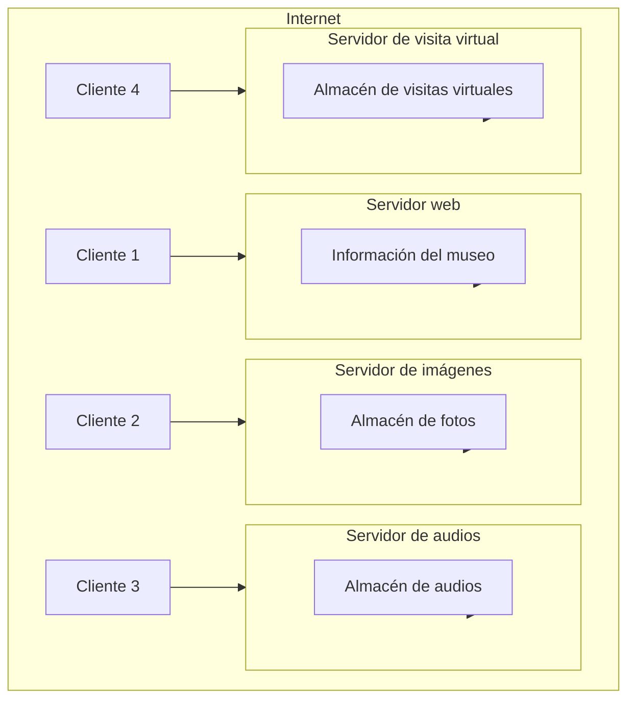

# Reutilización Del Software Y Patrones Arquitectónicos

## Importancia De la Reutilización De Software

Progresivamente, el software se ha vuelto un activo más valioso para las organizaciones, lo que ha hecho necesario adoptar estrategias para reducir el tiempo de entrega de los sistemas. Este movimiento ha sido impulsado por factores como iniciativas _open source_, donde los desarrolladores disponen de enormes cantidades de código reutilizable (librerías, aplicaciones completas adaptables).

La reutilización de software en ingeniería va más allá del simple "copiar y pegar" de código anterior.

- **Implementación**: técnicas que usan components existentes a distintos niveles y lenguajes modernos.
    
- **Conocimiento**: reutilización de experiencia, manuales, tutoriales y patrones de diseño.

## Niveles De Reutilización De Código

(Sommerville, I. (2011). _Ingeniería de software_ (9. ª ed.). Pearson Educación de México):

- **Grano grueso**: reutilización a nivel de aplicación.
    
- **Grano medio**: reutilización a nivel de components.
    
- **Grano fino**: reutilización a nivel de objetos y funciones.

> En general, se utilizan varios niveles. Los superiores engloban a los inferiores.

## Patrones De Diseño

Los patrones de diseño son soluciones generales y reutilizables para problemas frecuentes. Se caracterizan por:

- Set aplicables en distintos contextos.
    
- Incrementar la complejidad en algunos casos al requerir elementos adicionales.

## Enfoques De Reutilización

(Polo Usaola, M. (2012). _Desarrollo de software basado en reutilización_. Universitat Oberta de Catalunya):

- **Enfoque oportunista**: uso de recursos disponibles, sin planificación previa.
    
- **Enfoque proactivo**: desarrollo con vistas a su reutilización futura.

## Sistemas De Solución COTS

### Sistema De Solución COTS

- Producto único que satisface los requisitos.
    
- Basado en procesos estándar.
    
- Desarrollo = configuración.
    
- Mantenimiento y plataforma a cargo del proveedor.

### Sistemas Integrados COTS

- Varios sistemas integrados.
    
- Desarrollo = integración.
    
- Cliente mantiene y provee plataforma.

**Ejemplo:** Crear un blog empresarial

- Opción 1: Contratar blog en WordPress.com y configurarlo.
    
- Opción 2: Descargar CMS desde WordPress.org e instalarlo.

## Beneficios De la Reutilización

- Reduce tiempos de desarrollo y costes.
    
- Mejora la calidad del producto.
    
- Debe integrarse como práctica rutinaria.

---

# Patrones Arquitectónicos

(Sommerville, I. (2011). _Ingeniería de software_ (9. ª ed.). Pearson Educación de México)

## Arquitectura Cliente-Servidor

- Lógica distribuida entre clientes y servidores.
    
- Común en sistemas distribuidos.
    
- Elementos: servidores, clientes y red.

> Ejemplo: museo virtual

**Tabla resumen:**

|Nombre|Descripción|Ejemplo|Cuándo usarlo|Ventajas|Desventajas|
|---|---|---|---|---|---|
|Cliente-servidor|Servicios ofrecidos por servidores, usados por clientes.|Museo virtual|Se necesita acceso común desde distintos puntos.|Distribución, replicación.|Vulnerabilidad del servidor, carga impredecible.|

**Tipos de cliente:**

- Cliente ligero: sólo presenta.
    
- Cliente pesado: procesa y almacena.

![[Pasted image 20250617163250.png]]

---

## Arquitectura De Tuberías Y Filtros

- Procesamiento sequential de datos a través de filtros independientes.
    
- Ejemplos: compiladores, procesamiento de señales.

**Tabla resumen:**

|Nombre|Descripción|Ejemplo|Cuándo usarlo|Ventajas|Desventajas|
|---|---|---|---|---|---|
|Tuberías y filtros|Flujo de datos por filtros sin estado.|Compiladores|Procesamiento en etapas.|Simplicidad, extensibilidad.|Require estándares de comunicación.|

---

## Arquitecturas Multicapa

- Sistema distribuido en capas lógicas jerárquicas.
    
- Ejemplo: plataforma Android (kernel, API, etc.)

**Tabla resumen:**

|Nombre|Descripción|Ejemplo|Cuándo usarlo|Ventajas|Desventajas|
|---|---|---|---|---|---|
|Multicapa|Funcionalidades distribuidas jerárquicamente.|Android, aplicaciones cliente-servidor.|Construir servicios sobre otros, seguridad multinivel.|Sustitución de capas, despliegue distribuido.|Separación difícil, menor rendimiento.|

---

## Arquitectura De Repositorio

- Datos compartidos concentrados en un repositorio.

**Tabla resumen:**

|Nombre|Descripción|Ejemplo|Cuándo usarlo|Ventajas|Desventajas|
|---|---|---|---|---|---|
|Repositorio|Datos centralizados accesibles por todos los subsistemas.|Sistema de gestión hospitalaria|Necesidad de almacenar mucha información.|Independencia de components, gestión centralizada.|Nodo único crítico, problemas de distribución.|

---

## Arquitecturas Tolerantes a Fallos

- Varios sistemas generan salidas comparadas por votación.
    
- Usado en: señalización ferroviaria, control de aeronaves, reactores nucleares.

---

## Arquitecturas De Sistemas Distribuidos

1. **Compartición de recursos**.
    
2. **Escalabilidad**.
    
3. **Tolerancia a fallos**.

---

## Arquitectura Maestro-Esclavo

- Nodo maestro coordina y comunica con los esclavos.

![[Pasted image 20250621080904.png]]

---

## Arquitectura Cliente-Servidor De Varios Niveles

- 2 niveles: clientes ligeros o pesados.
    
- Multinivel: aplicaciones complejas con fuentes múltiples.

---

## Arquitectura De Components Distribuidos

- Cada capa se implementa como servidor.
    
- Conectadas mediante middleware.

![[Pasted image 20250621080927.png]]

---

## Arquitecturas P2P

- Nodos homogéneos con roles simultáneos (cliente-servidor).
    
- Uso eficiente de recursos.
    
- Aplicaciones: intercambio de archivos, mensajería.

---

# Tipos De Patrones De Diseño

## Estructurales

- **Adapter**
    
- **Composite**
    
- **Facade**
    
- **Proxy**

> Separan interfaz e implementación, aseguran independencia de capas.

## De Comportamiento

- **Chain of Responsibility**
    
- **Mediator**
    
- **Observer**
    
- **State**
    
- **Template Method**

> Se centran en la comunicación entre objetos y asignación de responsabilidades.

## Creacionales

- **Abstract Factory**: familias de objetos con interfaz común.
    
- **Builder**: pasos secuenciales para crear objetos complejos.
    
- **Singleton**: garantizar una única instancia global.

## Ejemplos Expandidos

- **Adapter**: compatibilizar interfaces incompatibles.
    
- **Composite**: jerarquías de objetos.
    
- **Facade**: interfaz unificada para subsistemas complejos.
    
- **Proxy**: objeto intermediario que controla acceso.
    
- **Chain of Responsibility**: delegación de mensajes jerárquica.
    
- **Mediator**: coordina interacciones entre components.
    
- **Observer**: notificación de cambios a múltiples observadores.

---

> "Una solución reutilizable para un problema que se presenta una y otra vez"  
> (Alexander et al., 1977. _A Pattern Language_. Oxford University Press).

