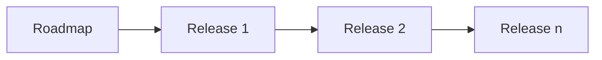
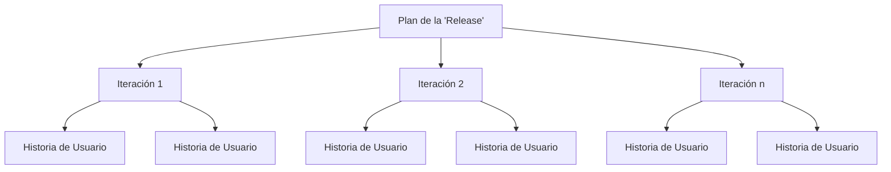

# 🧭 **La Hoja De Ruta De Un Proyecto Ágil**

## 🔍 **Contexto General**

- La planificación de proyectos de software es **compleja** y propensa a errores de estimación.
    
- En el enfoque ágil, es fundamental conocer:
    
    - Las **herramientas disponibles**.
        
    - El **orden adecuado** para usarlas.
        
- Según la magnitud del proyecto, se definen **niveles de abstracción** en la planificación (Garzás, 2013).

---

# 🧱 **Tres Niveles De Planificación Ágil**

1. **Planificación de la hoja de ruta (roadmap)**: estratégica.
    
2. **Planificación de entregas (release planning)**: táctica.
    
3. **Planificación de cada iteración (iteration planning)**: operativa.
![[Pasted image 20250726113742.png]]
Sure! Based on the image, here are three different [Mermaid.js](https://mermaid.js.org/) diagrams that represent:

4. **Roadmap**
    
5. **Release Plan**
    
6. **Iteration Plan**

---

## 1. **Roadmap (Mermaid Flowchart)**



---

## 2. **Release Plan (Mermaid Flowchart)**



---

## 3. **Iteration Plan (Mermaid Gantt Chart)**

```mermaid
gantt
    title Plan de la Iteración
    dateFormat  HH:mm
    section Historia B
    Tarea 1     :done, 01, 00:00, 05:00
    Tarea 2     :done, 02, 05:00, 15:00
    section Historia M
    Tarea 3     :done, 03, 15:00, 21:00
    Tarea 4     :done, 04, 21:00, 25:00
    Tarea 5     :done, 05, 25:00, 34:00
```

# 🗺️ 1. **Roadmap (Hoja De Ruta)**

- Se utilize en **proyectos grandes** y de larga duración (años).
    
- Objetivo: **Coordinar divisiones/departamentos** y establecer **temas clave del sistema**.
    
- Las **entregas (releases)** sí pasarán a **producción real** y serán usadas por usuarios.
    
- Las entregas deben estar reflejadas en el roadmap, con un enfoque **temporal (semestres, años)**.
    
- Ejemplos de temas:
    
    - “Los usuarios podrán realizar compras online”.
        
    - “Los usuarios podrán descargar contenidos disponibles”.
        
    - “Los usuarios autenticados podrán acceder a recursos privados”.

---

# 🚀 2. **Release Planning (Planificación De Entrega)**

- Cubre **3 a 6 meses** típicamente, con **3 a 12+ iteraciones**.
    
- Proporciona una **visión de alto nivel** sobre cómo se entregará el producto.
    
- Útil para evaluar si se están cumpliendo los **objetivos de la organización**.
    
- No busca crear un **plan detallado** (no se asignan tareas específicas ni se define secuencia exacta).
    
- El contenido son **historias de usuario**, no tareas técnicas.
    
- Algunas historias aún pueden estar poco definidas y se descomponen más adelante.

---

# 🔁 3. **Iteration Planning (Planificación De Iteración)**

- Ocurre **al inicio de cada iteración (1–4 semanas)**.
    
- Se detallan y desagregan las **historias de usuario** del release en **tareas técnicas**.
    
- Se estiman en **horas ideales** (no puntos de historia).
    
- Se convoca a:
    
    - Product Owner, programadores, testers, diseñadores UX, DBAs, etc.
        
- Herramientas como **hojas de cálculo, tarjetas o visualizaciones** permiten la participación general.
    
- Las tareas no se asignan individualmente desde el inicio:
    
    - Se prioriza la **colaboración flexible** del equipo completo según advance y contexto.

---

# 🔄 **Comparativa Entre Release Vs Iteration Planning**

|Aspecto|Release Planning|Iteration Planning|
|---|---|---|
|Alcance temporal|3–6 meses|1–4 semanas|
|Nivel de detalle|Alto nivel (estratégico)|Bajo nivel (operativo)|
|Unidad de planificación|Historias de usuario|Tareas técnicas|
|Estimación|Puntos de historia / días ideales|Horas ideales|
|Asignación de tareas|No aplica|Flexible, no individual desde el inicio|

---

**Referencias**:

- Garzás, J. (2013). _Cómo sobrevivir a la planificación de un proyecto ágil_. 233 grados de TI.
    
- Pichler, R. (2010). _Agile Product Management with Scrum_. Addison-Wesley Professional.

---

# MicroTest

- ¿Qué representa la hoja de ruta en un desarrollo ágil?
	- La planificación de las diferentes entregas necesarias para realizar un producto software.
- ¿Qué periodo de tiempo abarca típicamente un plan de lanzamiento?
	- De tres a seis meses.
- ¿Cuál no es uno de los objetivos de la planificación de entrega?
	- Crear un plan detallado que indique la asignación desarrolladores-historias de Usuario o tareas.