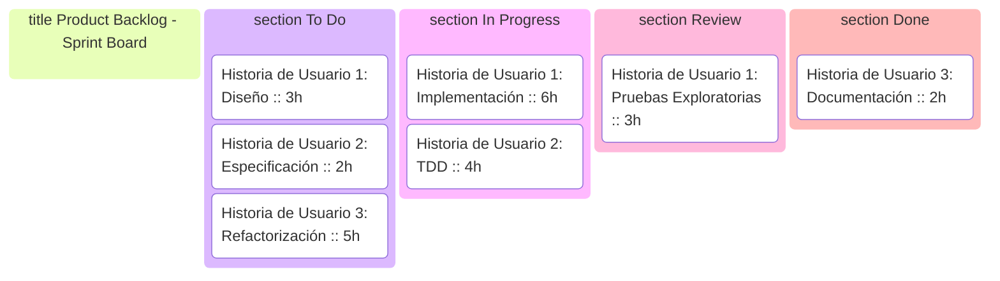
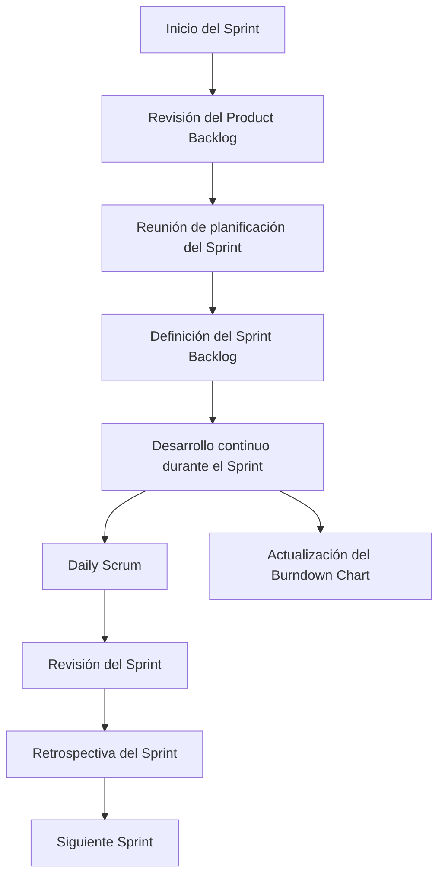

# 📌 Desarrollo Ágil Con Scrum: Sprints, Backlog Y Gestión Visual

## 🌀 Iteraciones Y Sprint

En un proyecto ágil, el software se desarrolla en partes sucesivas llamadas **iteraciones**. En **Scrum**, estas iteraciones se conocen como **sprints**, que:

- Son **operativas y desplegables**.
    
- Tienen una **duración fija**, usualmente de **1 a 4 semanas**.
    
- Se recomienda que **todos los sprints tengan la misma duración** para fomentar un ritmo constante de trabajo.

---

## 📋 Product Backlog Y Planificación

- El **Product Backlog** contiene todas las funcionalidades que el cliente desea implementar.
    
- Estas funcionalidades se seleccionan en la **reunión de planificación del sprint**.
    
- Es esencial que el backlog esté **validado antes** de comenzar la planificación para evitar bloqueos.

---

## 🧩 Descomposición En Tareas

Según **Garzás, Enríquez de Salamanca e Irrazábal (2013)**, el equipo tiene libertad para descomponer el sprint backlog como mejor estime.

Normalmente:

- Las **historias de usuario** se desglosan en **tareas**.
    
- **Ninguna tarea debe superar las 16 horas**.
    
- Si una tarea exceed ese tiempo, se divide en subtareas más pequeñas.

---

### 🗂️ Mock Product Backlog (Kanban Style - Mermaid)

---

## ✅ Ejemplos De Tareas Del Sprint

|**Tarea**|**Descripción**|
|---|---|
|Diseño de la historia de usuario|Promueve el debate sobre cómo implementar la historia.|
|Implementación de la historia de usuario|Define interfaces y métodos necesarios.|
|Pruebas unitarias (TDD)|Pruebas obligatorias vinculadas a la historia.|
|Pruebas de aceptación|Validación automática para aceptación del cliente.|
|Requisitos no funcionales|Seguridad, rendimiento, escalabilidad, etc.|
|Revisión de código|Evaluación del código fuente por pares.|
|Refactorización de código|Mejora del código sin alterar su funcionalidad.|
|Emulación de interfaces|Sustitución temporal cuando no están disponibles.|
|Pruebas exploratorias|Pruebas ad-hoc no automatizadas.|
|Corrección de errores|Resolución de bugs como tarea separada.|
|Verificación de errores|Verificación de bugs corregidos.|
|Demo de la historia|Demostración interna tras la implementación.|
|Actualizar wiki/repositorio|Documentación técnica del desarrollo.|
|Documentación de usuario|Manuales de uso e instalación.|

---

## 🛑 Importante Sobre Los Sprints

- No son **mini-ciclos en cascada**.
    
- Todas las actividades se realizan **de forma continua**.
    
- Una vez definido el **Sprint Backlog**, **no se aceptan cambios**.
    
- No todos los sprints terminan en producción.
    
- Tipos especiales:
    
    - **Sprint de Release**: despliegue en producción.
        
    - **Sprint Cero**: preparación previa al desarrollo.

---

## 📉 Seguimiento Con Burndown Y Burnup

- **Gráfico Burndown**:
    
    - Compara el trabajo pendiente vs. tiempo transcurrido.
        
    - Se actualiza en la **retrospectiva del sprint**.
        
- **Gráfico Burnup**:
    
    - Muestra el advance del equipo en **puntos de historia completados** frente al total estimado.
        
    - Ideal para mostrar a los clientes.

---

## ❌ ¿Y Los Diagrams Gantt?

- El uso excesivo de Gantt puede **perjudicar** el enfoque ágil.
    
- Scrum prefiere:
    
    - **Planes de entrega iterativos.**
        
    - Seguimiento con **burndown/burnup charts**.

---

## 📊 Modelo De Desarrollo En Scrum - Mermaid JS

---

## MicroTest

- ¿Cuál es la duración máxima que puede tener un sprint en scrum?
	- Cuatro semanas.
	- 30 días
- Según scrum, ¿qué deben container todos los sprints?
	- A. Funciones potencialmente desplegables.
	- B. Incremento del producto-
- ¿Qué sucede si una tarea require más de 16 horas para set completada en un sprint de scrum?
	- Se divide en tareas más pequeñas.
	- No debe superar el limit de 16 horas
- En un proyecto ágil usando scrum, ¿qué ocurre una vez el sprint backlog queda definido en la planificación?
	- Inicia la fase de implementación.
	- No se admiten cambios.