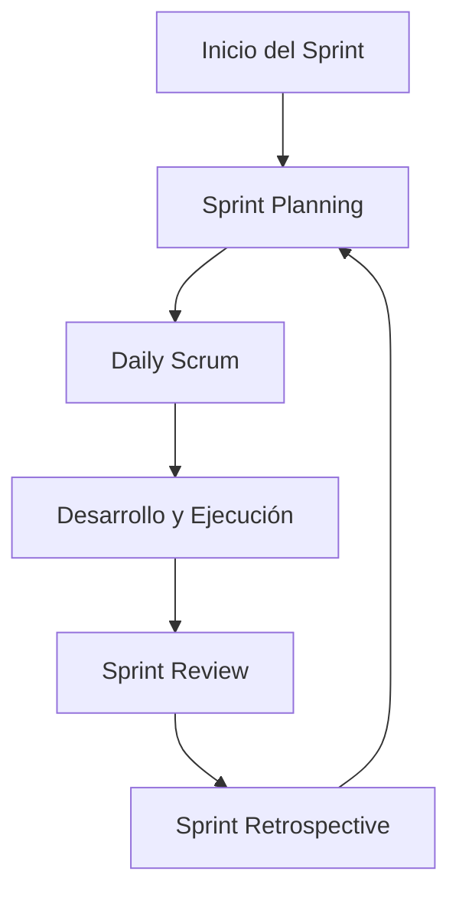

# 🧾 Reuniones En Scrum

Scrum organiza el desarrollo ágil a través de una series de reuniones estructuradas que se llevan a cabo en un **orden sequential** a lo largo del proyecto. Estas reuniones permiten planificar, dar seguimiento y mejorar continuamente el trabajo del equipo.

---

## 📅 1. Sprint Planning (Planificación Del Sprint)

**Objetivo:** Definir qué se va a implementar durante el sprint.

- Se realiza **al inicio de cada sprint**.
    
- Participan **todos los roles de Scrum**:
    
    - Product Owner
        
    - Scrum Master
        
    - Equipo de desarrollo
        
- Se responde a dos preguntas clave:
    
    1. ¿Qué valor aportará este sprint?
        
    2. ¿Cuál será su alcance?
        
- Se define el **Sprint Goal** (objetivo del sprint), que comunica por qué el sprint es valioso.
    
- Se seleccionan las **historias de usuario** desde el **Product Backlog**.
    
- El equipo decide **cómo construir el incremento**.
    
- Las historias se descomponen en **tareas individuales**.
    
- Cada miembro **se autoasigna tareas**.
    
- Resultado: se genera el **Sprint Backlog**, que incluye todas las tareas a realizar.

---

## 🔁 2. Daily Scrum (Reunión Diaria)

**Objetivo:** Coordinar el trabajo del día.

- Se realiza **diariamente**, durante todo el sprint.
    
- Tiene una duración de **15 minutos**.
    
- Cada miembro responde:
    
    - ¿Qué hice ayer?
        
    - ¿Qué haré hoy?
        
    - ¿Qué obstáculos tengo?
        
- Ayuda a detectar problemas y ajustar el trabajo a corto plazo.

---

## ✅ 3. Sprint Review (Revisión Del Sprint)

**Objetivo:** Mostrar y evaluar el trabajo completado.

- Se lleva a cabo **al final de cada sprint**.
    
- Participa el equipo Scrum y stakeholders.
    
- Se **demuestra el incremento** del producto.
    
- Se recopila **retroalimentación**.
    
- Se actualiza el **Product Backlog** con base en lo aprendido.

---

## 🔍 4. Sprint Retrospective (Retrospectiva Del Sprint)

**Objetivo:** Reflexionar y mejorar el proceso.

- Se realiza **inmediatamente después** del Sprint Review.
    
- Participa solo el equipo Scrum.
    
- Se analiza:
    
    - ¿Qué salió bien?
        
    - ¿Qué puede mejorarse?
        
    - ¿Qué acciones tomaremos?
        
- Se crea un **plan de mejoras** para el siguiente sprint.

---

## 🔄 Orden Sequential De Las Reuniones En Scrum

---

## 📌 Conclusión

- Las reuniones de Scrum **estructuran el trabajo** y fomentan la **transparencia, inspección y adaptación**.
    
- Son esenciales para el éxito de los sprints y del proyecto ágil.
    
- Siguen un **ciclo iterativo y continuo** que permite entregar valor de forma constante.
    
---

## MicroTest

- ¿En qué memento se lleva a cabo el sprint planning durante un sprint de scrum?
	- **Al comienzo de cada sprint.**
	- A. Para definir Io que se implementará en la iteración actual.
- ¿Quiénes deben asistir a la reunión sprint planning, según el marco de trabajo de scrum?
	- Todos los roles de scrum.
- Durante la reunión de daily scrum, ¿qué suelen hacer cada uno de los miembros del equipo de desarrollo?
	- Discutir los problemas al realizar su trabajo y planes para el día actual.
	- Explicar el trabajo realizado el día anterior.
- ¿Qué se pretende conseguir con la reunión sprint retrospective al final del sprint?
	- Plantear posibilidades de mejora sobre los procesos.
	- Analizar el trabajo propio del equipo de desarrollo.

https://scrumguides.org/docs/scrumguide/v2020/2020-Scrum-Guide-Spanish-European.pdf