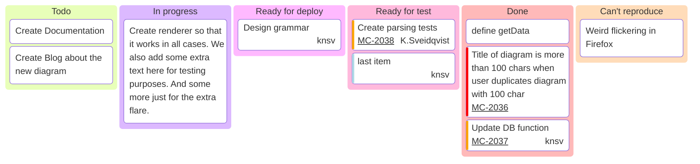

# 📌 Kanban: Origen Y Aplicación En Software

## 1. Origen Del Kanban

- **Significado**: “Tarjetas visuals” en japonés.
    
- **Primera aplicación**: Compañía **Toyota**.
    
- **Inspiración**: Taiichi Ohno observó la reposición de productos en supermercados estadounidenses.
    
- **Objetivo inicial**:
    
    - Planificar fabricación de coches.
        
    - Controlar inventario.
        
    - Coordinar pasos de fabricación.
        
- **Filosofía**: **Just-in-Time** → producir solo lo necesario, en la cantidad justa y en el memento exacto, eliminando despilfarros.

---

## 2. Transición Al Desarrollo De Software

- **Primer uso en software**: David Anderson (Modus Cooperandi, 2009).
    
- **Enfoque**: Vinculado estrechamente al pensamiento Lean.
    
- **Objetivo**:
    
    - Entrega continua de resultados.
        
    - Evitar saturaciones y cuellos de botella según capacidades del equipo.

---

## 3. Principios Clave Del Kanban

### 3.1 Visualización Del Flujo De Trabajo

- Herramienta: **Tablero Kanban**.
    
- Beneficio: Información visual clara sobre cada tarea y sus relaciones.
    
- Método:
    
    - Tareas descompuestas.
        
    - Se mueven de izquierda a derecha en columnas.
        
    - Estados básicos: _Pendiente → En progreso → Finalizado_.

### 3.2 Limitación Del Trabajo En Proceso (WIP)

- Evita sobrecarga del equipo.
    
- Cada columna tiene un volumen máximo de trabajo permitido.

### 3.3 Flujo Continuo

- Una tarea terminada da paso inmediatamente a la siguiente.
    
- No hay lotes de trabajo fijos como en _Scrum_.
    
- Todas las tareas pendientes son susceptibles de comenzar en cualquier memento.

---

## 4. Uso Del Tablero Kanban En Software

- Desarrollo incremental (historias de usuario, tareas, etc.).
    
- Tablero dividido en columnas:
    
    1. **Por hacer** (To Do)
        
    2. **Pendiente** (Backlog)
        
    3. **En progreso** (In Progress)
        
    4. **Finalizado** (Done)
        
- Variante: Columna extra para **estado de ánimo del equipo** (con caritas 😊😐☹️).
    
- Tarjetas Kanban se mueven entre columnas según su estado.

---

## 5. Ejemplo De Tablero Kanban (Mermaid)

---

## MicroTest

- ¿Qué dos cosas permiten saber las tarjetas kanban en la fabricación de coches?
	- Las piezas necesarias para la construcción del coche.
	- Cuántas piezas están disponibles y cuántas faltaban.
- ¿Cuáles son los dos objetivos principales del just-in-time según la filosofía lean?
	- Eliminar todo despilfarro.
	- Producir exclusivamente los elementos necesarios.
- ¿Qué dos cosas hace el sistema kanban en el desarrollo del software?
	- Pone énfasis en la entrega continua de resultados.
	- Evita saturaciones y cuellos de botella.
- ¿Cuáles son los dos aspectos básicos que reflejan las columnas de un tablero kanban?
	- El flujo de trabajo.
	- El estado del trabajo.
- En la técnica kanban, ¿qué dos principios rigen la toma de trabajo?
	- Visualización del flujo de trabajo.
	- Limitación de la capacidad de trabajo en proceso.

