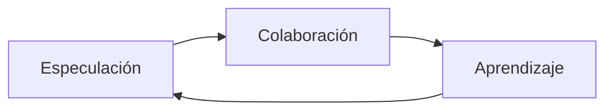
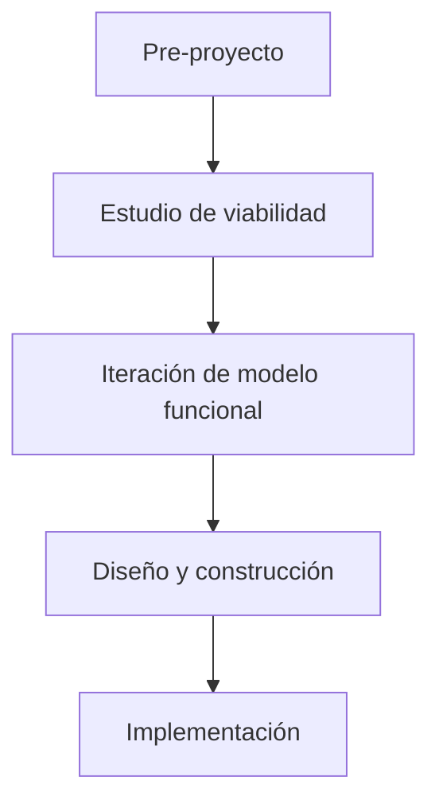

# 📌 Métodos Ágiles Alternativos

## 1. Crystal Methods

- **Creador**: Alistair Cockburn.
    
- **Enfoque**: Trabajo en equipo en desarrollo de software.
    
- **Variantes** según tamaño del equipo:
    
    - **Crystal Clear**
        
    - **Crystal Yellow**
        
    - **Crystal Orange**
        
- **Prioridades comunes**:
    
    1. Seguridad en el resultado del proyecto.
        
    2. Eficiencia en el proceso de desarrollo.
        
    3. Aceptación de convenciones.
        
- **Siete propiedades fundamentales**:
    
    - Entregas frecuentes.
        
    - Mejora reflexiva.
        
    - Comunicación osmótica.
        
    - Seguridad personal.
        
    - Focus (enfoque).
        
    - Acceso directo a usuarios expertos.
        
    - Entorno tecnológicamente apropiado.

---

## 2. Feature-Driven Development (FDD)

- **Enfoque**: Iteraciones cortas centradas en cumplir **características**.
    
- **Características**:
    
    - Deben set simples, aportar valor y expresarse claramente.
        
    - Énfasis en el diseño.
        
- **Modelo de proceso**:
    
    1. Desarrollar un modelo de dominio general junto al cliente.
        
    2. Descomponer funcionalidad en características sencillas.
        
    3. Planificar implementación.
        
    4. Asignar especialización por características.
        
    5. Diseñar, implementar y probar cada característica.

---

## 3. Adaptive Software Development (ASD)

- **Creador**: Jim Highsmith.
    
- **Idea central**: Las necesidades del cliente cambian constantemente.
    
- **Objetivos**:
    
    - Trabajar con el cambio.
        
    - Desarrollo iterativo.
        
    - Estrategia rápida pero disciplinada.
        
- **Fases**:
    
    1. **Especulación**: exploración y planificación adaptativa.
        
    2. **Colaboración**: habilidades comunicativas y desarrollo concurrente.
        
    3. **Aprendizaje**: revisión de calidad y mejora continua.

---

## 4. Dynamic Systems Development Method (DSDM)

- **Origen**: 1994, como herramienta de **RAD unificada**.
    
- **Principio clave**: Nada es perfecto a la primera.
    
- **Fases**:
    
    1. Pre-proyecto.
        
    2. Estudio de viabilidad.
        
    3. Iteración de modelo funcional.
        
    4. Diseño y construcción.
        
    5. Implementación.

---

## 5. Scaled Agile Framework (SAFe)

- **Creador**: Dean Leffingwell.
    
- **Objetivo**: Implementar agilidad a gran escala.
    
- **Niveles de abstracción**:
    
    1. **Equipo**: Scrum y XP.
        
    2. **Programa**: coordinación de varios equipos.
        
    3. **Portafolio**: definir lo que más valor aporta y gestionar con Lean y Kanban.
        
- **Backlogs**: historias (equipo), features (programa) y epopeyas (portafolio).

---

## 6. Agile Modeling (AM)

- **Enfoque**: Modelado y documentación efectiva.
    
- **Valores**:
    
    - Comunicación.
        
    - Simplicidad.
        
    - Retroalimentación.
        
    - Coraje.
        
    - Humildad.
        
- **Prácticas clave**:
    
    - Participación activa de stakeholders.
        
    - Modelado en cada iteración.
        
    - TDD.
        
    - Documentación continua.

---

## 7. Agile Unified Process (AUP)

- **Origen**: Versión simplificada de RUP.
    
- **Enfoque**:
    
    - Mantiene la estructura de RUP.
        
    - Usa técnicas ágiles como:
        
        - Desarrollo dirigido por pruebas (TDD).
            
        - AMDD (Agile Model Driven Development).
            
        - Gestión de cambios ágil.
            
        - Refactorización de bases de datos.

---

## MicroTest

- Según Alistair Cockburn, ¿qué técnica de crystal debe usarse para equipos de menos de ocho personas y para equipos de diez a veinte personas?
	- Crystal clear, para equipos de menos de ocho personas.
	- Crystal yellow, para equipos de diez a veinte personas.
- En el desarrollo de crystal, ¿cuáles son las prioridades comunes a todas las técnicas?
	- Eficiencia en el proceso de desarrollo.
	- Segundad en el resultado del proyecto.
- ¿Cuáles de estas propiedades se consideran ineludibles en un proyecto, según Crystal?
	- Mejora reflexiva
	- Entregas frecuentes.
- ¿Qué principios sigue feature driven development respecto a la implementación de características?
	- Las características deben set sencillas.
	- Las características deben poder set desarrolladas en poco tiempo.