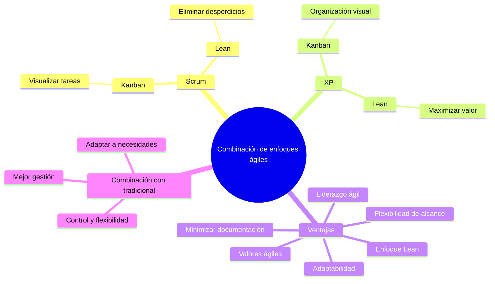

# 📌 Combinación De Técnicas Y Enfoques Ágiles

## 🌐 Principio General

- Es possible **usar varias técnicas y enfoques ágiles en conjunto**.
    
- No es necesario elegir **solo uno** (ej. Lean, Scrum, XP, Kanban), sino combinarlos según el proyecto.
    
- Objetivo: aplicar las **mejores prácticas** para dar la **mejor solución** al problema (pensamiento sistémico).

---

## 🔹 Ejemplos De Combinaciones

|Técnica / Enfoque|Complemento|Beneficio|
|---|---|---|
|**Scrum**|Kanban|Visualización de tareas en curso.|
|**XP**|Kanban|Organización y priorización visual del trabajo.|
|**Scrum + XP**|Lean|Eliminación de desperdicios y maximización de valor.|

---

## 📋 Ventajas De la Unión De Técnicas Ágiles

1. **Minimizar documentación** → Maximizar resultados tangibles.
    
2. **Flexibilidad en alcance** → Cambios continuous posibles.
    
3. **Liderazgo ágil** → Autogestión, no jefatura rígida.
    
4. **Valores ágiles**:
    
    - Personas sobre procesos.
        
    - Producto sobre documentación.
        
    - Colaboración sobre negociación.
        
    - Respuesta a cambios sobre seguir un plan.
        
5. **Enfoque Lean**:
    
    - Solo lo útil.
        
    - Eliminar despilfarros/desperdicios.
        
6. **Adaptabilidad**:
    
    - Selección de lo mejor de cada enfoque.
        
    - Incluso combinar ágil con tradicional.

---

## 📌 Integración Con Enfoques Tradicionales

- Se puede **combinar metodologías clásicas** con ideas ágiles para:
    
    - Adaptarse a necesidades específicas.
        
    - Mejorar la gestión del proyecto.
        
    - Mantener control y flexibilidad.

---

## 🗺️ Esquema Visual En Mermaid

---

## MicroTest

- ¿Qué role no es pertinente en el desarrollo ágil con scrum?
	- Jefe de proyecto.
- En el contexto de combinar enfoques ágiles con tradicionales, ¿qué aspecto no se menciona como un ejemplo de dicha mezcla?
	- EI uso de scrum para delegar tareas y reducir la duración de las reuniones.
- De acuerdo con el enfoque ágil descrito en el texto, ¿cuál no es uno de los principios de la filosofía ágil?
	- Dar preferencia a los contratos vinculantes sobre la colaboración.

https://www.elproximopaso.net/2011/12/dinamica-de-retrospectiva-3-caras-y-4.HTML