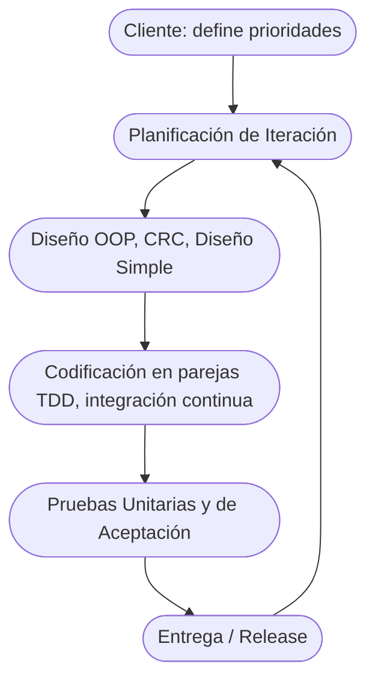
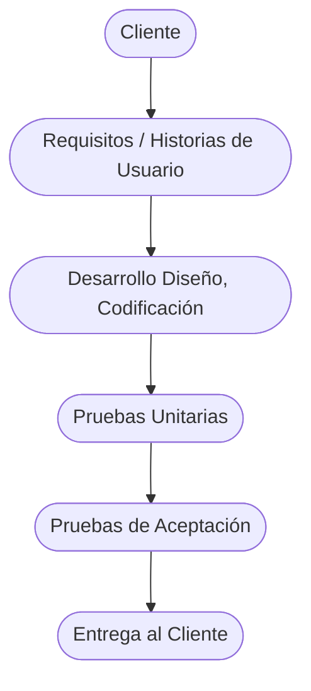
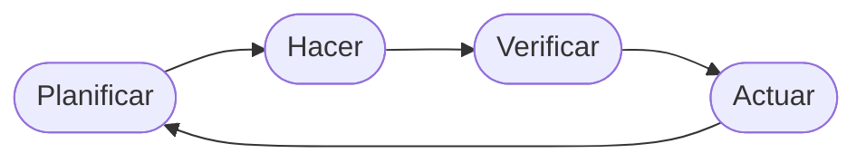
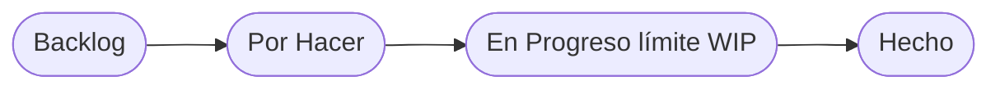
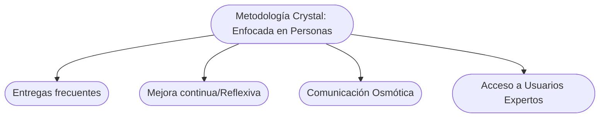

# Técnicas Ágiles de Desarrollo de Software

El **Desarrollo Ágil** adopta modelos iterativos (como XP) frente al enfoque secuencial en cascada. A diferencia del modelo en cascada rígido, donde los requisitos fijos al inicio pueden causar errores tardíos, los métodos iterativos permiten cambios frecuentes según necesidades del cliente y detección anticipada de errores. Por ejemplo, **Extreme Programming (XP)**, creado por Kent Beck en 1996, enfatiza ciclos cortos, cliente co-ubicado y prácticas de ingeniería intensivas. XP busca entregar el software _necesario cuando se necesita_, con versiones incrementales y validación continua.

## Extreme Programming (XP)

- **Objetivos clave:** Satisfacción del cliente, trabajo en equipo y entregas frecuentes. Se evitan grandes diseños monolíticos iniciales dedicando un breve tiempo de análisis (p.ej. un mes) antes de empezar XP, donde el cliente escribe _historias de usuario_ que guían cada iteración. El cliente prioriza estas historias para cada _release_ (entrega mayor), luego el equipo las descompone en tareas asociadas.
    
- **Flujo de trabajo general:** Cada iteración (de pocas semanas) sigue el ciclo: planificación → diseño → codificación → pruebas → entrega. Se inicia definiendo las pruebas unitarias (enfoque de Test-Driven Development, TDD) antes de programar. La codificación se realiza **en parejas** de programadores, integrando el código continuamente. Finalmente, el cliente prueba las historias con pruebas de aceptación para validar la iteración y el _release_.
    

- **Actividades de XP:** Planning Game (planificación iterativa), Diseño, Codificación y Pruebas. La planificación se divide en _planificación de release_ (priorizar historias de mayor valor) y _planificación de iteración_ (descomponer historias en tareas).
    
- **Diseño:** Se utiliza diseño orientado a objetos, manteniendo esquemas sencillos. Son comunes las tarjetas CRC (Clase-Responsabilidad-Colaborador) ligadas a historias de usuario. El diseño se refina constantemente (refactoring) incluso durante la codificación para mantenerlo simple.
    
- **Codificación:** Se practica TDD: primero se escriben pruebas unitarias que luego harán pasar con código mínimo. Programadores trabajan en **parejas**, integrando el código a un repositorio compartido y ejecutando las pruebas unitarias de forma continua para evitar regresiones.
    
- **Pruebas:** En XP hay dos tipos de pruebas: _unitarias_ (automáticas, definidas antes del código) que guían el desarrollo y validan cada módulo; y _de aceptación_ (definidas por el cliente) que verifican que cada historia de usuario cumpla los requisitos.
    
- **Valores de XP (5):** Comunicación (_Communication_), Simplicidad (_Simplicity_), Retroalimentación (_Feedback_), Valentía (_Courage_) y Respeto (_Respect_). Estos valores fomentan un ambiente colaborativo y enfocado en calidad.
    
- **Prácticas de XP (12):** Planificación de Jugadas (_Planning Game_), Entregas pequeñas frecuentes, Metáfora del Sistema, Diseño simple, TDD, Refactorización, Programación en parejas, Propiedad compartida del código, Integración continua, Semana de 40 horas (ritmo sostenible) y Estándares de programación.
    
- **Roles en XP:** Programador, Cliente (_Customer_), _Tracker_ o Facilitador (que mide progreso), Coach o Entrenador (ayuda a aplicar prácticas), Jefe de Proyecto, Consultor. Todos colaboran estrechamente.
    
- **XP Industrial / Enterprise:** Una variante de XP para organizaciones grandes. Introduce etapas adicionales como estudio de viabilidad, gestión orientada a pruebas y mayor involucramiento de gerencia, sin perder el enfoque minimalista de las prácticas XP. También se promueve la inclusión de _retrospectivas_ y aprendizaje continuo en la comunidad del proyecto, reforzando factores críticos de éxito como el compromiso de la dirección.
    

## Lean (Desarrollo Lean)

**Lean Software Development** adapta la filosofía Lean de manufactura al software. Su meta es maximizar el **valor entregado al cliente** eliminando todo el _desperdicio_ (en japonés _Muda_). El flujo de valor incluye todas las acciones para llevar el producto desde las necesidades del cliente hasta su entrega. Cualquier paso que no añada valor al cliente se considera desperdicio (Muda). Además, Lean identifica dos conceptos adicionales: **Mura** (irregularidad o falta de balance en el flujo de trabajo) y **Muri** (sobrecarga de trabajo). Eliminarlos ayuda a eficientar el proceso.

- **Principios Lean:** Entregar valor cuanto antes, mejorar continuamente (Kaizen) y potenciar al equipo. Se promueven lanzamientos frecuentes de funcionalidad (basados en _user stories_ prioritarias). Todos los integrantes participan en decidir priorizaciones y estimaciones, reforzando el trabajo en equipo. El ciclo _Deming (Plan-Do-Check-Act)_ se aplica para iterar mejoras en procesos y productos.
    
- **Ciclo Deming (PDCA):** Planificar (identificar cambios), Hacer, Verificar (medir resultados) y Actuar (ajustar). Este ciclo cierra el loop de mejora continua en Lean.
    

- **Eliminar desperdicios:** Se consideran desperdicios, por ejemplo, el sobre‐desarrollo (funcionalidades no deseadas), demoras en el proceso, mala captura de requisitos, comunicación deficiente o documentación excesiva. El objetivo es dedicar el trabajo a lo que aporta valor real al cliente.
    
- **Factores de éxito Lean:** Compromiso de la dirección, cultura de mejora continua (_Kaizen_), enfoque en la calidad y la satisfacción del cliente. Con ello se busca lograr _flujo perfecto_ sin Muda, Mura ni Muri.
    

## Kanban

**Kanban** es una metodología ágil visual que ayuda a planificar y controlar el flujo de trabajo en forma continua. Su nombre significa “tarjeta visual” en japonés. El equipo utiliza un **tablero Kanban** con columnas (p. ej. _Backlog_, _Por hacer_, _En progreso_, _Hecho_) donde se visualizan las tareas y su estado. Se **limita el trabajo en curso (WIP)** para mejorar la eficiencia y evitar la sobrecarga. Según Atlassian, “Kanban consiste en visualizar el trabajo, limitar el trabajo en curso y maximizar el flujo”.

- **Flujo continuo:** A diferencia de marcos basados en iteraciones, Kanban trabaja en un flujo continuo. Cada tarea pasa por las columnas hasta completarse. De esta forma se identifican cuellos de botella y se gestiona la capacidad.
    
- **Diferencias con Scrum:** Ambos son ágiles, pero Scrum usa iteraciones fijas (sprints) con roles claros (Product Owner, Scrum Master, Equipo), eventos periódicos (daily scrum, revisiones, retrospectivas) y backlog de sprint. Kanban no tiene sprints definidos ni roles específicos ni eventos obligatorios; se centra en el flujo permanente y la mejora continua. Mientras que en Scrum el equipo se compromete a terminar incrementos en cada sprint, en Kanban se busca mejorar el flujo general. Como resumen:
    
    - _Scrum:_ Trabajo en intervalos de tiempo fijo (sprints), revisión y adaptaciones regulares.
        
    - _Kanban:_ Flujo continuo, visualización de tareas en un tablero, límites de WIP.
        

## Crystal

**Crystal** es una familia de metodologías ágiles desarrollada por Alistair Cockburn. Se basa en la idea de que _las personas y sus interacciones_ son lo más importante. Crystal tiene variantes codificadas por colores según el tamaño del proyecto y su criticidad (p.ej. Crystal Clear, Crystal Orange, etc.). Las prácticas se adaptan al contexto del equipo y del proyecto.

- **Enfoque en personas:** No impone herramientas o procesos rígidos; prioriza la interacción del equipo, la comunicación osmótica (flujo natural de información en un espacio compartido) y la seguridad personal.
    
- **Propiedades de éxito:** Crystal identifica prácticas que aumentan la probabilidad de éxito, tales como entregas frecuentes, mejora continua (reflexiones regulares), comunicación efectiva y acceso fácil a usuarios expertos.
    
- **Entrega de valor:** Se promueven entregas regulares de software funcional y revisiones continuas. El objetivo es un entorno seguro donde el equipo pueda discutir abiertamente problemas y decisiones.
    
- **Diagramas de Crystal:** Una forma de visualizar los principios de Crystal es enfocar el proceso en las personas, ramificando hacia las propiedades clave:
    

## Feature-Driven Development (FDD)

**FDD (Feature-Driven Development)** es un método ágil centrado en las funcionalidades o _features_. Introducido por Jeff De Luca en 1997, sigue cinco actividades básicas:

1. **Desarrollar el modelo general:** Se crea un modelo de dominio unificado, con participación de arquitectos y expertos.
    
2. **Listar las features (características):** A partir del modelo, se enumera cada feature pequeña (de duración menor a 2 semanas).
    
3. **Planificar por feature:** Se agrupan las features para planificar el trabajo, definiendo entregas y responsables.
    
4. **Diseñar por feature:** Para cada feature, un equipo pequeño diseña las clases necesarias.
    
5. **Construir por feature:** Se implementa la feature (codificando y probando) antes de pasar a la siguiente.
    

FDD enfatiza entregas constantes de software funcional (“entregable en cada iteración”), con ciclos cortos por feature. Es escalable para equipos grandes mediante la regla de “diseño just-enough” y funciones claras (dueño de feature, etc.).

## DSDM (Dynamic Systems Development Method)

**DSDM** es otro enfoque ágil (originalmente de 1995) que enfatiza entregas rápidas y colaboración. Basado en timeboxing (bloques de tiempo fijos) y roles definidos, DSDM tiene ocho principios (p.ej. enfocarse en necesidad del negocio, entregar puntualmente por timeboxing, colaboración continua). Busca asegurar que el proyecto cumpla con las necesidades del negocio y se entregue a tiempo y dentro del presupuesto. DSDM enfatiza la **participación activa del usuario final** y la gestión de requisitos flexibles.

## Resumen Comparativo de Metodologías Ágiles (Documento Aparte)

- **XP:** Enfoca en calidad técnica (TDD, refactorización), programación en parejas y cliente presente. Ciclos muy cortos y colaboración cercana.
    
- **Lean:** Filosofía integral de mejora continua; elimina desperdicios (muda), optimiza flujo (evita mura/muri) y maximiza valor al cliente. No es “metodología” específica de desarrollo, sino principios para todo el proceso.
    
- **Kanban:** Marco de flujo continuo. Usa tablero visual con columnas (_Backlog_ → _Por Hacer_ → _En Progreso_ → _Hecho_) y límites de trabajo en curso (WIP). No prescribe roles ni iteraciones fijas.
    
- **Scrum:** Marcos iterativo de 2-4 semanas (sprints) con roles definidos (Scrum Master, Product Owner), backlog, daily meetings y revisiones. Ideal para manejar cambios frecuentes.
    
- **Crystal:** Familia de métodos adaptables según el tamaño del equipo (Crystal Clear, Crystal Orange, etc.). Se centra en **personas y comunicaciones**. Destacan prácticas como entregas frecuentes y revisión reflexiva.
    
- **FDD:** Centrado en características del producto. Metodología estructurada en cinco pasos: modelado, lista de features, planificación, diseño por feature, construcción por feature. Se enfoca en entregar software funcional frecuentemente.
    
- **DSDM:** Framework ágil basado en timeboxing y priorización por valor. Siete u ocho principios guían el proyecto (p.ej. enfoque en negocio, colaboración con usuarios). Combina flexibilidad con disciplina para asegurar entregas a tiempo.
    

En conjunto, estas técnicas ágiles promueven la adaptabilidad, la colaboración con el cliente y la entrega continua de valor, cada una con énfasis particulares (técnicas de programación XP, eliminación de desperdicio Lean, visualización Kanban, autoorganización Scrum, enfoque en personas Crystal, desarrollo por features FDD, gestión de tiempo DSDM).