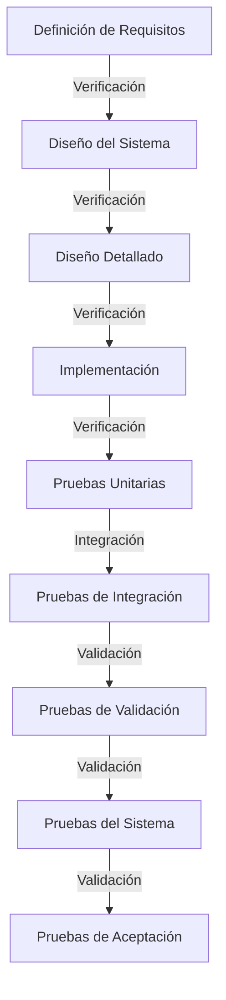

Aquí tienes las notas estructuradas en **Markdown** con encabezados, listas y un diagrama **Mermaid** para visualizar el modelo de verificación y validación:

---

# Notas Sobre Pruebas De Software

## Definición

Las **pruebas de software** son el proceso que ayuda a identificar la **corrección**, **completitud**, **seguridad** y **calidad** del software desarrollado.

> No garantizan un producto libre de errores, pero permiten detectar la mayoría de los posibles defectos antes de la entrega.

---

## Estrategias Y Tipos De Pruebas

Se ejecutan de dentro hacia afuera, comenzando por pequeños fragmentos de código hasta llegar al sistema completo.

1. **Pruebas unitarias**
    
    - Verifican la lógica y funcionalidad de cada elemento aislado (funciones, métodos, clases).
        
    - Se realizan aisladas de dependencias (usando _mocks_ o simulaciones).
        
    - Ventaja: Seguridad ante cambios en el código.
        
    - Realizadas por: Equipo de desarrollo.
        
2. **Pruebas de integración**
    
    - Comprueban el correcto funcionamiento conjunto de dos o más módulos.
        
    - Incluye interacciones reales (por ejemplo, con bases de datos reales).
        
    - Suelen set progresivas/incrementales.
        
    - Realizadas por: Equipo de desarrollo.
        
3. **Pruebas de validación**
    
    - Verifican que el sistema cumpla con los requisitos funcionales definidos por el usuario.
        
    - Tipos:
        
        - **Alfa**: En el sitio del desarrollador.
            
        - **Beta**: En el cliente, con pruebas específicas para descubrir errores.
            
    - Participación activa del cliente/usuario final.
        
4. **Pruebas del sistema**
    
    - Comprueban el funcionamiento del sistema en su entorno operativo de producción.
        
    - Enfoque en requisitos **no funcionales**.
        
    - Tipos:
        
        - **Pruebas de recuperación**: Capacidad de restaurar datos y estado tras un fallo.
            
        - **Pruebas de seguridad**: Protección contra ataques o accesos no autorizados.
            
        - **Pruebas de esfuerzo** (_stress testing_): Límite de carga y tolerancia del sistema.
            
5. **Pruebas de aceptación**
    
    - Representan los intereses del cliente.
        
    - Validan que el producto cumple las especificaciones y requisitos pactados.
        
    - Su éxito marca un hito clave: el producto está listo para entrega.
        
    - Ejecución: Con participación directa del cliente.

---

## Modelo De Verificación Y Validación (V-Model)

---

## Comparativa De Tipos De Pruebas

|Tipo de prueba|Realizada por|Objetivo principal|Memento de ejecución|Participación del cliente|
|---|---|---|---|---|
|Unitarias|Desarrolladores|Validar código aislado|Inicio del desarrollo|No|
|Integración|Desarrolladores|Validar interacción de módulos|Progresiva durante desarrollo|No|
|Validación|Dev + Cliente|Verificar requisitos funcionales|Fase final|Sí|
|Sistema|QA / DevOps|Comprobar funcionamiento global|Entorno productivo|Opcional|
|Aceptación|Cliente|Validar requisitos del cliente|Final del proyecto|Sí|

---

## MicroTest

**Pregunta 1:**  
**¿Cuál de las siguientes afirmaciones es falsa sobre las pruebas unitarias?**  
**Respuesta:** b. Las pruebas unitarias se enfocan en varias unidades de código acopladas entre sí.  
**Por qué:** Las pruebas unitarias se centran en **una única unidad de código** (función, método o clase) y deben estar **aisladas** de otras dependencias para evitar que errores externos afecten el resultado.

---

**Pregunta 2:**  
**¿Cuál de las siguientes no es un tipo de prueba de sistema?**  
**Respuesta:** a. Pruebas de escritura.  
**Por qué:** Las pruebas de sistema incluyen recuperación, seguridad, esfuerzo y rendimiento, pero **no existen pruebas de escritura** como categoría formal en este contexto.

---

**Pregunta 3:**  
**¿Qué pruebas validan que se cumplen los requisitos funcionales?**  
**Respuesta:** b. Pruebas funcionales o pruebas de validación.  
**Por qué:** Estas pruebas verifican que el sistema cumpla con los **requisitos funcionales definidos por el usuario**, evaluando si las funcionalidades implementadas responden a lo especificado.