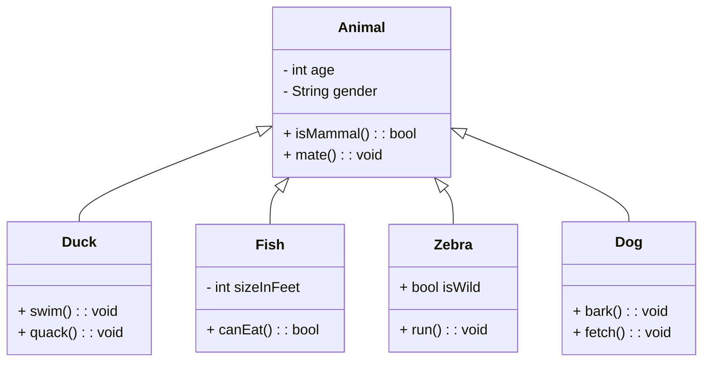

# 📘 Notas: Programación Orientada a Objetos (POO)

![[Pasted image 20250514173206.png]]

# 🌍 Fundamento De la POO

- Basada en la idea de un mundo lleno de **objetos**:
  - Tienen **atributos** (características).
  - Poseen **operaciones** (acciones que pueden realizar).
- Los programas orientados a objetos se construyen mediante:
  - **Colaboración de objetos**.
  - **Intercambio de mensajes** (Shlaer y Mellor, 1992).

# 📚 Definición De Booch Et Al. (2007)

- La POO organiza los programas como una colección de **objetos colaborativos**.
- Cada objeto:
  - Es una **instancia** de una **clase**.
  - Las clases se organizan en **jerarquías** mediante **herencia**.

# 🔑 Principios De la POO

1. Enfocada en objetos, **no en algoritmos**.
2. Todo objeto debe set **una instancia de una clase**.
3. Agrupa elementos con **funcionalidades similares** en conceptos unificados.
4. Facilita el **acceso y modificación** organizada de datos.

# 🧑‍💻 Lenguajes De Programación Orientados a Objetos (LPOO)

- Populares desde los años 80: **C++, Objective-C, Self, Eiffel**.
- **Java** es uno de los más utilizados actualmente.

# ✅ Requisitos Para Que Un Lenguaje Sea Orientado a Objetos (según Booch Et al.)

- Los objetos son **abstracciones de datos**.
- Tienen:
  - **Interfaz** (nombres de operaciones disponibles).
  - **Estado oculto** (encapsulamiento).
  - **Tipo asociado** (clase).
- Las clases pueden **heredar atributos y métodos**.

# 📐 Diseño Y Desarrollo Orientado a Objetos

- Introducido por **Booch en 1981-1982**.
- **Análisis orientado a objetos** define objetos del dominio del problema.
- **Diseño orientado a objetos (DOO)** crea la solución combinando objetos de diseño.
  
  1. La programaciön orientada a objetos se centra en los objetos en lugar de en los algoritmos. 
  2. Cada objeto debe set una instancia de una clase. 
  3. Se agrupan elementos del cådigo con funcionalidades similares en conceptos unificados. 
  4. Permite acceder y modificar los elementos de manera organizada y eficiente.

# 💡 Ventajas De la Orientación a Objetos

- Representa mejor el **mundo real** mediante abstracciones comprensibles.
- Mejora la **comunicación entre usuarios y desarrolladores**.
- Más **tolerancia a cambios** que el enfoque estructurado.
- **Reutilización** de clases y components.
- Facilita:
  - La **verificación del software**.
  - La **extensibilidad** de la solución.

---

# 📊 Diagrama De Clases Mejorado (Mermaid)



```Java// Clase base
class Animal {
    int age;
    String gender;

    boolean isMammal() {
        return true;
    }

    void mate() {
        System.out.println("Mating...");
    }
}

// Nueva clase
class Dog extends Animal {
    void bark() {
        System.out.println("Woof!");
    }
}

// Uso de objetos
public class Main {
    public static void main(String[] args) {
        Dog myDog = new Dog();
        myDog.age = 3;
        myDog.gender = "male";
        myDog.bark();           // Woof!
        myDog.mate();           // Mating...
        System.out.println(myDog.isMammal()); // true
    }
}

```