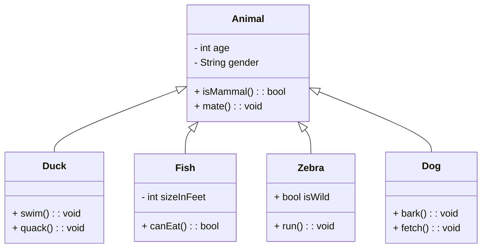

# 📘 Notas: Programación Orientada a Objetos (POO)

![[Pasted image 20250514173206.png]]

# 🌍 Fundamento De la POO

- Basada en la idea de un mundo lleno de **objetos**:
  - Tienen **atributos** (características).
  - Poseen **operaciones** (acciones que pueden realizar).
- Los programas orientados a objetos se construyen mediante:
  - **Colaboración de objetos**.
  - **Intercambio de mensajes** (Shlaer y Mellor, 1992).

# 📚 Definición De Booch Et Al. (2007)

- La POO organiza los programas como una colección de **objetos colaborativos**.
- Cada objeto:
  - Es una **instancia** de una **clase**.
  - Las clases se organizan en **jerarquías** mediante **herencia**.

# 🔑 Principios De la POO

1. Enfocada en objetos, **no en algoritmos**.
2. Todo objeto debe set **una instancia de una clase**.
3. Agrupa elementos con **funcionalidades similares** en conceptos unificados.
4. Facilita el **acceso y modificación** organizada de datos.

# 🧑‍💻 Lenguajes De Programación Orientados a Objetos (LPOO)

- Populares desde los años 80: **C++, Objective-C, Self, Eiffel**.
- **Java** es uno de los más utilizados actualmente.

# ✅ Requisitos Para Que Un Lenguaje Sea Orientado a Objetos (según Booch Et al.)

- Los objetos son **abstracciones de datos**.
- Tienen:
  - **Interfaz** (nombres de operaciones disponibles).
  - **Estado oculto** (encapsulamiento).
  - **Tipo asociado** (clase).
- Las clases pueden **heredar atributos y métodos**.

# 📐 Diseño Y Desarrollo Orientado a Objetos

- Introducido por **Booch en 1981-1982**.
- **Análisis orientado a objetos** define objetos del dominio del problema.
- **Diseño orientado a objetos (DOO)** crea la solución combinando objetos de diseño.
  
  1. La programaciön orientada a objetos se centra en los objetos en lugar de en los algoritmos. 
  2. Cada objeto debe set una instancia de una clase. 
  3. Se agrupan elementos del cådigo con funcionalidades similares en conceptos unificados. 
  4. Permite acceder y modificar los elementos de manera organizada y eficiente.

# 💡 Ventajas De la Orientación a Objetos

- Representa mejor el **mundo real** mediante abstracciones comprensibles.
- Mejora la **comunicación entre usuarios y desarrolladores**.
- Más **tolerancia a cambios** que el enfoque estructurado.
- **Reutilización** de clases y components.
- Facilita:
  - La **verificación del software**.
  - La **extensibilidad** de la solución.

---

# 📊 Diagrama De Clases Mejorado (Mermaid)



```Java// Clase base
class Animal {
    int age;
    String gender;

    boolean isMammal() {
        return true;
    }

    void mate() {
        System.out.println("Mating...");
    }
}

// Nueva clase
class Dog extends Animal {
    void bark() {
        System.out.println("Woof!");
    }
}

// Uso de objetos
public class Main {
    public static void main(String[] args) {
        Dog myDog = new Dog();
        myDog.age = 3;
        myDog.gender = "male";
        myDog.bark();           // Woof!
        myDog.mate();           // Mating...
        System.out.println(myDog.isMammal()); // true
    }
}

```

---

## MicroTest

- En la programación orientada a objetos:
	- Las clases se organizan en jerarquías a través de la herencia.
- La gran diferencia entre la programación orientada a objetos frente a la programación estructurada es:
	- Que la programación orientada a objetos hace de los objetos los elementos principales para el desarrollo del software, donde cada objeto ha de set la instancia de alguna clase.
- ¿Cuál de las siguientes afirmaciones es correcta?
	- Un objeto es una instancia de una clase.
---

## Readmore

### [Programación orientada a objetos](https://www.ibm.com/docs/es/spss-modeler/saas?topic=language-object-oriented-programming)

La programación orientada a objetos se basa en el concepto de crear un modelo del problema de destino en sus programas. La programación orientada a objetos disminuye los errores y promociona la reutilización del código. Python es un lenguaje orientado a objetos. Los objetos definidos en Python tienen las características siguientes:

- **Identidad.** Cada objeto debe set distinguido y ello debe poder demostrarse mediante pruebas. Las pruebas `is` e `is not` existen para este fin.
- **Estado** Cada objeto debe set capaz de almacenar el estado. Para este fin, existen atributos, tales como variables de instancias y campos.
- **Comportamiento.** Cada objeto debe set capaz de manipular su estado. Para este fin existen métodos.

  Python incluye las características siguientes para dar soporte a la programación orientada a objetos:

- **Creación de objetos basada en clases.** Las clases son plantillas para la creación de objetos. Los objetos son estructuras de datos con el comportamiento asociado.
- **Herencia con polimorfismo.** Python da soporte a la herencia individual y múltiple. Todos los métodos de instancias de Python son polimórficos y se pueden alterar temporalmente mediante subclases.
- **Encapsulación con ocultación de datos.** Python permite ocultar los atributos. Cuando se ocultan los atributos, se puede acceder a los mismos desde fuera de la clase únicamente mediante los métodos de la clase. Las clases implementan métodos para modificar los datos.

#### Definición De Una Clase

En una clase Python, se pueden definir tanto variables como métodos. A diferencia de Java, en Python puede definir cualquier número de clases públicas por archivo de origen (o module). Por lo tanto, un módulo en Python puede considerarse similar a un paquete en Java.

En Python, las clases se definen utilizando la sentencia `class`. La sentencia `class` tiene el formato siguiente:

```plaintext-ibm
class name (superclasses): statement 
```

o

```plaintext-ibm
class name (superclasses): 
    assignment
    .
    .
    function
    .
    .
```

Cuando define una clase tiene la opción de proporcionar cero o más sentencias assignment. Estos crean atributos de clase que comparten todas las instancias de la clase. Puede proporcionar cero o más definiciones de function. Estas definiciones de función crean métodos. La lista de superclases es opcional.

El nombre de clase debe set exclusivo en el mismo ámbito, esto es, dentro de un módulo, función o clase. Puede definir varias variables para que hagan referencia a la misma clase.

#### Creación De Una Instancia De Clase

Las clases se utilizan para container (o compartir) los atributos de clase o para crear instancias de clase. Para crear una instancia de una clase, debe llamar a la clase como si fuera una función. Por ejemplo, considere las clases siguientes:

```plaintext-ibm
class MyClass:
    pass
```

Aquí, se utilize la sentencia `pass` por que se require una sentencia para completar la clase, pero no se require ninguna acción de programación.

La sentencia siguiente crea una instancia de la clase `MyClass`:

```plaintext-ibm
x = MyClass()
```

#### Añadir Atributos a Una Instancia De Clase

A diferencia de Java, en Python los clientes pueden añadir atributos a una instancia de una clase. Solo se cambia la instancia. Por ejemplo, para añadir atributos a una instancia de `x`, establezca valores nuevos en dicha instancia:

```plaintext-ibm
x.attr1 = 1
x.attr2 = 2
    .
    .
x.attrN = n
```

#### Definición De Atributos De Clase Y Métodos

Cualquier variable enlazada a una clase es un atributo de clase. Cualquier función definida en una clase es un método. Los métodos reciben como primer argumento una instancia de la clase, que convencionalmente se denomina `self`. Por ejemplo, para definir algunos atributos de clase y métodos, puede entrar el siguiente código:

```plaintext-ibm
class MyClass
    attr1 = 10        #class attributes
    attr2 = "hello"

    def method1(self):
        print MyClass.attr1   #reference the class attribute

    def method2(self):
        print MyClass.attr2   #reference the class attribute

    def method3(self, text):
        self.text = text        #instance attribute
        print text, self.text   #print my argument and my attribute

    method4 = method3   #make an alias for method3
```

Dentro de una clase, debe cualificar todas las referencias a los atributos de clase con el nombre de clase; por ejemplo, `MyClass.attr1`. Todas las referencias a los atributos de la instancia deben cualificarse con la variable `self`, por ejemplo, `self.text`. Fuera de la clase, debe cualificar todas las referencias a los atributos de clase con el nombre de clase (por ejemplo, `MyClass.attr1`) o con una instancia de la clase (por ejemplo, `x.attr1`, donde `x` es una instancia de la clase). Fuera de la clase, todas las referencias a las variables de la instancia deben cualificarse con una instancia de la clase, por ejemplo, `x.text`.

#### Variables Ocultas

Los datos se pueden ocultar creando variables privadas. Solo la propia clase puede acceder a las variables privadas. Si declara nombres con el formato `__xxx` o `__xxx_yyy`, estos es, con dos signos de subrayado antes de los nombres, el analizador Python automáticamente añadirá el nombre de clase al nombre declarado y creará las variables ocultas, por ejemplo:

```plaintext-ibm
class MyClass:
    __attr = 10   #private class attribute

    def method1(self):
        pass

    def method2(self, p1, p2):
        pass

    def __privateMethod(self, text):
        self.__text = text    #private attribute
```

A diferencia de Java, en Python todas las referencias a variables de instancia deben estar calificadas con `self`; no existe un uso implícito de `this`.

#### Heredado

La posibilidad de herencia de las clases es fundamental en la programación orientada a objetos. Python da soporte a la herencia individual y múltiple. Herencia individual significa que solo puede haber una superclase. Herencia múltiple significa que puede haber más de una superclase.

La herencia se implementa generando subclases de otras clases. Cualquier número de clases Python pueden set superclases. En la implementación de Jython en Python, solo se puede heredar directa o indirectamente de una clase Java. No es necesario suministrar una superclase.

Cualquier atributo o método de una superclase también está en cualquier subclase y lo puede utilizar la propia clase o cualquier cliente, siempre que el atributo o método no esté oculto. Se puede utilizar cualquier instancia de una subclase; esto se denomina polimorfismo. Estas características permiten la reutilización y facilitan la extensión.

Ejemplo

```plaintext-ibm
class Class1: pass    #no inheritance

class Class2: pass

class Class3(Class1): pass     #single inheritance

class Class4(Class3, Class2): pass     #multiple inheritance
```

