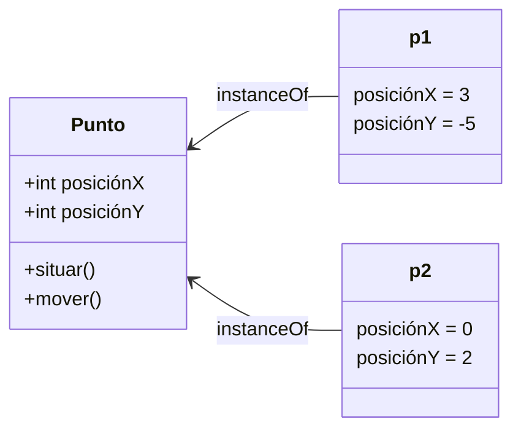
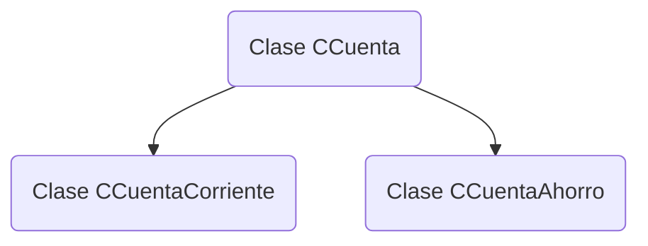
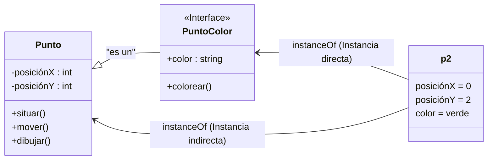
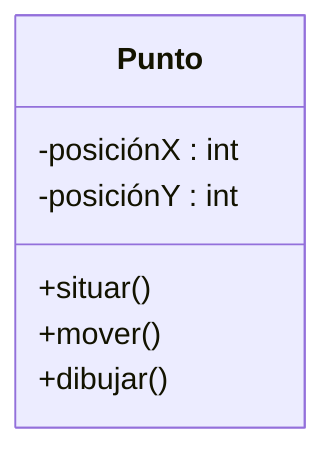
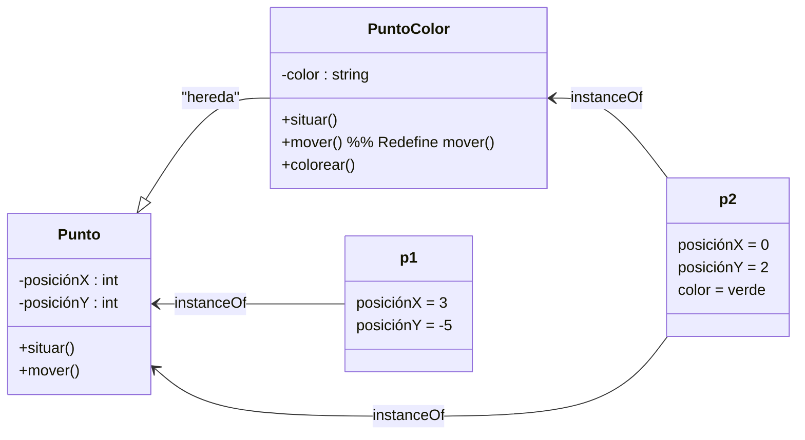

# 📘 Notas: Principios De la Orientación a Objetos

Dentro de la orientación a objetos (OO) se definen una series de principios que constituyen la base sobre la que se fundamenta. Los principios fundamentales para la orientación a objetos son los que se describen a continuación.

## La Abstracción

La abstracción constituye el mecanismo por el que las personas se enfrentan a la complejidad. En el contexto de la orientación a objetos, Booch et al. definen la abstracción como:

> "Aquello que denota las características esenciales de un objeto, que le distinguen de otros objetos ignorando los detalles que no son importantes desde un determinado punto de vista."  
> (Booch, G., Maksimchuk, R. A., Engle, M. W., Young, B. J., Conallen, J. y Houston, K. A. (2007). _Object-Oriented Analysis and Design with Applications_ (3.a ed.). Addison-Wesley.)

La abstracción es una forma de simplificar la realidad (dominio del problema y de su solución), en la que se seleccionan los aspectos relevantes y se prescinde de aquellos que no son de interés para el sistema a implementar. De acuerdo con Booch et al., existen varios tipos de abstracciones (ordenados de mayor a menor relevancia):

- **Abstracción de entidad:** representa un modelo últil de una entidad del dominio.
    
- **Abstracción de acción:** objeto que proporciona un conjunto generalizado de operaciones con un objetivo común.
    
- **Abstracción de máquina virtual:** agrupa operaciones utilizadas por un nivel superior o por operaciones auxiliares.
    
- **Abstracción casual:** engloba un conjunto de operaciones sin relación entre sí.

## La Clasificación

La clasificación determina la relación entre las clases. Los objetos están clasificados en clases, es decir, la clase es su tipo. Booch et al. definen la clasificación como:

> "La forma en la que a un objeto se le asigna un tipo, de tal forma que objetos de diferente tipo no se podrán intercambiar, o en caso de que se puedan intercambiar, lo harán de manera muy restrictiva."

### Clasificación Fuerte Vs Débil

- **Fuerte:** no se permite invocar una operación si su signatura no está definida en la clase o superclase.
    
- **Débil:** permite invocación más flexible, pero con menor seguridad de tipos.

### Clasificación Estática Vs Dinámica

- **Estática:** los tipos se fijan en tiempo de compilación (_early binding_).
    
- **Dinámica:** los tipos se resuelven en tiempo de ejecución (_late binding_).

## La Jerarquía

La jerarquía permite ordenar las abstracciones. La herencia es un ejemplo de jerarquía entre clases, denotando la relación "es-un/a".

Esto permite reutilizar atributos, operaciones y relaciones. La subclase hereda de la superclase. Por ejemplo, _Empleado_ hereda de _Persona_.

## El Encapsulamiento

El encapsulamiento permite separar la interfaz de la implementación. Reduce el acoplamiento y fomenta la comunicación mediante mensajes. Los atributos y operaciones internas se marcan como `private`, mientras que las responsabilidades externas se definen como `public`.

- `+` Público
    
- `-` Privado
    
- `#` Protegido
    
- `~` Interno/paquete

## El Polimorfismo

El polimorfismo permite a los objetos responder de manera distinta ante el mismo mensaje. Las subclases pueden redefinir operaciones heredadas.

> Esto permite que una misma referencia a una superclase pueda comportarse como un objeto de su subclase.

- `PuntoColor` redefine `mover()`.
    
- Cuando `p2` llama a `mover()`, se ejecuta la versión de `PuntoColor`.
    
- Cuando `p1` llama a `mover()`, se ejecuta la versión de `Punto` (por ejemplo, desplazamiento +1, -1).

Este comportamiento demuestra el uso de operaciones polimórficas.