# Actividad 1, Extracción De Clases De Análisis Con Enfoque Orientado a Objetos

# Miguel De Jesús Chávez

# Metodologías, Desarrollo Y Calidad En la Ingeniería De Software

# Bárbaro Jorge Ferrero Castro

# Mayo 26, 2025

# Unir – Universidad Internacional De la Rioja

## Índice

## Introducción

Este trabajo presentará un análisis orientado a objetos de una aplicación de gestión de gimnasio, describiendo las clases principales del sistema, por ejemplo, **Gimnasio**, **Equipo**, **Clase**, **Entrenador**, **Usuario**, **Cliente**, **Membresía**, **Asistencia** con sus atributos y métodos.

Se identificarán las relaciones entre estas clases (asociación, herencia, agregación y composición) y se justificará el uso de cada una conforme a las reglas de UML. Se incluye además varios diagrams de clases UML que sintetizan la estructura que se propone para el sistema.

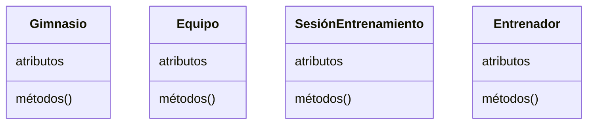

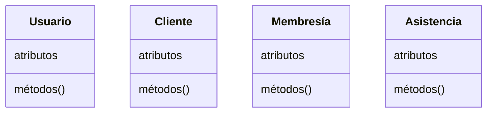

Partiendo de las necesidades que nos comparte el cliente y gestionando los casos de uso podemos analizar los siguientes casos de uso que tienen los actores para llevar a cabo sus actividades diversas.

### Casos De Uso

1. **Gestión de usuarios y acceso**
    - **Registrar Nuevo usuario**: El sistema debe permitir dar de alta nuevos clientes y personal.
    - **Autentificar usuario**: Control de acceso mediante credenciales.
    - **Gestionar perfiles**: El sistema debe permitir la actualización de información tanto de metas como personal.
2. **Administración de instalaciones**
    - **Abrir/cerrar gimnasio**: Debemos tener un control de quién se encarga de cerrar y abrir el gimnasio.
    - **Gestionar Espacios:** Asignación de espacios disponibles con equipos asignados a esa área.
    - **Monitorear aforo:** Control de capacidad de personas en instalaciones para el balanceo de entrenadores por horarios de demanda.
3. **Control de equipo**
    - **Inventariar equipos**: Permite que un empleado pueda añadir equipo nuevo.
    - **Programar mantenimiento**: Calendarización de revisiones y reparaciones.
    - **Verificar disponibilidad**: Consulta del estado actual de los equipos.
4. **Programación de actividades**
    - **Crear Clases Grupales**: Permite al entrenador crear una clase, por ejemplo, de yoga, etc.
    - **Inscribirse**: Permite que los clientes puedan ingresar a las clases.
    - **Cancelar / Reprogramar sesiones**: Permite que los usuarios cancelen su inscripción a una clase o que el entrenador reagende, enviando notificación previa.
    - **Notificación de cambios**: Notificar cancelaciones o reprogramaciones de clases.
5. **Gestión de membresías**
    - **Suscribir clientes**: Registro de nuevas membresías.
    - **Renovar planes**: Extensión de membresías existentes.
    - **Consultar beneficios**: Verificación de servicios incluidos.
6. **Control de asistencia**
    - **Registrar entrada/salida**: Seguimiento de visitas al gimnasio.
    - **Controlar participación en clases**: Registro de asistentes a sesiones grupales.
7. **Entrenamiento personalizado**
    - **Asignar rutinas**: Creación de planes de entrenamiento individuales.
    - **Realizar seguimiento**: Monitoreo del progreso de los clientes.
    - **Programar sesiones personales**: Organización de entrenamientos uno a uno.

## Análisis De Actores Y Entidades Del Sistema De Gestión De Gimnasio

Los **actores** son los usuarios que interactúan directamente con el sistema y tienen roles específicos. A partir del análisis de los casos de uso, podemos identificar los siguientes actores:

### Actores Principales

#### 1. Cliente

Actor principal que utilize los servicios del gimnasio.

- **Características**: Persona que ha contratado una membresía para usar las instalaciones.
- **Responsabilidades**: Inscribirse en clases, registrar entrada/salida, consultar su historial de asistencia, renovar membresías.

#### 2. Entrenador

Personal especializado que imparte clases y asesora a los clientes.

- **Características**: Professional con experiencia en actividades físicas y entrenamiento.
- **Responsabilidades**: Crear clases grupales, asignar rutinas personalizadas, gestionar la programación de sesiones.

#### 3. Administrador/Recepcionista

Personal encargado de la gestión operativa del gimnasio.

- **Características**: Empleado con permisos para administrar usuarios y recursos.
- **Responsabilidades**: Registrar nuevos usuarios, gestionar membresías, controlar el acceso, supervisar instalaciones.

### Entidades Del Sistema

Las **entidades** representan los objetos principales que son gestionados por el sistema:

| Nº  | Entidad          | Descripción                                                            | Relevancia                                                                                               | Justificación                                                  |
| --- | ---------------- | ---------------------------------------------------------------------- | -------------------------------------------------------------------------------------------------------- | -------------------------------------------------------------- |
| 1   | **Gimnasio**     | Representa la instalación física donde se desarrollan las actividades. | Entidad contenedora principal que coordina todas las operaciones.                                        | Gestiona horarios de apertura/cierre, espacios y aforo.        |
| 2   | **Usuario**      | Representa a cualquier persona registrada en el sistema.               | Clase abstracta para clientes y personal.                                                                | Unifica la gestión de accesos y datos personales.              |
| 3   | **Cliente**      | Especialización de Usuario para los miembros del gimnasio.             | Principal usuario de los servicios ofrecidos.                                                            | Gestiona membresías, asistencias e inscripciones.              |
| 4   | **Entrenador**   | Especialización de Usuario para el personal instructor.                | Responsible de las actividades físicas dirigidas.                                                        | Asigna clases y entrenamientos.                                |
| 5   | **Membresía**    | Representa el plan de suscripción y su renovación.                     | Define nivel de acceso y beneficios.                                                                     | Controla el acceso y permite renovaciones.                     |
| 6   | **Clase/Sesión** | Actividad grupal programada.                                           | Organiza las actividades colectivas.                                                                     | Programación, asistencia y asignación de recursos.             |
| 7   | **Equipo**       | Máquinas y material deportivo disponibles.                             | Recurso físico clave para actividades.                                                                   | Control de inventario, mantenimiento y asignación a espacios.  |
| 8   | **Asistencia**   | Registro histórico de participación.                                   | Permite seguimiento de actividad.                                                                        | Análisis de uso, facturación y control de acceso.              |
| 9   | Personal         | Especialización de usuario para el personal administrativo.            | Responsible de administrar los clientes, levantar reportes para mataninimiento y administrar el gimnasio | Administra los recursos disponibles dentro las instalaciones . |

## Clases Del Sistema

A continuación se detallan las clases principales del sistema de gimnasio, indicando para cada una su nombre, propósito, atributos y métodos.

### Gimnasio

Propongo adicionalmente la clase **Gimnasio**, la cual representa la entidad principal del sistema o de las instalaciones. El modelo se centra en el manejo de los usuarios.

#### Atributos Principales

- `nombre:` Nombre official del gimnasio.
- `ubicacion:` Dirección física o localización del gimnasio.
- `horario:` Horario de apertura y cierre, o bien, estructura de turnos de funcionamiento.

#### Métodos Clave

- `abrir():` Cambia el estado del gimnasio a abierto, permitiendo el acceso a usuarios y el inicio de actividades.
- `cerrar():` Cambia el estado del gimnasio a cerrado, restringiendo el acceso y finalizando las operaciones del día.
- `registrar_entrada():` Registra la entrada de un usuario al gimnasio, validando su membresía y actualizando el historial de acceso.
- `registrar_salida():` Registra la salida de un usuario, permitiendo llevar un control de aforo y asistencia.

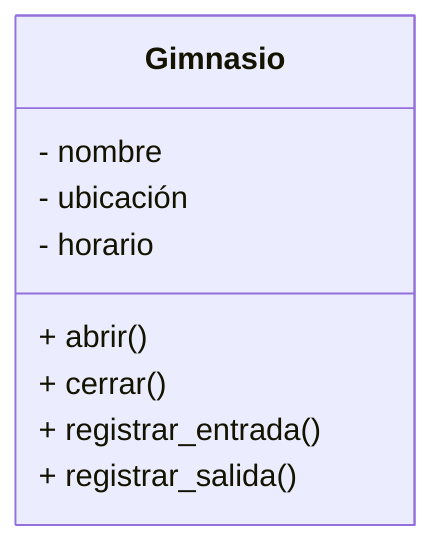

### Equipo

La clase **Equipo** representa cualquier máquina o aparato disponible que está en el gimnasio, como cintas de correr, bicicletas, pesas, entre otros. Esta entidad ayudará a la gestión de inventario, el control de disponibilidad y la programación de mantenimientos.

#### Atributos Principales

- `nombre` Descripción o denominación del equipo.
- `estado` Indica la condición actual del equipo (por ejemplo: operativo, en mantenimiento, fuera de servicio).

#### Métodos Clave

- `marcar_mantenimiento()` Cambia el estado del equipo para indicar que require revisión o reparación, y registra la fecha del mantenimiento.
- `agregar_equipo(equipo)` Permite incorporar un nuevo equipo al inventario del gimnasio.
- `ver_disponibilidad()` Devuelve información sobre si el equipo está disponible para uso o reservado para alguna actividad.

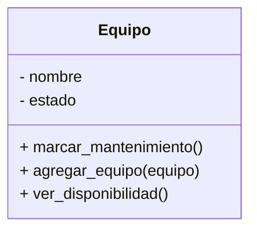

### Usuario

La clase **Usuario** funciona como una superclase abstracta que modela los atributos y comportamientos comunes de todas las personas que interactúan con el sistema, ya sean clientes, entrenadores u otro personal. Su propósito es facilitar la reutilización de la clase para simplificar y unir con la gestión de datos personales.

#### Atributos Principales

- `nombre` Nombre completo del usuario.
- `correo` Dirección de correo electrónico para contacto y notificaciones.
- `teléfono` Número de teléfono asociado al usuario.

#### Métodos Clave

- `contactar()` Permite enviar un mensaje o notificación al usuario a través de los medios registrados (correo o teléfono).
- `actualizar_datos()` Permite modificar la información personal del usuario.

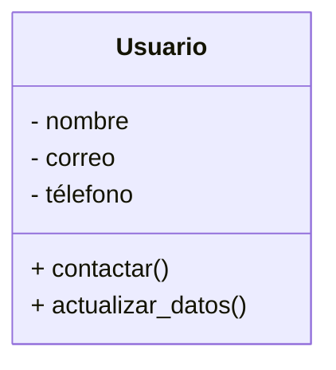

La creación de esta clase como superclase nos permite crear clases como **Cliente**, **Entrenador**, que hereden atributos y métodos comunes. Los atributos los mantenemos privados y usamos métodos para poder cambiar o actualizar los atributos, asegurando que solo la clase o subclases que podamos crear puedan acceder o modificar la información.

De esta forma también, al tener una superclase, nos permite incorporar nuevos métodos en el futuro y centralizar la gestión de información sensible.

### Cliente

La clase **Cliente** representa a un cliente registrado en el gimnasio, generado a partir de la superclase abstracta **Usuario**. Modela las operaciones y atributos propios de un socio, permitiendo gestionar su relación con el gimnasio y su participación en actividades.

#### Atributos Principales

- `nombre` Nombre completo del miembro (heredado de Usuario).
- `correo` Correo electrónico para notificaciones (heredado de Usuario).
- `télefono` Número de contacto (heredado de Usuario).
- `fecha_registro` Fecha en la que el miembro se inscribió al gimnasio.
- `estado_membresía` Indica si la membresía del miembro está activa o no.
- `tipo_membresía` Plan de membresía asociado al miembro.

#### Métodos Clave

- `pagar_cuota()` Permite al miembro realizar el pago de su cuota periódica.
- `hacer_checkIn()` Registra la entrada del miembro al gimnasio.
- `inscribir_en_clase(sesión)` Permite al miembro inscribirse en una sesión grupal o clase.

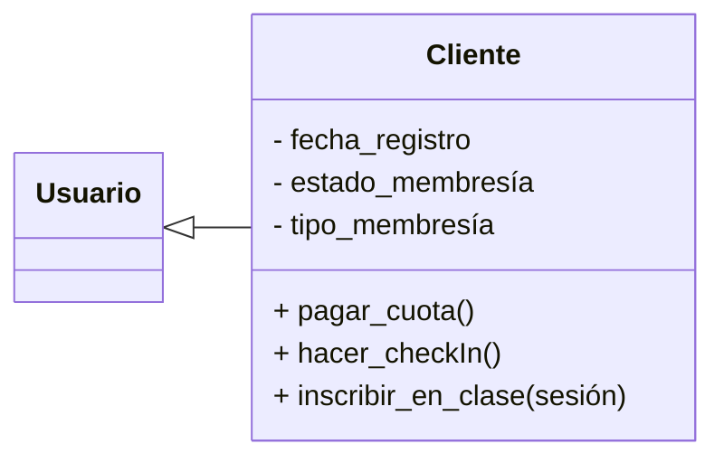

### Membresía

La clase **Membresía** modela el contrato de suscripción que permite a un cliente acceder a los servicios del gimnasio bajo ciertas condiciones y beneficios. Es fundamental para controlar el acceso, gestionar renovaciones y definir los privilegios de cada usuario.

#### Atributos Principales

- `plan:planes` Indica el tipo de plan contratado, esto se hace a través de una clase de tipo enumeración con la intención de restringir los valores posibles.
- `fecha_inicio`: Fecha en la que inicia la vigencia de la membresía.
- `fecha_fin`: Fecha en la que termina el plazo de la membresía.
- `costo`: Monto asociado con el plan.
- `estado`: Indica si la membresía está activa o vencida.

#### Enumeración Asociada

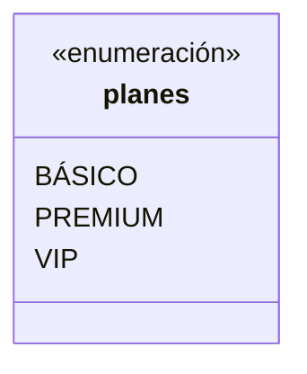

**Tipos de membresías**:

- `BÁSICO`: Acceso a instalaciones básicas y horarios estándar.
- `PREMIUM`: Acceso completo a instalaciones y clases grupales.
- `VIP`: Total acceso, clases ilimitadas, y entrenamiento personalizado.

#### Métodos

- `renovar_membresia()` - Extiende la fecha de finalización de la membresía según la duración especificada, que puede set mensual o annual.
- `ver_detalles()` - Devuelve una descripción detallada de la membresía, incluyendo beneficios, duración y costo.
- `es_activa()` - Verifica si la membresía está vigente con la fecha actual.

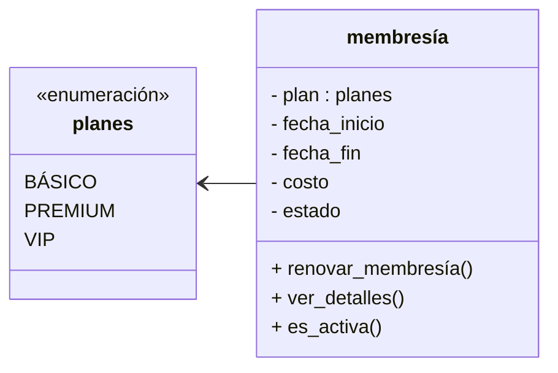

Dejando los atributos privados, podemos aprovechar su encapsulamiento para que solo los métodos de la clase puedan modificar el estado de la membresía. Usando una clase de tipo enumeración, nos permite simplificar y ampliar los planes desde un punto central.

La clase se encarga exclusivamente de resguardar la suscripción, la renovación y permite consultar los detalles de la misma clase, siguiendo el principio de la responsabilidad única.

### Entrenador

La clase **Entrenador** representa a un instructor o professional encargado de guiar y supervisar a los miembros del gimnasio. Es una especialización de la clase **Usuario**, lo que permite heredar atributos y métodos comunes, y añadir funcionalidades específicas relacionadas con la gestión de entrenamientos y clases.

#### Atributos Principales

- `nombre` Nombre completo del entrenador (heredado de Usuario).
- `correo` Correo electrónico para notificaciones (heredado).
- `teléfono` Número de contacto (heredado).
- `fecha_registro` Fecha de alta en el gimnasio (heredado).
- `especialidad` Área de conocimiento o disciplina principal del entrenador.
- `años_experiencia` Tiempo de experiencia professional en el ámbito deportivo.

#### Métodos Clave

- `asignar_rutina(miembro)` Permite diseñar y asignar un plan de entrenamiento personalizado a un miembro.
- `programar_clase(clase)` Permite crear o programar una nueva sesión grupal o clase.
- `ver_clientes()` Devuelve la lista de miembros bajo su supervisión o entrenamiento.

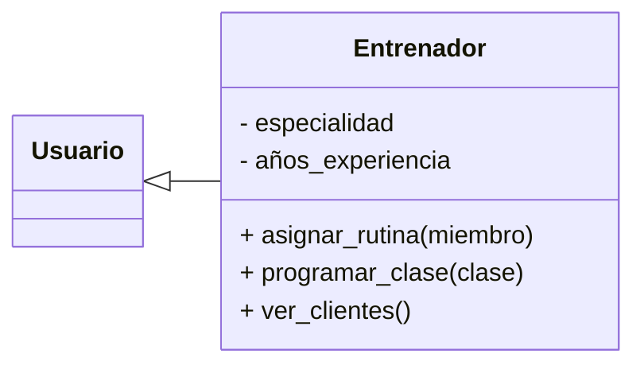

### SesiónEntrenamiento (clase)

La clase **SesiónEntrenamiento** representa una actividad grupal programada dentro del gimnasio, como yoga, spinning o cualquier otra clase colectiva. Esta entidad permite organizar, gestionar y controlar la participación de miembros y la asignación de entrenadores.

#### Atributos Principales

- `Nombre` Nombre de la clase para identificar que va a cubrir.
- `fecha_hora` Memento programado para el inicio de la sesión.
- `duracion` Tiempo estimado de la sesión.
- `estado` Indica si la sesión está programada, en curso, finalizada o cancelada.

#### Métodos Clave

- `iniciar_sesion()` Cambia el estado de la sesión a "en curso" y permite el acceso de los participantes.
- `cancelar_sesion()` Cambia el estado de la sesión a "cancelada" y notifica a los inscritos.
- `agregar_participante(participante)` Permite registrar a un miembro como asistente a la sesión.
- `asignar_entrenador(entrenador)` Asocia un entrenador responsible de la sesión.

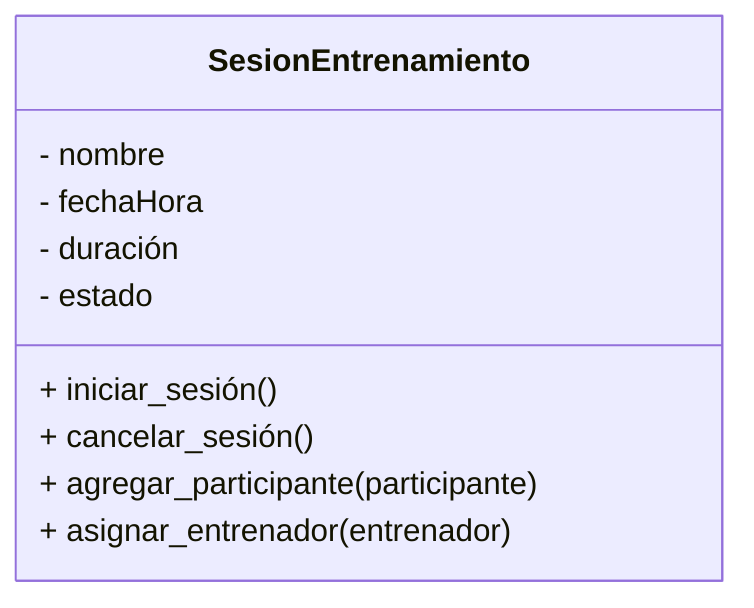

### Asistencia

La clase **Asistencia** representa el registro de la participación de un usuario en una clase o sesión dentro del gimnasio. Esta entidad es fundamental para llevar un control histórico de la actividad de los clientes y para la gestión de reportes y análisis de uso.

#### Atributos Principales

- `fecha` Fecha y hora en la que se registra la asistencia.
- `usuario` Referencia al miembro que asiste (asociación).
- `sesion` Referencia a la sesión o clase a la que asiste el miembro.

#### Métodos Clave

- `registrar_asistencia()` Registra la asistencia de un miembro a una clase, añadiendo una nueva entrada al historial.
- `ver_historial_asistencias()` Permite consultar el historial de asistencias de un miembro, facilitando el seguimiento de su participación en actividades.

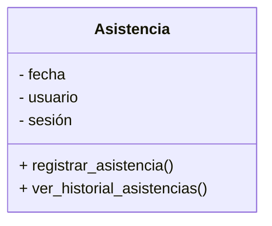

## Relaciones Dinámicas Entre Clases (Diagrams De Secuencia)

### 1. Registro De Entrada De Un Cliente

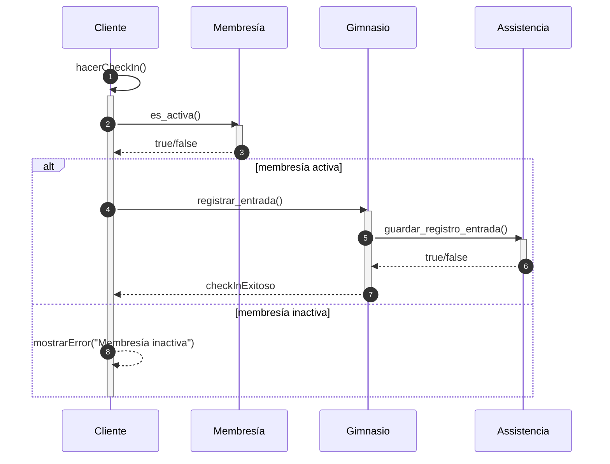

1. **Cliente → Cliente (`hacerCheckIn()`)**  
    El objeto `Cliente` inicia el proceso de check-in invocando su propio método `hacerCheckIn()`.
    
2. **Cliente → Membresía (`es_activa()`)**  
    Dentro de `hacerCheckIn()`, `Cliente` pregunta a su objeto `Membresía` si está activa.
    
3. **Membresía → Cliente (`true/false`)**  
    `Membresía` devuelve un booleano que indica si la suscripción está vigente.
    
4. **Caso membresía activa**
    
    - **Cliente → Gimnasio (`registrar_entrada()`)**: si la membresía es válida, `Cliente` invoca `registrar_entrada()` en `Gimnasio`.
		
    - Gimnasio → Asistencia (`Guardar_registro_Entrada ())`: Gimnasio luego guarda el registro dentro de asistencia, para que asistencia lo guarde con el id del usuario.
        
    - **Gimnasio → Cliente (`checkInExitoso`)**: `Gimnasio` confirma el registro de entrada.
        
5. **Caso membresía inactiva**
    
    - **Cliente → Cliente (`mostrarError(…)`)**: se muestra el mensaje de error “Membresía inactiva”.

**Relaciones**

- **Asociación**: `Cliente` está asociado con `Membresía` y con `Gimnasio`.
    
- **Composición implícita**: `Gimnasio` lleva el registro interno de accesos (aunque aquí el objeto `Asistencia` no aparece explícito).

### 2. Inscripción En Una Clase Grupales

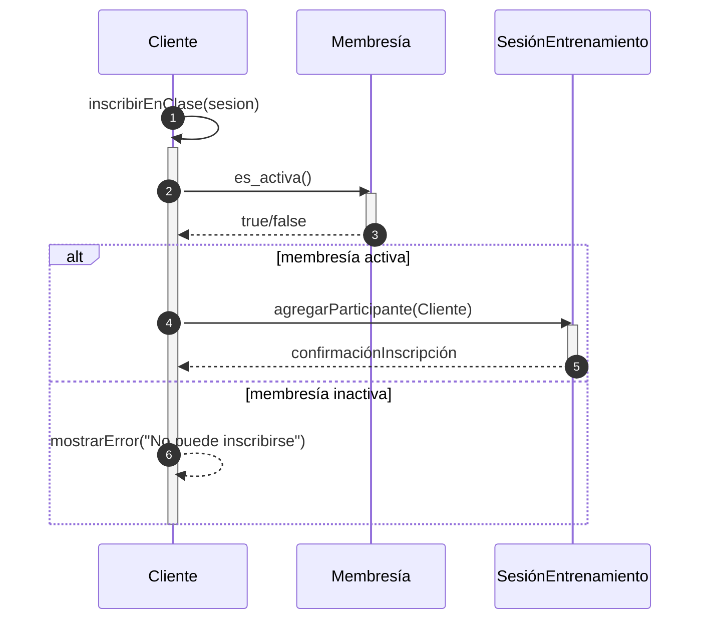

1. **Cliente → Cliente (`inscribirEnClase(sesion)`)**  
    El cliente llama a `inscribirEnClase`, pasando la instancia de `SesiónEntrenamiento`.
    
2. **Cliente → Membresía (`es_activa()`)**  
    Se valida de nuevo el estado de la membresía.
    
3. **Membresía → Cliente (`true/false`)**  
    Se devuelve si el cliente puede participar o no.
    
4. **Caso membresía activa**
    
    - **Cliente → SesiónEntrenamiento (`agregarParticipante(Cliente)`)**: añade al cliente al listado de participantes.
        
    - **SesiónEntrenamiento → Cliente (`confirmaciónInscripción`)**: confirma la inscripción.
        
5. **Caso membresía inactiva**
    
    - **Cliente → Cliente (`mostrarError(…)`)**: muestra el error de imposibilidad.

**Relaciones**

- **Asociación**: `Cliente` interactúa tanto con `Membresía` como con `SesiónEntrenamiento`.
    
- **Agregación**: `SesiónEntrenamiento` mantiene una colección de participantes (clientes).

### 3. Programación De Una Clase Grupal Por Un Entrenador

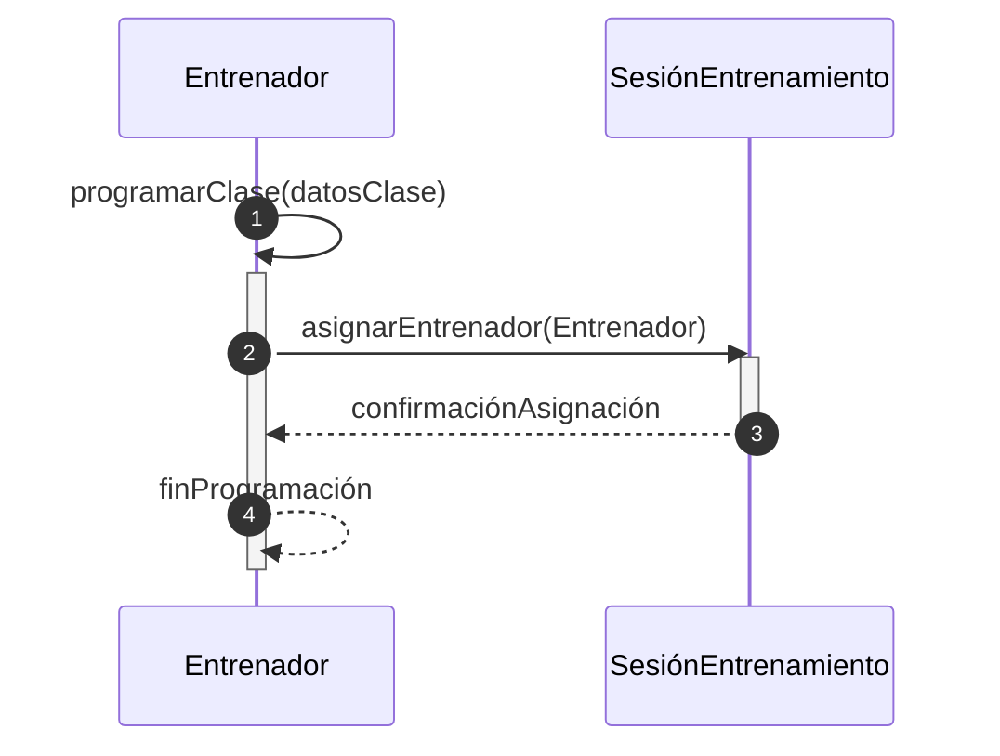

1. **Entrenador → Entrenador (`programarClase(datosClase)`)**  
    El entrenador inicia la creación de una nueva sesión, preparando los datos.
    
2. **Entrenador → SesiónEntrenamiento (`asignarEntrenador(Entrenador)`)**  
    Se asocia la instancia del entrenador con la nueva `SesiónEntrenamiento`.
    
3. **SesiónEntrenamiento → Entrenador (`confirmaciónAsignación`)**  
    Se devuelve la confirmación de que el entrenador fue asignado correctamente.
    
4. **Entrenador → Entrenador (`finProgramación`)**  
    El entrenador culmina internamente el flujo de programación.

**Relaciones**

- **Herencia/Polimorfismo**: `Entrenador` es una subclase de `Usuario`.
    
- **Asociación fuerte**: `SesiónEntrenamiento` require un `Entrenador` para existir.

### 4. Programar Mantenimiento De Un Equipo

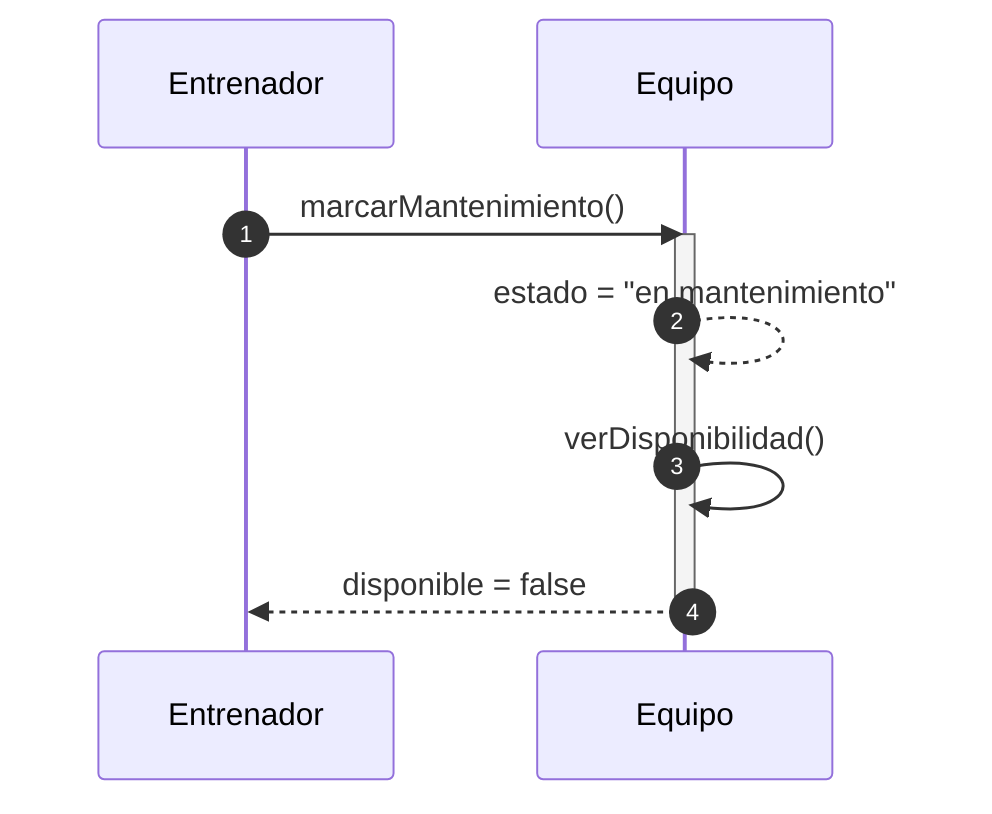

1. **Entrenador → Equipo (`marcarMantenimiento()`)**  
    El técnico inicia el proceso de mantenimiento de la máquina.
    
2. **Equipo → Equipo (interno)**  
    Cambia su atributo `estado` a `"en mantenimiento"`.
    
3. **Equipo → Equipo (`verDisponibilidad()`)**  
    Comprueba internamente si puede seguir siendo usado.
    
4. **Equipo → TécnicoDeMantenimiento (`false`)**  
    Responde que ya no está disponible hasta terminar la reparación.

**Relaciones**

- **Asociación**: el Entrenador interactúa con el objeto `Equipo`.
    
- **Encapsulamiento**: las operaciones de estado y disponibilidad quedan dentro de `Equipo`.

## Análisis De Los Flujos Principales E Interacciones

Basado en los casos de usos y los diagrams de secuencia que se identifican, podemos intuir y analizar los siguientes flujos principales sobre las interacciones entre los actores y components del sistema:

### 1 . **Gestion De Usuarios Y Acceso**

- **Durante el registro de un nuevo usuario**
	 1. Un administrador inicia el proceso de registro en el sistema
	 2. El sistema solicita datos básicos (nombre, contacto, etc)
	 3. Se selecciona el tipo de usuario (cliente, entrenador)
	 4. Si es cliente se vincula con una membresía
	 5. El sistema valida la información proporcionada
	 6. Se generan credenciales para el ingreso
	 7. El usuario recibe notificación de registro exitoso con credenciales
- **Interacciones clave:**
	- `Usuario` ↔ `Membresía`: Al registrar un cliente, debe asociarse con un tipo de membresía
	- `Usuario` ↔ `Gimnasio`: Los usuarios registrados pueden acceder a las instalaciones a través de credenciales

### 2. **Administración De Instalaciones**

- **Gestión de espacios:**
	1. El administrador accede al módulo de gestión de espacios
	2. Visualiza la distribución actual de las instalaciones
	3. Asigna equipos específicos a cada área
	4. Configura horarios de disponibilidad de instalaciones
	5. El sistema actualiza la información y la hace visible para los usuarios

**Interacciones clave:**

- `Gimnasio` ↔ `Equipo`: El gimnasio contiene diversos equipos distribuidos en sus espacios
- `Gimnasio` ↔ `Clase`: Las clases se asignan a espacios específicos dentro del gimnasio

### 3. **Control De Equipo**

**Programación de mantenimiento:**

1. El administrador identifica equipos que requieren mantenimiento
2. Programa fechas para revisión o reparación
3. El sistema marca el equipo como "En mantenimiento"
4. Se notifica al personal relevante
5. Al completar el servicio, se actualiza el estado del equipo
6. El sistema registra el historial de mantenimiento

**Interacciones clave:**

- `Equipo` ↔ `Clase`: La disponibilidad de equipos afecta la programación de clases
- `Equipo` ↔ `Gimnasio`: El inventario de equipos es parte integral del gimnasio

### 4. **Programación De Actividades**

 **Creación de clases grupales:**

1. El entrenador accede al módulo de programación
2. Define el tipo de clase (yoga, spinning, etc.)
3. Establece fecha, hora y duración
4. Asigna un espacio específico
5. Define capacidad máxima
6. El sistema verifica disponibilidad y no conflictos
7. La clase se publica y queda disponible para inscripción

**Interacciones clave:**

- `Clase` ↔ `Entrenador`: Cada clase es impartida por un entrenador específico
- `Clase` ↔ `Cliente`: Los clientes se inscriben en las clases
- `Clase` ↔ `Asistencia`: El sistema registra la asistencia a cada clase

### 5. **Gestión De Membresías**

**Flujo principal - Renovación de planes:**

1. El cliente o recepcionista inicia el proceso de renovación
2. El sistema muestra el estado actual y opciones disponibles
3. Se selecciona el nuevo período de vigencia
4. Se aplican promociones si corresponde
5. Se procesa el pago
6. El sistema actualiza la fecha de vencimiento
7. Se notifica la renovación exitosa

**Interacciones clave:**

- `Membresía` ↔ `Cliente`: Cada cliente tiene asociada una membresía con características específicas
- `Membresía` ↔ `Clase`: El tipo de membresía podría determina el acceso a ciertas clases

### 6. **Control De Asistencia**

**Registro de entrada/salida:**
1. El cliente se identifica en el punto de acceso (tarjeta, biometría, etc.)
2. El sistema verifica la vigencia de la membresía
3. Se registra la fecha y hora de entrada
4. Al salir, el cliente se identifica nuevamente
5. El sistema registra la hora de salida
6. Se actualiza el historial de asistencia del cliente

**Interacciones clave:**

- `Asistencia` ↔ `Cliente`: Se registra cada visita del cliente
- `Asistencia` ↔ `Clase`: Se controla la participación en actividades específicas
- `Asistencia` ↔ `Gimnasio`: Permite monitorear el aforo en tiempo real

### 7. **Entrenamiento Personalizado**

**Flujo principal - Asignación de rutinas:**

1. El entrenador accede al perfil del cliente
2. Evalúa su condición física y objetivos
3. Diseña una rutina personalizada
4. Asigna ejercicios específicos con series y repeticiones
5. Establece progresión esperada
6. El cliente recibe notificación de su nueva rutina
7. El sistema permite seguimiento del cumplimiento

**Interacciones clave:**

- `Entrenador` ↔ `Cliente`: Relación directa para la personalización del entrenamiento
- `Cliente` ↔ `Equipo`: Las rutinas incluyen el uso de equipos específicos

## Relaciones Entre Clases

Las relaciones entre las clases son cruciales para entender cómo interactúan los diferentes components del sistema. A continuación, se detallan las relaciones y cómo se enlazan, justificando el uso de cada una conforme a las reglas de UML.

1. **Herencia (Generalización/Especialización)**
    
    - **Usuario --> Cliente**: La clase `Cliente` **hereda** de `Usuario`. Esto significa que un cliente es un tipo específico de usuario, compartiendo atributos y métodos comunes (nombre, correo, teléfono) y añadiendo características y comportamientos propios de un miembro del gimnasio (fecha de registro, estado de membresía).
    - **Usuario --> Entrenador**: Similar al cliente, la clase `Entrenador` **hereda** de `Usuario`. Un entrenador también es un tipo de usuario con información básica compartida, pero con atributos y métodos específicos de su rol (especialidad, años de experiencia, asignar rutina).
2. **Asociación**
    
    - **Cliente -- Membresía**: Un `Cliente` **tiene** una `Membresía`. Esta es una relación de asociación donde cada cliente está vinculado a una membresía que define su acceso y beneficios. La multiplicidad sería "1 a 1" (un cliente tiene una membresía) .
    - **Cliente -- Asistencia**: Un `Cliente` **registra** `Asistencia`. Esta relación indica que un cliente puede tener múltiples registros de asistencia a lo largo del tiempo. La multiplicidad sería "1 a *" (un cliente tiene muchas asistencias).
    - **Cliente -- SesiónEntrenamiento**: Un `Cliente` **se inscribe en** `SesiónEntrenamiento`. Un cliente puede inscribirse en varias sesiones, y una sesión puede tener varios clientes inscritos. La multiplicidad sería "* a *".
    - **Entrenador -- SesiónEntrenamiento**: Un `Entrenador` **imparte** `SesiónEntrenamiento`. Una sesión es impartida por un entrenador, y un entrenador puede impartir múltiples sesiones. La multiplicidad sería "1 a *" en el lado del entrenador y "1" en el lado de la sesión.
    - **Gimnasio -- Equipo**: Un `Gimnasio` **contiene** `Equipo`. El gimnasio posee y gestiona varios equipos. La multiplicidad sería "1 a *".
    - **Gimnasio -- SesiónEntrenamiento**: Un `Gimnasio` **organiza** `SesiónEntrenamiento`. Las sesiones grupales se realizan en el gimnasio. La multiplicidad sería "1 a *".
    - **Asistencia -- Usuario**: Un registro de `Asistencia` **corresponde a** un `Usuario` (en este caso, un `Cliente`). Esta relación es esencial para saber quién asistió. La multiplicidad es "1 a 1".
    - **Asistencia -- SesiónEntrenamiento**: Un registro de `Asistencia` **se relaciona con** una `SesiónEntrenamiento`. Especifica a qué sesión se asistió. La multiplicidad es "1 a 1".
3. **Agregación**
    
    - **SesiónEntrenamiento o Clase -- Cliente**: Una `SesiónEntrenamiento` **compuesta por** `Cliente` s (como participantes). Esto indica que una `SesiónEntrenamiento` tiene una colección de `Cliente` s que participan, pero los `Cliente` s pueden existir independientemente de la sesión. La multiplicidad sería "1 a *" en el lado de la sesión.

## Diagrama De Clases UML

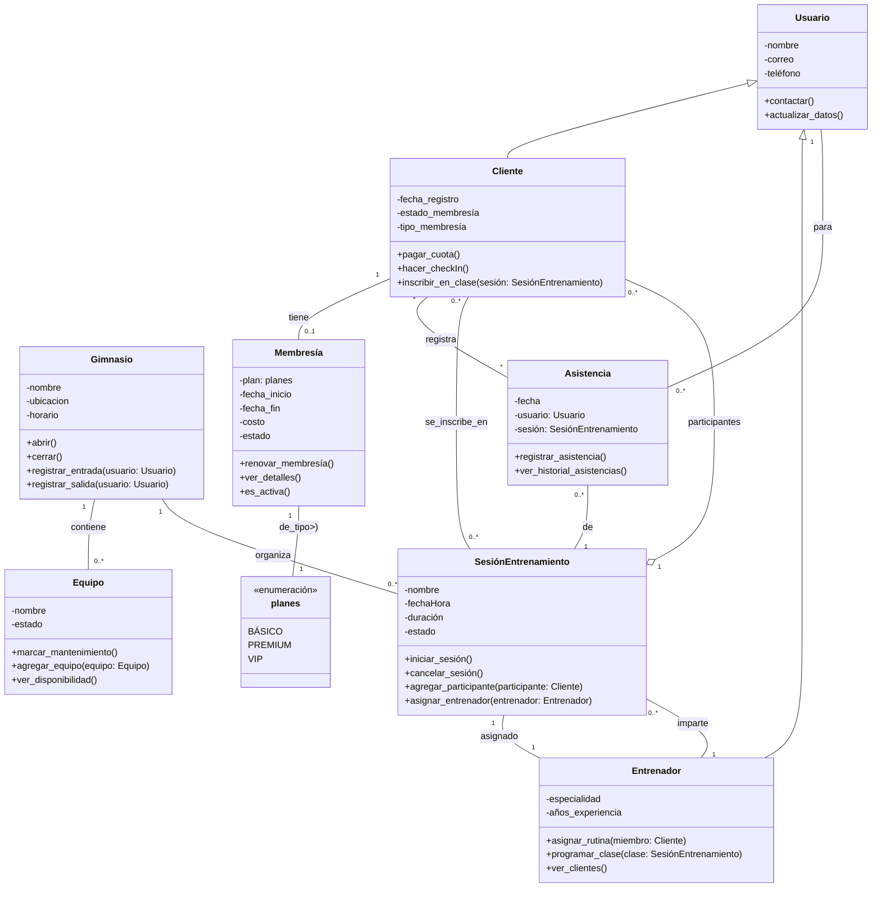

## Conclusión

Este análisis orientado a objetos ha permitido modelar un sistema de gestión de gimnasio, identificando los actores, entidades y sus interacciones. Se han definido las clases clave con sus atributos y métodos, y se han establecido las relaciones UML adecuadas (herencia, asociación, agregación) para representar la estructura del sistema.

Los diagrams de secuencia ilustran los flujos dinámicos de operaciones fundamentales como el registro de entrada de clientes, la inscripción a clases y la programación de entrenamientos o mantenimientos. La jerarquía de clases, como la especialización de `Usuario` en `Cliente`, `Entrenador` y `Personal` la coherencia en la gestión de datos. El uso de enumeraciones para `planes` en `Membresía` asegura la integridad y simplifica la expansión de los tipos de suscripción.

En resumen, el modelo propuesto ofrece una base robusta y escalable para el desarrollo de un software de gestión de gimnasio, facilitando la administración de membresías, equipos, personal y actividades, lo cual es fundamental para la eficiencia operativa y la satisfacción del cliente.