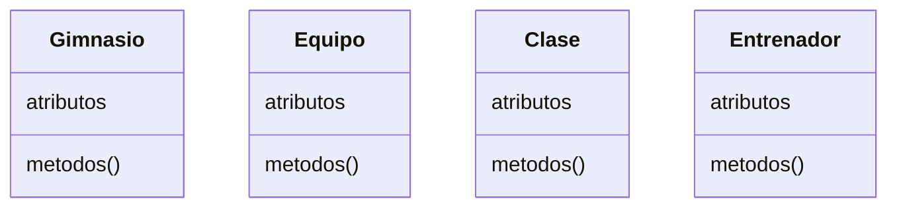
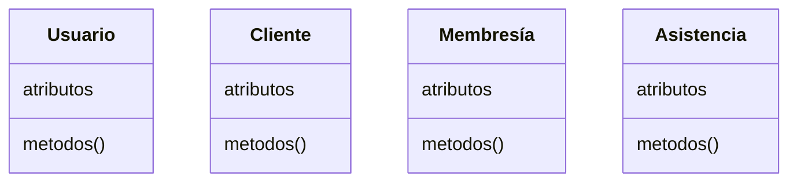
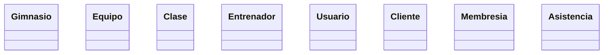

# Análisis Del Sistema Para Una Aplicación De Gimnasio

## Resumen

Este trabajo presentara un análisis orientado a objetos de una aplicación de gestión de gimnasio, describiendo las clases principales del sistema por ejemplo, _Gimnasio_, _Equipo_, _Clase_, _Entrenador_, _Usuario_, _Cliente_, _Membresía_, _Asistencia_ con sus atributos y métodos.

Se identifican las relaciones entre estas clases (asociación, herencia, agregación y composición) y se justifica el uso de cada una conforme a las reglas de UML. Se incluye además varios diagrams de clases UML que sintetiza la estructura que se propone para el sistema.

## Introducción

> [!danger] Escribir un buen introduccion despues

## Clases Del Sistema

A continuación se detallan las clases principales del sistema de gimnasio, indicando para cada una su nombre, propósito, atributos y métodos.

### Gimnasio

- **Gimnasio:** Representa el centro deportivo en sí mismo. _Atributos: _ `nombre: String`, `ubicación: String`, `horario: String`. _Métodos: _ `abrir()`, `cerrar()`, `registrarEntrada(Usuario)`, `registrarSalida(Usuario)`. Esta clase puede considerarse un servicio o entidad global que coordina las operaciones del gimnasio.

### Equipo

- **Equipo:** Representa un equipo o máquina del gimnasio (p. ej. cinta, pesa). _Atributos: _ `equipoID: Int`, `nombre: String`, `estado: String`. _Métodos: _ `marcarMantenimiento()` `agregar_equipo(equipo)` `ver_disponibilidad()`. Los equipos son utilizados en las sesiones, pero en el modelo propuesto existen como entidades propias.

### Clase

- **SesiónEntrenamiento:** Representa una clase o sesión grupal (p. ej. yoga, spinning). _Atributos:_ `sesiónID: Int`, `fechaHora: DateTime`, `duración: Int`. _Métodos:_ `iniciarSesión()`, `cancelarSesión()`. Esta clase se asocia con **Miembro** (asistencia de miembros) y **Entrenador** (conduce la sesión), sin que exista dependencia de vida fuerte entre ellas.

### Usuario

- **Persona:** (Superclase abstracta) Modelo común para individuos en el sistema. _Atributos:_ `id: Int`, `nombre: String`, `correo: String`, `telefono: String`. _Métodos:_ `contactar()`. Se propone para agrupar atributos comunes de **Miembro** y **Entrenador** a través de herencia (generalización)

### Cliente

- **Miembro:** Hereda de _Persona_. Representa a un cliente registrado en el gimnasio. _Atributos:_ `fechaRegistro: Date`, `estadoMembresía: Boolean`, `tipoMembresía: Membresía` (enumeración). _Métodos:_ `pagarCuota()`, `hacerCheckIn()`, `inscribirEnClase(SesiónEntrenamiento)`. Modela las operaciones típicas de un socio del gimnasio.

### Membresía

- **Membresía:** (Enumeración) Define los tipos de planes disponibles: `BÁSICO`, `PREMIUM`, `VIP`. **No es una clase de entidad**, sino un tipo de dato especial. Se usa como atributo de _Miembro_ para indicar su plan contratado.
- `renovar_membresia()`: Permite al cliente renovar su membresía, actualizando la fecha de inicio y fin de la suscripción. 
- `ver_detalles()`: Muestra la información sobre el tipo de membresía del cliente, incluyendo beneficios, duración y costo

### Entrenador

- **Entrenador:** Hereda de _Persona_. Representa a un instructor o entrenador del gimnasio. _Atributos: _ `especialidad: String`, `añoExperiencia: Int`. _Métodos: _ `asignarRutina(Miembro)`, `programar_clase(clase)` `ver_clientes()`. Un _Entrenador_ puede gestionar sesiones de entrenamiento y asignar rutinas personalizadas.

### Asistencia

- Asistencia: 
	- registrar_asistencia(): Registra la asistencia de un cliente a una clase, añadiendo una entrada a la base de datos que vincula el cliente con la clase y la fecha. 
	- ver_historial_asistencias(): Permite al cliente ver su historial de asistencias a clases, ayudando a mantener un seguimiento de su participación

## Relaciones Entre Clases

> [!todo] Agregar explicacion de las relaciones entre las clases y como se enlazan

## Diagrama De Clases UML

## Conclusión