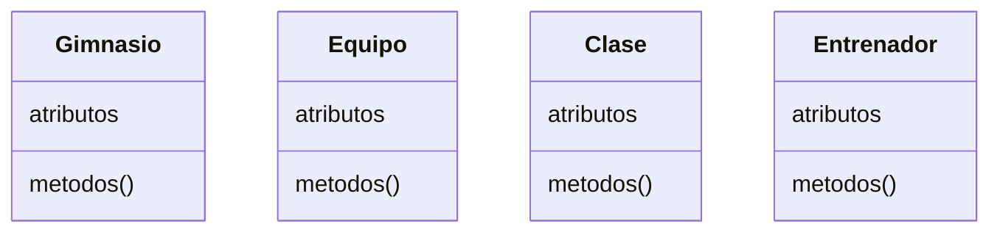
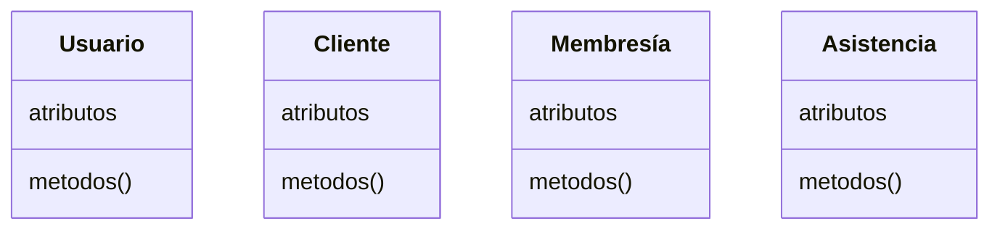
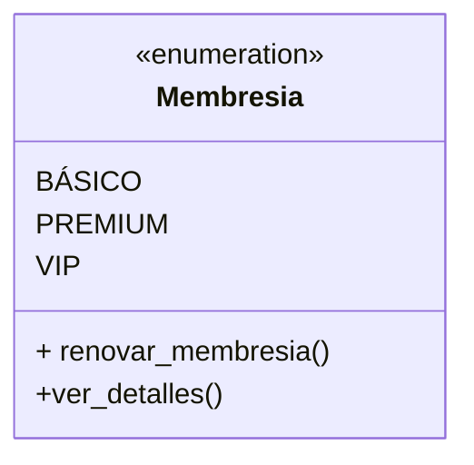
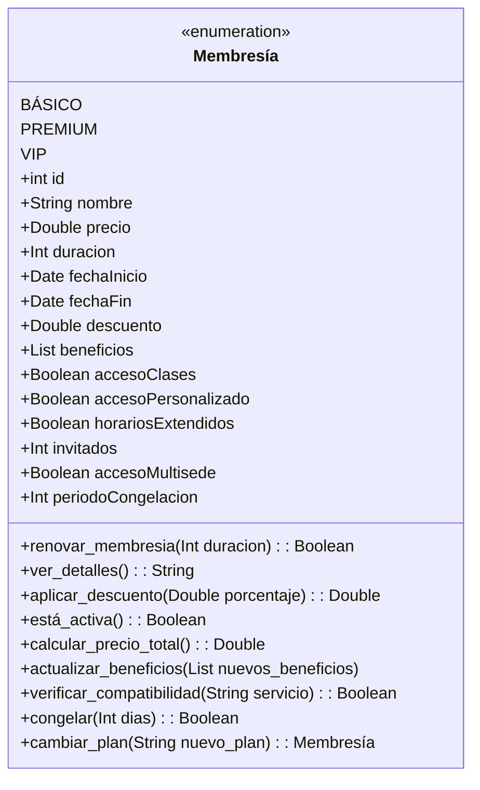
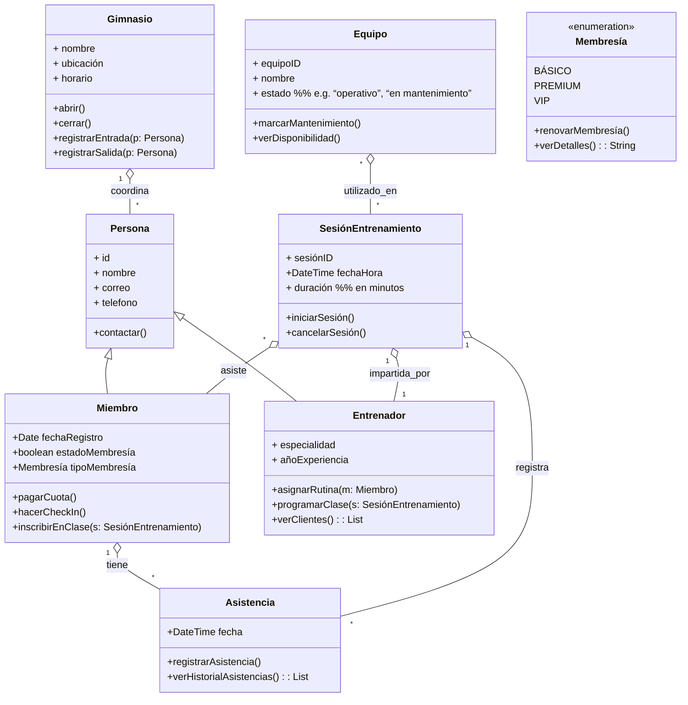

# Actividad 1, Extracción De Clases De Análisis Con Enfoque Orientado a Objetos

## Miguel De Jesus Chavez

### Metodologías, Desarrollo Y Calidad En la Ingeniería De Software

### Bárbaro Jorge Ferrero Castro

#### Mayo 26, 2025

##### Unir – Universidad Internacional De la Rioja

---

> [!missing] indice

---

## Introducción

Este trabajo presentara un análisis orientado a objetos de una aplicación de gestión de gimnasio, describiendo las clases principales del sistema por ejemplo, _Gimnasio_, _Equipo_, _Clase_, _Entrenador_, _Usuario_, _Cliente_, _Membresía_, _Asistencia_ con sus atributos y métodos.

Se identifican las relaciones entre estas clases (asociación, herencia, agregación y composición) y se justifica el uso de cada una conforme a las reglas de UML. Se incluye además varios diagrams de clases UML que sintetiza la estructura que se propone para el sistema. 

Partiendo de las necesidades que nos comparte el cliente y gestionando los casos de usos podemos analizar los siguientes casos de uso que tienen los actores para llevar acabo sus actividades diversas.

1. **Gestion de usuarios y acceso**
	- **Registrar Nuevo usuario**: El sistema debe permitir dar de alta nuevos clientes y personal.
	- **Autentificar usuario**: Control de acceso mediante credenciales.
	- **Gestionar perfiles**: El sistema de permitir la actualización de información tanto metas, como personal. 
2. **Administración de instalaciones**
	- **Abrir/cerrar gimnasio**: Debemos de enter un control de quien se encarga de cerrar y abir el gimnasio
	- **Gestionar Espacios:** Asignación de espacios disponibles con equipos asignados a esa area
	- **monitorear aforo:** Control de Capacidad de personas en instalaciones para el balanceo de entrenadores por horarios de demanda 
3. **Control de equipo** 
	- **Inventariar equipos**: permite que un empleado pueda añadir equipo nuevo.
	- **Programar mantenimiento**: Calendarización de revisiones y reparaciones.
	- **Verificar disponibilidad**: Consulta del estado actual de los equipos.
4. **Programación de actividades** 
	- **Crear Classes Grupales**: Permitir entrenador crear una clase ejemplo de yoga etc.
	- **Inscribirse**: Permite que clientes pueden ingresar a las Classes.
	- **Cancelar / Reprogramar sesiones**: permite que los usuarios cancelen su inscripción a una clase o que entrenador reagende enviando notificación previa.
	- **Notificación de cambios**: Notificar de cancelaciones, o reprogramaciones de clases.
5. **Gestion de membresías**
	- **Suscribir clientes**: Registro de nuevas membresías.
	- **Renovar planes**: Extensión de membresías existentes.
	- **Aplicar promociones**: Gestión de descuentos y ofertas especiales.
	- **Consultar beneficios**: Verificación de servicios incluidos.
6. **Control de asistencia**
	- **Registrar entrada/salida**: Seguimiento de visitas al gimnasio.
	- **Controlar participación en clases**: Registro de asistentes a sesiones grupales.
7. **Entrenamiento personalizado**
	- **Asignar rutinas**: Creación de planes de entrenamiento individuales.
	- **Realizar seguimiento**: Monitoreo del progreso de los clientes.
	- **Programar sesiones personales**: Organización de entrenamientos uno a uno.

## Análisis De Los Flujos Principales E Interacciones

Basado en los casos de usos que se identifican podemos intuir y analizar los siguientes flujos principales sobre las interactions entre los actores y components del sistema:

### 1 . **Gestion De Usuarios Y acceso**

- **Durante el registro de un nuevo usuario**
	 1. Un administrador inicia el proceso de registro en el Sistema
	 2. El sistema solicita datos básicos (nombre, contacto, etc)
	 3. Se selecciona el tipo de usuario (cliente o personal)
	 4. Si es cliente se vincula con una membership
	 5. El sistema valida la information proporcionada
	 6. Se generan credenciales para el ingreso
	 7. El usuario recibe notificación de registro existo con credenciales
- **Interacciones clave:**
	- `Usuario` ↔ `Membresía`: Al registrar un cliente, debe asociarse con un tipo de membresía
	- `Usuario` ↔ `Gimnasio`: Los usuarios registrados pueden acceder a las instalaciones atreves de credenciales

### 2. **Administration De instalaciones**

- **Gestión de espacios:**
	1. El administrador accede al módulo de gestión de espacios
	2. Visualiza la distribución actual de las instalaciones
	3. Asigna equipos específicos a cada área
	4. Configura horarios de disponibilidad de instalaciones
	5. El sistema actualiza la información y la hace visible para los usuarios

**Interacciones clave:**

- `Gimnasio` ↔ `Equipo`: El gimnasio contiene diversos equipos distribuidos en sus espacios
- `Gimnasio` ↔ `Clase`: Las clases se asignan a espacios específicos dentro del gimnasio

### 3. **Control De equipo**

**Programación de mantenimiento:**

1. El administrador identifica equipos que requieren mantenimiento
2. Programa fechas para revisión o reparación
3. El sistema marca el equipo como "En mantenimiento"
4. Se notifica al personal relevante
5. Al completar el servicio, se actualiza el estado del equipo
6. El sistema registra el historial de mantenimiento

**Interacciones clave:**

- `Equipo` ↔ `Clase`: La disponibilidad de equipos afecta la programación de clases
- `Equipo` ↔ `Gimnasio`: El inventario de equipos es parte integral del gimnasio

### 4. **Programación De actividades**

 **Creación de clases grupales:**

1. El entrenador accede al módulo de programación
2. Define el tipo de clase (yoga, spinning, etc.)
3. Establece fecha, hora y duración
4. Asigna un espacio específico
5. Define capacidad máxima
6. El sistema verifica disponibilidad y no conflictos
7. La clase se publica y queda disponible para inscripción

**Interacciones clave:**

- `Clase` ↔ `Entrenador`: Cada clase es impartida por un entrenador específico
- `Clase` ↔ `Cliente`: Los clientes se inscriben en las clases
- `Clase` ↔ `Asistencia`: El sistema registra la asistencia a cada clase

### 5. **Gestión De membresías**

**Flujo principal - Renovación de planes:**

1. El cliente o recepcionista inicia el proceso de renovación
2. El sistema muestra el estado actual y opciones disponibles
3. Se selecciona el nuevo período de vigencia
4. Se aplican promociones si corresponde
5. Se procesa el pago
6. El sistema actualiza la fecha de vencimiento
7. Se notifica la renovación exitosa

**Interacciones clave:**

- `Membresía` ↔ `Cliente`: Cada cliente tiene asociada una membresía con características específicas
- `Membresía` ↔ `Clase`: El tipo de membresía podría determina el acceso a ciertas clases

### 6. **Control De asistencia**

**Registro de entrada/salida:**
1. El cliente se identifica en el punto de acceso (tarjeta, biometría, etc.)
2. El sistema verifica la vigencia de la membresía
3. Se registra la fecha y hora de entrada
4. Al salir, el cliente se identifica nuevamente
5. El sistema registra la hora de salida
6. Se actualiza el historial de asistencia del cliente

**Interacciones clave:**

- `Asistencia` ↔ `Cliente`: Se registra cada visita del cliente
- `Asistencia` ↔ `Clase`: Se controla la participación en actividades específicas
- `Asistencia` ↔ `Gimnasio`: Permite monitorear el aforo en tiempo real

### 7. **Entrenamiento personalizado**

**Flujo principal - Asignación de rutinas:**

1. El entrenador accede al perfil del cliente
2. Evalúa su condición física y objetivos
3. Diseña una rutina personalizada
4. Asigna ejercicios específicos con series y repeticiones
5. Establece progresión esperada
6. El cliente recibe notificación de su nueva rutina
7. El sistema permite seguimiento del cumplimiento

**Interacciones clave:**

- `Entrenador` ↔ `Cliente`: Relación directa para la personalización del entrenamiento
- `Cliente` ↔ `Equipo`: Las rutinas incluyen el uso de equipos específicos

## Clases Del Sistema

A continuación se detallan las clases principales del sistema de gimnasio, indicando para cada una su nombre, propósito, atributos y métodos.

### Gimnasio

- **Gimnasio:** Representa el centro deportivo en sí mismo. _Atributos:_ `nombre: String`, `ubicación: String`, `horario: String`. _Métodos:_ `abrir()`, `cerrar()`, `registrarEntrada(Usuario)`, `registrarSalida(Usuario)`. Esta clase puede considerarse un servicio o entidad global que coordina las operaciones del gimnasio.

### Equipo

- **Equipo:** Representa un equipo o máquina del gimnasio (p. ej. cinta, pesa). _Atributos:_ `equipoID: Int`, `nombre: String`, `estado: String`. _Métodos:_ `marcarMantenimiento()` `agregar_equipo(equipo)` `ver_disponibilidad()`. Los equipos son utilizados en las sesiones, pero en el modelo propuesto existen como entidades propias.

### Clase

- **SesiónEntrenamiento:** Representa una clase o sesión grupal (p. ej. yoga, spinning). _Atributos:_ `sesiónID: Int`, `fechaHora: DateTime`, `duración: Int`. _Métodos:_ `iniciarSesión()`, `cancelarSesión()`. Esta clase se asocia con **Miembro** (asistencia de miembros) y **Entrenador** (conduce la sesión), sin que exista dependencia de vida fuerte entre ellas.

### Usuario

- **Persona:** (Superclase abstracta) Modelo común para individuos en el sistema. _Atributos:_ `id: Int`, `nombre: String`, `correo: String`, `telefono: String`. _Métodos:_ `contactar()`. Se propone para agrupar atributos comunes de **Miembro** y **Entrenador** a través de herencia (generalización)

### Cliente

- **Miembro:** Hereda de _Persona_. Representa a un cliente registrado en el gimnasio. _Atributos:_ `fechaRegistro: Date`, `estadoMembresía: Boolean`, `tipoMembresía: Membresía` (enumeración). _Métodos:_ `pagarCuota()`, `hacerCheckIn()`, `inscribirEnClase(SesiónEntrenamiento)`. Modela las operaciones típicas de un socio del gimnasio.

### Membresía

La clase membresía representa los distintos tipos de planes o niveles de suscripción que puede adquirir el cliente. Se implementa con 3 tipos de membresías para iniciar con una clase de tipo enumeración pero con los dos métodos iniciales de `renovar_membresia()` y `ver_detalles`

- **Tipos de membresías**: 
 	- `BÁSICO`: Acceso a instalaciones básicas y horarios estándar
 	- `PREMIUM`: Acceso completo a instalaciones y classes grupales 
 	- `VIP`: Total acceso, classes ilimitadas, y incluyendo entrenamiento personalizado

- **Metodos**:
	 - `renovar_membresia()` - Extiende la fecha de finalización de la membresía según la duración especificada que esto puede set mensual o annual. Retorna verdadero si la operación fue exitosa.
	 - - `ver_detalles()` - Devuelve una descripción detallada de la membresía, incluyendo beneficios, duración y costo.

Analizando nuestra clase y viendo nuestros metodos y los tipos de datos que necesitanamos nos invita ampliarlo para considerar mayores casos de uso. En este caso donde queremos renovar la membresía tendríamos definir nuevos atributos para contemplar mas datos.

Tal como require el método anterior `ver_detalles` también require de mas information, como los beneficios, la duración y el costo. 

### Entrenador

- **Entrenador:** Hereda de _Persona_. Representa a un instructor o entrenador del gimnasio. _Atributos:_ `especialidad: String`, `añoExperiencia: Int`. _Métodos:_ `asignarRutina(Miembro)`, `programar_clase(clase)` `ver_clientes()`. Un _Entrenador_ puede gestionar sesiones de entrenamiento y asignar rutinas personalizadas.

### Asistencia

- Asistencia:
  - registrar_asistencia(): Registra la asistencia de un cliente a una clase, añadiendo una entrada a la base de datos que vincula el cliente con la clase y la fecha.
  - ver_historial_asistencias(): Permite al cliente ver su historial de asistencias a clases, ayudando a mantener un seguimiento de su participación

## Relaciones Entre Clases

> [!todo] Agregar explicacion de las relaciones entre las clases y como se enlazan

## Diagrama De Clases UML

## Conclusión