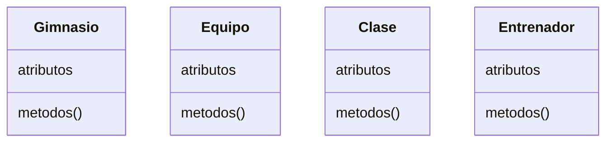
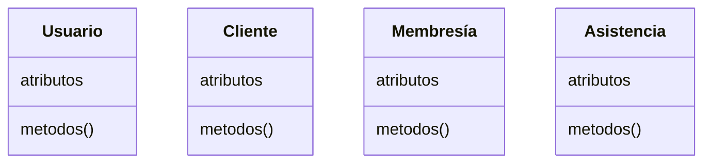
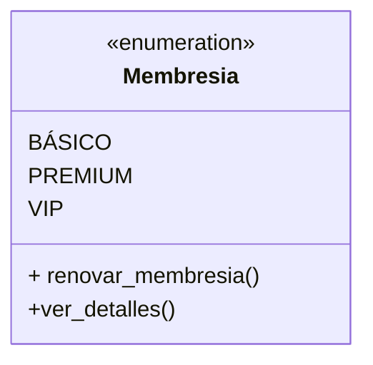
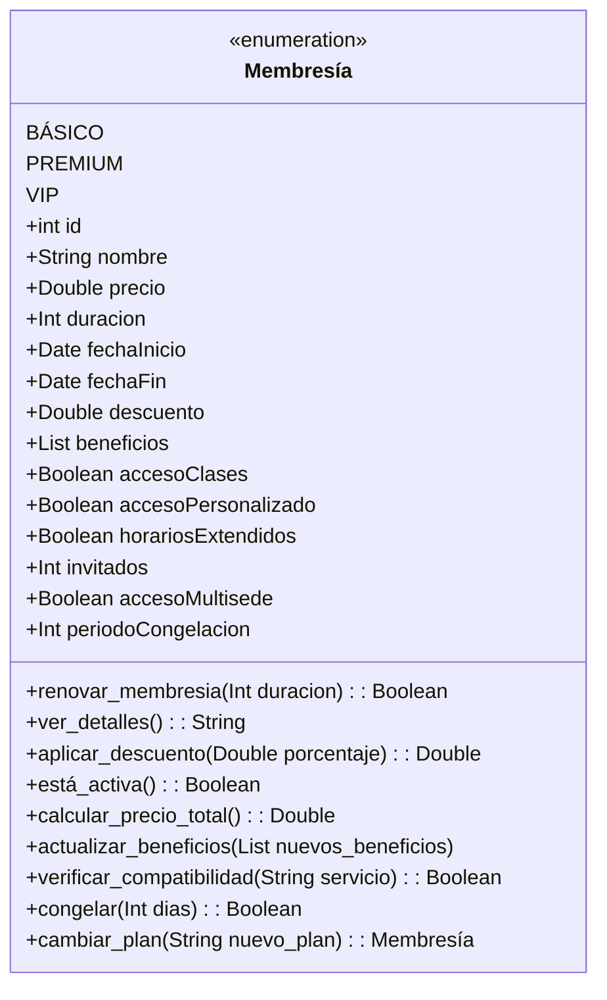
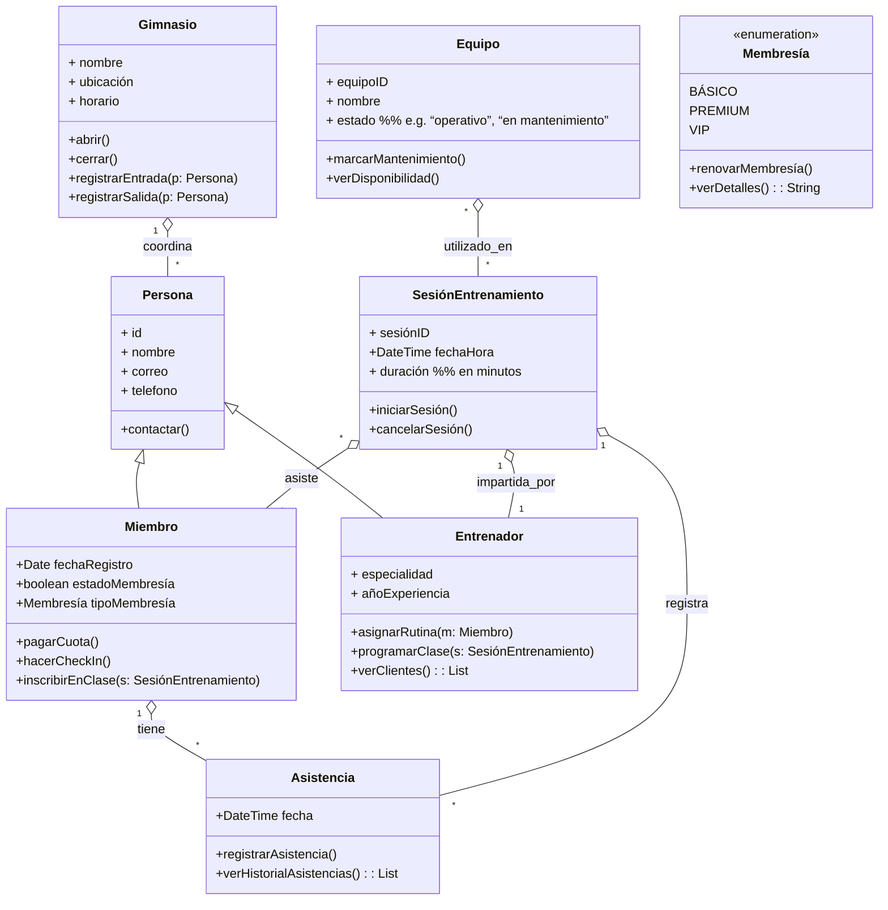

# Análisis Del Sistema Para Una Aplicación De Gimnasio

## Resumen

Este trabajo presentara un análisis orientado a objetos de una aplicación de gestión de gimnasio, describiendo las clases principales del sistema por ejemplo, _Gimnasio_, _Equipo_, _Clase_, _Entrenador_, _Usuario_, _Cliente_, _Membresía_, _Asistencia_ con sus atributos y métodos.

Se identifican las relaciones entre estas clases (asociación, herencia, agregación y composición) y se justifica el uso de cada una conforme a las reglas de UML. Se incluye además varios diagrams de clases UML que sintetiza la estructura que se propone para el sistema.

## Introducción

> [!danger] Escribir un buen introduccion despues

## Clases Del Sistema

A continuación se detallan las clases principales del sistema de gimnasio, indicando para cada una su nombre, propósito, atributos y métodos.

### Gimnasio

- **Gimnasio:** Representa el centro deportivo en sí mismo. _Atributos:_ `nombre: String`, `ubicación: String`, `horario: String`. _Métodos:_ `abrir()`, `cerrar()`, `registrarEntrada(Usuario)`, `registrarSalida(Usuario)`. Esta clase puede considerarse un servicio o entidad global que coordina las operaciones del gimnasio.

### Equipo

- **Equipo:** Representa un equipo o máquina del gimnasio (p. ej. cinta, pesa). _Atributos:_ `equipoID: Int`, `nombre: String`, `estado: String`. _Métodos:_ `marcarMantenimiento()` `agregar_equipo(equipo)` `ver_disponibilidad()`. Los equipos son utilizados en las sesiones, pero en el modelo propuesto existen como entidades propias.

### Clase

- **SesiónEntrenamiento:** Representa una clase o sesión grupal (p. ej. yoga, spinning). _Atributos:_ `sesiónID: Int`, `fechaHora: DateTime`, `duración: Int`. _Métodos:_ `iniciarSesión()`, `cancelarSesión()`. Esta clase se asocia con **Miembro** (asistencia de miembros) y **Entrenador** (conduce la sesión), sin que exista dependencia de vida fuerte entre ellas.

### Usuario

- **Persona:** (Superclase abstracta) Modelo común para individuos en el sistema. _Atributos:_ `id: Int`, `nombre: String`, `correo: String`, `telefono: String`. _Métodos:_ `contactar()`. Se propone para agrupar atributos comunes de **Miembro** y **Entrenador** a través de herencia (generalización)

### Cliente

- **Miembro:** Hereda de _Persona_. Representa a un cliente registrado en el gimnasio. _Atributos:_ `fechaRegistro: Date`, `estadoMembresía: Boolean`, `tipoMembresía: Membresía` (enumeración). _Métodos:_ `pagarCuota()`, `hacerCheckIn()`, `inscribirEnClase(SesiónEntrenamiento)`. Modela las operaciones típicas de un socio del gimnasio.

### Membresía

La clase membresía representa los distintos tipos de planes o niveles de suscripción que puede adquirir el cliente. Se implementa con 3 tipos de membresías para iniciar con una clase de tipo enumeración pero con los dos métodos iniciales de `renovar_membresia()` y `ver_detalles`

- **Tipos de membresías**: 
 	- `BÁSICO`: Acceso a instalaciones básicas y horarios estándar
 	- `PREMIUM`: Acceso completo a instalaciones y classes grupales 
 	- `VIP`: Total acceso, classes ilimitadas, y incluyendo entrenamiento personalizado

- **Metodos**:
	 - `renovar_membresia()` - Extiende la fecha de finalización de la membresía según la duración especificada que esto puede set mensual o annual. Retorna verdadero si la operación fue exitosa.
	 - - `ver_detalles()` - Devuelve una descripción detallada de la membresía, incluyendo beneficios, duración y costo.

Analizando nuestra clase y viendo nuestros metodos y los tipos de datos que necesitanamos nos invita ampliarlo para considerar mayores casos de uso. En este caso donde queremos renovar la membresía tendríamos definir nuevos atributos para contemplar mas datos.

Tal como require el método anterior `ver_detalles` también require de mas information, como los beneficios, la duración y el costo. 

### Entrenador

- **Entrenador:** Hereda de _Persona_. Representa a un instructor o entrenador del gimnasio. _Atributos:_ `especialidad: String`, `añoExperiencia: Int`. _Métodos:_ `asignarRutina(Miembro)`, `programar_clase(clase)` `ver_clientes()`. Un _Entrenador_ puede gestionar sesiones de entrenamiento y asignar rutinas personalizadas.

### Asistencia

- Asistencia:
  - registrar_asistencia(): Registra la asistencia de un cliente a una clase, añadiendo una entrada a la base de datos que vincula el cliente con la clase y la fecha.
  - ver_historial_asistencias(): Permite al cliente ver su historial de asistencias a clases, ayudando a mantener un seguimiento de su participación

## Relaciones Entre Clases

> [!todo] Agregar explicacion de las relaciones entre las clases y como se enlazan

## Diagrama De Clases UML

## Conclusión