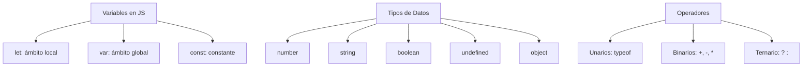

# 📒 Notas De Estudio: Variables Y Operadores En JavaScript

---

## 1. Tipos De Variables Y Modificadores

En JavaScript existen **modificadores de variable** que definen su alcance y comportamiento:

|Modificador|Alcance|Características|
|---|---|---|
|`let`|Local|Variable declarada dentro de un bloque (`{}`), solo accessible en ese ámbito.|
|`var`|Global (o función)|Variable accessible desde cualquier punto del programa si se declara fuera de funciones.|
|`const`|Local (similar a `let`)|Define una constante: su valor no puede reasignarse.|

🔑 **Relevancia**: La elección entre `let`, `var` y `const` es crucial para el manejo de memoria, seguridad y mantenimiento del código.

---

## 2. Tipos De Datos Básicos En JavaScript

JavaScript soporta los mismos tipos que otros lenguajes, pero tiene particularidades:

|Tipo de Dato|Ejemplo|Notas|
|---|---|---|
|`number`|`42`, `-3.14`|Enteros y números con coma flotante.|
|`string`|`"Hola mundo"`|Texto. Se considera **tipo primitivo**, no un objeto.|
|`boolean`|`true`, `false`|Valores lógicos.|
|`undefined`|Variable declarada pero no inicializada.||
|`object`|`{ clave: "valor" }`|Estructuras más complejas.|

📌 **Dato curioso**: A diferencia de otros lenguajes, en JavaScript **`string` es un tipo primitivo**, aunque se comporta como objeto en ciertos contextos.

---

## 3. Definición De Variables

Sintaxis general:

```js
let nombreVariable = valor;
```

Ejemplo:

```js
let saludo = "Hola mundo";
console.log(saludo); // Imprime: Hola mundo
```

📌 No es necesario indicar el tipo de dato, ya que JavaScript es un **lenguaje de tipado dinámico**.

---

## 4. Constantes (`const`)

Se definen igual que una variable, pero no pueden set reasignadas:

```js
const PI = 3.1416;
// PI = 3.15; ❌ Error
```

---

## 5. Variables Globales Con `var`

- Declarar con `var` fuera de funciones → accessible globalmente.
    
- Declarar con `var` dentro de una función → accessible solo dentro de ella.

⚠️ **Advertencia**: Usar `var` puede generar problemas de alcance y sobrescritura accidental.

---

## 6. Operadores En JavaScript

Los operadores en JavaScript se dividen en tres tipos:

|Tipo|Definición|Ejemplo|
|---|---|---|
|**Unarios**|Requieren un operando.|`typeof x`|
|**Binarios**|Operan con dos valores.|`a + b`, `x - y`|
|**Ternarios**|Expresiones condicionales.|`cond ? valor1 : valor2`|

### `typeof` (Operador Unario)

Sirve para conocer el tipo de dato de una variable en **tiempo de ejecución**:

```js
let edad = 25;
console.log(typeof edad); // "number"
```

---

## 7. Ejemplo De Uso Completo

```js
let nombre = "Laura";          // String
const edad = 30;               // Número constante
var esEstudiante = true;       // Boolean global

console.log(nombre);           // "Laura"
console.log(typeof edad);      // "number"
console.log(esEstudiante);     // true

// Operador ternario
let mensaje = esEstudiante ? "Es estudiante" : "No es estudiante";
console.log(mensaje);          // "Es estudiante"
```

---

## 8. Diagrama De Relaciones (MermaidJS)



---

## 📌 Resumen De Puntos Clave

- `let`, `var` y `const` determinan el alcance y mutabilidad de variables.
    
- Tipos primitivos: `number`, `string`, `boolean`, `undefined`.
    
- `string` es tipo básico en JavaScript (no objeto).
    
- Lenguaje de **tipado dinámico**: no se declara el tipo.
    
- `typeof` permite verificar tipos en tiempo de ejecución.
    
- Operadores: unarios, binarios y ternarios.

---

## ✍️ MicroTest

1. El operador typeof en JavaScript.
	Permite averiguar el tipo de una variable.
2. En JavaScript existen operadores:
	1. Unarios, binarios y ternarios.
3. Declarar una variable con la palabra reservada let implica:
	1. Las respuestas A) y B) son correctas.