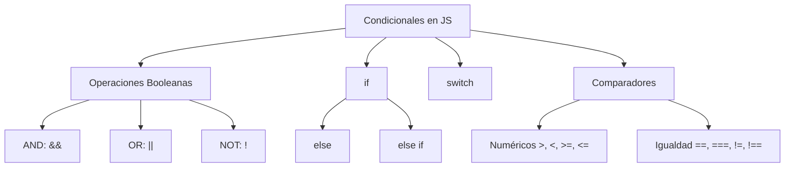

# 📒 Notas De Estudio: Estructuras Condicionales En JavaScript

---

## 1. Operaciones Booleanas

### Definición

Las **operaciones booleanas** trabajan con valores lógicos (`true` o `false`). Son la base para crear estructuras condicionales en programación.

### Operadores Principales

| Operador    | Significado                                               | Ejemplo         | Resultado                                  |
| ----------- | --------------------------------------------------------- | --------------- | ------------------------------------------ |
| `&&` (AND)  | Verdadero solo si **ambos operandos** son verdaderos      | `true && false` | `false`                                    |
| `\|\|` (OR) | Verdadero si **al menos uno** es verdadero                | `               | Verdadero si **al menos uno** es verdadero |
| `!` (NOT)   | Niega el valor (convierte `true` en `false` y vice-versa) | `!true`         | `false`                                    |

---

## 2. Estructura Condicional `if`

### Definición

La cláusula `if` permite ejecutar un bloque de código **solo si una condición se cumple**.

### Sintaxis

```js
if (condición) {
  // Código que se ejecuta si la condición es true
}
```

📌 La **condición** debe devolver un valor booleano (`true` o `false`).

---

## 3. Clausula `else`

### Definición

Se ejecuta **cuando la condición del `if` es falsa**.

### Ejemplo

```js
let edad = 17;

if (edad >= 18) {
  console.log("Eres mayor de edad");
} else {
  console.log("Eres menor de edad");
}
```

---

## 4. Clausula `else if`

### Definición

Permite **evaluar múltiples condiciones** de forma sequential.

### Ejemplo

```js
let nota = 85;

if (nota >= 90) {
  console.log("Excelente");
} else if (nota >= 70) {
  console.log("Aprobado");
} else {
  console.log("Reprobado");
}
```

---

## 5. Estructura `switch`

### Definición

Se utilize cuando hay que **comparar una misma variable contra múltiples valores posibles**.

### Sintaxis

```js
let color = "verde";

switch (color) {
  case "rojo":
    console.log("Alto");
    break;
  case "verde":
    console.log("Siga");
    break;
  default:
    console.log("Color no reconocido");
}
```

📌 `default` es opcional y se ejecuta si ningún `case` coincide.

---

## 6. Comparadores En JavaScript

### Comparadores Numéricos

|Operador|Ejemplo|Significado|
|---|---|---|
|`>`|`a > b`|Mayor que|
|`<`|`a < b`|Menor que|
|`>=`|`a >= b`|Mayor o igual|
|`<=`|`a <= b`|Menor o igual|
|`!=`|`a != b`|Distinto|

### Comparadores De Igualdad

|Operador|Ejemplo|Evaluación|
|---|---|---|
|`==`|`"2" == 2`|`true` → compara **solo valor**|
|`===`|`"2" === 2`|`false` → compara **valor y tipo**|
|`!=`|`"2" != 2`|`false` → compara solo valor|
|`!==`|`"2" !== 2`|`true` → compara valor y tipo|

📌 Usar `===` y `!==` es la **práctica recomendada**, ya que evita errores por conversión implícita de tipos.

---

## 7. Buenas Prácticas

- Mantener las condiciones **lo más simples possible** dentro de los `if`.
    
- Preferir `===` sobre `==` para mayor precisión.
    
- Usar `switch` cuando haya muchas condiciones sobre **una sola variable**.
    
- Recordar que `else` siempre va ligado a un `if`, pero un `if` puede existir solo.

---

## 8. Diagrama De Relaciones (MermaidJS)



---

## 📌 Resumen De Puntos Clave

- Las operaciones booleanas (`&&`, `||`, `!`) permiten crear condiciones lógicas.
    
- `if` ejecuta código si la condición es `true`.
    
- `else` se ejecuta si la condición es `false`.
    
- `else if` permite múltiples condiciones.
    
- `switch` evalúa una variable contra varios valores.
    
- `===` compara **tipo y valor**, mientras que `==` solo compara el valor.

---

## ✍️ MicroTest

1. ¿Qué tipo de resultado debe devolver una sentencia que se encuentre dentro de una cláusula if()?
    
    - **La respuesta:** b. Booleano.
        
    - **Justificación:** La condición dentro de un `if()` en JavaScript debe evaluarse a un valor lógico (`true` o `false`). Aunque se pueden usar expresiones de otro tipo, siempre se convierten implícitamente a un booleano.

---

1. Una cláusula if-else puede set sustituida por:
    
    - **La respuesta:** d. El operador ternario expresión ? opción A : opción B.
        
    - **Justificación:** El operador **ternario** permite evaluar una condición y devolver un valor u otro según sea `true` o `false`, funcionando como una versión compacta de `if-else`.

---

1. Si dentro de una cláusula if-else necesitamos más de dos escenarios o preguntas, podemos hacer uso de:
    
    - **La respuesta:** c. Else If.
        
    - **Justificación:** En JavaScript se utilize `else if` para encadenar múltiples condiciones, permitiendo evaluar más de dos casos posibles dentro de una misma estructura condicional.