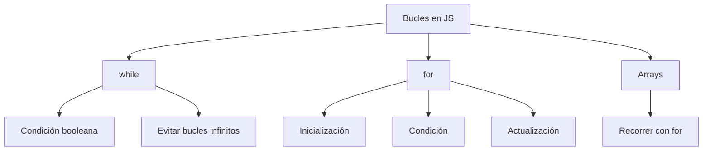

# 📒 Notas de Estudio: Bucles en JavaScript

---

## 1. Concepto de Bucle

Un **bucle** es una estructura de control que permite repetir la ejecución de un bloque de código mientras se cumpla una condición lógica.  
En JavaScript los principales bucles son:

- `while`
    
- `for`
    

---

## 2. Bucle `while`

### Definición

Ejecuta un bloque de código **mientras una condición booleana sea verdadera**.

### Sintaxis

```js
while (condición) {
  // Código a ejecutar en cada iteración
}
```

### Ejemplo explicado paso a paso

```js
let valor = 1;
let iteraciones = 0;

while (valor < 100) {
  console.log(valor);   // Mostrar valor actual
  valor *= 2;           // Multiplicar por 2 en cada iteración
  iteraciones++;        // Contar iteraciones
}

console.log("Total de iteraciones:", iteraciones);
```

📌 **Resultado:**

- Valores mostrados: `1, 2, 4, 8, 16, 32, 64`
    
- Iteraciones totales: `7`
    

⚠️ Importante: siempre modificar la condición dentro del bucle para evitar **bucles infinitos**.

---

## 3. Bucle `for`

### Definición

Se usa principalmente para recorrer estructuras de datos como arrays.

### Sintaxis

```js
for (inicialización; condición; actualización) {
  // Código a ejecutar
}
```

### Ejemplo explicado paso a paso

```js
let numeros = [1, 2, 3, 4, 5];

for (let indice = 0; indice < numeros.length; indice++) {
  numeros[indice] *= 2;   // Multiplicar cada elemento por 2
}

console.log(numeros);
```

📌 **Resultado:** `[2, 4, 6, 8, 10]`

### Partes del `for`

1. **Inicialización:** `let indice = 0;`
    
2. **Condición:** `indice < numeros.length;`
    
3. **Actualización:** `indice++`
    

---

## 4. Arrays en JavaScript

### Definición

Un **array** es una estructura de datos con tamaño definido que almacena elementos (del mismo o distinto tipo).

Ejemplo:

```js
let array = [1, "texto", true];
```

---

## 5. Buenas Prácticas con Bucles

- **Evitar** usar `break` o `return` para salir de bucles.
    
- Controlar las condiciones lógicas de iteración para detenerlos de manera natural.
    
- Mantener las condiciones claras y comprensibles para mejorar la legibilidad.
    
- Usar `for` cuando se conozca el número de iteraciones.
    
- Usar `while` cuando no se sepa de antemano cuántas veces se repetirá.
    

---

## 6. Relación de Conceptos (MermaidJS)



---

## 📌 Resumen de Puntos Clave

- Un **bucle** permite repetir código mientras una condición sea verdadera.
    
- `while`: se ejecuta mientras la condición sea `true`.
    
- `for`: ideal para recorrer arrays y estructuras con tamaño conocido.
    
- Arrays en JavaScript pueden almacenar datos heterogéneos.
    
- **Evitar `break` y `return`** para salir de bucles; en su lugar, modificar las condiciones de iteración.
    

---

## ✍️ MicroTest


1. Para finalizar un bucle while dentro del cuerpo del bucle es necesario:
    
    - **La respuesta:** a. Realizar alguna operación que, eventualmente, haga que la condición de ejecución del bucle se haga falsa.
        
    - **Justificación:** El bucle `while` sigue ejecutándose mientras la condición sea verdadera. Para que termine, es necesario que dentro de su cuerpo ocurra alguna acción que cambie el estado de esa condición a falsa, de lo contrario se generará un bucle infinito.
        

---

2. La diferencia entre el bucle while y el bucle do-while es:
    
    - **La respuesta:** d. El bucle do-while se ejecutará al menos una vez.
        
    - **Justificación:** En `while`, la condición se evalúa antes de la primera iteración, por lo que podría no ejecutarse nunca si la condición inicial es falsa. En `do-while`, la condición se evalúa después de ejecutar el cuerpo, garantizando que al menos una iteración se realice.
        

---

3. La condición de un bucle for:
    
    - **La respuesta:** D. Las respuestas B) y C) son correctas.
        
    - **Justificación:** La estructura de un `for` es `for (inicialización; condición; avance)`. Primero se ejecuta la inicialización, luego se evalúa la condición, y si es verdadera se ejecuta el cuerpo. Después de cada iteración se ejecuta la sección de avance y vuelve a evaluarse la condición. Por lo tanto, la condición se revisa en ese punto específico, no necesariamente debe ser siempre verdadera.