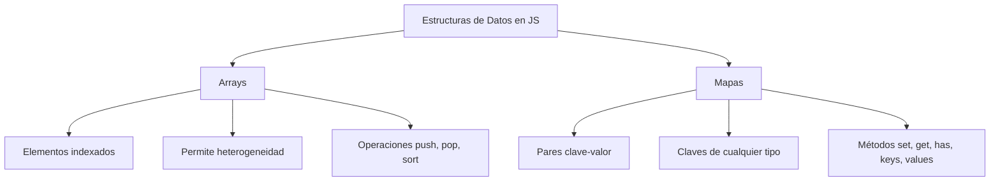

# Notas De Estudio – **Estructuras De Datos En JavaScript**

---

## 1. Arrays En JavaScript

### Definición

- Un **array** es una colección de elementos **indexados** que se almacenan en memoria de forma contigua.
    
- En muchos lenguajes los arrays tienen tamaño fijo, pero en JavaScript los arrays son más flexibles y pueden cambiar de tamaño dinámicamente.

### Creación

- **Array vacío**:

    ```js
    let arr = [];
    ```

- **Array con elementos iniciales**:

    ```js
    let vehiculos = ["coche", "moto", "furgoneta"];
    let numeros = [1, 2, 3];
    let mixto = ["hola", 42, true];
    ```

> 🔎 En JavaScript se permite mezclar distintos tipos de datos en un mismo array (heterogeneidad). Aunque es válido, puede complicar el manejo del array.

---

### Acceso a Elementos

- Se usa **notación de corchetes**:

    ```js
    console.log(vehiculos[0]); // "coche"
    console.log(vehiculos[1]); // "moto"
    console.log(vehiculos[2]); // "furgoneta"
    ```

- Los índices empiezan en **0**.
    
- Si se intenta acceder a un índice inexistente → `undefined`.

    ```js
    console.log(vehiculos[3]); // undefined
    ```

---

### Propiedad `length`

- Devuelve el **número de elementos** de un array.

    ```js
    console.log(vehiculos.length); // 3
    ```

- Permite acceder al último elemento:

    ```js
    console.log(vehiculos[vehiculos.length - 1]); // "furgoneta"
    ```

---

### Métodos Principales

|Método|Función|
|---|---|
|`push()`|Agrega un elemento al final|
|`pop()`|Elimina el último elemento|
|`sort()`|Ordena los elementos (alfabéticamente por defecto)|

Ejemplo:

```js
let numeros = [3, 1, 2];
numeros.sort(); // [1, 2, 3]
```

---

### Matrices (Arrays multidimensionales)

- Una **matriz** es un array cuyos elementos son arrays.

    ```js
    let matriz = [
      [1, 2, 3],
      [4, 5, 6],
      [7, 8, 9]
    ];
    ```

- Acceso a un valor:

    ```js
    console.log(matriz[0][0]); // 1
    console.log(matriz[2][1]); // 8
    ```

- Recorrido con bucles **for anidados**:

    ```js
    for (let i = 0; i < matriz.length; i++) {
      for (let j = 0; j < matriz[i].length; j++) {
        console.log(matriz[i][j]);
      }
    }
    ```

---

## 2. Mapas En JavaScript

### Definición

- Un **Map** es una colección de pares **clave → valor**.
    
- A diferencia de los objetos:
    
    - Las claves pueden set de **cualquier tipo** (strings, números, objetos, etc.).
        
    - Mantiene el **orden de inserción**.

### Creación

```js
let mapa = new Map();
```

### Métodos Principales

|Método|Función|
|---|---|
|`set(clave, valor)`|Inserta un nuevo par|
|`get(clave)`|Obtiene el valor asociado a una clave|
|`has(clave)`|Devuelve `true` si existe la clave|
|`keys()`|Devuelve todas las claves|
|`values()`|Devuelve todos los valores|

Ejemplo:

```js
let mapa = new Map();
mapa.set(1, "uno");
mapa.set("saludo", "hola");
mapa.set("precio", 13);

console.log(mapa.get("saludo")); // "hola"
console.log(mapa.has("precio")); // true
console.log([...mapa.keys()]);   // [1, "saludo", "precio"]
console.log([...mapa.values()]); // ["uno", "hola", 13]
```

---

## 3. Comparación Arrays Vs Mapas



---

## Resumen De Puntos Clave

- **Arrays**: listas indexadas, permiten mezcla de tipos, usan índices desde `0`, soportan operaciones como `push`, `pop`, `sort`.
    
- **Matrices**: arrays bidimensionales, requieren bucles anidados para recorrerlos.
    
- **Mapas**: colecciones clave-valor, claves y valores pueden set heterogéneos, métodos útiles (`set`, `get`, `has`, `keys`, `values`).
    
- JavaScript es más flexible que otros lenguajes al permitir **heterogeneidad de tipos** en arrays y mapas.

---

## MicroTest

1. Un array…
    
    - **La respuesta:** b. Es un conjunto de valores indexado cuyos elementos se almacenan de forma contigua en memoria.
        
    - **Justificación:** Los arrays son colecciones **indexadas** (cada elemento tiene un índice que empieza en 0). Aunque suelen estar almacenados de forma contigua en memoria, en JavaScript no necesariamente están estrictamente ordenados en memoria como en lenguajes de bajo nivel. La opción (a) es incorrecta porque añade "ordenados", lo cual no siempre es cierto (los arrays no ordenan automáticamente sus elementos).

---

1. El array `const gurus = ["Jobs", "Ellison"]`:
    
    - **La respuesta:** a. Tiene tamaño 2.
        
    - **Justificación:** El array contiene **dos elementos** (`"Jobs"` y `"Ellison"`). El tamaño o longitud de un array en JavaScript se obtiene con `.length`, en este caso `gurus.length` devuelve `2`.

---

1. Si intentamos acceder a la posición 3 del array `const numbers = [1,2,3]` obtendremos:
    
    - **La respuesta:** c. Undefined.
        
    - **Justificación:** Los índices válidos son `0, 1, 2`. Al intentar acceder a `numbers[3]`, que no existe, no se lanza una excepción, sino que devuelve `undefined`, que es el valor por defecto cuando una propiedad/índice no existe en JavaScript.