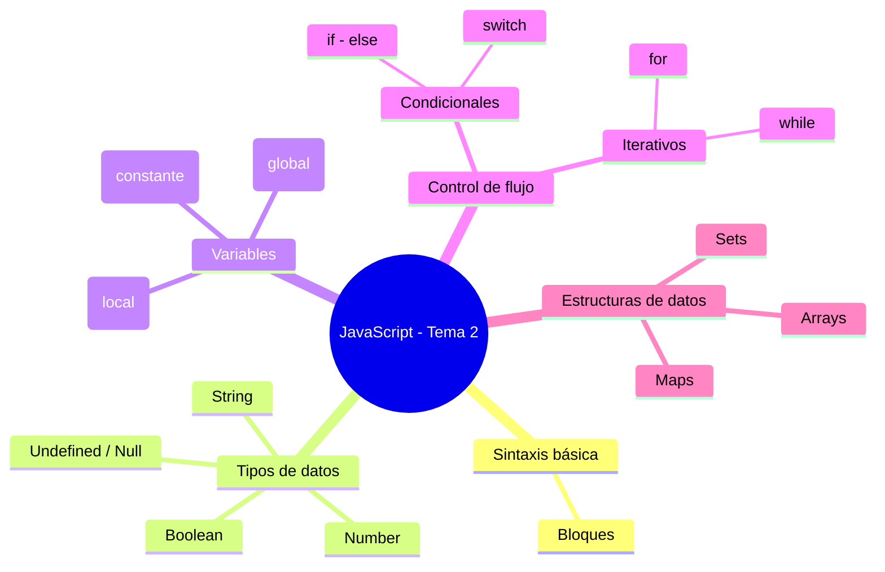

# 📘 Notas de Estudio – Resumen Tema 2: Introducción a JavaScript

## 1. Introducción a JavaScript

- Lenguaje de programación utilizado principalmente en el **lado del cliente (frontend)**.
    
- Permite manipular el DOM, gestionar eventos y crear aplicaciones interactivas.
    

---

## 2. Sintaxis básica

- Conjunto de reglas para escribir código válido.
    
- Incluye **bloques**, delimitados normalmente por llaves `{ }`.
    

---

## 3. Tipos de datos básicos

- **Number** → valores numéricos (enteros y decimales).
    
- **String** → cadenas de texto.
    
- **Boolean** → valores lógicos (`true` o `false`).
    
- **Undefined / Null** → ausencia de valor o valor no definido.
    

---

## 4. Variables y ámbitos

- **`let`** → declara variables con **ámbito local**.
    
- **`const`** → declara **constantes**, no reasignables.
    
- **`var`** → declara variables con **ámbito global o de función** (se desaconseja su uso moderno).
    

📌 Importancia: el **ámbito** define dónde puede usarse una variable dentro del programa.

---

## 5. Control de flujo

### Sentencias condicionales

- **if – else**: ejecutan código si una condición se cumple o no.
    
- **switch**: alternativa para múltiples condiciones basadas en un valor.
    

### Sentencias iterativas (bucles)

- **while**: repite mientras la condición sea `true`.
    
- **for**: ideal para recorrer estructuras como arrays, con control de inicio, condición y actualización.
    

---

## 6. Estructuras de datos

- **Arrays**: listas indexadas de elementos.
    
- **Sets (conjuntos)**: colecciones de valores **únicos**, sin duplicados.
    
- **Maps (mapas)**: colecciones de pares **clave–valor**, permiten claves y valores heterogéneos.
    

---

## 7. Resumen gráfico

---

## 🔑 Puntos clave para repaso rápido

- JavaScript se ejecuta en el **frontend** y controla la interacción con el usuario.
    
- Variables: `let` (local), `const` (constante), `var` (global, poco usado).
    
- Control de flujo: `if-else`, `switch`, bucles `while` y `for`.
    
- Estructuras de datos más comunes: **arrays, sets y maps**.
    

---

