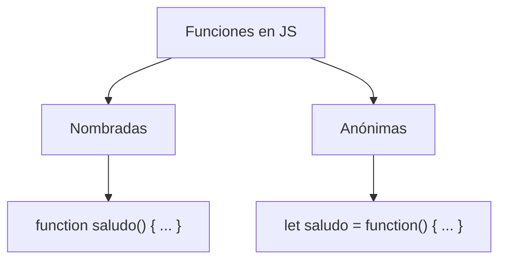

# 📘 Notas De Estudio – Funciones En JavaScript

---

## 🔹 Introducción a Las Funciones

- **Definición:** Una función es un bloque de código reutilizable que puede ejecutarse múltiples veces cuando es invocado.
    
- **Objetivo:** Agrupar instrucciones bajo un nombre para facilitar su reutilización.

### Sintaxis Básica

```js
function nombreFuncion(argumentos) {
   // cuerpo de la función
}
```

- **Palabra clave:** `function`
    
- **Nombre de la función:** Identificador con el que se invoca.
    
- **Paréntesis ():** Pueden container **argumentos** o estar vacíos.
    
- **Cuerpo de la función {}:** Instrucciones que se ejecutan al llamarla.

📌 **Nota:** Aunque la función no reciba argumentos, los paréntesis **siempre deben colocarse** al invocar la función.

---

## 🔹 Funciones Nombradas

- **Definición:** Funciones con un identificador único.
    
- **Ejemplo:**

```js
function saludoNombrado() {
   console.log("Hola, soy una función nombrada");
}

saludoNombrado(); // Ejecución
```

📌 Se invocan directamente con su nombre seguido de `()`.

---

## 🔹 Funciones Anónimas

- **Definición:** Funciones sin nombre que se asignan a una variable.
    
- **Características:**
    
    - En JavaScript, las funciones son **objetos** → pueden almacenarse en variables.
        
    - El nombre de la variable es lo que referencia a la función.
        
- **Ejemplo:**

```js
let saludoAnonimo = function() {
   console.log("Hola, soy una función anónima");
};

saludoAnonimo(); // Ejecución
```

📌 Aunque se usa una variable `let`, al colocar `()` se ejecuta la función asignada.

---

## 🔹 Comparación

|Tipo de función|Tiene nombre propio|Se asigna a variable|Se invoca con|
|---|---|---|---|
|Nombrada|✅ Sí|Opcional|`nombreFuncion()`|
|Anónima|❌ No|✅ Sí|`variable()`|

---

## 🔹 Visualización Con MermaidJs



---

## 🔹 Ejecución De Ejemplo

1. Declaración de función nombrada:

    ```js
    function saludoNombrado() {
       console.log("Hola, soy una función nombrada");
    }
    ```

2. Declaración de función anónima:

    ```js
    let saludoAnonimo = function() {
       console.log("Hola, soy una función anónima");
    };
    ```

3. Ejecución:
    
    - `saludoNombrado();` → imprime _Hola, soy una función nombrada_
        
    - `saludoAnonimo();` → imprime _Hola, soy una función anónima_

---

## ✅ Resumen De Puntos Clave

- Las funciones permiten reutilizar código.
    
- En JavaScript se definen con la palabra clave `function`.
    
- Existen funciones **nombradas** y **anónimas**.
    
- Todas se ejecutan invocándolas con `()`.
    
- Las funciones son **objetos**, lo que permite asignarlas a variables.

---

## ✍️ MicroTest

1. Las funciones en JavaScript pueden set:
    
    - La respuesta: a. Anónimas o nombradas.
        
    - Justificación: En JavaScript existen funciones con nombre (nombradas) y funciones sin nombre que se asignan a variables (anónimas). Ambas se pueden ejecutar como bloques de código reutilizables.
        
2. Para invocar una función necesitamos:
    
    - La respuesta: a. Indicar el nombre de la función seguido de paréntesis, tenga la función argumentos o no.
        
    - Justificación: Los paréntesis `()` son obligatorios al invocar una función, incluso si no recibe argumentos, ya que indican que se desea ejecutar la función.
        
3. La sentencia const hola = saluda():
    
    - La respuesta: b. Asigna a la constante hola el valor devuelto por la función hola.
        
    - Justificación: Al poner paréntesis `()`, se ejecuta la función `saluda` y se asigna su **resultado** a la constante `hola`, no la referencia a la función.