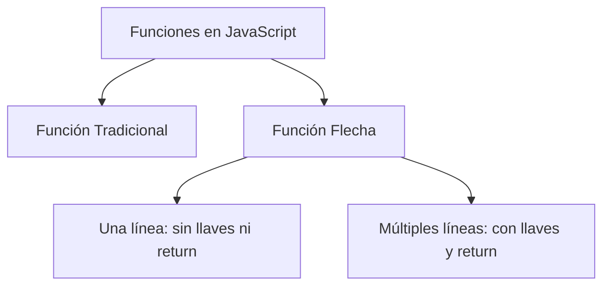

# Notas De Estudio: Funciones Flecha En JavaScript

---

## 1. Definición De Funciones Flecha

Las **funciones flecha** (también llamadas **funciones lambda**) son una **notación concisa para definir funciones en JavaScript**.

- Permiten **escribir funciones de manera más corta** sin necesidad de usar la palabra reservada `function`.
    
- Se identifican por el operador `=>` (igual seguido de mayor que).
    
- Son **funciones normals**: se pueden usar como cualquier otra función, asignarlas a variables y pasar argumentos.

**Sintaxis básica:**

```javascript
const nombreFuncion = (parametros) => expresion;
```

- Si la función tiene **una sola sentencia**, no se requieren **llaves `{}`** ni `return`.
    
- Si la función tiene **múltiples sentencias**, se deben usar **llaves** y `return` para devolver un valor.

---

## 2. Ejemplo 1: Función Flecha De Una Sola Línea

```javascript
const cuadrado = x => x * x;
console.log(cuadrado(5)); // 25
```

**Explicación paso a paso:**

1. Se define la función `cuadrado` que toma un argumento `x`.
    
2. El cuerpo de la función es `x * x`.
    
3. Como es una sola línea, **no se usan llaves ni `return`**.
    
4. Al llamar `cuadrado(5)`, devuelve 25.

---

## 3. Ejemplo 2: Función Flecha Con Múltiples Líneas

```javascript
const describir = (nombre, edad) => {
    const mensaje = `Mi nombre es ${nombre} y tengo ${edad} años`;
    return mensaje;
};

console.log(describir("Alis", 30)); 
// "Mi nombre es Alis y tengo 30 años"
```

**Explicación paso a paso:**

1. La función `describir` recibe dos argumentos: `nombre` y `edad`.
    
2. Dentro del cuerpo se declara una variable `mensaje` que contiene un string con interpolación.
    
3. Se utilize `return` para devolver el mensaje.
    
4. Al invocar `describir("Alis", 30)`, se obtiene el string completo.

---

## 4. Características Importantes

|Característica|Descripción|
|---|---|
|Sintaxis corta|Menos verbosa que `function` tradicional|
|Identificación|Se reconoce por `=>`|
|Funciones normals|Funcionan igual que las funciones tradicionales|
|Anónimas|Son anónimas si no se les asigna un nombre directo|
|Una sola línea|No require `{}` ni `return`|
|Múltiples líneas|Require `{}` y `return`|

---

## 5. Comparación Visual: Función Tradicional Vs Flecha

```javascript
// Tradicional
function cuadrado(x) {
    return x * x;
}

// Flecha
const cuadrado = x => x * x;
```

**MermaidJS: Relaciones de Funciones Flecha**



---

## 6. Ventajas De Las Funciones Flecha

- Código más **conciso y legible**.
    
- Fácil de **asignar a variables**.
    
- Útiles para funciones **anónimas** y **callbacks**.

---

## Resumen De Puntos Clave

- Las funciones flecha son una **notación más corta** para escribir funciones.
    
- Se reconocen por `=>`.
    
- Función de **una sola línea**: no require `{}` ni `return`.
    
- Función de **múltiples líneas**: necesita `{}` y `return`.
    
- Se pueden asignar a variables y **son anónimas por naturaleza**.
    
- Comportamiento **idéntico** al de funciones tradicionales si el cuerpo de la función es el mismo.

---

## MicroTest

1. Acerca de las funciones flecha:
    
    - La respuesta: b. Su comportamiento no es diferente al de una función normal. Son lo mismo.
        
    - Justificación: Las funciones flecha son simplemente una **notación más concisa** para definir funciones. Su ejecución y comportamiento es equivalente al de las funciones tradicionales si el cuerpo de la función es el mismo.
        
2. El operador que nos indica que una función es una función flecha es:
    
    - La respuesta: d. =>
        
    - Justificación: El símbolo `=>` identifica a las funciones flecha en JavaScript, reemplazando la palabra reservada `function` en la sintaxis tradicional.
        
3. Si la función flecha tiene una única línea de código:
    
    - La respuesta: c. Las opciones A) y B) son correctas.
        
    - Justificación: Cuando la función flecha tiene **una sola sentencia**, **no es necesario usar corchetes `{}`** ni la cláusula `return`, ya que el valor de la expresión se devuelve automáticamente.