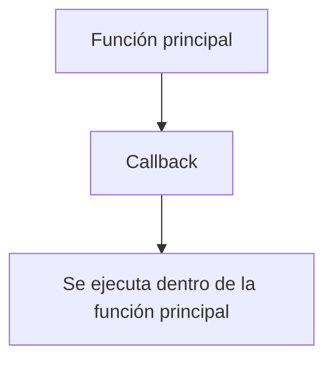

# Notas De Estudio: Callbacks En JavaScript

## 1. Introducción a Los Callbacks

- **Definición**: Un **callback** es una función que se pasa como argumento a otra función y que se ejecuta en un memento determinado dentro de la función que la recibe.
    
- **Contexto**: Los callbacks son fundamentales en la **programación orientada a eventos** y permiten manejar código que se ejecuta de forma asíncrona o en respuesta a ciertas acciones.
    
- **Concepto clave**: En JavaScript, las **funciones son objetos**, por lo que pueden set tratadas como variables, asignadas a otras variables o pasadas como argumentos a otras funciones.



## 2. Sintaxis Y Funcionamiento

- **Declaración de un callback**: Se define como un parámetro dentro de la función principal.

```javascript
function procesar(entrada, callback) {
    console.log("Procesando entrada:", entrada);
    callback(entrada); // Se ejecuta el callback con el argumento recibido
}
```

- **Explicación paso a paso**:
    
    1. La función `procesar` recibe dos argumentos: `entrada` (por ejemplo, un string) y `callback` (una función).
        
    2. Se muestra la entrada por pantalla.
        
    3. Se ejecuta la función `callback` pasando como argumento el valor de `entrada`.
        
- **Llamada a la función con callback**:

```javascript
procesar("datos", function(resultado) {
    console.log("Callback ejecutado con", resultado);
});
```

- **Paso a paso de la ejecución**:
    
    1. Se llama a `procesar` con `"datos"` como entrada.
        
    2. La función anónima pasada como callback se ejecuta dentro de `procesar`.
        
    3. En la consola se muestra:

        ```Python
        Procesando entrada: datos
        Callback ejecutado con datos
        ```

## 3. Tipos De Funciones Que Pueden Set Callbacks

- **Funciones anónimas**: Se definen directamente dentro de la llamada.
    
- **Funciones nombradas**: Se pueden definir antes y pasar su referencia como argumento.
    
- **Variables que contienen funciones**: Se pueden asignar a una variable y luego pasar dicha variable como callback.

```javascript
let miCallback = function(resultado) {
    console.log("Ejecutando callback con", resultado);
};

procesar("info", miCallback);
```

## 4. Ventajas De Usar Callbacks

- Permiten **modularizar el código** y separar la lógica de ejecución principal de la lógica de respuesta.
    
- Facilitan la **programación asíncrona**, como el manejo de eventos, timers o peticiones a servidores.
    
- Permiten **reutilizar funciones** en diferentes contextos.

## 5. Buenas Prácticas

- Siempre verificar que el argumento recibido es realmente una función antes de ejecutarlo.
    
- Evitar callbacks excesivamente anidados para mantener el código legible (lo que se conoce como **callback hell**).

```javascript
if (typeof callback === "function") {
    callback(entrada);
}
```

---

## Resumen De Puntos Clave

- Un **callback** es una función pasada como argumento y ejecutada dentro de otra función.
    
- JavaScript permite usar **funciones anónimas, nombradas o variables que contienen funciones** como callbacks.
    
- Los callbacks son esenciales en **programación orientada a eventos** y para manejar **operaciones asíncronas**.
    
- Se debe tener cuidado con la legibilidad del código al anidar múltiples callbacks.

---

## MicroTest

1. Una función de retrollamada o más comúnmente conocida como callback es:
    
    - **La respuesta:** b. Una función que se pasa como argumento a otra función.
        
    - **Justificación:** Un callback se define como una función que se envía como parámetro a otra función y que será ejecutada dentro de ella en un memento específico.
        
2. En JavaScript una función es también un objeto porque:
    
    - **La respuesta:** d. Todas las respuestas son correctas.
        
    - **Justificación:** Las funciones en JavaScript son objetos de primera clase, lo que significa que tienen atributos, pueden pasarse como argumentos y poseen un constructor.
        
3. Para pasar como argumento una función es necesario hacerlo:
    
    - **La respuesta:** a. Indicando su nombre, sin paréntesis.
        
    - **Justificación:** Si se usan paréntesis, la función se ejecuta inmediatamente; en cambio, pasar solo el nombre sin paréntesis envía la **referencia** de la función como argumento para que se ejecute más adelante dentro de otra función.