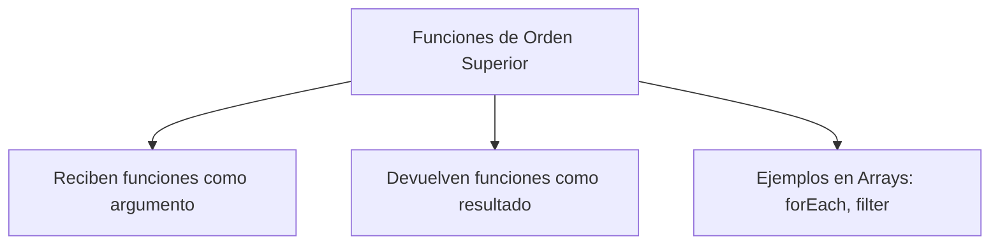

# 📘 Notas De Estudio: Funciones De Orden Superior En JavaScript

---

## 🔹 Definición De Funciones De Orden Superior

- Una **función de orden superior** es aquella que:
    
    1. Puede recibir otra función como **argumento**.
        
    2. Puede devolver otra función como **resultado**.
        
- Se usan principalmente con **estructuras de datos** (ejemplo: arrays).
    
- Ventaja: permiten aplicar transformaciones, filtros o iteraciones de manera concisa y clara.



---

## 🔹 Ejemplo 1: `forEach`

El método `forEach` aplica una función **callback** a cada elemento de un array.

### Ejemplo

```js
const numeros = [1, 2, 3, 4, 5];

numeros.forEach(num => {
  console.log(num * 2);
});
```

### Paso a Paso

1. `numeros` es `[1, 2, 3, 4, 5]`.
    
2. El callback se ejecuta sobre cada elemento.
    
3. Se multiplica cada número por 2.
    
4. Resultado en consola: `2, 4, 6, 8, 10`.

📌 **Uso típico:** aplicar una misma operación a todos los elementos de un array.

---

## 🔹 Ejemplo 2: `filter`

El método `filter` crea un nuevo array con los elementos que cumplen una condición definida en el callback.

### Ejemplo

```js
const numeros = [1, 2, 3, 4, 5];

const pares = numeros.filter(num => num % 2 === 0);
console.log(pares);
```

### Paso a Paso

1. Se evalúa cada número en el array.
    
2. Condición: `num % 2 === 0` (número par).
    
3. Solo se seleccionan los números que cumplan la condición.
    
4. Resultado: `[2, 4]`.

📌 **Uso típico:** filtrar elementos según un criterio.

---

## 🔹 Tabla Comparativa

|Método|Qué hace|Retorno|Caso de uso|
|---|---|---|---|
|`forEach`|Itera sobre cada elemento y ejecuta un callback|`undefined`|Procesar todos los elementos (ej. imprimir, calcular, modificar algo externo).|
|`filter`|Aplica un callback que devuelve `true` o `false`|Nuevo array con los elementos que cumplen la condición|Filtrar datos (pares, mayores de cierta edad, etc.).|

---

## 🔹 Ejemplo Extendido

Si en lugar de pares se quieren **impares**, basta con cambiar la condición:

```js
const impares = numeros.filter(num => num % 2 !== 0);
console.log(impares); // [1, 3, 5]
```

---

## ✅ Resumen De Puntos Clave

- Una **función de orden superior** puede recibir o devolver funciones.
    
- En arrays, los métodos más comunes son:
    
    - `forEach`: aplica una acción a cada elemento (no devuelve nada).
        
    - `filter`: devuelve un nuevo array con los elementos que cumplen una condición.
        
- Suelen usarse con **callbacks** para definir la lógica a aplicar.

---

## ✏️ MicroTest

1. Una función de orden superior:
    
    - **La respuesta:** b. Son funciones predefinidas que se ejecutan sobre estructuras de datos como los arrays, los sets o los mapas.
        
    - **Justificación:** Una función de orden superior puede recibir otras funciones como argumento o devolverlas como resultado. En JavaScript, métodos como `forEach`, `filter`, `map` y otros son ejemplos de funciones de orden superior que trabajan sobre arrays, sets o maps.

---

1. El método forEach de arrays:
    
    - **La respuesta:** c. Recibe como único argumento que es una función callback, cuyo argumento es el elemento en cuestión que se está procesando en cada iteración, aunque puede tener otros argumentos como el índice.
        
    - **Justificación:** `forEach` aplica un callback a cada elemento de un array. Ese callback puede recibir hasta tres parámetros: el elemento actual, el índice y el array completo. Por eso, no se limita únicamente al elemento.

---

1. El método filter de arrays:
    
    - **La respuesta:** c. Tiene como único argumento un callback que debe devolver un resultado booleano. Si el callback devuelve true para un elemento, dicho elemento será incluido en el array final.
        
    - **Justificación:** `filter` recorre el array y ejecuta el callback en cada elemento. El callback debe devolver `true` o `false`: los elementos con `true` se mantienen en el nuevo array y los de `false` son descartados.
      
      