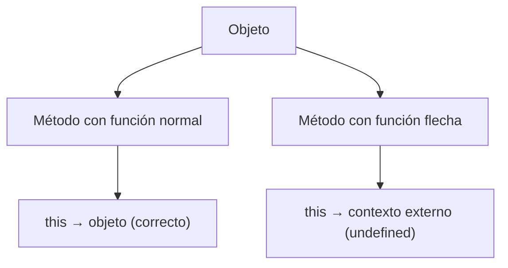

# Notas De Estudio – `this` En JavaScript

---

## 📌 Introducción a `this`

- **Definición:**  
    `this` es una referencia especial en JavaScript que apunta al **objeto actual** sobre el cual se está ejecutando un método.
    
- **Uso principal:** Permite acceder a las propiedades internas del objeto desde dentro de sus métodos.

---

## 📖 Ejemplo Básico Con `this`

```js
const objeto = {
  nombre: "ALIS",
  saludar: function() {
    console.log("Hola, mi nombre es " + this.nombre);
  }
};

objeto.saludar(); 
// Salida: Hola, mi nombre es ALIS
```

- Aquí, `this.nombre` hace referencia a la propiedad `nombre` del objeto `objeto`.
    
- Como `saludar` es una **función normal**, mantiene el contexto y puede usar `this`.

---

## ⚡ Funciones Flecha Y `this`

- **Características principales:**
    
    - Las funciones flecha **no crean su propio contexto** de `this`.
        
    - Al definirse, heredan el `this` del **contexto léxico** donde fueron creadas.
        
    - Dentro de un objeto, si se usa una función flecha como método, **`this` no estará definido**.

### Ejemplo

```js
const objeto = {
  nombre: "ALIS",
  saludar: function() {
    console.log("Hola, mi nombre es " + this.nombre);
  },
  despedida: () => {
    console.log("Adiós, " + this.nombre);
  }
};

objeto.saludar();    // Hola, mi nombre es ALIS
objeto.despedida();  // Adiós, undefined
```

- **Explicación:**
    
    - En `saludar`, se usa una función normal → `this` apunta correctamente al objeto.
        
    - En `despedida`, al set una función flecha, `this` **no se refiere al objeto**, sino al contexto externo (que en este caso no tiene `nombre`), resultando en `undefined`.

---

## 🔑 Diferencia Clave

|Tipo de función|Contexto de `this`|Acceso a propiedades|
|---|---|---|
|Función normal|Apunta al objeto que la invoca|✅ Puede acceder a `this.propiedad`|
|Función flecha|No tiene su propio `this` (usa el del entorno)|❌ En un objeto, devuelve `undefined`|

---

## 📝 Resumen De Puntos Clave

1. `this` hace referencia al **objeto actual** en métodos definidos con funciones normals.
    
2. Las **funciones flecha no tienen `this` propio**; usan el contexto donde fueron creadas.
    
3. En objetos, usar funciones flecha como métodos produce `undefined` al intentar acceder a propiedades con `this`.

---

## 🪄 Diagrama De Relación



---

## ✅ MicroTest

1. **This hace referencia:**
    
    - **La respuesta:** b. Al propio objeto.
        
    - **Justificación:** En JavaScript, dentro de métodos de objetos, `this` apunta al propio objeto desde el cual se invoca la función, permitiendo acceder a sus propiedades.

---

1. **Se puede hacer referencia a this:**
    
    - **La respuesta:** b. Dentro del ámbito de un objeto.
        
    - **Justificación:** `this` tiene sentido cuando se usa dentro de un objeto, ya que hace referencia a ese mismo objeto. Fuera de ese contexto puede apuntar a otros entornos (como el global), pero su uso más común y correcto es dentro de un objeto.

---

1. **Una función flecha tiene acceso a this:**
    
    - **La respuesta:** c. No tiene acceso a this.
        
    - **Justificación:** Las funciones flecha no crean su propio `this`. Capturan el `this` del contexto en el que fueron declaradas, pero dentro de un objeto no se puede usar `this` correctamente con funciones flecha, ya que devolvería `undefined`.