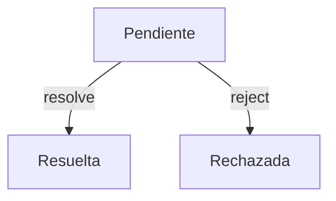

# 📘 Notas De Estudio: Promesas En JavaScript

---

## 🔹 Introducción a Las Promesas

- **Definición:**  
    Una **promesa** en JavaScript es un objeto que representa el resultado eventual de una operación **asíncrona**.
    
    - Puede estar:
        
        - _Pendiente (pending):_ aún no se resuelve.
            
        - _Resuelta (fulfilled):_ se completó exitosamente.
            
        - _Rechazada (rejected):_ falló durante la ejecución.
            
- **Relevancia:**  
    Las promesas permiten trabajar con procesos que tardan en completarse (consultas a API, temporizadores, operaciones de E/S, etc.) sin bloquear el flujo del programa.

---

## 🔹 Creación De Promesas

- Se utilizan los parámetros **resolve** y **reject** en el constructor de `Promise`.
    
- Ejemplo básico:

```js
function operacionAsincrona(simularError) {
  return new Promise((resolve, reject) => {
    setTimeout(() => {
      if (simularError) {
        reject("La operación falló");
      } else {
        resolve("Operación completada exitosamente");
      }
    }, 2000); // espera 2 segundos
  });
}
```

📌 **Explicación paso a paso:**

1. Se define una promesa con `new Promise(…)`.
    
2. `setTimeout` simula un proceso que tarda 2 segundos.
    
3. Si `simularError` es `true` → se ejecuta `reject(…)`.
    
4. Si `simularError` es `false` → se ejecuta `resolve(…)`.

---

## 🔹 Consumo De Promesas

Existen dos formas principales:

### 1. **Con `.then()` Y `.catch()`**

```js
operacionAsincrona(false)
  .then(resultado => console.log(resultado))   // "Operación completada exitosamente"
  .catch(error => console.error(error));
```

- `.then()` → se ejecuta cuando la promesa se resuelve.
    
- `.catch()` → se ejecuta cuando la promesa es rechazada.

---

### 2. **Con `async` Y `await`**

Permite escribir código asíncrono como si fuera síncrono.

```js
async function ejecutarProceso() {
  try {
    console.log("Iniciando el proceso...");
    const resultado = await operacionAsincrona(false);
    console.log(resultado);
  } catch (error) {
    console.error(error);
  }
}
```

📌 **Explicación paso a paso:**

1. `async` se coloca en la declaración de la función.
    
2. `await` se coloca delante de la promesa para esperar su resultado.
    
3. El flujo se pausa hasta que la promesa finaliza.
    
4. Si la promesa se resuelve → se guarda en `resultado`.
    
5. Si la promesa es rechazada → se captura en el `catch`.

---

## 🔹 Comportamiento Asíncrono

- Si no usamos `await`, el valor que obtenemos es una **promesa pendiente** (`Promise { <pending> }`).
    
- Esto ocurre porque el hilo principal no espera a que determine la operación.

📌 Ejemplo sin `await`:

```js
const resultado = operacionAsincrona(false);
console.log(resultado); // Promise { <pending> }
```

---

## 🔹 Estados De Una Promesa



- **Pendiente:** la promesa está en ejecución.
    
- **Resuelta:** se obtuvo un resultado exitoso.
    
- **Rechazada:** ocurrió un error.

---

## 🔹 Ejemplo Completo

```js
async function ejecutarProceso(simularError) {
  try {
    console.log("Iniciando el proceso...");
    const resultado = await operacionAsincrona(simularError);
    console.log(resultado);
  } catch (error) {
    console.error(error);
  }
}

ejecutarProceso(false); // → "Iniciando el proceso..." + "Operación completada exitosamente"
ejecutarProceso(true);  // → "Iniciando el proceso..." + "La operación falló"
```

---

## 📌 Resumen De Los Puntos Clave

- Las **promesas** representan procesos asíncronos que pueden resolverse o rechazarse.
    
- Métodos clave: `resolve` (éxito) y `reject` (error).
    
- Estados posibles: _pendiente, resuelta, rechazada_.
    
- Se consumen con `.then()/.catch()` o `async/await`.
    
- `await` permite detener la ejecución hasta que la promesa finalice.

---

## ✏️ MicroTest

1. **Cuando una promesa se ejecuta, puede set:**
    
    - **La respuesta:** b. Las opciones A) y C) son correctas.
        
    - **Justificación:** Una promesa en JavaScript puede estar pendiente y luego resolverse (éxito) o set rechazada (error). Por lo tanto, tanto _resuelta_ como _rechazada_ son estados válidos.

---

1. **Una promesa es, por defecto:**
    
    - **La respuesta:** b. Asíncrona.
        
    - **Justificación:** Las promesas en JavaScript se ejecutan de manera asíncrona, es decir, no bloquean el hilo principal y continúan en segundo plano mientras el resto del programa sigue corriendo.

---

1. **Mediante async y await podemos:**
    
    - **La respuesta:** a. Ejecutar código dentro de una función asíncrona como si fuera síncrono.
        
    - **Justificación:** El uso de `async` en la definición de la función y `await` delante de una promesa permite pausar la ejecución hasta obtener el resultado, simulando un comportamiento síncrono dentro de un flujo asíncrono.