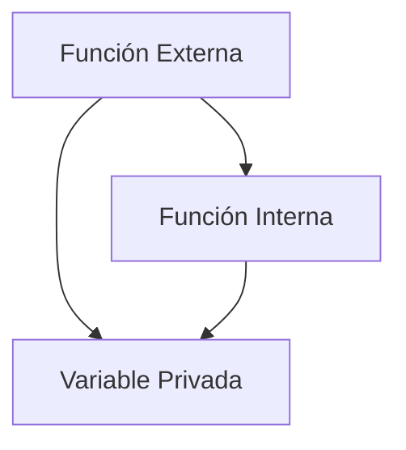

# Notas De Estudio: Closures En JavaScript

---

## 1. Concepto De Closure

- **Definición:**  
    Una **closure** es una función que tiene acceso a variables de su **función externa** incluso después de que la función externa haya terminado su ejecución.  
    Básicamente, permite que una función "recuerde" el entorno en el que fue creada.
    
- **Importancia:**
    
    - Permite **encapsular datos**, evitando el acceso directo desde fuera de la función.
        
    - Facilita la creación de **funciones factoría**, es decir, funciones que generan otras funciones.
        
    - Se utilize ampliamente para mantener **estado privado** en JavaScript.

---

## 2. Función Factoría De Contadores

### Ejemplo

```javascript
function crearContador() {
    let contador = 0; // variable privada de la función externa
    return function() { // función interna
        contador++;
        console.log(contador);
    };
}

const miContador = crearContador();
miContador(); // 1
miContador(); // 2
```

### Explicación Paso a Paso

1. `crearContador` define una variable interna `contador` inicializada en 0.
    
2. La función **interna** incrementa `contador` y muestra su valor.
    
3. Al llamar `crearContador()`, se devuelve la función interna y se asigna a `miContador`.
    
4. Cada vez que ejecutamos `miContador()`, se incrementa la **misma variable interna**, mostrando la continuidad del contador.
    
5. La variable `contador` **no es accessible** desde fuera de la función externa, garantizando encapsulación.

---

## 3. Múltiples Closures Independientes

```javascript
const miContador1 = crearContador();
const miContador2 = crearContador();

console.log(miContador1 === miContador2); // false
miContador1(); // 1
miContador2(); // 1
```

- Cada llamada a `crearContador()` genera un **nuevo entorno** con su propia variable `contador`.
    
- Los contadores son **independientes**, incluso si se ejecutan simultáneamente.
    
- La comparación `===` devuelve `false` porque son **objetos/funcciones diferentes**.

---

## 4. Acceso Entre Funciones Internas Y Externas

|Dirección de acceso|Posibilidad|
|---|---|
|Función interna → externa|✅ Permitido (acceso a variables de la externa)|
|Función externa → interna|❌ No permitido (no puede acceder a variables internas directamente)|

- La función interna **puede** referenciar variables de la función externa.
    
- La función externa **no puede** acceder a variables definidas dentro de la función interna.

---

## 5. Resumen De Puntos Clave

- Una **closure** permite que una función "recuerde" el entorno donde fue creada.
    
- Se utilizan para **crear funciones factoría** y mantener **estado privado**.
    
- Cada ejecución de la función externa genera un **nuevo closure independiente**.
    
- La **función interna** puede acceder a las variables externas, pero **no al revés**.



---

## MicroTest

1. ¿Qué es un closure en el contexto de la programación en JavaScript?
    
    - La respuesta: a. Es una referencia a una variable que fue creada en el ámbito de otra función que permanece accessible y puede set usada en otra parte del programa.
        
    - Justificación: Un closure permite que una función interna "recuerde" el entorno en el que fue creada, manteniendo el acceso a variables de la función externa incluso después de que esta haya terminado su ejecución.
        
2. Cuando una función sea declarada dentro de otra función, la función externa tendrá acceso a las variables que son declaradas en la función externa:
    
    - La respuesta: b. La función externa no tendrá acceso a las variables que son declaradas en la función interna.
        
    - Justificación: La función interna puede acceder a variables de la función externa, pero la función externa no puede acceder a variables declaradas dentro de la función interna, preservando el encapsulamiento.
        
3. Los closures son usados habitualmente como mecanismo para crear:
    
    - La respuesta: a. Fábricas de funciones.
        
    - Justificación: Los closures permiten generar nuevas funciones con estados privados independientes, funcionando como "factorías" que crean funciones con comportamientos personalizados o con variables internas encapsuladas.