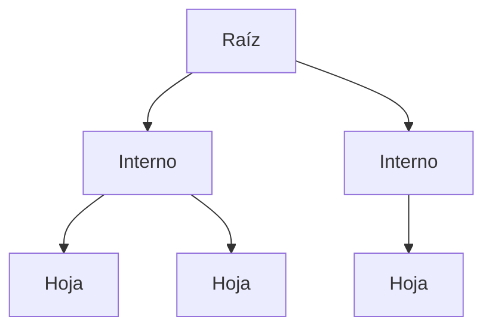
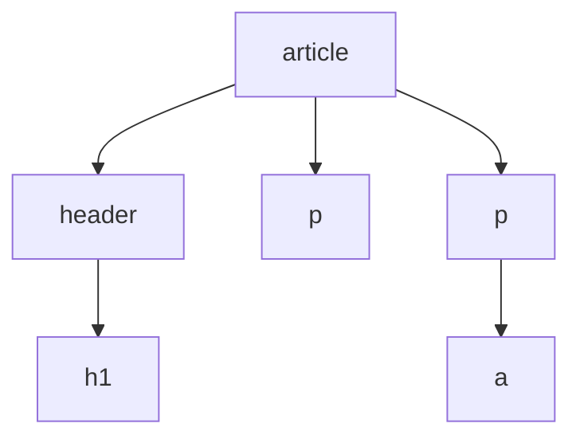

# Notas De Estudio – Tema 4: El DOM (Document Object Model)

---

## 1. Introducción: Árboles En Estructuras De Datos

### Definición De Árbol

- **Árbol**: estructura de datos jerárquica formada por nodos conectados entre sí.
    
- **Características principales**:
    
    - **Raíz**: nodo superior del árbol.
        
    - **Nodos internos**: nodos intermedios con al menos un hijo.
        
    - **Nodos externos (hojas)**: nodos sin hijos.
        
    - **Profundidad**: número de niveles que tiene el árbol desde la raíz hasta las hojas.

### Tipos De Árboles

- **Árbol binario**: cada nodo puede tener como máximo 2 hijos.
    
- **Árbol genérico**: un nodo puede tener más de dos hijos.



---

## 2. El DOM Como Representación Arbórea

### Definición

- **DOM (Document Object Model)**:  
    Interfaz que representa un documento HTML como un árbol de nodos, donde cada elemento HTML es un nodo.

### Relación Con HTML

- Ejemplo:

    ```html
    <article>
      <header>
        <h1>Título</h1>
      </header>
      <p>Párrafo 1</p>
      <p>Párrafo 2 con <a href="#">enlace</a></p>
    </article>
    ```

- Representación arbórea:
    
    - `article` → raíz
        
    - `header` y `p` → nodos hijos
        
    - `h1` y `a` → hijos dentro de otros elementos
        
    - Orden de los nodos sigue el orden de declaración en HTML.



---

## 3. Acceso Y Manipulación Del DOM

### Acceso

- Se realiza desde JavaScript mediante la **API del navegador**.
    
- Objeto global: **`document`**.

### Operaciones Posibles

|Operación|Descripción|
|---|---|
|**Leer/Escribir propiedades**|Modificar contenido de nodos.|
|**Insertar o eliminar elementos**|Añadir o quitar nodos del árbol HTML.|
|**Modificar estilo**|Cambiar visualización dinámicamente.|

---

## 4. Eventos Importantes En la Carga Del DOM

### Eventos Principales

1. **`DOMContentLoaded`**
    
    - Se dispara cuando el **HTML ha sido procesado**.
        
    - Imágenes, CSS y scripts externos pueden no estar cargados aún.
        
    - Punto ideal para manipular el DOM temprano.
        
2. **`load` (objeto `window`)**
    
    - Se dispara cuando **todos los recursos** (HTML, imágenes, CSS, scripts) están completamente cargados.

### Uso De `defer`

- Atributo en `<script>` que permite ejecutar el código **después de procesar el HTML** pero **antes de `DOMContentLoaded`**.
    
- Útil para cargar scripts sin bloquear la carga de la página.

---

## 5. Importancia Práctica

- El DOM permite a los desarrolladores **interactuar dinámicamente con la página**:
    
    - Crear experiencias interactivas.
        
    - Cargar contenido sin recargar la página.
        
    - Cambiar estilos en tiempo real.
        
- Comprender **cuándo el DOM está disponible** es clave para evitar errores.

---

## Resumen De Puntos Clave

- Un **árbol** es la base conceptual del DOM: raíz, nodos internos y hojas.
    
- El **DOM** representa un documento HTML como un árbol de nodos manipulables.
    
- Accedemos al DOM mediante **`document`** en JavaScript.
    
- Eventos clave:
    
    - `DOMContentLoaded`: HTML listo.
        
    - `load`: todo el contenido cargado.
        
    - `defer`: ejecución diferida de scripts.
        
- Con el DOM podemos **leer, modificar, insertar o eliminar elementos** dinámicamente.

---

