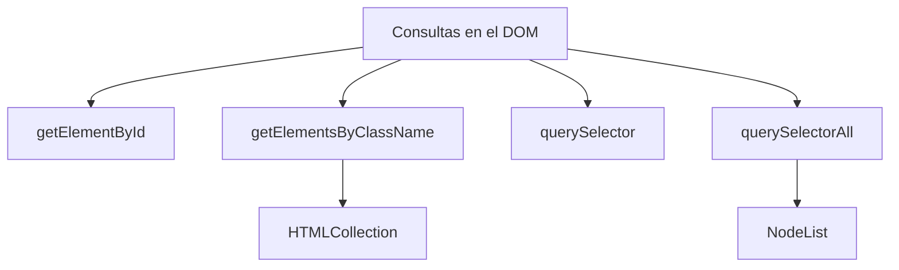

# Notas De Estudio – Consultas En El DOM

---

## 1. Introducción a Las Consultas En El DOM

- **Objetivo**: acceder a elementos HTML para:
    
    - Modificar atributos.
        
    - Cambiar estilos.
        
    - Insertar o eliminar contenido.
        
- Para poder operar sobre un elemento, primero debemos **obtener una referencia** a él.

---

## 2. Métodos Principales De Selección

### 2.1 `getElementById(id)`

- **Definición**: Devuelve el elemento HTML con el `id` especificado.
    
- **Buenas prácticas**:
    
    - Los `id` deben set **únicos** en el documento HTML.
        
    - Si existen varios con el mismo `id` (mala práctica), se devuelve **solo el primero**.
        
- **Ejemplo**:

    ```html
    <button id="myBtn">Haz clic</button>
    <script>
      const button = document.getElementById("myBtn");
      // button ahora es una referencia al botón de la línea <button>
    </script>
    ```

---

### 2.2 `getElementsByClassName(className)`

- **Definición**: Devuelve una **colección (HTMLCollection)** de elementos con el nombre de clase dado.
    
- Si se usa la forma singular (`getElementByClassName`), devolverá **solo el primero**.
    
- **Ejemplo**:

    ```html
    <p class="note">Nota 1</p>
    <p class="note">Nota 2</p>
    <script>
      const notes = document.getElementsByClassName("note");
      // notes es una colección con ambos <p>
    </script>
    ```

|Método|Devuelve|Observaciones|
|---|---|---|
|`getElementById("id")`|Un único elemento HTML|Debe existir un `id` único.|
|`getElementsByClassName("c")`|Colección de elementos (HTMLCollection)|Iterables, pero no son arrays.|

---

### 2.3 `querySelector(selector)`

- **Definición**: Devuelve el **primer elemento** que coincida con el selector CSS indicado.
    
- **Ejemplo**:

    ```html
    <button>Primero</button>
    <button>Segundo</button>
    <script>
      const btn = document.querySelector("button");
      // btn es el <button> "Primero"
    </script>
    ```

---

### 2.4 `querySelectorAll(selector)`

- **Definición**: Devuelve **todos los elementos** que coincidan con el selector CSS.
    
- El resultado es un **NodeList**, no un array:
    
    - Tiene `.length` y se puede acceder por índices.
        
    - No soporta todos los métodos de array, aunque algunos navegadores permiten `.forEach()`.
        
- **Ejemplo**:

    ```html
    <p>Uno</p>
    <p>Dos</p>
    <p>Tres</p>
    <script>
      const paragraphs = document.querySelectorAll("p");
      // NodeList con los 3 párrafos
    </script>
    ```

|Método|Devuelve|Tipo de resultado|Observaciones|
|---|---|---|---|
|`querySelector("sel")`|Primer elemento|Elemento único|Usa sintaxis CSS|
|`querySelectorAll("sel")`|Todos los elementos|NodeList|Iterables pero no arrays|

---

## 3. Diferencias Entre Colecciones

- **HTMLCollection** (ej. `getElementsByClassName`):
    
    - Se actualiza en tiempo real (si cambian los elementos en el DOM, la colección también).
        
- **NodeList** (ej. `querySelectorAll`):
    
    - Estático: no cambia si se modifica el DOM después de la consulta.
        
    - Más flexible: permite usar algunos métodos como `.forEach()`.



---

## 4. Ejemplo Paso a Paso

Código HTML:

```html
<button>Botón 1</button>
<button>Botón 2</button>
<p class="text">Párrafo A</p>
<p class="text">Párrafo B</p>
<p class="text">Párrafo C</p>
```

Código JS:

```js
const btn1 = document.querySelector("button"); 
// Devuelve <button>Botón 1</button>

const firstP = document.querySelector(".text"); 
// Devuelve <p class="text">Párrafo A</p>

const allP = document.querySelectorAll("p.text"); 
// Devuelve NodeList con los 3 <p>
```

---

## Resumen De Puntos Clave

- Para trabajar con elementos del DOM debemos **consultarlos primero**.
    
- Métodos principales:
    
    - `getElementById(id)` → un elemento único.
        
    - `getElementsByClassName(class)` → colección de elementos (HTMLCollection).
        
    - `querySelector(sel)` → primer elemento que cumple el selector CSS.
        
    - `querySelectorAll(sel)` → todos los elementos que cumplen, en un NodeList.
        
- Diferencias:
    
    - **HTMLCollection**: dinámico, se actualiza con cambios en el DOM.
        
    - **NodeList**: estático, no cambia automáticamente.

---

