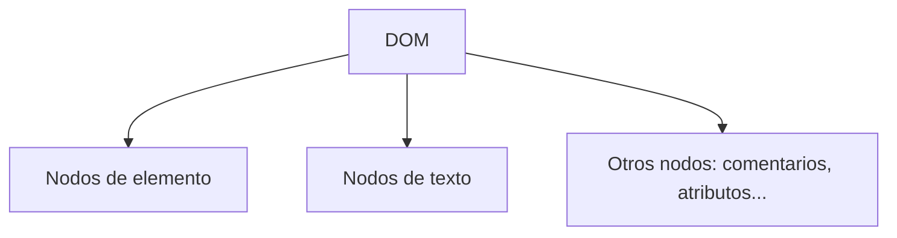

# Notas De Estudio – Navegabilidad Y Modificación De Atributos En El DOM

---

## 1. Introducción

- **Objetivo**: aprender cómo navegar entre nodos del DOM y cómo modificar sus atributos mediante la API del DOM.
    
- **Ejemplo base**:
    
    - HTML con:
        
        - Una clase `highlight` definida como estilo inline (negrita y fondo rojo).
            
        - Un contenedor con `header`, `ul` y varios `li` (elemento 0, elemento 1, elemento 2, elemento 3).
            
        - Dentro de `elemento 1` hay un párrafo.
            
        - Varios botones (`NextSibling`, `PreviousSibling`, `FirstChild`, `SetAttribute`).
            
    - Script (`script.js`) enlazado y ejecutado al dispararse el evento **`DOMContentLoaded`**.

---

## 2. Tipos De Nodos En El DOM

- **Nodo de elemento**: representa etiquetas HTML (`<div>`, `<p>`, `<ul>`, etc.).
    
- **Nodo de texto**: representa el contenido textual **incluyendo saltos de línea**.
    
- **Relevancia**: al navegar, hay que diferenciar entre ambos para evitar seleccionar nodos de texto cuando buscamos nodos de elemento.



---

## 3. Navegabilidad En El DOM

### 3.1 Sibling (hermanos)

- **NextSibling**: devuelve el nodo hermano siguiente.
    
- **PreviousSibling**: devuelve el nodo hermano anterior.
    
- **Problema**: pueden devolver nodos de texto (como saltos de línea).

### 3.2 Child (hijos)

- **FirstChild**: devuelve el primer hijo de un nodo.
    
- Igual que en los hermanos, puede set un nodo de texto → se debe filtrar.

### 3.3 Variantes Seguras (ignoran Nodos De texto)

- **NextElementSibling**: devuelve el siguiente hermano que es nodo de elemento.
    
- **PreviousElementSibling**: devuelve el anterior hermano de tipo elemento.
    
- **FirstElementChild**: devuelve el primer hijo que es nodo de elemento.

|Método básico|Riesgo|Alternativa segura|
|---|---|---|
|`nextSibling`|Puede devolver salto de línea|`nextElementSibling`|
|`previousSibling`|Puede devolver texto|`previousElementSibling`|
|`firstChild`|Puede set texto|`firstElementChild`|

---

## 4. Modificación De Atributos

### `setAttribute(nombre, valor)`

- Permite cambiar o añadir un atributo a un nodo.
    
- Ejemplo:

    ```js
    elemento1.setAttribute("class", "highlight");
    ```

    - Agrega la clase `highlight` al nodo con id `elemento1`.
        
    - Esto afecta tanto al `li` como a los hijos que contiene (incluido el párrafo).

---

## 5. Ejemplo Paso a Paso

### HTML Simplificado

```html
<ul>
  <li id="elemento0">Elemento 0</li>
  <li id="elemento1">Elemento 1
    <p>Párrafo 1</p>
  </li>
  <li id="elemento2">Elemento 2</li>
</ul>

<button id="NextSibling">Next Sibling</button>
<button id="PreviousSibling">Previous Sibling</button>
<button id="FirstChild">First Child</button>
<button id="SetAttribute">Set Attribute</button>
```

### JavaScript

```js
document.addEventListener("DOMContentLoaded", () => {
  const elemento1 = document.getElementById("elemento1");

  document.getElementById("NextSibling")
    .addEventListener("click", () => highlight(elemento1.nextElementSibling));

  document.getElementById("PreviousSibling")
    .addEventListener("click", () => highlight(elemento1.previousElementSibling));

  document.getElementById("FirstChild")
    .addEventListener("click", () => highlight(elemento1.firstElementChild));

  document.getElementById("SetAttribute")
    .addEventListener("click", () => elemento1.setAttribute("class", "highlight"));
});

function highlight(node) {
  if (node) node.classList.add("highlight");
}
```

### Resultado Esperado

- **NextSibling** → resalta `Elemento 2`.
    
- **PreviousSibling** → resalta `Elemento 0`.
    
- **FirstChild** → resalta `Párrafo 1`.
    
- **SetAttribute** → todo `Elemento 1` se resalta en rojo, incluyendo su párrafo.

---

## 6. Depuración En El Navegador

- Se pueden usar **puntos de ruptura** en la pestaña **Fuentes** del navegador.
    
- Permite inspeccionar la ejecución línea a línea.
    
- Herramienta clave para comprender cómo interactúa el código con el DOM.

---

## Resumen De Puntos Clave

- El DOM incluye distintos tipos de nodos (elementos, texto, etc.).
    
- Al navegar entre nodos hay que distinguir **siblings** y **children**.
    
- Usar variantes **Element** (`nextElementSibling`, `firstElementChild`) evita capturar nodos de texto.
    
- Con **`setAttribute`** se pueden modificar atributos de un nodo dinámicamente.
    
- La depuración en el navegador ayuda a entender el flujo de ejecución y detectar errores.

---

