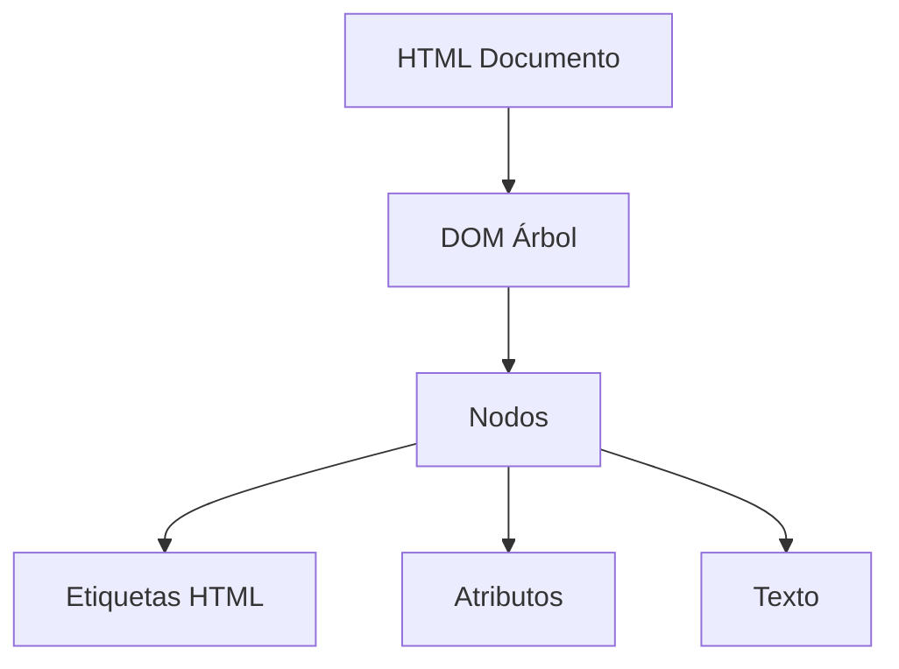
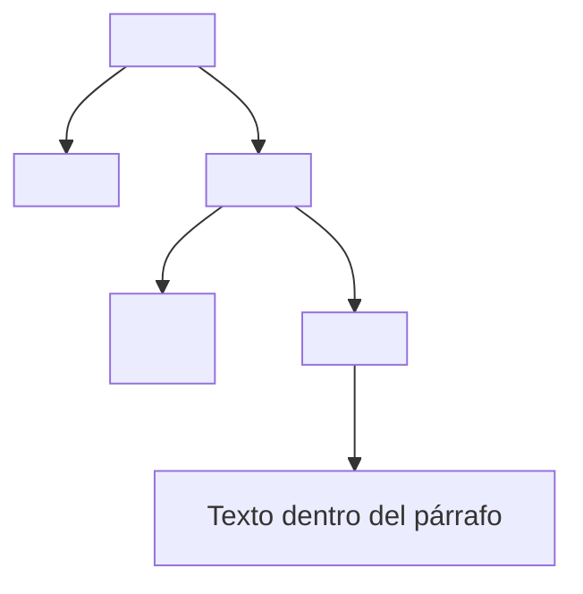

# Notas De Estudio – Resumen Del Tema 4: DOM

---

## 1. ¿Qué Es El DOM?

- **Definición**:  
    El **DOM (Document Object Model)** es una representación en **estructura de árbol** de todos los elementos de un documento HTML.
    
- **Relevancia**:  
    Permite a los navegadores exponer una **API** para manipular, consultar y modificar los elementos de una página web.
    
- **Condición**:  
    El DOM **solo existe en el contexto de un navegador web**. No tiene sentido hablar de DOM en entornos como Node.js.



---

## 2. Acceso Al DOM

- Se accede a través de la **variable global `document`**.
    
- Esta variable permite interactuar con todos los elementos del árbol del DOM.

---

## 3. Métodos Principales De Búsqueda De Elementos

|Método|Descripción|Devuelve|
|---|---|---|
|`getElementById(id)`|Busca por un identificador único|Un solo elemento|
|`getElementsByClassName(clase)`|Busca por nombre de clase|Colección de elementos|
|`querySelector(selector)`|Busca con un selector CSS|El primer elemento coincidente|
|`querySelectorAll(selector)`|Busca con un selector CSS|Lista de nodos coincidentes|

- **Ejemplo**:

    ```js
    const titulo = document.getElementById("main-title");
    const parrafos = document.querySelectorAll(".texto");
    ```

---

## 4. Operaciones Con El DOM

Una vez obtenidos los nodos, se pueden realizar múltiples operaciones:

### 4.1 Modificar Elementos

- Cambiar estilos → `element.style.color = "red";`
    
- Cambiar contenido → `element.textContent = "Nuevo texto";`
    
- Cambiar atributos → `element.setAttribute("class", "nuevaClase");`

### 4.2 Crear Y Añadir Elementos

- Crear → `document.createElement("p");`
    
- Insertar → `padre.appendChild(hijo);`

### 4.3 Recorrer El Árbol

- `parentElement` → obtiene el padre.
    
- `nextSibling` → obtiene el siguiente nodo hermano.
    
- `previousSibling` → obtiene el nodo hermano anterior.

### 4.4 Eliminar

- **Atributos**: `element.removeAttribute("id");`
    
- **Nodos**: `padre.removeChild(hijo);`

---

## 5. Representación Del DOM Como Árbol

El documento HTML se refleja como nodos organizados jerárquicamente:



---

## 6. Conexión Con Otros Temas

- Los **selectores CSS** (vistos en el Tema 1) se utilizan dentro de la API del DOM (`querySelector`, `querySelectorAll`) para localizar elementos.
    
- Con el DOM se sientan las bases para trabajar en frameworks como **React** (Tema 5), que automatizan y optimizan la manipulación del DOM.

---

## Resumen De Puntos Clave

- El **DOM** es la representación en árbol de un documento HTML.
    
- Se accede al DOM a través de la variable global **`document`**.
    
- Métodos de búsqueda principales: `getElementById`, `getElementsByClassName`, `querySelector`, `querySelectorAll`.
    
- Con el DOM se pueden **modificar estilos, atributos y contenido**, así como **crear, recorrer y eliminar nodos**.
    
- Es fundamental entender el DOM porque es la base de la **manipulación dinámica de páginas web** y el trabajo con librerías modernas como React.

---