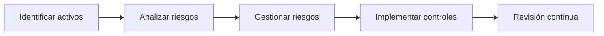

# 🧠 **Notas De Estudio: Ciberseguridad Web**

---

## 🌐 **1. Introducción a la Asignatura**

**Professor:** Juan Ramón Vermejo  
**Estructura del curso:**  
La asignatura se divide en **dos partes principales**:

|Parte|Enfoque principal|
|---|---|
|**1**|Gobierno y gestión de la ciberseguridad en las organizaciones|
|**2**|Seguridad específica en aplicaciones web|

---

## 🛡️ **2. Ciberseguridad En Las Organizaciones**

### Objetivo Principal

Comprender **por qué la ciberseguridad es necesaria** en las organizaciones modernas.

### Justificación

- Existen **amenazas reales** que provienen de distintos **actores de ciberseguridad**:
    
    - **Hacktivistas**
        
    - **Amenazas persistentes avanzadas (APT)**
        
    - **Ciberdelincuentes o grupos organizados**
        
- Estos actores emplean **diversos métodos de ataque**, por lo que es esencial conocerlos para **mitigarlos eficazmente**.

### Conceptos Clave

|Concepto|Definición|
|---|---|
|**Ciberseguridad**|Conjunto de medidas y procesos para proteger los sistemas de información frente a ataques o accesos no autorizados.|
|**Autenticación**|Proceso de verificar la identidad de un usuario o sistema.|
|**Notificación**|Comunicación formal de un incidente o amenaza.|
|**Proceso de seguridad**|Implementación continua de medidas preventivas y reactivas para salvaguardar la información.|

---

## 🏛️ **3. Gestión De la Ciberseguridad**

### Elementos Centrales

1. **Política de seguridad**
    
    - Documento marco que define las reglas y responsabilidades sobre el uso seguro de la información.
        
2. **Sistema de Gestión de Seguridad de la Información (SGSI)**
    
    - Conjunto de políticas, procesos y controles que aseguran la protección y mejora continua de la seguridad.

Ambos elementos **funcionan en paralelo** y constituyen el **marco normativo** de la gestión de la ciberseguridad.

### Ejemplos Normativos

|Norma / Esquema|Descripción|
|---|---|
|**Esquema Nacional de Seguridad (ENS)**|Marco obligatorio para la administración pública española.|
|**ISO 27001**|Norma internacional para la gestión de la seguridad de la información.|
|**Norma 1637 (AENOR/AMIS)**|Especificación técnica española para seguridad en TI.|

---

## ⚙️ **4. Análisis Y Gestión De Riesgos De Seguridad**

### Etapas Principales

### Pasos Del Proceso

1. **Identificar activos:**
    
    - Sistemas de información
        
    - Personal
        
    - Documentación
        
    - Instalaciones
        
2. **Analizar riesgos:**  
    Determinar el nivel de exposición ante amenazas.
    
3. **Gestionar riesgos:**  
    Implementar **controles o salvaguardas** para reducirlos.

### Herramientas Útiles

- **PILAR:** Software especializado en análisis y gestión de riesgos.

### Nota

El proceso es **cíclico** y debe realizarse de forma **continua** para mantener la seguridad.

---

## 💻 **5. Seguridad En Aplicaciones Web**

### Ciclo De Vida De Desarrollo Seguro (SDLC)

El objetivo es **integrar la seguridad desde el diseño** hasta la puesta en producción.

|Fase|Enfoque de seguridad|
|---|---|
|Diseño|Definir requisitos de seguridad|
|Implementación|Codificar siguiendo buenas prácticas|
|Pruebas|Detectar y corregir vulnerabilidades|
|Producción|Mantener medidas preventivas activas|

---

## 🌐 **6. Protocolo HTTP Y Métodos Inseguros**

El protocolo **HTTP** es la base de la comunicación web.  
Sin embargo, algunos métodos pueden tener **debilidades de seguridad**.

|Método HTTP|Descripción|Riesgo|
|---|---|---|
|**GET**|Solicita datos del servidor|Bajo si se usa correctamente|
|**POST**|Envía datos al servidor|Riesgo si no hay validación|
|**PUT / DELETE**|Modifican o eliminan recursos|**Altamente sensibles** si no están controlados|
|**TRACE / CONNECT**|Usados para depuración o túneles|**Inseguros**, deben evitarse|

---

## 🧩 **7. Vulnerabilidades Y OWASP**

### Proyecto OWASP

El **Open Web Application Security Project (OWASP)** identifica y clasifica las vulnerabilidades más críticas en aplicaciones web.

**Ejemplos comunes:**

- Inyección SQL
    
- Cross-Site Scripting (XSS)
    
- Fallos de autenticación
    
- Exposición de datos sensibles

Estas categorías se estudian para **reconocer, prevenir y mitigar vulnerabilidades**.

---

## 🔐 **8. Autenticación Y Autorización**

|Concepto|Descripción|Buenas prácticas|
|---|---|---|
|**Autenticación**|Verificación de identidad del usuario.|Usar autenticación multifactor (MFA).|
|**Sesión**|Identificador temporal para mantener al usuario autenticado.|Regenerar el ID al iniciar sesión y al cambiar de rol.|
|**Autorización**|Controla qué recursos puede acceder el usuario.|Aplicar principios de mínimo privilegio.|

**Errores comunes:**

- IDs de sesión predecibles
    
- Falta de expiración de sesión
    
- Tokens mal gestionados

---

## 🧱 **9. Desarrollo Seguro Y Código Fuente**

### Objetivo

Prevenir y corregir vulnerabilidades desde el código.

**Buenas prácticas:**

- Validar entradas del usuario.
    
- Evitar concatenar cadenas SQL.
    
- Usar librerías seguras.
    
- Revisar código (code review) periódicamente.

El desarrollador debe **conocer cómo se originan y solucionan** las vulnerabilidades en el código fuente.

---

## 🧮 **10. Análisis De Seguridad De Aplicaciones Web**

### Tipos De Análisis

|Tipo|Descripción|Ejemplo|
|---|---|---|
|**Estático (SAST)**|Analiza el código fuente sin ejecutarlo.|SonarQube|
|**Dinámico (DAST)**|Evalúa la aplicación en ejecución.|OWASP ZAP|
|**Interactivo (IAST)**|Combina ambos enfoques para mayor precisión.|Contrast Security|

**Recomendación:**  
Combinar los tres métodos para lograr una visión integral de la seguridad.

---

## 🔥 **11. Producción Y Protección En Línea**

### Medidas De Protección

- **Firewall de Aplicaciones Web (WAF)**  
    Filtra tráfico malicioso hacia la aplicación.
    
- **Sistemas de detección y respuesta ante incidentes (IDS/IPS)**  
    Analizan y bloquean actividades sospechosas.
    
- **Protocolos seguros (HTTPS)**  
    Garantizan cifrado de extremo a extremo.

### Procedimientos Esenciales

- Plan de **respuesta ante incidentes**
    
- Monitoreo constante
    
- Actualización continua de software

### Aplicaciones Ricas De Internet (RIA)

Tecnologías modernas como **Angular**, **React**, o **Node.js** también requieren configuraciones seguras (control de dependencias, tokens, CORS, etc.).

---

## 🧾 **Resumen De Puntos Clave**

|Tema|Concepto principal|
|---|---|
|1|Importancia de la ciberseguridad organizacional|
|2|Políticas y sistemas de gestión de seguridad|
|3|Análisis y gestión de riesgos (ciclo continuo)|
|4|Desarrollo seguro de software (SDLC)|
|5|Protocolo HTTP y métodos inseguros|
|6|OWASP y vulnerabilidades comunes|
|7|Autenticación, sesión y autorización seguras|
|8|Prevención de vulnerabilidades en el código|
|9|Análisis de seguridad (SAST, DAST, IAST)|
|10|Protección en producción: WAF, IDS, HTTPS|

---

**👉 Conclusión:**  
La ciberseguridad web require una **visión integral**, abarcando desde la gestión organizacional y los riesgos, hasta la **implementación técnica segura** y la **respuesta ante incidentes** en entornos en producción.