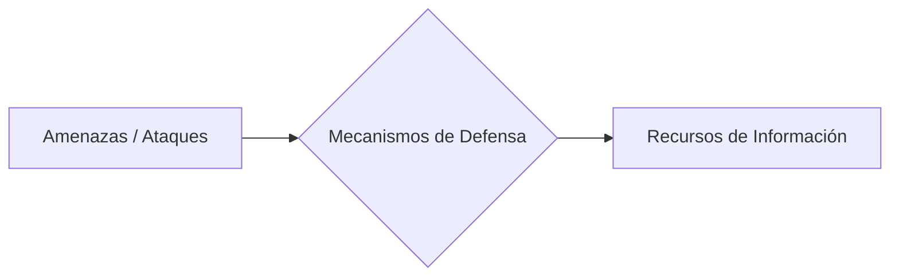

# Notas De Estudio – Justificación Y Motivación De la Ciberseguridad

---

## 1. Introducción a la Ciberseguridad

La **ciberseguridad** se define como el conjunto de medidas, prácticas y tecnologías destinadas a proteger los sistemas de información, los datos y las redes frente a ataques, accesos no autorizados, daños o robos.

El professor **Juan Ramón Vermejo** plantea que la ciberseguridad debe entenderse desde un punto de vista **económico y estratégico**, ya que toda medida de seguridad implica un coste, pero su ausencia puede generar pérdidas mucho mayores ante un ataque exitoso.

---

## 2. Equilibrio Entre Coste Y Beneficio

Uno de los principios fundamentales es **encontrar un equilibrio** entre:

|Elemento|Descripción|
|---|---|
|**Coste de implementación**|Inversión económica en herramientas, personal y medidas de protección (por ejemplo, firewalls, sistemas de detección de intrusos, auditorías de seguridad).|
|**Impacto económico de los ataques**|Pérdidas financieras, daño reputacional o interrupción de servicios que pueden derivarse de un ataque exitoso.|

El objetivo es **minimizar el riesgo total**, asegurando que el coste de proteger sea **menor que el possible daño** que provocaría una brecha de seguridad.

---

## 3. Factores Que Dificultan la Implementación

### 3.1 Resistencia Al Cambio

Las medidas de seguridad suelen implicar **modificaciones en los procesos o la usabilidad de los sistemas**.  
Ejemplo:

- Implementar **autenticación multifactor (MFA)** puede resultar molesto o complejo para algunos usuarios, generando resistencia entre empleados o directivos.

Esta resistencia puede reducir la efectividad de las políticas de seguridad si no se gestiona adecuadamente con **capacitación y comunicación interna**.

---

## 4. Adopción De Tecnologías De Seguridad

Las tecnologías de seguridad tienden a adoptarse masivamente cuando se cumplen dos condiciones principales:

|Condición|Explicación|
|---|---|
|**1. Facilidad de implementación**|Las medidas deben set simples de aplicar e integrar en los sistemas existentes.|
|**2. Demanda organizacional**|Los **auditores de seguridad** o expertos comienzan a demostrar a la dirección la necesidad de estas medidas para reducir el riesgo económico.|

El cambio cultural dentro de la organización es clave para la **aceptación de controles de seguridad** y para comprender su **valor estratégico**.

---

## 5. Flujo De Amenazas, Defensas Y Recursos

El flujo básico de la ciberseguridad puede representarse como una **relación entre amenazas, mecanismos defensivos y recursos protegidos**.

### Elementos Del Flujo

|Elemento|Descripción|
|---|---|
|**Amenazas o ataques**|Intentos de explotar vulnerabilidades existentes.|
|**Mecanismos de defensa**|Controles técnicos o administrativos como firewalls, IDS/IPS, autenticación, parches, etc.|
|**Recursos de información**|Datos, sistemas, servidores o aplicaciones que deben protegerse.|

---

## 6. Costes Asociados En la Ciberseguridad

### 6.1 Desde la Perspectiva Del Atacante

|Concepto|Descripción|
|---|---|
|**Coste de ruptura**|Tiempo, recursos y habilidades necesarias para explotar una vulnerabilidad.|
|**Beneficio esperado**|Ganancia económica o estratégica obtenida si el ataque tiene éxito.|

El atacante **solo actuará** si el beneficio esperado **supera el coste de ruptura**.

---

### 6.2 Desde la Perspectiva De la Organización

|Tipo de coste|Ejemplo|Objetivo|
|---|---|---|
|**Coste de construcción**|Configuración de firewalls, IDS/IPS, políticas de seguridad.|Prevenir ataques.|
|**Coste de protección**|Mantenimiento y actualización de las defensas.|Reforzar la seguridad continua.|
|**Coste de reparación**|Aplicación de parches, corrección de vulnerabilidades, recuperación post-incidente.|Restablecer operaciones seguras.|
|**Coste de las pérdidas**|Impacto económico tras un ataque (pérdida de datos, reputación o clientes).|Minimizar consecuencias.|

El objetivo es **demostrar a la dirección** que invertir en seguridad **reduce drásticamente las pérdidas potenciales** frente a los costos de reparación y recuperación.

---

## 7. Conclusión: Enfoque Estratégico

La ciberseguridad no debe verse como un gasto, sino como **una inversión que mitiga riesgos**.  
Implementar medidas preventivas y de detección reduce la probabilidad de sufrir pérdidas mayores, garantizando la **continuidad operativa** y la **confianza** de clientes y usuarios.

---

## Resumen De Los Puntos Clave

|Concepto|Idea Principal|
|---|---|
|**Equilibrio costo–beneficio**|La inversión en seguridad debe set proporcional al riesgo potential.|
|**Resistencia al cambio**|Es un obstáculo común que debe gestionarse mediante formación y concienciación.|
|**Adopción tecnológica**|Depende de la facilidad de implementación y la presión interna de expertos en seguridad.|
|**Flujo de seguridad**|Amenazas → Mecanismos defensivos → Recursos de información.|
|**Tipos de costes**|Construcción, protección, reparación y pérdidas derivadas.|
|**Conclusión**|La ciberseguridad es un proceso estratégico continuo que busca reducir el impacto de los ataques mediante inversión preventiva.|

---

## MicroTest

1. El coste de realizar un ataque se denomina:
    
    - **La respuesta:** b. Cost to break.
        
    - **Justificación:** En el transcript, se menciona que _"el atacante no tiene que asumir un coste de ruptura"_, el cual en inglés se traduce como _cost to break_. Este coste representa el tiempo y recursos que el atacante debe invertir para vulnerar un sistema.
        
2. Para que la ciberseguridad sea rentable:
    
    - **La respuesta:** b. Coste construcción defensas < (cost to fix + pérdida de beneficio + coste reconstrucción).
        
    - **Justificación:** El professor explica que la inversión en ciberseguridad debe set menor que las pérdidas potenciales si ocurre un ataque. Por lo tanto, la rentabilidad se logra cuando el coste de las defensas es inferior al conjunto de los costes derivados de un ataque exitoso (reparación, pérdida de beneficios y reconstrucción).
        
3. Del lado de la organización, los costes básicos son: coste de construcción de las medidas defensivas, coste de reparación de vulnerabilidades y…
    
    - **La respuesta:** a. Coste de reconstrucción de sistemas.
        
    - **Justificación:** En el transcript se indica que además del coste de construcción y reparación, existen “otros costes que incluyen el cálculo de las pérdidas derivadas y la reconstrucción de los sistemas”, lo que confirma que el tercer coste principal es el de reconstrucción.