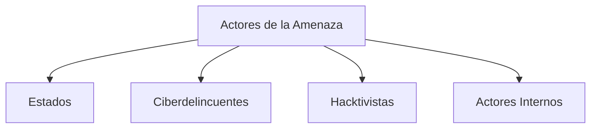
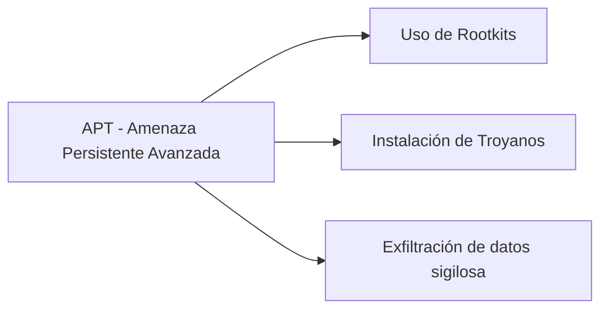

# Notas De Estudio: Amenazas Y Riesgos De la Ciberseguridad

---

## 1. Introducción

En esta sesión, el professor **Juan Ramón Vermejo** aborda los conceptos fundamentales sobre **amenazas y riesgos de la ciberseguridad**, centrándose en:

- Los **principales actores de la amenaza**.
    
- Los **métodos y factores de ataque** utilizados por dichos actores.

La comprensión de ambos elementos es clave para diseñar estrategias efectivas de defensa y mitigación de riesgos en entornos digitales.

---

## 2. Actores De la Amenaza

Los **actores de la amenaza** son los responsables de llevar a cabo ataques cibernéticos. Se clasifican según su motivación, nivel de organización y recursos disponibles.

|Tipo de Actor|Motivación Principal|Ejemplos / Características|
|---|---|---|
|**Estados**|Espionaje, sabotaje, guerra cibernética|Patrocinados por gobiernos. Objetivos: defensa, industria armamentística, farmacéutica, telecomunicaciones, finanzas.|
|**Ciberdelincuentes**|Ganancia económica|Usan _phishing_, _ransomware_, malware y venden datos o servicios ilícitos.|
|**Hacktivistas**|Protesta social o política|Ejemplo: Anonymous, WikiLeaks. Buscan exposición o denuncia.|
|**Actores internos**|Venganza, negligencia o disconformidad|Empleados o ex empleados que pueden causar daño deliberado o accidental. Representan ~14% de los incidentes.|

### Diagrama: Clasificación De Actores

### 2 .1 Ciberdelincuencia

- Usan **ransomware**, como RobbinHood, Avaddon, NetWaIker, Maze, Snake Locker y Vscript.re, etc.
- Phishing.
- Ofrecen malware as a service, datos de tarjetas, máquinas infectadas, etc. en la deep web.

### 2.2 Hacktivistismo

Hacktivismo: es un tipo de protesta con fines de activismo político, social o económico en forma de

- ataques cibernéticos (Anonymous, Wikileaks, etc.):
- Ataques de denegación de servicio.
- Ataques web (defacements), por los que se modifica la apariencia del sitio web y se publica contenido relacionado con la operación, en ocasiones, indicando su hashtag.
- Inyecciones SQL (SQLi) para exfiltrar información.
- Doxxing, que consiste en obtener la máxima información privada relacionada con un objetivo para después publicarla en fuentes públicas como Twitter.

### Actores Internos

- Gran parte los incidentes de ciberseguridad se comenten directa o indirectamente por empleados relacionados con negligencias de seguridad.
- Un porcentaje menor de incidentes está relacionado con los actores internos intencionados, que representarían un 14 %.
- EI phishing representa el vector de ataque más utilizado contra los actores internos más vulnerables de una organización; últimamente, hasta un 38 % de los incidentes.
- Los actores internos pueden tener un impacto negativo grave en la organización en términos de espionaje económico, sabotaje, fraude y pérdida de recursos de una empresa.

---

## 3. Métodos Y Factores De Ataque

Cada tipo de actor utilize diferentes **métodos de ataque**, dependiendo de sus recursos, objetivos y nivel técnico.

### 3.1. Malware Y Ransomware

- **Definición:** Programas diseñados para infiltrarse o dañar un sistema sin consentimiento del usuario.
    
- **Ransomware:** Variante que **cifra los archivos** de un sistema y **exige un rescate** (usualmente en criptomonedas) para restaurar el acceso.
    
- **Ejemplos**: Maze, LockBit y RagnarLocker, Ragnarok, NetWalker, Nemty, Tycoon, SNAKE, Avaddon,Thanos, Phobos, Black Kingdom, DoppeIPaymer, REvil, TinyCryptor, Ryuk, RansomExx, Conti,Egregor, Pay2Key o Zeppelin.

**Funcionamiento paso a paso:**

1. Aprovecha una vulnerabilidad pública (CVE).
    
2. Se instala en el sistema.
    
3. Cifra los archivos del usuario.
    
4. Muestra una nota de rescate solicitando pago.

---

### 3.2. Botnets

- **Definición:** Red de equipos infectados (“zombies”) controlados remotamente para ejecutar ataques coordinados.
    
- **Usos comunes:**
    
    - Ataques de **Denegación de Servicio Distribuido (DDoS)**.
        
    - Envío masivo de **spam**.
        
    - Minería de criptomonedas.

**Ejemplo:** Dispositivos IoT (televisores, routers, cámaras) se utilizan por su baja seguridad.

---

### 3.3. Amenazas Persistentes Avanzadas (APT)

**Exploits**: utilizan vulnerabilidades críticas en dispositivos (revelados por organizaciones), como Citrix NetScaler y Gateway (CVE 2019-19781). Intentan aprovecharlas horas después de la publicación o
existencia de un exploit.

- **Definición:** Ataques sofisticados patrocinados por estados o grupos organizados.
    
- **Objetivo:** Infiltrarse discretamente en una red para **robar información sensible** durante un largo periodo sin set detectados.
    
- **Ejemplo:** Grupos APT-41, APT-32, activos durante la pandemia.

**APTs**: malware sofisticado que aprovecha vectors de entrada como phishing o vulnerabilidades para instalarse.
- Realizan un ataque selectivo de ciberespionaje o cibersabotaje llevado a cabo bajo el auspicio o la dirección de un país, por razones que van más allá de las meramente financieras/delictivas o de protesta política.
- La motivación del adversario y no tanto el nivel de sofisticación o el impacto, es el principal diferenciador de un ataque APT de otro llevado a cabo por ciberdelincuentes o hacktivistas.

---

### 3.4. Ataques a Sistemas De Acceso Remoto

- Aprovechan vulnerabilidades en plataformas como **Zoom**, **Google Meet**, **Webex**, etc.
    
- Herramientas como **Shodan** permiten localizar dispositivos vulnerables conectados a Internet.

---

### 3.5. Ataques Web

Basados en vulnerabilidades en aplicaciones web.  
**Referencia:** OWASP Top 10 (2021).

|Categoría|Descripción breve|
|---|---|
|**1. Control de acceso roto**|Usuarios acceden a datos no autorizados.|
|**2. Fallos criptográficos**|Mala gestión del cifrado o claves.|
|**3. Inyección (SQL, etc.)**|Ejecución de código malicioso en el servidor.|
|**4. Diseño inseguro**|Falta de medidas preventivas en la arquitectura.|
|**5. Configuraciones inseguras**|Parámetros mal definidos o por defecto.|
|**6. Components no actualizados**|Software con vulnerabilidades conocidas.|
|**7. Fallos de autenticación y sesión**|Suplantación de identidad.|
|**8. Integridad del software y datos**|Manipulación de código o dependencias.|
|**9. Registro y monitoreo insuficiente**|Dificultad para detectar intrusiones.|
|**10. Robo de recursos del servidor**|Explotación indebida de procesamiento o memoria.|

---

### 3.6. Ingeniería Social

- **Definición:** Manipulación psicológica para obtener información o acceso no autorizado.
    
- **Ejemplos:**
    
    - **Phishing:** Correos falsos que imitan servicios legítimos.
        
    - **Vishing:** Llamadas telefónicas fraudulentas.
        
    - **Spear Phishing:** Ataques dirigidos a una persona o empresa concreta.
        
    - **Doxing:** Publicación de información privada.
        
    - **Hunting / Farming:** Obtención de información mediante interacción mínima o prolongada.

---

### 3.7. Ataques a la Cadena De Suministro

- **Definición:** Compromiso de proveedores o terceros para atacar indirectamente a una organización.
    
- **Factores de riesgo:**
    
    - Dependencia de subcontratistas.
        
    - Baja conciencia de seguridad.
        
    - Falta de control de ciberseguridad de terceros.

---

### 3.8. Ataques a Sistemas Ciberfísicos

- **Definición:** Ataques dirigidos a **infraestructuras críticas** dentro de la **Industria 4.0** (energía, transporte, comunicaciones, IoT).
    
- Ponen en riesgo tanto la seguridad informática como la física.

---

## 4. Conceptos Clave

|Concepto|Definición|
|---|---|
|**Exploit**|Software diseñado para aprovechar una vulnerabilidad específica.|
|**Rootkit**|Herramienta que oculta procesos maliciosos dentro del sistema operativo.|
|**CVE (Common Vulnerabilities and Exposures)**|Identificador público de una vulnerabilidad conocida.|
|**IoT (Internet of Things)**|Dispositivos conectados a Internet con baja capacidad defensiva.|

---

## 5. Resumen De Los Puntos Clave

1. **Cuatro tipos de actores principales:** Estados, ciberdelincuentes, hacktivistas e internos.
    
2. **Métodos más comunes:** ransomware, botnets, APT, phishing e ingeniería social.
    
3. **OWASP Top 10 (2021)** es la referencia principal para vulnerabilidades web.
    
4. **El factor humano** sigue siendo una de las mayores debilidades (actores internos e ingeniería social).
    
5. **La cadena de suministro** y los **sistemas ciberfísicos** son nuevos vectors críticos tras la pandemia.

---

## MicroTest

1. Al tipo de protesta con fines de activismo político, social o económico en forma de ataques cibernéticos. (Anonymous, Wikileaks…), se la denomina:
    
    - **La respuesta:** c. Hacktivismo.
        
    - **Justificación:** El _hacktivismo_ combina “hacker” y “activismo”, y se refiere al uso de ataques informáticos como forma de protesta o reivindicación política o social. Grupos como Anonymous o WikiLeaks actúan con esta motivación.

---

1. ¿Cuál es el ataque relacionado con los actores internos más frecuente?
    
    - **La respuesta:** a. Phishing.
        
    - **Justificación:** El _phishing_ es uno de los ataques más comunes dentro de las organizaciones, ya que los empleados (actores internos) suelen set víctimas de correos o mensajes falsos que buscan robar credenciales o instalar malware, aprovechando errores humanos o falta de capacitación.

---

1. Las APTs son características de:
    
    - **La respuesta:** b. Actores estado.
        
    - **Justificación:** Las _Amenazas Persistentes Avanzadas (APT)_ son ataques sofisticados, prolongados y con alto nivel de recursos, generalmente patrocinados por estados o grupos vinculados a gobiernos, que buscan espionaje o control estratégico sobre redes críticas.