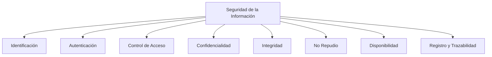

# Notas De Estudio

## Dimensions De la Ciberseguridad

### 1. Introducción

El professor Juan Ramón Vermejo aborda las **dimensions fundamentales de la ciberseguridad**, las cuales aseguran la protección de los sistemas de información frente a accesos no autorizados, alteraciones y pérdidas de disponibilidad.

Estas dimensions cubren aspectos técnicos y organizativos que permiten garantizar la seguridad, fiabilidad y trazabilidad de los sistemas informáticos.

---

### 2. Identificación

**Definición:**  
Proceso mediante el cual se reconoce de forma única a cada usuario que accede a un sistema o aplicación.

**Importancia:**  
Permite asociar acciones y privilegios a usuarios concretos.

**Ejemplo:**

- Un sistema asigna un **ID de usuario** único para cada empleado.

> [!warning] **No se recomienda** usar el correo electrónico como identificador, ya que puede brindar información valiosa a los atacantes (por ejemplo, para ataques de phishing).

---

### 3. Autenticación

**Definición:**  
Proceso de verificación que confirma que el usuario identificado es realmente quien dice set.

**Método habitual:**

- Validación de una contraseña (secreto) contra la base de datos.
    
- Las contraseñas **no se almacenan en texto plano**, sino como **hashes**.

**Ejemplo técnico:**

- Se aplica un algoritmo de hash (como **SHA-512**) sobre la contraseña.
    
- El resultado del hash se almacena.
    
- Cuando el usuario inicia sesión, su contraseña ingresada se vuelve a hashear y se compara con el valor almacenado.

**Tipos de autenticación:**

- **De un solo factor:** algo que el usuario sabe (ej. contraseña).
    
- **Multifactor (MFA):** combinación de varios métodos (algo que sabe, algo que tiene, algo que es).

---

### 4. Control De Acceso

**Definición:**  
Mecanismo que determina qué usuarios pueden acceder a qué recursos dentro de una aplicación o sistema.

**Método común:**

- **Listas de Control de Acceso (ACL)** o **modelos basados en roles (RBAC)**.

**Funcionamiento:**

1. El sistema verifica la identidad y autenticación del usuario.
    
2. Se consulta una **lista de permisos** o **roles**.
    
3. Solo si el rol incluye el permiso adecuado, se concede el acceso al recurso.

**Ejemplo:**  
Un usuario con el rol _administrador_ puede acceder a la configuración, mientras que un _usuario estándar_ no.

---

### 5. Confidencialidad

**Definición:**  
Garantiza que la información solo sea accessible a personas autorizadas.

**Mecanismos:**

- **Cifrado en tránsito:** mediante protocolos como **TLS/SSL**.
    
- **Cifrado en reposo:** usando algoritmos como **AES-256**.

**Ejemplo:**  
El uso de HTTPS en un sitio web protege los datos transmitidos entre el usuario y el servidor.

---

### 6. Integridad

**Definición:**  
Asegura que la información no sea modificada o alterada de forma no autorizada.

**Herramientas:**

- **Firmas digitales avanzadas.**
    
- **Códigos hash** para verificar cambios en los archivos o mensajes.

**Ejemplo:**  
Si un archivo se altera, su hash cambia; esto permite detectar manipulaciones.

---

### 7. No Repudio

**Definición:**  
Evita que una persona niegue haber realizado una acción o transacción.

**Mecanismo principal:**

- **Firma digital avanzada.**

**Ejemplo:**  
En una transacción electrónica, la firma digital asegura que el remitente no pueda negar su autoría.

---

### 8. Disponibilidad

**Definición:**  
Garantiza que los sistemas y servicios estén operativos cuando los usuarios los necesiten.

**Medidas de aseguramiento:**

- **Sistemas redundantes** (servidores de respaldo).
    
- **Copias de seguridad (backups).**
    
- **Procedimientos de recuperación ante desastres.**

**Ejemplo:**  
Si un servidor falla, un servidor de respaldo entra automáticamente en funcionamiento.

---

### 9. Registro Y Trazabilidad

**Definición:**  
Permite registrar y auditar las actividades dentro de un sistema, para detectar incidentes y atribuir acciones.

**Características del registro adecuado:**

- Debe incluir solo información relevante.
    
- Permite reconstruir eventos de seguridad y determinar **quién hizo qué y cuándo**.

**Objetivo:**  
Apoyar en la detección, análisis y mitigación de incidentes de seguridad.

---

### 10. Relación Entre Las Dimensions

---

### 11. Tabla Resumen De Las Dimensions

|Dimensión|Propósito Principal|Mecanismo Clave|Ejemplo|
|---|---|---|---|
|Identificación|Reconocer al usuario|ID de usuario|Asignar identificador único|
|Autenticación|Verificar identidad del usuario|Hash de contraseña, MFA|Login con contraseña + código SMS|
|Control de Acceso|Definir qué puede hacer cada usuario|Roles, ACL|Solo admin puede eliminar usuarios|
|Confidencialidad|Proteger información de accesos no autorizados|Cifrado (AES, TLS)|HTTPS en sitio web|
|Integridad|Evitar alteración no autorizada de datos|Firma digital, hash|Verificación de integridad de archivos|
|No Repudio|Evitar negación de acciones realizadas|Firma digital avanzada|Confirmación de envío de documentos|
|Disponibilidad|Asegurar acceso continuo y recuperación ante fallos|Redundancia, backups|Sistema de respaldo en servidores|
|Registro/Trazabilidad|Detectar incidentes y mantener evidencia|Logs, auditorías|Bitácoras de accesos y errores|

---

## Resumen De Puntos Clave

- La **ciberseguridad** se basa en múltiples dimensions interdependientes.
    
- **Identificación y autenticación** son la base del control de acceso.
    
- **Confidencialidad, integridad y no repudio** protegen los datos y las transacciones.
    
- **Disponibilidad y trazabilidad** garantizan continuidad operativa y evidencia verificable.
    
- La **firma digital avanzada** es un mecanismo central tanto para integridad como para no repudio.
    
- Un buen **registro de eventos** es esencial para la detección y respuesta ante incidentes.

---

## MicroTest

1. ¿Cómo se puede asegurar la integridad de los sistemas?
    
    - **La respuesta:** b. Firma digital avanzada.
        
    - **Justificación:** La integridad busca garantizar que la información no sea alterada de forma no autorizada. Para ello, se utilizan mecanismos como la **firma digital avanzada**, que permite detectar cualquier modificación en los datos y asegurar que estos permanecen intactos desde su origen.

---

1. ¿Para qué es necesario un correcto diseño de logging o registro?
    
    - **La respuesta:** a. Para garantizar la trazabilidad.
        
    - **Justificación:** Un sistema de registro adecuado permite **rastrear las acciones y eventos** dentro de un sistema, identificando quién hizo qué y cuándo. Esto garantiza la **trazabilidad**, fundamental para detectar incidentes de seguridad y reconstruir lo ocurrido ante un ataque o fallo.

---

1. Proporcionar la prueba de que una determinada transmisión o recepción ha sido realizada, sin que su receptor/transmisor pueda negar que se haya producido, se denomina:
    
    - **La respuesta:** d. No repudio.
        
    - **Justificación:** El **no repudio** asegura que una persona no pueda negar la autoría o recepción de una acción o transacción. Se logra mediante mecanismos como la **firma digital avanzada**, que vincula de forma única al author con la acción realizada.