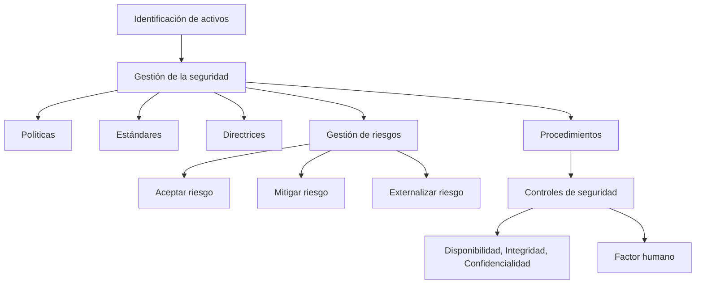

# Notas De Estudio

## Idea Clave 4 – La Ciberseguridad Es Un Proceso

---

### 1. La Seguridad Como Proceso

La **seguridad de la información** no es un estado fijo, sino un **proceso continuo**. Este proceso se basa en la **identificación de los activos de información**, los cuales son los elementos más valiosos dentro de una organización.

Una vez identificados, se aplican **herramientas de gestión** que permiten mantener la **disponibilidad, integridad y confidencialidad** de dichos activos.

---

### 2. Gestión De la Seguridad

La **gestión de la seguridad** implica un conjunto de acciones estructuradas y documentadas que incluyen:

- **Políticas**
    
- **Normas**
    
- **Procedimientos**
    
- **Directrices**

Su propósito es garantizar que los recursos de información estén **protegidos adecuadamente** frente a amenazas internas o externas.

---

### 3. Políticas De Seguridad

Las políticas son el **marco de referencia** del sistema de seguridad de una organización.

#### a) Política General

Es de **alto nivel** y tiene un carácter **estratégico**. De ella derivan las demás políticas.  
Típicamente contiene:

- Declaración de la **importancia de los recursos de información**.
    
- Compromiso de la **dirección** con la seguridad.
    
- Delegación hacia **políticas derivadas** más específicas.

#### b) Políticas Funcionales

También son de **alto nivel**, pero aplican a **áreas o aplicaciones específicas** (por ejemplo, uso del correo electrónico).  
Indican **qué se debe hacer**, pero no **cómo hacerlo**; ese detalle pertenece a los procedimientos.

---

### 4. Estándares, Directrices Y Procedimientos

|Elemento|Descripción|Nivel de obligatoriedad|
|---|---|---|
|**Estándares**|Definen el uso uniforme de tecnologías o métodos. Pueden implicar compromisos con ciertos sistemas o fabricantes.|Obligatorios|
|**Directrices**|Recomendaciones que orientan la aplicación de los estándares. Son más flexibles.|No obligatorias|
|**Procedimientos**|Describen los pasos detallados que deben seguir los usuarios para realizar tareas específicas.|Obligatorios|

---

### 5. Riesgos En Ciberseguridad

Un **riesgo** está asociado a un **evento no deseado**, como un ataque o un robo de información.  
Ejemplo: el riesgo de sufrir un ataque que robe datos personales.

Una vez analizado un riesgo, existen tres formas de gestión:

|Estrategia de gestión|Descripción|
|---|---|
|**Aceptar el riesgo**|Asumirlo tal como es.|
|**Mitigar el riesgo**|Reducir su impacto o probabilidad mediante medidas preventivas.|
|**Externalizar el riesgo**|Transferirlo a un tercero, por ejemplo, contratando un seguro.|

---

### 6. Gestión De Riesgos

El **conjunto de procesos** que incluyen el análisis, evaluación y planificación de riesgos se denomina **gestión de riesgos**.

El riesgo **no puede eliminarse completamente**, pero sí se pueden establecer mecanismos para:

- **Reducir su probabilidad** de ocurrencia.
    
- **Disminuir su impacto** si llega a materializarse.

---

### 7. Controles De Seguridad

Los **controles de seguridad** se definen a partir de un **estudio previo del impacto** de amenazas y vulnerabilidades.  
Estos controles buscan proteger la **disponibilidad, integridad y confidencialidad** de:

- Información
    
- Instalaciones
    
- Personas
    
- Documentación

---

### 8. Tipos De Amenazas

|Tipo de amenaza|Ejemplo|Característica|
|---|---|---|
|**Física**|Desastres naturales (terremotos, incendios, inundaciones)|Afectan infraestructuras y equipos.|
|**Lógica**|Malware, ataques informáticos|Afectan sistemas digitales.|
|**Humana**|Errores, negligencias o sabotajes|El **factor humano** suele set el eslabón más débil del sistema de seguridad.|

---

### 9. El Factor Humano

El **factor humano** es esencial dentro del sistema de seguridad.  
Las políticas y herramientas deben **considerar el comportamiento y formación de las personas**, ya que muchos incidentes ocurren por **errores humanos o falta de capacitación**.

---

### Diagrama De Relaciones Del Proceso De Seguridad

---

### Resumen De Los Puntos Clave

- La ciberseguridad es **un proceso continuo** basado en la **identificación y protección de activos**.
    
- La **gestión de seguridad** se apoya en políticas, estándares, directrices y procedimientos.
    
- La **gestión de riesgos** busca reducir la probabilidad o impacto de amenazas.
    
- Los **controles de seguridad** se aplican según estudios previous de impacto.
    
- El **factor humano** es el punto más vulnerable y debe incluirse en toda estrategia de seguridad.

---

## MicroTest

1. Las descripciones sobre cómo configurar determinados elementos de seguridad para que sean aplicados de manera uniforme en toda la organización se denominan:
    
    - La respuesta: c. Líneas base
        
    - Justificación: Las **líneas base** son descripciones que establecen cómo deben configurarse los elementos de seguridad de manera uniforme en la organización, asegurando consistencia y cumplimiento de las políticas.
        
2. Las descripciones detalladas de los pasos para llevar a cabo una determinada tarea por los usuarios sin dudas se llaman:
    
    - La respuesta: a. Procedimientos
        
    - Justificación: Los **procedimientos** describen paso a paso cómo realizar tareas específicas, permitiendo que los usuarios las ejecuten correctamente y sin ambigüedad.
        
3. Los estándares, directrices y procedimientos son medios para implementar las:
    
    - La respuesta: A y C. Políticas
        
    - Justificación: Los **estándares, directrices y procedimientos** se utilizan como herramientas para **aplicar y cumplir las políticas de seguridad**, traduciendo los objetivos de alto nivel en acciones concretas y consistentes.