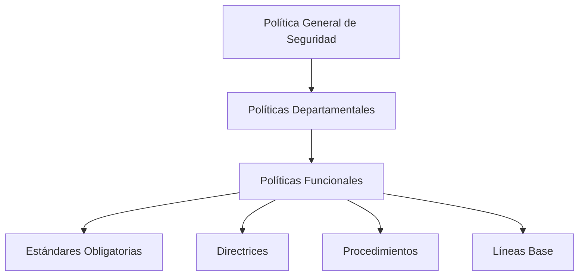
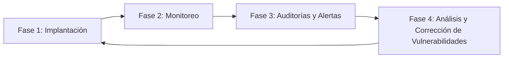
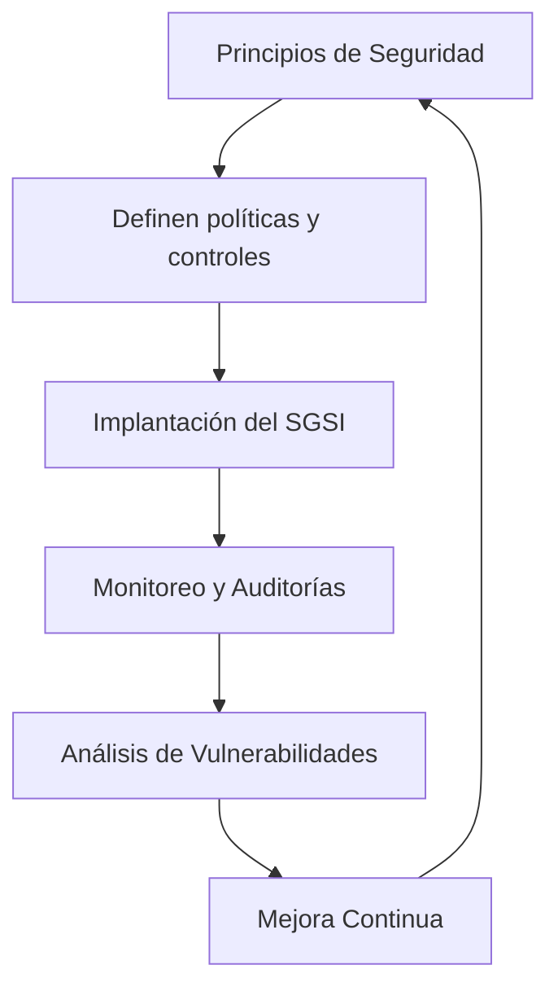

# Notas De Estudio: Política General De Seguridad De Una Organización

## 1. Introducción a la Política De Seguridad

La **política general de seguridad** es el documento fundamental que define los **objetivos de seguridad** que una organización busca alcanzar en la gestión y protección de sus sistemas de información.

Sirve como marco de referencia para el desarrollo de políticas derivadas, estándares y procedimientos que regulan la seguridad en todos los niveles organizativos.

---

## 2. Estructura Jerárquica De Las Políticas De Seguridad

La política general se descompone en distintos niveles que especifican el **qué**, el **cómo** y el **cuándo** debe aplicarse cada medida de seguridad.

### Descripción De Cada Nivel

|Nivel|Descripción|Ejemplo|
|---|---|---|
|**Política General**|Define los objetivos y el alcance global de la seguridad.|“Mantener un entorno seguro para la información corporativa.”|
|**Políticas Departamentales**|Adaptan la política general a las necesidades de cada departamento.|Política de seguridad del área de TI.|
|**Políticas Funcionales**|Se centran en áreas o aplicaciones específicas.|Política de uso del correo electrónico.|
|**Estándares (obligatorios)**|Normas de cumplimiento obligatorio.|Uso obligatorio del antivirus McAfee en todos los equipos.|
|**Directrices**|Recomendaciones no obligatorias, pero sugeridas.|Participar en una sesión online sobre uso de antivirus.|
|**Procedimientos**|Describen los pasos concretos para aplicar una medida.|Actualizar el antivirus de forma semanal.|
|**Líneas Base**|Configuraciones mínimas o seguras por defecto.|Configuración segura del antivirus o del sistema operativo.|

---

## 3. Contenido Y Alcance De la Política General

### Objetivo Principal

Definir **qué se debe hacer** en materia de seguridad dentro de la organización, aplicable a todos los niveles jerárquicos: desde la dirección hasta los empleados de menor rango, incluyendo personal externo y proveedores.

### Alcance

- **Interno:** empleados, directivos, departamentos.
    
- **Externo:** contratistas, técnicos de mantenimiento, proveedores de servicios.

### Función

Garantizar que todos los integrantes de la organización:

- Conozcan las medidas de seguridad aplicables.
    
- Comprendan su papel en la protección de la información.
    
- Actúen de acuerdo con los principios y normas establecidas.

---

## 4. Principios Fundamentales De Seguridad

|Principio|Descripción|Aplicación Práctica|
|---|---|---|
|**Mínimo Privilegio**|Los usuarios deben tener solo los permisos necesarios para realizar sus funciones.|Un usuario con rol de lectura no puede modificar datos.|
|**Defensa en Profundidad**|Uso de múltiples capas de protección para reforzar la seguridad.|Firewalls de red, IDS, firewalls de aplicaciones web.|
|**Diversidad de la Defensa**|Utilizar diferentes tecnologías y mecanismos para evitar vulnerabilidades comunes.|Combinación de sistemas de detección y cortafuegos de distintos fabricantes.|
|**Identificación de Puntos Débiles**|Localizar las vulnerabilidades más críticas dentro del sistema.|Revisión de servicios, puertos y accesos expuestos.|
|**Centralización de la Gestión**|Controlar la seguridad desde un punto único para mejorar la trazabilidad.|Monitoreo centralizado con registros de acciones y accesos.|
|**Simplicidad**|Mantener las medidas de seguridad lo más simples possible sin sacrificar eficacia.|Configuraciones seguras pero fáciles de administrar.|
|**Trazabilidad**|Capacidad de registrar y seguir todas las acciones realizadas.|Log de auditoría que identifique quién hizo qué y cuándo.|

---

## 5. Fases De Implantación De Una Política De Seguridad

### Descripción De Las Fases

|Fase|Descripción|Ejemplo de Actividades|
|---|---|---|
|**Implantación**|Implementación de las medidas y controles de seguridad.|Configuración de firewalls, VPN, IDS/IPS, WAF.|
|**Monitoreo Continuo**|Supervisar en tiempo real la seguridad de la organización.|Detección de accesos, revisión de logs, uso de SIEM.|
|**Auditorías y Alertas**|Evaluar el cumplimiento y detectar incidentes.|Auditorías periódicas y alertas automáticas ante intrusiones.|
|**Análisis y Corrección**|Identificar y remediar vulnerabilidades.|Escaneo de seguridad, parches, ajustes de configuración.|

Este ciclo es **continuo** y forma parte de un **Sistema de Gestión de Seguridad de la Información (SGSI)**.

---

## 6. Ejemplo Práctico De Aplicación

Supongamos que una empresa implementa una política de seguridad para proteger su red corporativa:

1. **Política General:** Mantener la integridad y confidencialidad de la información.
    
2. **Estándar:** Uso obligatorio de antivirus corporativo McAfee.
    
3. **Directriz:** Recomendar formación en ciberseguridad a todos los usuarios.
    
4. **Procedimiento:** Actualizar el antivirus cada semana.
    
5. **Línea Base:** Configurar el antivirus con las opciones seguras predeterminadas.

De esta forma, cada nivel de la política contribuye a una **defensa integral y coherente**.

---

## 7. Relación Entre Principios Y Fases Del SGSI

El cumplimiento de los principios fortalece cada fase del SGSI, asegurando una mejora constante y adaptable frente a nuevas amenazas.

---

## 8. Resumen De Puntos Clave

- La **política general de seguridad** define el marco que guía todas las acciones en materia de protección de la información.
    
- Se estructura en **políticas derivadas, estándares, directrices, procedimientos y líneas base**.
    
- Aplica a **todo el personal interno y externo** de la organización.
    
- Se sustenta en principios como **mínimo privilegio**, **defensa en profundidad**, **centralización** y **simplicidad**.
    
- Su implementación sigue un ciclo continuo de **implantación, monitoreo, auditorías y mejora**.
    
- Es el pilar fundamental de un **Sistema de Gestión de Seguridad de la Información (SGSI)**.

---

## **MicroTest**

1. La política general de seguridad de una organización:
    
    - **La respuesta:** d. Todas las anteriores son correctas.
        
    - **Justificación:** La política general de seguridad define el comportamiento adecuado (qué se debe hacer), establece herramientas y procedimientos (cómo se aplican las medidas) y comunica un consenso sobre el uso de datos y aplicaciones dentro de la organización. Por tanto, todas las opciones anteriores forman parte de su propósito.
        
2. Un sistema de detección de intrusiones se usa en la fase de:
    
    - **La respuesta:** a. Monitorización.
        
    - **Justificación:** El sistema de detección de intrusiones (IDS) se utilize para supervisar continuamente la red y detectar comportamientos sospechosos o ataques en tiempo real. Su función principal pertenece a la fase de **monitorización** dentro del ciclo de gestión de la seguridad.
        
3. Un cortafuegos se instala en la fase de:
    
    - **La respuesta:** c. Implementación.
        
    - **Justificación:** Los cortafuegos (firewalls) se configuran y despliegan durante la fase de **implementación**, cuando se establecen las medidas y controles de seguridad iniciales que protegerán la red y los sistemas frente a accesos no autorizados.

https://www.incibe.es/empresas/herramientas/politicas
