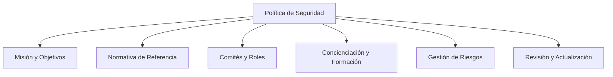
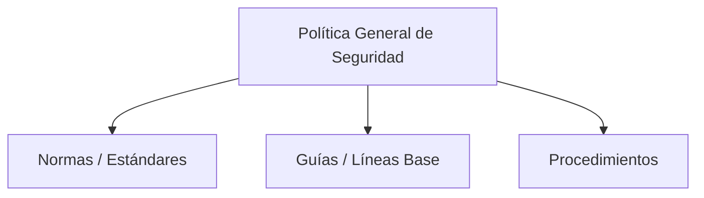
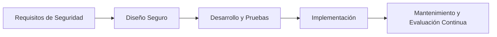

# Notas De Estudio: Diseño De la Política De Seguridad

## 1. Introducción

El **diseño de la política de seguridad** establece las secciones, normas y procedimientos necesarios para estructurar, aplicar y mantener la seguridad de la información dentro de una organización.  
Esta estructura está basada en la **Guía CCN-STIC 851** del _Centro Criptológico Nacional (CCN)_, que detalla las secciones y components esenciales de una política de seguridad eficaz.

---

## 2. Estructura De Una Política De Seguridad

Según el modelo del **CCN-STIC 851**, una política de seguridad debe container los siguientes apartados:

|Nº|Sección|Descripción|
|---|---|---|
|**1**|**Misión y objetivos**|Define el propósito y metas de seguridad de la organización.|
|**2**|**Normativa de referencia**|Enumera leyes, regulaciones y estándares en los que se basa la política.|
|**3**|**Comités, roles y responsabilidades**|Detalla quiénes participan en la gestión de la seguridad, sus funciones y mecanismos de coordinación.|
|**4**|**Concienciación y formación**|Describe las políticas de capacitación y educación en seguridad para el personal.|
|**5**|**Gestión y análisis de riesgos**|Define el proceso para identificar, evaluar y tratar riesgos.|
|**6**|**Revisión de la política**|Establece cómo y cuándo se revisará y actualizará la política de seguridad.|

---

## 3. Gestión De Riesgos En la Política De Seguridad

La **gestión de riesgos** es uno de los pilares fundamentales de la política de seguridad.  
Consiste en identificar, evaluar y decidir cómo tratar los riesgos que pueden afectar a la información o los sistemas.

### Fases Del Proceso De Gestión De Riesgos

|Fase|Descripción|Ejemplo|
|---|---|---|
|**Análisis de riesgos**|Se identifican los riesgos y su impacto potential.|Determinar si los servidores de correo están expuestos a vulnerabilidades.|
|**Evaluación del riesgo**|Se asigna un nivel de criticidad a cada riesgo.|Riesgo alto: robo de datos de clientes.|
|**Tratamiento del riesgo**|Se decide cómo actuar frente al riesgo.|Mitigar el riesgo instalando un firewall.|
|**Aceptación del riesgo**|Se reconoce el riesgo residual inevitable.|Aceptar un riesgo bajo tras aplicar salvaguardas.|

### Métodos De Análisis Comunes

|Método|Descripción|
|---|---|
|**MAGERIT**|Metodología española basada en análisis cualitativo y cuantitativo de riesgos.|
|**OCTAVE / TARA**|Modelos internacionales de evaluación de riesgos enfocados en la gestión organizativa.|

**Ejemplo:**  
Si se detecta que un servidor web tiene vulnerabilidades, la organización puede:

- **Mitigar**: actualizando software o aplicando parches.
    
- **Transferir**: contratando un seguro o servicio externo.
    
- **Aceptar**: si el riesgo residual es bajo y controllable.

---

## 4. Normativa Y Documentación De Seguridad

De la política general emanan diferentes tipos de documentos técnicos que definen **cómo** se deben aplicar las medidas de seguridad.

|Tipo de documento|Descripción|Ejemplo|
|---|---|---|
|**Normas o Estándares**|Son **obligatorias** y definen reglas específicas de uso.|Gestión segura de contraseñas.|
|**Guías o Líneas Base**|Recomendaciones para la configuración segura de sistemas.|Guía de contraseñas seguras para Firefox.|
|**Procedimientos**|Describen los pasos concretos a seguir en un proceso de seguridad.|Procedimiento de respaldo y recuperación de datos.|

---

## 5. Ejemplos De Normas Derivadas

Estas normas complementan la política general y abarcan diferentes áreas técnicas y operativas:

|Categoría|Ejemplos|
|---|---|
|**Gestión de seguridad**|Procedimiento de análisis y gestión de riesgos, ciclo de vida seguro del software.|
|**Acceso y autenticación**|Política de contraseñas, normas de acceso remoto, gestión de usuarios.|
|**Infraestructura**|Seguridad de servidores, routers, comunicaciones inalámbricas, DMZ, VPN.|
|**Información**|Clasificación y protección de la información según su nivel de confidencialidad.|
|**Perimetral y física**|Normas de seguridad perimetral, control de acceso físico a instalaciones.|
|**Proveedores y adquisiciones**|Requisitos de seguridad para proveedores de software, hardware o servicios.|
|**Incidentes y continuidad**|Procedimientos de gestión de incidentes, copias de seguridad y recuperación.|

Estas normas aseguran una **protección integral** del entorno de TI y la información corporativa.

---

## 6. Ciclo De Vida Seguro Del Software

La política de seguridad también debe contemplar el desarrollo de software bajo principios de **seguridad desde el diseño**:

Cada fase del ciclo incluye actividades específicas de seguridad:

- Validación de requisitos seguros.
    
- Pruebas de vulnerabilidad.
    
- Auditorías de código.
    
- Actualizaciones y revisiones continuas.

---

## 7. Revisión Y Actualización De la Política

La política de seguridad **no es estática**; debe revisarse periódicamente para:

- Adaptarse a nuevas amenazas.
    
- Incluir cambios tecnológicos o normativos.
    
- Incorporar lecciones aprendidas de incidentes previous.

El proceso de revisión debe definir:

- **Quiénes** participan (comité de seguridad, responsables de TI, auditores).
    
- **Cuándo** se realiza (anualmente o tras incidentes relevantes).
    
- **Cómo** se aprueban las actualizaciones.

---

## 8. Resumen De Puntos Clave

- Una política de seguridad debe incluir misión, normativa, roles, formación, gestión de riesgos y procesos de revisión.
    
- La gestión de riesgos es continua e implica análisis, evaluación, tratamiento y aceptación.
    
- De la política general derivan documentos específicos: **normas**, **guías** y **procedimientos**.
    
- El ciclo de vida seguro del software y la gestión de proveedores son components esenciales.
    
- La política debe revisarse regularmente para garantizar su vigencia y eficacia.

---

## **MicroTest**

1. El tipo de norma que estandariza el uso de aspectos específicos del sistema (indican un uso correcto y responsabilidad del usuario y son obligatorias) se denomina:
    
    - **La respuesta:** b. Estándar
        
    - **Justificación:** Los **estándares de seguridad** establecen reglas obligatorias sobre el uso correcto de los sistemas, definiendo responsabilidades y comportamientos esperados de los usuarios. Su propósito es asegurar la uniformidad en la aplicación de las medidas de seguridad y garantizar que todos sigan las mismas pautas operativas.
        
2. El tipo de norma destinada a ayudar a los usuarios a aplicar las medidas de seguridad correctamente al proporcionar un razonamiento donde no se dispone de los procedimientos correctos, se denomina:
    
    - **La respuesta:** c. Guía de seguridad
        
    - **Justificación:** Las **guías de seguridad** sirven como orientación o referencia para los usuarios, ofreciendo recomendaciones prácticas sobre cómo aplicar medidas de seguridad. No son obligatorias, pero ayudan a mantener buenas prácticas cuando no existen procedimientos formales definidos.
        
3. El tipo de norma que se ocupa de tareas específicas, mostrando cada paso que se debe realizar y que es muy útil en tareas que son repetitivas, como en un procedimiento de backup y recuperación, se denomina:
    
    - **La respuesta:** a. Procedimientos de seguridad
        
    - **Justificación:** Los **procedimientos de seguridad** detallan de manera sequential las acciones a seguir en tareas concretas, garantizando que se realicen de forma correcta y consistente. Son esenciales en operaciones críticas o repetitivas, como copias de seguridad o gestión de incidentes.