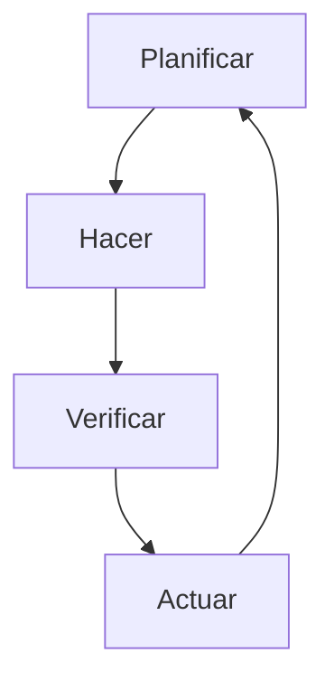
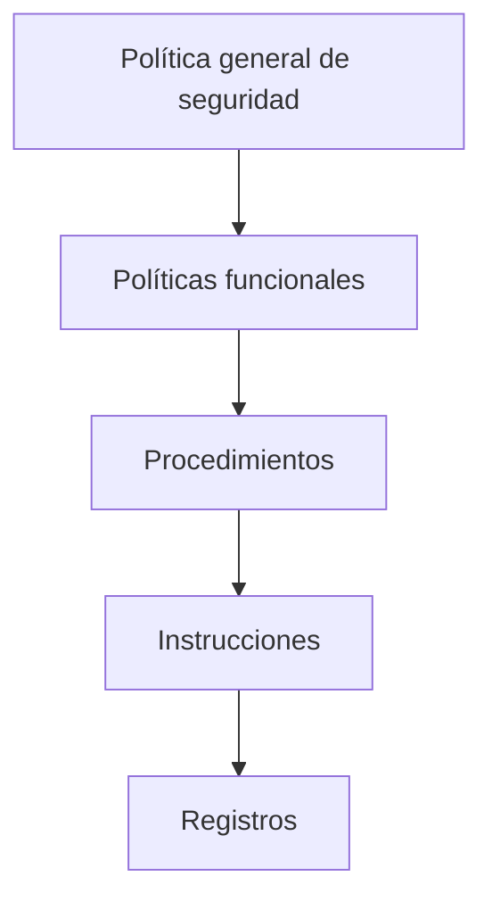
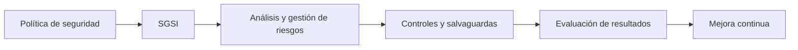

# Sistema De Gestión De Seguridad De la Información (SGSI)

## Definición Y Propósito Del SGSI

Un **Sistema de Gestión de Seguridad de la Información (SGSI)** es el conjunto de políticas, procedimientos y controles que permiten **proteger los activos de información** de una organización.  
Este sistema **emana directamente de la política general de seguridad** y se apoya en el **conjunto normativo** de la organización para garantizar la confidencialidad, integridad y disponibilidad de la información.

El **objetivo principal** del SGSI es establecer, operar y mantener procesos de seguridad que permitan **alcanzar los objetivos definidos por la política general de seguridad**, evaluando continuamente su eficacia mediante indicadores y actividades de monitorización.

---

## Ciclo De Mejora Continua (PDCA)

El funcionamiento del SGSI se basa en un **ciclo de mejora continua**, también conocido como **ciclo PDCA (Plan-Do-Check-Act)**, utilizado por la norma **ISO/IEC 27001**.

### Etapas Del Ciclo PDCA

| Fase                  | Descripción                                                                     | Ejemplo                                                                |
| --------------------- | ------------------------------------------------------------------------------- | ---------------------------------------------------------------------- |
| **Planificar (Plan)** | Identificar riesgos, establecer objetivos y definir políticas y procedimientos. | Análisis de riesgos con metodologías como Magerit o ISO 27001 o 27005. |
| **Hacer (Do)**        | Implementar las salvaguardas y controles definidos.                             | Configurar firewalls o políticas de contraseñas.                       |
| **Verificar (Check)** | Medir y evaluar la efectividad de los controles aplicados.                      | Auditorías internas o revisión de indicadores de seguridad.            |
| **Actuar (Act)**      | Aplicar mejoras basadas en los resultados de la verificación.                   | Actualizar políticas o corregir vulnerabilidades detectadas.           |

---

## Estructura Documental Del SGSI

El SGSI se construye de forma jerárquica, con diferentes niveles de documentación que especifican **qué se debe hacer** y **cómo se debe hacer**.

### Jerarquía Documental

|Nivel|Descripción|Ejemplo|
|---|---|---|
|**Política general de seguridad**|Define los objetivos, alcance y principios de seguridad de la organización.|Política de protección de datos.|
|**Políticas funcionales**|Detallan el “qué” se debe hacer en áreas específicas.|Política de acceso remoto o contraseñas.|
|**Procedimientos**|Describen “cómo” se realizarán las tareas.|Procedimiento de gestión de incidentes.|
|**Instrucciones**|Indican los pasos concretos a seguir en tareas específicas.|Instrucción para realizar copias de seguridad.|
|**Registros**|Evidencian la ejecución y cumplimiento del SGSI.|Logs de auditoría o reportes de incidentes.|

---

## Análisis Y Tratamiento De Riesgos

El **análisis y gestión de riesgos** es una actividad **fundamental** dentro del SGSI.

### Pasos Del Proceso

1. **Identificación de riesgos:** Determinar amenazas y vulnerabilidades que puedan afectar los activos de información.
    
2. **Evaluación del riesgo:** Calcular el impacto y la probabilidad de ocurrencia.
    
3. **Tratamiento del riesgo:** Elegir entre mitigar, aceptar o transferir el riesgo.
    
4. **Definición del riesgo residual:** Aceptar el nivel de riesgo que permanece tras aplicar las medidas.

### Documento Clave: SOA (Statement of Applicability)

El **SOA** es el documento que detalla:

- Las salvaguardas seleccionadas.
    
- Su prioridad de implantación.
    
- Las justificaciones de su elección.  
    Constituye el **plan de tratamiento de riesgos**.

---

## ISO 27001 Y Normas Relacionadas

La norma **ISO/IEC 27001** establece los requisitos para implementar un SGSI efectivo.  
Se complementa con otras normas como:

|Norma|Enfoque principal|
|---|---|
|**ISO 27005**|Metodología de análisis y gestión de riesgos.|
|**MAGERIT**|Método español para análisis y gestión de riesgos de sistemas de información.|
|**OCTAVE**|Modelo para identificar y gestionar riesgos organizativos y tecnológicos.|

---

## Relación Entre Elementos Del SGSI

---

## Resumen De Los Puntos Clave

- El **SGSI** surge de la política general de seguridad y busca proteger los activos de información.
    
- Funciona bajo un **ciclo PDCA** (Planificar, Hacer, Verificar, Actuar).
    
- Se apoya en **documentación jerárquica**: políticas, procedimientos, instrucciones y registros.
    
- El **análisis y tratamiento de riesgos** es el núcleo operativo del SGSI.
    
- La **norma ISO/IEC 27001** es la referencia internacional principal para la implementación del SGSI.
    
- El **SOA** define las salvaguardas que se aplicarán y constituye el plan de tratamiento de riesgos.

---

## MicroTest

1. Un sistema de gestión para la seguridad de la información:
    
    - **La respuesta:** d. Todas las anteriores son correctas.
        
    - **Justificación:** Un **SGSI** (Sistema de Gestión de Seguridad de la Información) establece políticas y planes de seguridad, **opera y mantiene** los procesos definidos, y **mide los resultados** mediante indicadores de desempeño. Todo esto forma parte de su ciclo de mejora continua (PDCA), que integra planificación, ejecución, verificación y mejora.
        
2. ¿Cuál es la actividad más importante en un SGSI?
    
    - **La respuesta:** c. Análisis y gestión de riesgos.
        
    - **Justificación:** El **análisis y gestión de riesgos** es el eje central del SGSI, ya que permite identificar, evaluar y tratar los riesgos que pueden afectar los activos de información. A partir de esta actividad se determinan las salvaguardas necesarias y se orientan todas las decisiones de seguridad dentro del sistema.
        
3. La declaración de aplicabilidad de salvaguardas es propia de la fase (ISO27001):
    
    - **La respuesta:** c. PLAN: tratamiento de los riesgos.
        
    - **Justificación:** En la norma **ISO 27001**, la **Declaración de Aplicabilidad (SOA)** se elabora durante la fase de **planificación del tratamiento de riesgos**, ya que en este documento se detallan las salvaguardas seleccionadas, su justificación y su prioridad de implementación para reducir los riesgos identificados.
