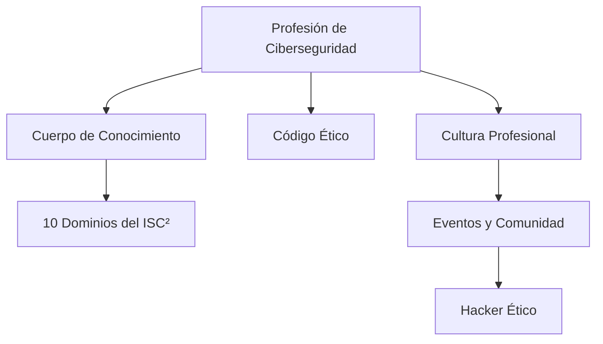

# Notas De Estudio – Profesión De Gestión De la Ciberseguridad

---

## 1. Criterios Que Definen Una Profesión

Una **profesión** se caracteriza por el cumplimiento de cinco criterios fundamentales:

|Criterio|Descripción|
|---|---|
|**Cuerpo organizado de conocimientos**|Conjunto sistemático y formal de saberes que sustentan la práctica professional.|
|**Reconocimiento de utilidad por parte de los clientes**|La sociedad y las organizaciones valoran la profesión por los beneficios que aporta.|
|**Aprobación de la comunidad professional**|La autoridad y legitimidad de la profesión son reconocidas por sus propios miembros y por la sociedad.|
|**Código de ética**|Conjunto de principios morales que regulan el comportamiento professional.|
|**Cultura professional**|Tradiciones, valores y prácticas compartidas, apoyadas por la actividad académica y professional.|

---

## 2. Disciplina De la Seguridad De la Información

- La **seguridad de la información** se ha consolidado como una **disciplina independiente** con formación universitaria específica.
    
- Aunque **no existe una asociación professional única y global**, sí se han desarrollado **referentes internacionales** que establecen el conocimiento esencial del área.
    
- Un ejemplo clave es el **(ISC)² (International Information System Security Certification Consortium)**, que ha definido un **Cuerpo de Conocimiento (Body of Knowledge, BoK)** con los dominios que debe dominar un professional certificado.

---

## 3. Cuerpo De Conocimiento De (ISC)²

El **BoK del (ISC)²** establece **10 dominios** que representan las competencias esenciales en ciberseguridad.

|N°|Dominio|Descripción breve|
|---|---|---|
|1|Seguridad de la información y gestión de riesgos|Identificación, evaluación y mitigación de riesgos asociados a la información.|
|2|Sistemas y metodologías de control de acceso|Políticas y mecanismos para limitar el acceso a los recursos.|
|3|Criptografía|Técnicas de cifrado para proteger la confidencialidad e integridad de los datos.|
|4|Seguridad física|Protección de los activos físicos frente a amenazas.|
|5|Arquitectura y diseño de seguridad|Integración de principios de seguridad en el diseño de sistemas.|
|6|Legislación, regulaciones y cumplimiento|Normas legales y regulatorias aplicables a la seguridad de la información.|
|7|Continuidad del negocio y recuperación ante desastres|Planes para mantener operaciones durante incidentes o crisis.|
|8|Seguridad en el desarrollo de aplicaciones|Prácticas seguras en el ciclo de vida del software.|
|9|Seguridad en operaciones|Controles y procedimientos para mantener la seguridad operativa.|
|10|Investigación de seguridad, redes y telecomunicaciones|Análisis forense y protección de infraestructuras de comunicación.|

---

## 4. Código Ético Del (ISC)²

- Todo professional certificado debe **adherirse a un código ético**.
    
- Este código enfatiza principios como:
    
    - La **honestidad** y la **responsabilidad professional**.
        
    - El **respeto a la ley** y a los derechos de los demás.
        
    - La **protección de la sociedad y de la infraestructura de información**.

---

## 5. El Hacker Ético

- El **hacker ético** es un professional especializado en realizar **pruebas de penetración (penetration testing)** de manera **controlada y autorizada** por contrato.
    
- Su objetivo es **evaluar la seguridad desde la perspectiva del atacante**, identificando vulnerabilidades antes de que puedan set explotadas de forma maliciosa.

**Características principales:**

|Aspecto|Descripción|
|---|---|
|**Rol**|Simula ataques reales de cibercriminales de manera controlada.|
|**Propósito**|Fortalecer la seguridad de los sistemas antes de sufrir ataques reales.|
|**Diferencia clave**|Las técnicas usadas son idénticas a las de un atacante, pero la **intención y el contexto ético** marcan la diferencia.|

---

## 6. Eventos De Hacking

Existen eventos y conferencias dedicados al intercambio de conocimientos sobre hacking ético y seguridad informática.

|Evento|Descripción|
|---|---|
|**Defcon**|Uno de los eventos de hacking más reconocidos del mundo, celebrado anualmente en Las Vegas.|
|**Hackers Hatlet (posiblemente “Hackers Hat” o similar)**|Encuentro técnico donde se presentan vulnerabilidades y métodos de defensa.|

**Importante:**  
Aunque las **técnicas presentadas** pueden set utilizadas tanto de forma **maliciosa** como **ética**, la **intención** y el **uso** determinan su carácter.

---

## 7. Relación Entre Los Conceptos

---

## Resumen De Puntos Clave

- Una **profesión** se define por conocimientos estructurados, reconocimiento, ética y cultura professional.
    
- La **ciberseguridad** es una disciplina consolidada con formación y certificaciones específicas.
    
- El **(ISC)²** establece un **cuerpo de conocimiento** que cubre los 10 dominios esenciales.
    
- Los **hackers éticos** contribuyen a la seguridad mediante pruebas controladas.
    
- Los **eventos de hacking** fomentan la actualización y el intercambio de conocimientos, diferenciando el uso ético del malicioso por la **intención** y el **contexto**.

---

## MicroTest

1. Una profesión puede caracterizarse por el desarrollo de algunos de los siguientes criterios:
    
    - **La respuesta:** d. Todas las anteriores son ciertas.
        
    - **Justificación:** Una profesión se define por varios criterios en conjunto: un cuerpo organizado de conocimientos, el reconocimiento de su utilidad y autoridad por parte de la comunidad y los clientes, un código ético y una cultura professional.
        
2. El hacker ético tiene como elemento interesante el situar:
    
    - **La respuesta:** b. La seguridad desde el contexto del atacante.
        
    - **Justificación:** El hacker ético analiza la seguridad poniéndose en el lugar del atacante para detectar vulnerabilidades antes de que puedan set explotadas de forma maliciosa.
        
3. Un ejemplo de recopilación de requisitos en el área (que puede considerarse como definitorio) de qué debe saber un professional de la seguridad de la información sería:
    
    - **La respuesta:** c. El cuerpo de conocimiento (body of knowledge, BOK) del Consorcio Internacional de Certificación de Seguridad de Sistemas de Información o (ISC)².
        
    - **Justificación:** El BoK del (ISC)² define los dominios y competencias esenciales que debe dominar un professional certificado en seguridad de la información, siendo una referencia internacional reconocida.