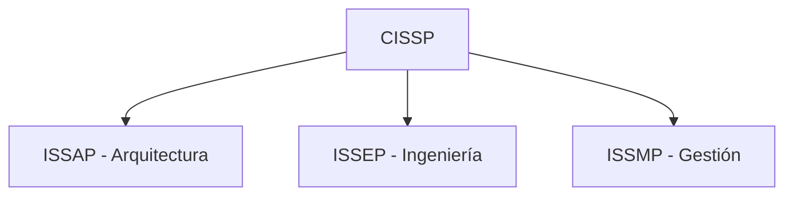

# Notas De Estudio: Certificaciones De Ciberseguridad

---

## Introducción

Las certificaciones en ciberseguridad acreditan los conocimientos, habilidades y competencias de los profesionales en distintas áreas de la seguridad de la información. Estas certificaciones son emitidas por organismos reconocidos, como el **(ISC)² (International Information System Security Certification Consortium)**, y sirven tanto para validar experiencia como para fomentar buenas prácticas de seguridad en entornos empresariales y técnicos.

---

## Certificaciones Principales Del (ISC)²

### 1. **CISSP (Certified Information Systems Security Professional)**

La **CISSP** es una de las certificaciones más reconocidas a nivel mundial en el campo de la ciberseguridad.  
Esta credencial avala la competencia del professional en múltiples áreas de la seguridad de la información, incluyendo la gestión, diseño, arquitectura e implementación de sistemas seguros.

#### Subcertificaciones De CISSP

|Subcertificación|Enfoque principal|Descripción|
|---|---|---|
|**ISSAP (Information Systems Security Architecture Professional)**|Arquitectura segura|Centrada en el diseño y definición de arquitecturas seguras.|
|**ISSEP (Information Systems Security Engineering Professional)**|Ingeniería de seguridad|Enfocada en la creación de software seguro y el desarrollo técnico.|
|**ISSMP (Information Systems Security Management Professional)**|Gestión de seguridad|Dirigida a la gestión, monitoreo e implementación de políticas y procedimientos de seguridad.|

#### Requisitos Del CISSP

- Aprobar un examen de **250 preguntas** de selección múltiple (6 horas de duración).
    
- Acreditar **al menos 5 años de experiencia** en **2 o más dominios** del cuerpo de conocimiento (CBK).
    
- Adherirse al **código ético** del (ISC)².

#### Dominios Del CISSP (Cuerpo De Conocimiento – CBK)

1. Seguridad de la información y gestión de riesgos.
    
2. Control de acceso: sistemas y metodologías.
    
3. Criptografía.
    
4. Seguridad física.
    
5. Arquitectura y diseño de seguridad.
    
6. Legislación, regulaciones, cumplimiento e investigación.
    
7. Continuidad del negocio y recuperación ante desastres.
    
8. Seguridad en el desarrollo de aplicaciones.
    
9. Seguridad de operaciones.
    
10. Seguridad en redes y telecomunicaciones.

**Importancia:**  
El CISSP es una certificación **global e integral**, ya que cubre tanto los aspectos técnicos como los de gestión, posicionando al professional como un experto completo en seguridad de la información.

---

### 2. **CSSLP (Certified Secure Software Lifecycle Professional)**

El **CSSLP** se centra en el **desarrollo seguro de software**, es decir, en incorporar prácticas de seguridad durante todo el ciclo de vida del desarrollo (SSDLC).

#### Objetivos Del CSSLP

- Enseñar a construir **software seguro desde la concepción**.
    
- Integrar controles de seguridad en cada fase del ciclo de vida.
    
- Formar desarrolladores capaces de **prevenir vulnerabilidades desde el código**.
    
- Asegurar la correcta **gestión y operación segura del software** en producción.

#### Fases Del Ciclo De Vida Seguro (SSDLC)

|Fase|Actividad de seguridad principal|
|---|---|
|**1. Requisitos**|Definición de requisitos de seguridad.|
|**2. Diseño**|Arquitectura segura del sistema.|
|**3. Implementación**|Programación y codificación segura.|
|**4. Pruebas**|Análisis estático y dinámico, pruebas de penetración.|
|**5. Despliegue y mantenimiento**|Gestión de incidentes, actualizaciones y recuperación ante fallos.|

#### Dominios Del CSSLP

1. Conceptos de seguridad en software.
    
2. Diseño de software y arquitectura segura.
    
3. Implementación segura del código.
    
4. Pruebas de seguridad (estáticas y dinámicas).
    
5. Gestión del ciclo de vida seguro.
    
6. Operaciones y mantenimiento seguro.
    
7. Gestión de incidentes y recuperación.

**Importancia:**  
El CSSLP promueve un enfoque **preventivo** en la seguridad del software, ayudando a reducir vulnerabilidades desde el desarrollo y garantizando que las aplicaciones sean seguras a lo largo de su vida útil.

---

## Otras Certificaciones Destacadas Del (ISC)²

|Certificación|Enfoque|Descripción breve|
|---|---|---|
|**CCSP (Certified Cloud Security Professional)**|Seguridad en la nube|Enfocada en la protección de entornos y servicios en la nube.|
|**CAP (Certified Authorization Professional)**|Evaluación y autorización de sistemas|Certifica habilidades en la gestión de riesgos y cumplimiento normativo.|
|**SSCP (Systems Security Certified Practitioner)**|Seguridad operativa|Se centra en la implementación práctica de controles de seguridad y administración de sistemas.|

---

## Comparativa General De Certificaciones

|Certificación|Enfoque|Nivel|Experiencia requerida|
|---|---|---|---|
|**CISSP**|Seguridad integral (gestión, arquitectura, ingeniería)|Avanzado|5 años|
|**CSSLP**|Desarrollo seguro de software|Medio-avanzado|4-5 años|
|**SSCP**|Administración y operación de seguridad|Intermedio|1 año|
|**CCSP**|Seguridad en la nube|Avanzado|5 años|
|**CAP**|Cumplimiento y autorización|Intermedio|2 años|

---

## Resumen De Puntos Clave

- Las certificaciones del **(ISC)²** son estándares internacionales que validan las competencias de los profesionales en seguridad de la información.
    
- **CISSP** es la certificación más completa y reconocida, cubriendo arquitectura, ingeniería y gestión.
    
- **CSSLP** se enfoca en el desarrollo seguro de software, integrando prácticas de seguridad en todo el ciclo de vida del desarrollo (SSDLC).
    
- La elección de la certificación depende del rol professional:
    
    - **Arquitectos e ingenieros:** CISSP o ISSAP.
        
    - **Desarrolladores:** CSSLP.
        
    - **Administradores o técnicos:** SSCP.
        
    - **Gestores de riesgos:** CAP o ISSMP.

---

## MicroTest

1. La certificación Certified Information Systems Security Professional (CISSP) es certificada por:
    
    - **La respuesta:** d. International Information Systems Security Certification Consortium.
        
    - **Justificación:** El **(ISC)² (International Information Systems Security Certification Consortium)** es la organización internacional que otorga la certificación **CISSP**, reconocida globalmente como un estándar para profesionales de la seguridad de la información.

---

1. La certificación Certified Information Systems Security Professional (CISSP), incluye:
    
    - **La respuesta:** d. Todas las anteriores son correctas.
        
    - **Justificación:** El CISSP se compone de tres subespecializaciones:
        
        - **ISSAP** (Arquitectura de seguridad),
            
        - **ISSEP** (Ingeniería de seguridad), y
            
        - **ISSMP** (Gestión de seguridad).  
            Todas forman parte del cuerpo de conocimiento de CISSP y permiten especializarse en distintas áreas de la ciberseguridad.

---

1. Un CISSP está certificado como professional para:
    
    - **La respuesta:** a. Definir la arquitectura de seguridad.
        
    - **Justificación:** El CISSP acredita a un professional con la capacidad de **diseñar, definir y gestionar arquitecturas de seguridad**, así como implementar controles en sistemas y redes. Aunque puede tener nociones de desarrollo o auditoría, su función principal es la **definición y gestión integral de la seguridad de la información**.